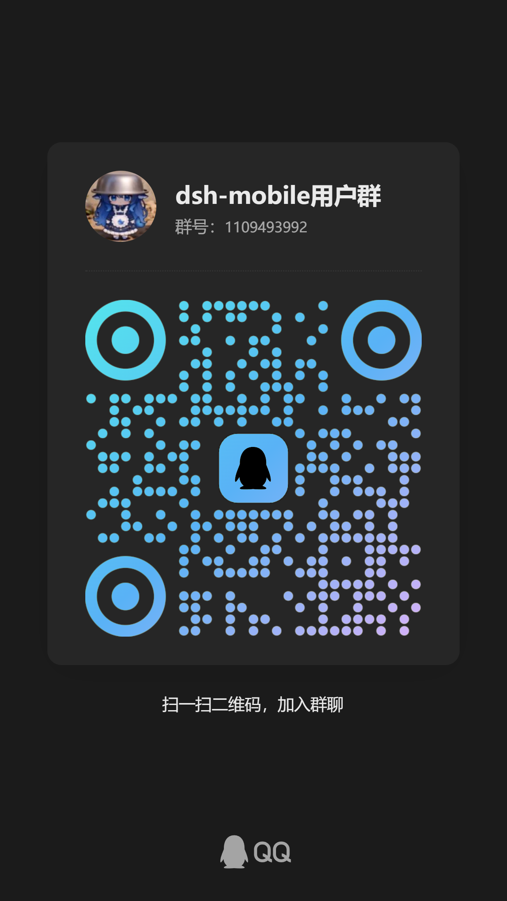

# dsh-mobile-apk — DeepSeek Harness 安卓壳 APK

[🌐 English README](README.en.md)

[](https://qun.qq.com/universal-share/share?ac=1&authKey=C2NW5eWXsV%2FYu5DEkV9Ac%2FqYcXhGCY8C3Lga40KNCfE4AOjzlSeAaRGvWZqc3ADV&busi_data=eyJncm91cENvZGUiOiIxMTA5NDkzOTkyIiwidG9rZW4iOiJjTTRDM3pwNjRLTE8rbkZBVjRDbnFVWlBOdU04aGJaS3FaSG1xZWFXbm5ZNXphbEJBOXdGMGw2N0V3YnpabnhaIiwidWluIjoiMzc1NDY4MDE3NSJ9&data=NzUYIVyoUDsINSstug9aQ6Kf4EUx-hhDegPFaPS-1RD-p_4eE02WN773yEIujclrFYtWRDkLyDa-YDtWj2bKjg&svctype=4&tempid=h5_group_info)


> **dsh-mobile 生态** · [dsh-shell-termux](https://github.com/kelai141/dsh-shell-termux)（shell）· [dsh-client-ui-responsive](https://github.com/kelai141/dsh-client-ui-responsive)（移动 UI）· [dsh-host-web-compat](https://github.com/kelai141/dsh-host-web-compat)（浏览器兼容）· [dsh-mobile](https://github.com/kelai141/dsh-mobile)（协调仓库，private）

[DeepSeek Harness](https://github.com/deepseek-ai/deepseek-harness) 的安卓壳：WebView UI 覆盖
**内嵌 Termux 运行时快照**（解压即跑，无需 Termux app）、SAF 目录桥、保活前台服务、引擎看门狗、
运行时在线更新。一个 APK 装完即用：完整的 dsh web agent，且能真实执行 bash。

应用名 `DeepCode`（图标文字 DeepSearch）、包名 `com.dsharnessmobile.shell`、
当前版本 **`0.14.0-preview`**（versionCode 38）、引擎 `@deepseek-ai/dsh` 0.1.5-rc.1。

> **插件市场适配警示**：内置市场牵涉大量第三方插件，**绝大多数插件在手机端不一定可用、大概率有 bug**
> （移动端与桌面端在 WebView 内核/文件系统/权限模型/运行环境差异大）；移动端适配是长期工程，
> beta 阶段以「可用性验证与反馈」为主，暂不建议当作生产依赖。
> 插件报错请到 [issues](https://github.com/kelai141/dsh-mobile-apk/issues) 反馈（附机型/版本/复现步骤）。

## 功能

### 运行时与生命周期

- **内嵌运行时**：xz 快照内置 node + git + bash + coreutils + dsh + 插件 + pnpm + python/perl/ruby；
  首启解压 2-4 分钟（`refreshSnapshot`），引擎监听 `127.0.0.1:3080`；完全离线。
- **在线运行时更新**：manifest 驱动的快照替换（下载 → sha256 → 原子切换 → 自动重启），
  运行时可自更新而无需更新 APK。换树是**单事务**：解压到 staging → 校验完整 → 整体换入，
  中断可回滚，且**从不触碰用户数据**（会话/附件/设置/凭据/工作区）。
- **APK 自更新**：启动页「检查更新」按钮手动触发（**不自动检查**）——查 GitHub latest release、
  按设备 ABI 匹配资产、镜像链逐级回退下载；发现新版时同一按钮变为「下载并安装 vX.Y.Z」二次确认。
- **保活**：前台服务 + 5 秒看门狗（自动重拉挂死引擎）+ 3 秒 UI 轮询 + 崩溃自动回退闸门（UndoGate）。
- **内置控制台**：独立 bash 交互终端（`assets/console.html`），引擎未运行也可排查。

### AI 浏览器（隔离 WebView 工作台）

- 右侧栏独立工作台，**与主 UI 完全隔离**的第二个 WebView；AI 可开页签、多网页同时管理，
  人打开即可查看多个页签——**UI 是给人看的，AI 走工具直接读信息**。
- **分辨率 = CSS 视口**（document-start 注入 `width=<cssW>` + 物理矩形等比 letterbox），
  `window.innerWidth` 精确等于请求值；**PC / 手机身份**可切换（UA-CH 能力门，WebView 110 degraded 如实上报）。
- 侧栏收起时视口**不再塌成 0x0**（可见性用 `INVISIBLE` 而非 `GONE`，保留布局 + 按上次舞台尺寸给非退化矩形）。
- `browser_snapshot` 渲染每行 ref（不再只报计数，模型拿得到可点目标）。
- 滚动避让、Edge 式错误页、关闭即销毁、失败渲染兜底。

### 虚拟屏（独立屏幕运行第三方 App）

- 经 **Shizuku 特权通道**创建虚拟屏，第三方 App 在独立屏幕运行，**不挤占用户前台**；
  单实例上限 1 块，序号复用（`virtual-1` 恒为「没有屏时新建」的号）。
- **跨屏拉起唯一可行路径**：壳侧 Shizuku UserService 的 `am start --display <id> -n <component>`
  （固定 argv，先 `cmd package resolve-activity`）；其余三条路实测均不成立
  （`monkey --display` 无此选项 / shell `am start` 不稳 / 进程内 `setLaunchDisplayId` 被 `SafeActivityOptions` 拒）。
  模型侧用法：`android_app_launch { pkg, screenId: "virtual-N" }`。
- **坐标输入**：虚拟屏上用绝对 `x/y` + `screenId`（经 `input -d <displayId>`，真实屏不受影响）；
  归一化 `nx/ny` 在虚拟屏上**明确拒绝**（分母歧义会静默点到真屏）。
- **截图认屏**：`android_screenshot { screenId }` 的**两条通道都**落到目标 displayId，
  并把分辨率锚点换成该屏自身像素（此前 ADB 回落路径忽略 `screenId`，抓的是真实屏）。
- 等比适配（按内容宽高比 letterbox 居中，不拉伸）、空闲 10 分钟自动回收、
  设置页「手机控制」含强制销毁（三连点确认）。

### 手机控制（无障碍 + Shizuku 双通道）

- **无障碍通道**：语义树 / ref 动作 / 虚拟屏语义树；**Shizuku 特权通道**：uid 2000 执行系统命令
  （`screencap`/`uiautomator`/`dumpsys`/`input` 等只读与输入类；系统配置写面一律拒绝）。
- **ref 寻址**：dump 时保留节点句柄，重定位不再重走 `childPath`；建树时钉住窗口 id
  （焦点变化不再换树）；UI 缓存 TTL 10 分钟。
- **screenId 三件套**：`screenId`/`displayId`/`scope` 逐条回填；`guard()` 异步解析别名
  （虚拟屏别名 → 动态 displayId 必须问壳侧注册表，同步面做不到）。
- **设置页「手机控制」**：Shizuku 状态与引导、屏幕开放范围、虚拟屏档位、浮窗开关、无障碍入口、强制销毁。

### 附件与文件

- **回形针上拉菜单**（DSH 原生视觉）：点回形针出「上传附件 / 上传图片」两项，
  **单击即出**（不再需要点两下）；两项分别走**系统文件选择器**与**系统相册**
  （显式图片类型分流到 `PickMultipleVisualMedia`，API 33+ 系统照片选择器）。
- **文件直达会话**：「使用其他应用打开 / 分享」→ 自动跳转本应用 → 强制新建临时工作区会话处理文件；
  临时工作区 7 天 TTL 自动清理。
- **SAF 桥**：`pickDirectory` 把所选目录映射为真实路径。

## 下载 / 安装

Release 提供双 ABI 包（另含快照归档、插件包、MANIFEST 校验清单与发布说明）：

| APK | 适用 |
|---|---|
| `dsh-mobile-apk-v<版本>-arm64.apk` | arm64 设备（真机） |
| `dsh-mobile-apk-v<版本>-x86_64.apk` | x86_64 模拟器 / 设备 |

```sh
adb install -r -t <apk>    # 同签名覆盖安装
```

**ABI 必须与设备匹配。** ABI 不匹配会导致引擎启动即崩——node ELF `EM_X86_64` vs `EM_AARCH64`。
真机选 arm64 包，模拟器选 x86_64 包。

> **覆盖安装后请等待首次解压完成**（快照指纹翻转），期间勿强杀应用。

## 构建

快照构建与打包在**协调仓库**（[dsh-mobile](https://github.com/kelai141/dsh-mobile)）完成，
本仓库是壳子仓库。要求：JDK 17+、Android SDK（compileSdk 36）；Gradle 8.11.1 由 wrapper 提供。

```powershell
# 快照构建（Termux 源 + 依赖闭包 + pnpm + cordis 权威覆盖 + 瘦身）：
node scripts\build-snapshot-013.mjs <arm64|x86_64>

# 一键打包（快照 → 注入 → 门禁 → gradle，双 ABI）：
pwsh scripts\build-apk-013.ps1 -Suffix ""

# dev 档：单 ABI x86_64 + preset 1（产物体积增大，禁发布）
pwsh scripts\build-apk-013.ps1 -Fast
```

产物：`out\v<版本>\dsh-mobile-apk-v<版本>-<abi>.apk`。

门禁由 `scripts/check-release-gates.mjs` 聚合（`--list` 现数）。任一不过即拒打包，
严格发布档 `--run --require` 要求 SKIP=0。

## 桥协议 v1（`window.androidBridge`）

壳侧 **51 个 `@JavascriptInterface` 方法**；页面按 `androidBridge.version` 做特性检测，
故 APK 与 dsh 版本解耦。

**同步返回**

| 方法 | 说明 |
|---|---|
| `version` | 应用版本号，feature-detect 用 |
| `getSystemDark` | 系统深色模式（绕过部分厂商 WebView `matchMedia` 失效，首帧主题用） |
| `checkEngine` | 探测 `127.0.0.1:3080`；JSON `{running, latencyMs, error?}` |
| `hasAllFilesAccess` | 是否已授予「所有文件访问」权限 |
| `getPickToken` | 目录选择桥的一次性会话 token（引擎侧 pick 端点校验） |
| `copyText` | 写入系统剪贴板（WebView `clipboard.writeText` 被拒时的回退） |
| `getDevLogEnabled` / `setDevLogEnabled` | dev 日志开关事实（拒绝乐观置位） |
| `getImmersiveMode` / `setImmersiveMode` | 沉浸式状态栏（壳侧权威值） |
| `getOverlayEnabled` / `setOverlayEnabled` | 悬浮层开关 |
| `getScreenScope` / `setScreenScope` | 屏幕开放范围（virtual-only / real-only / all） |
| `getVdisplayScale` / `setVdisplayScale` | 虚拟屏分辨率档位 |
| `getVdisplayFloatEnabled` / `setVdisplayFloatEnabled` | 退后台自动浮窗开关 |
| `a11yStatus` | 无障碍控制通道状态 JSON |

**浏览器工作台**

| 方法 | 说明 |
|---|---|
| `browserHostStatus` | 工作台状态 |
| `browserHostShow` | 打开/重开（含零参重载——WebView 桥按实参个数匹配） |
| `browserHostHide` / `browserHostClose` | 隐藏 / 关闭即销毁当前页 |
| `browserHostReload` | 重新加载（内含 `browserHostShow` 语义） |
| `browserHostBounds` / `browserHostViewport` | 舞台几何 / 分辨率（CSS 视口） |
| `browserHostIdentity` | 身份档切换（PC / 手机），载荷 `{profile, ua}` |

**虚拟屏**

| 方法 | 说明 |
|---|---|
| `vdisplayStatus` / `vdisplayCreate` / `vdisplayDestroy` | 状态 / 创建（幂等）/ 销毁 |
| `vdisplaySelect` | 选择呈现目标（仅自有虚拟别名可选） |
| `vdisplayBounds` | 侧栏舞台几何下发（原生 CoverView 对位） |
| `forceDestroyVdisplay` | 强制销毁全部虚拟屏（与设置页同口径） |

**命令**

| 方法 | 说明 |
|---|---|
| `pickDirectory` | SAF 目录选择；结果经 `window.__dshBridge.onDirectoryPicked(callbackId, path)` 异步回传 |
| `openPathChooser` | 路径选择（工作区/共享目录） |
| `openNativePath` | 「使用其他应用打开」原生路径 |
| `settingsPath` / `exportSettingsDocument` / `exportConfig` / `importConfig` | 设置文档导入导出 |
| `keepScreenOn` / `showNotification` | 屏幕常亮 / 通知测试通道 |
| `requestAllFilesAccess` | 打开系统「所有文件访问」授权页（特殊权限） |
| `openA11ySettings` / `unlockRestrictedSettings` | 无障碍设置页 / Android 13+ 一键解锁受限设置 |
| `restartEngine` / `shutdownToGuide` / `reloadWebUI` / `openConsole` | 引擎与 UI 生命周期 |
| `incomingWorkspacePath` | 来件会话工作区路径 |

## 工具面（模型可见能力）

**AI 可见的能力全部来自插件**，壳侧不直接注册工具。当前 45 个工具，按能力组渐进披露
（先 `android_capabilities` 解锁，之后工具才出现在列表里）：

- **phone**（14）：`android_ui_dump` / `android_ui_click` / `android_ui_input` / `android_ui_scroll` /
  `android_ui_tree` / `android_ui_detail` / `android_ui_global` / `android_screenshot` /
  `android_screen_list` / `android_app_launch` / `android_device_info` / `android_act_input` /
  `android_web_dump` / `android_env_prepare`
- **browser**（19）：`browser_open` / `browser_snapshot` / `browser_click` / `browser_type` / …（17 个）
- **virtual-display**（3）：`android_vdisplay_create` / `android_vdisplay_destroy` / `android_vdisplay_status`
- 另有 bridge（4）、model-capability（2）、linux-env（2）、file-open（1）

**跨屏用法**：任何带 `screenId` 的工具传 `"virtual-N"` 即在虚拟屏上执行
（`android_screen_list` 列出当前别名与范围）；缺省 `real` 表示真实屏。

## 权限

| 权限 | 用途 |
|---|---|
| `INTERNET` | WebView + 引擎探测 + APK 自更新（仅手动触发） |
| `POST_NOTIFICATIONS` | 通知通道（API 33+ 运行时请求） |
| `FOREGROUND_SERVICE` + `FOREGROUND_SERVICE_DATA_SYNC` | 保活前台服务 |
| `MANAGE_EXTERNAL_STORAGE` | 「所有文件访问」（外部工作区要求；特殊权限，用户手动授予） |
| `REQUEST_INSTALL_PACKAGES` | 唤起系统安装器安装下载的更新包（须用户在系统页显式授权） |

SAF 目录/图片选择无需权限。虚拟屏与特权 shell 需用户安装、启动并授权 **Shizuku**。

## 版本历史

完整版本历史见 [`docs/AGENTS/changelog-archive.md`](docs/AGENTS/changelog-archive.md)（倒序，最新在最上）。
开发地图与坑位库见 [`AGENTS.md`](AGENTS.md) 与 [`docs/AGENTS/gotchas.md`](docs/AGENTS/gotchas.md)。

## License

MIT。第三方组件按各自许可（见依赖声明）。GPL 合规：copyleft 全文三形态在场——快照
`usr/share/LICENSES/`、仓库 `LICENSES/`、APK `assets/licenses/`。

## 致谢与邀请

**感谢全体社区成员的反馈与贡献！** 特别致谢：cdwlll（环境问题反馈）、haitunlang（MIUI12 兼容）、
TACONailoong（老 WebView 兼容方案）、X-SCI-TECH（PR 贡献）、Yangerwei（文件竞态反馈）、
gr12-cmd（armv7l 需求）、cmyfqwq（覆盖安装兼容反馈）。

**诚邀各位开发者参与**：欢迎提交 issue、PR、建议与改进。我们特别需要：Android 兼容性测试
（华为/荣耀/小米等定制 WebView）、armv7l 等更多机型支持、Shizuku 通道完善、插件生态扩展。
开发维护规范见各仓库 `AGENTS.md`（开发地图）。

## 欢迎加入用户群反馈



欢迎加入 dsh-mobile 用户群反馈：使用问题、机型兼容、功能建议都可以在群里直接提。
