# EXECUTION-MAP.md — 执行地图（查点表 / 运行顺序 / 耦合 / 流程图）

> **目的**：让排查 bug 的人 5 分钟内知道「这段代码什么时候跑、被谁拉起、跑完交给谁、坏了看哪里」。
> **三种读法（按手里的线索挑一条）**：
> 1. 手里是**症状**（页面白屏、球不动、命令被拒……）→ 查 §5「症状 → 查点索引」，跳到对应查点的「症状 → 排查」；
> 2. 手里是**文件或函数** → 查 §2 主表的「关键文件」列，或 §6 分块详解里的小节；
> 3. 想**先通读一遍** → §1 全局运行顺序（阶段 0-4 + 时序图）→ §2 主表 → §4 耦合矩阵。
>
> **基线**：锚点对应 apk 仓 `cc0c921` + 工作树（3 个未提交改动：`SnapshotTransaction.kt` 空间断言口径、其单测、`screen-scope.test.mjs` 的 S-5 回归用例）与 coord 仓 `1f9852d`。
> 锚点格式 `path:line`，路径一律**相对 apk 仓根**；插件与三个子仓（`plugins/*`、`dsh-client-ui-responsive`、`dsh-host-web-compat`、`dsh-shell-termux`）在本仓是协调仓的**逐字节镜像**，行号以本仓副本为准。
>
> **锚点会漂**：改了代码就跑 `node scripts/check-code-map.mjs`——它守「覆盖完整、锚点有效、编号一致」（详见 §7）。
> **维护**：新增/删除块、调用顺序或耦合关系变化 → 改本文对应查点（`AGENTS.md` §5.1 已登记）。

## 0. 一次排查的推荐姿势

1. **定位查点**：症状/文件 → §5 索引 → 拿到查点 ID。
2. **读三件东西**：查点的「运行顺序」（什么时候跑）→ 流程图（主干与失败出口）→「耦合」（谁读写了什么，改它会不会连带别处）。
3. **跑排查入口**：查点「症状 → 排查」里的命令 / grep 关键词 / logcat tag（都是本块独有的，别从别处抄）。
4. **先看疑点**：§3 疑点清单里该查点是否已有登记（含证据、影响、状态），避免重复踩坑。

## 1. 全局运行顺序（阶段 0-4）

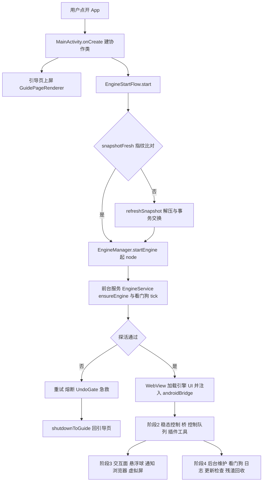
```mermaid
flowchart TD
  A["用户点开 App"] --> B["MainActivity.onCreate 建协作类"]
  B --> C["引导页上屏 GuidePageRenderer"]
  B --> D["EngineStartFlow.start"]
  D --> E{"snapshotFresh 指纹比对"}
  E -->|"否"| F["refreshSnapshot 解压与事务交换"]
  E -->|"是"| G["EngineManager.startEngine 起 node"]
  F --> G
  G --> H["前台服务 EngineService ensureEngine 与看门狗 tick"]
  H --> I{"探活通过"}
  I -->|"是"| J["WebView 加载引擎 UI 并注入 androidBridge"]
  I -->|"否"| K["重试 熔断 UndoGate 急救"]
  K --> L["shutdownToGuide 回引导页"]
  J --> M["阶段2 稳态控制 桥 控制队列 插件工具"]
  M --> N["阶段3 交互面 悬浮球 通知 浏览器 虚拟屏"]
  M --> O["阶段4 后台维护 看门狗 日志 更新检查 残渣回收"]
```

### 阶段 0：首次部署（装机后第一次启动，一次性）

- 快照就绪判据是**指纹比对**：`app/src/main/java/com/dsharnessmobile/shell/EngineManager.kt:81`（`snapshotFresh`）拿 `filesDir/.snapshot-fingerprint` 与 `assets/snapshot.sha256` 比；
- 不新鲜 → `EngineManager.kt:99`（`refreshSnapshot`）：解压到暂存（`EngineManager.kt:434` `extractSnapshotTo`）→ **事务交换**（`app/src/main/java/com/dsharnessmobile/shell/SnapshotTransaction.kt:256` `swap`，marker 三阶段 `STAGED/SWAPPING/SWAPPED` 见 `SnapshotTransaction.kt:53`）→ 指纹提交；中途被杀由下次启动的 `EngineManager.kt:238`（`recoverInterruptedRefresh`）前滚/回滚/丢弃；
- 交换内还要合并用户面：`SnapshotTransaction.kt:439`（`mergeProfiles`）、`SnapshotTransaction.kt:385`（`reconcileRemovedProfilePlugins`，已摘除插件的存量迁移）；残渣按年龄回收 `SnapshotTransaction.kt:190`（`reclaimResidue`）；
- 引擎首启：`EngineManager.kt:810`（`startEngine`）；运行时补丁在 `EngineManager.kt:756`（`applyRuntimePatches`）。

### 阶段 1：每次冷启动（秒级到三十秒）

- `MainActivity` 用 `by lazy` 建协作类（`app/src/main/java/com/dsharnessmobile/shell/MainActivity.kt:86` 起）；`MainActivity.kt:719` 是**全仓唯一的 `addJavascriptInterface` 注入点**（页面桥）；
- 引导页先上屏并自证进度（`GuidePageRenderer`），同时 `app/src/main/java/com/dsharnessmobile/shell/EngineStartFlow.kt:405`（`start`）拉起前台服务：`app/src/main/java/com/dsharnessmobile/shell/EngineService.kt:48`（`onStartCommand`）→ `EngineService.kt:107`（`ensureEngine`）；
- 看门狗在服务侧起 tick：`app/src/main/java/com/dsharnessmobile/shell/WatchdogV2.kt:109`（`planTick`，深度探活/退避/熔断）；
- 失败退路：启动超时与重试（`EngineStartFlow.kt:378`/`:384`）→ 熔断（`WatchdogV2.kt:76` `tripped`）→ 急救回退（`UndoGate` 调 `assets/undo-emergency.mjs`）→ 回引导页（`EngineStartFlow.kt:318` `shutdownToGuide`）。

### 阶段 2：稳态控制（引擎跑起来之后一直跑）

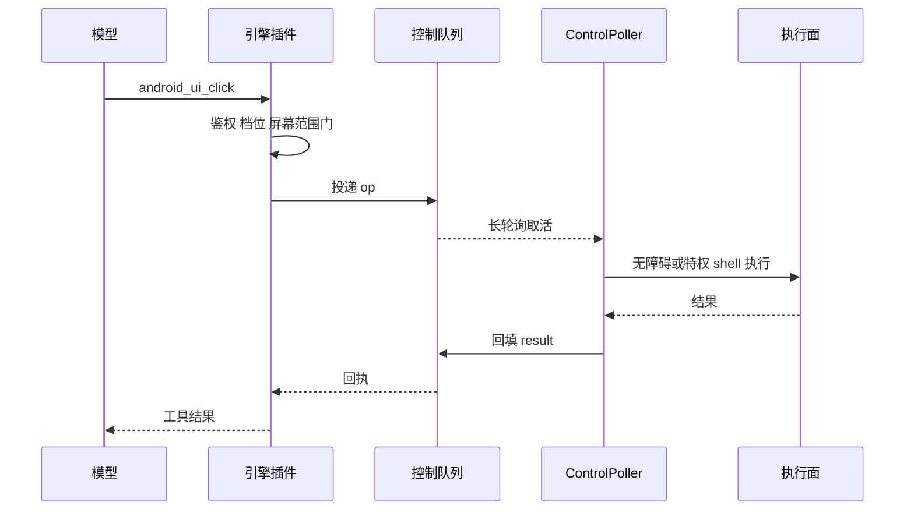
```mermaid
sequenceDiagram
  participant M as 模型
  participant P as 引擎插件
  participant Q as 控制队列
  participant C as ControlPoller
  participant X as 执行面
  M->>P: android_ui_click
  P->>P: 鉴权 档位 屏幕范围门
  P->>Q: 投递 op
  Q-->>C: 长轮询取活
  C->>X: 无障碍或特权 shell 执行
  X-->>C: 结果
  C->>Q: 回填 result
  Q-->>P: 回执
  P-->>M: 工具结果
```

- 壳侧轮询入口：`app/src/main/java/com/dsharnessmobile/shell/ControlPoller.kt:65`（`start`）→ `ControlPoller.kt:96`（`loop`）→ `ControlPoller.kt:158`（`runOp` 分发）；
- 无障碍执行面：`app/src/main/java/com/dsharnessmobile/shell/DeviceControlService.kt:444`（`onServiceConnected`，能力声明与树/动作/截屏 op）；
- 特权执行面：`app/src/main/java/com/dsharnessmobile/shell/ShellOps.kt:80`（`handle` 的 op 分发）→ `ShizukuTransport`（`app/src/main/java/com/dsharnessmobile/shell/ShizukuTransport.kt:271` `runShell`）；
- 编码唯一入口：`ControlProtocolV2.kt`（壳侧）；页面↔壳的同步桥与返回网关见 `AndroidBridge.kt` / `BackGate.kt`。

### 阶段 3：交互面（用户随时触发）

- 悬浮球/光环/面板/报告栏：`app/src/main/java/com/dsharnessmobile/shell/OverlayService.kt:155`（`onCreate` 建三窗口）；
- 通知中心与通知内应答：`NotifyCenter` → `NotifyStore`（偏移消费）→ `NotifyDecisionQueue`（耐久队列）→ `MuxClient`（`/api/remote.mux`）；
- 隔离浏览器：`app/src/main/java/com/dsharnessmobile/shell/BrowserHost.kt:361`（`statusJson`）/`:367`（`show`）/`:423`（`navigate`）——该 WebView **无 bridge**；
- 虚拟屏：`VdisplayController` + `VdisplayHost`（viewer Surface）+ `VdisplayFloat`（浮窗），特权走 `ShizukuTransport`。

### 阶段 4：后台维护（低频）

- 看门狗持续探活/退避/熔断（`WatchdogV2.kt:109`）；日志采集与轮转（`LogCollector`）；
- 在线更新检查：`EngineStartFlow.kt:294`（`startUpdateCheck`）→ `UpdateChecker`/`UpdateManager`（manifest 为空即 fail-closed 跳过）；
- 残渣回收与标记恢复（`SnapshotTransaction.kt:190` / `EngineManager.kt:238`）。

### 横向：构建与验收链

- 构建链（`scripts/build-apk-013.ps1` → 快照注入 → 门禁 → 打包）见 §6 的 B01；静态门禁与 CI 见 B02；设备验收套件（CDP + adb）见 B03 与 `docs/AGENTS/emulator-test-protocol.md`。

## 2. 查点主表（19 个块）

> 列义：**阶段**＝在整机生命周期的哪一段跑；**依赖**＝它读/调用的块；**被谁拉起**＝触发它的块或外部角色；**耦合**＝改它时最可能连带受影响的面积（高/中/低）；**关键文件**＝排查第一站（完整锚点见 §6）。

| ID | 名称 | 一句话职责 | 入口/触发 | 阶段 | 依赖 | 被谁拉起 | 关键文件 | 耦合 |
|---|---|---|---|---|---|---|---|---|
| K01 | 启动与引导面 | 点开 App 到引擎页面可见的进程入口、引导页与 WebView 宿主 | LAUNCHER 图标、VIEW/SEND 来件、ACTION_UPDATE | 引导与启动 | 引擎进程与快照面、鉴权探活、诊断落盘 | 系统启动器与分享面板、BootReceiver、悬浮球跳转 | MainActivity.kt,EngineStartFlow.kt,GuidePageRenderer.kt | 高 |
| K02 | 引擎生命周期与保活 | 起 node 引擎、5s 探活、看门狗重启熔断与日志落盘 | EngineStartFlow.start、EngineService 5s tick | 引导与启动 | K01,K03 | MainActivity、BootReceiver、EngineStartFlow | EngineManager.kt,EngineService.kt,WatchdogV2.kt,LogCollector.kt | 高 |
| K03 | 快照事务与更新链 | 内嵌快照暂存交换事务与回滚，兼在线更新与清单合并 | 启动流判指纹不新鲜 / 引导页检查更新 / WebView 下载 | 快照与更新 | 引导启动流、引擎探活、构建快照资产 | EngineStartFlow.runFlow、EngineService 看门狗、引导页按钮、MainActivity 的 WebView 回调 | SnapshotTransaction.kt,SnapshotFs.kt,UpdateManager.kt | 高 |
| K04 | 桥与控制协议面 | 页面 JS 桥面、引擎鉴权与控制队列承载 | 页面调 androidBridge；EngineService 起控制承载 | 稳态控制 | 引导与启动（EngineService/MainActivity）、无障碍与虚拟屏宿主、快照与更新（UndoGate） | MainActivity 装桥；EngineService.onCreate 起 ControlCarrier；看门狗 tick 调 UndoGate | app/src/main/java/com/dsharnessmobile/shell/AndroidBridge.kt,app/src/main/java/com/dsharnessmobile/shell/ControlPoller.kt,app/src/main/java/com/dsharnessmobile/shell/EngineAuth.kt,app/src/main/java/com/dsharnessmobile/shell/ControlProtocolV2.kt | 高 |
| K05 | 无障碍控制面 | 按需取语义树并对设备执行点击输入滚动截屏 | 控制队列取活 + 无障碍服务回调 | 稳态控制 | K04 控制协议、K06 特权执行 | ControlCarrier 控制队列取活、onServiceConnected、ADB 键盘广播 | DeviceControlService.kt,GlobalActionCatalog.kt,AdbKeyboardService.kt,AdbKeyboardReceiver.kt | 高 |
| K06 | 特权执行、屏幕范围与本地文件面 | Shizuku 特权 shell 通道、屏幕范围门与本地文件出入口 | 引擎 sh* op / 设置页范围写面 / 外部分享与打开 intent | 稳态控制 | 控制队列承载、引擎 bridge 插件、虚拟屏注册表、无障碍控制面 | 引擎 androidPrivilege 服务面与页面桥 | ShellOps.kt,ScreenScope.kt,ShizukuTransport.kt,ShizukuUserService.kt,ShizukuProbe.kt,ShizukuSupport.kt,ProcIo.kt,FileIncoming.kt,PathOpen.kt,ConfigTransfer.kt | 高 |
| K07 | 虚拟屏宿主 | Shizuku 建屏与 viewer Surface 交接的生命周期编排 | 模型 vd 工具 / 侧栏桥面 / Activity 生命周期 | 交互面 | Shizuku 特权通道、K05 无障碍控制面、K08 浏览器宿主 | MainActivity、DeviceControlService 与 ControlCarrier、侧栏面板 | VdisplayController.kt,VdisplayHost.kt,VdisplayOps.kt | 高 |
| K08 | 浏览器宿主 | 隔离浏览器：无桥 WebView、准入过滤、几何与保活 | 模型 browser* op（控制队列）/ 面板 browserHost* 桥 | 交互面 | S01,P03,控制队列 | MainActivity 构造，op 与面板下推拉起 | BrowserHost.kt,BrowserHostNavigationPolicy.kt,BrowserOverlayPolicy.kt | 高 |
| K09 | 悬浮球与面板 | 悬浮球三窗口与展开面板：状态、待答、应答、完成态 | 设置页开关或 onResume 补启；点球展开；WS 帧与 live 文件事件 | 交互面 | K01,K10,引擎网关 | K01 宿主 Activity 与桥开关；EngineService 划掉后台时停它 | OverlayService.kt,OverlayPanel.kt | 高 |
| K10 | 通知中心 | 引擎事件到通知栏应答的投递-应答闭环 | 引擎 .notify.ndjson / WS waterfall / 通知动作广播 | 交互面 | P01 通知投影、K09 面板 pending | EngineService.onCreate、动作广播冷启动 | NotifyCenter.kt,NotifyBridge.kt,NotifyStore.kt,NotifyDecisionQueue.kt | 高 |
| K11 | Kotlin 单测面 | 49 个 JVM 契约测试类钉住壳侧行为与调用点，靠数量基线防防线删失 | `gradlew :app:testDebugUnitTest` / `node scripts/check-kotlin-test-count.mjs` | 测试与门禁 | 横切 | gradle 结果 XML → check-kotlin-test-count 逐类基线 456 → 打包链与发布链判 SKIP | app/src/test/java/com/dsharnessmobile/shell,scripts/check-kotlin-test-count.mjs,scripts/kotlin-test-baseline.json,app/build.gradle.kts | 中 |
| P01 | 桥插件（dsh-android-bridge） | 设备控制的授权判定、控制队列与三条特权执行出口 | 模型设备工具 / 其它插件直连服务面 / 壳侧长轮询取活 | 稳态控制 | K04 控制队列协议、K05 无障碍面、K06 特权执行、P02 manage、P03 浏览器、K10 通知 | cordis 装配（provide androidPrivilege）、模型设备工具、壳侧 ControlPoller 长轮询 | plugins/dsh-android-bridge/src/index.ts,plugins/dsh-android-bridge/src/control-queue.ts,plugins/dsh-android-bridge/src/screen-scope.ts | 高 |
| P02 | 管理插件（dsh-android-manage） | 把模型意图落成壳侧无障碍或特权 shell 的屏幕工具面 | 模型每轮 tool call；插件 apply 时注册 14 个工具 | 稳态控制 | 授权桥与控制队列（androidPrivilege）,壳侧无障碍与特权执行面,屏幕范围偏好 | 引擎 cordis 装配（android-bridge 先于 android-manage）；每次模型 tool call | plugins/dsh-android-manage/src/index.ts,plugins/dsh-android-manage/src/protocol-v2.ts,plugins/dsh-android-manage/src/vd-shot.ts | 高 |
| P03 | 浏览器与虚拟屏插件 | browser_* 与 vd* 工具落壳侧控制 op 并如实回执 | 模型调用 browser_* / android_vdisplay_* 工具 | 稳态控制 | K08,K07,桥控制队列 | 引擎启动时按装配集注册 | plugins/dsh-android-browser/src/tools.ts,plugins/dsh-android-browser/src/index.ts,plugins/dsh-android-vdisplay/src/index.ts,plugins/dsh-android-vdisplay/src/status.ts | 高 |
| P04 | 文件打开、Linux 环境与模型能力插件 | 外部来件草稿、工具链与缓存清理、模型能力写回 | 壳侧 FileIncoming 投递 / 设置页 HTTP / cordis 装配 | 稳态控制 | 桥与鉴权、客户端注入层、shell-termux 工具链表、快照装配链 | 壳侧 FileIncoming.processIncomingIntent、设置页与开发者选项、cordis 装配 | plugins/dsh-android-file-open/src/index.ts,plugins/dsh-android-linux-env/src/runtime-cache.ts,plugins/dsh-model-capability/src/index.ts | 高 |
| S01 | 引擎侧注入层（三个子仓） | 页面内发布标记与桥入口、钳面板几何、装配老内核垫片 | 客户端插件 apply() 装载；每个 index 响应经 tapIndex 注入 | 交互面 | K04（壳侧 androidBridge/dshBackBridge 桥面） | 引擎插件系统按 profile-web.cordis.patch.yml 的 insert 行拉起 | dsh-client-ui-responsive/src/client/index.ts,dsh-host-web-compat/lib/index.js,dsh-shell-termux/src/index.ts | 高 |
| B01 | 构建链与快照注入 | 快照构建 插件注入 门禁收口 到 APK 出包 | 人手动 pwsh -File scripts\build-apk-013.ps1 或发布链/CI 调用 | 构建与发布 | 门禁块,壳侧快照解压,插件源码与 vendor 固化面 | 开发者手动,发布链 build-release.ps1,CI 与云端 build-apk.mjs | scripts/build-apk-013.ps1,scripts/build-snapshot-013.mjs,scripts/inject-all.py,scripts/patches/apply-patches.mjs | 高 |
| B02 | 静态门禁链与 CI | 33 个静态门禁脚本与三层接线的唯一声明处 | PR/CI、两条打包链、发布链 | 测试与门禁 | B01,B03 | 提交 PR、推 main、构建/发版 | scripts/check-release-gates.mjs,scripts/check-gate-skips.mjs,.github/workflows/pr-gate.yml,scripts/build-apk-013.ps1 | 高 |
| B03 | 设备验收套件（CDP 与 adb 面） | 7 个 CDP 断言套件 + 5 个部署冒烟脚本的设备侧验收入口 | 人手动逐个执行 node scripts/verify-*.mjs 与 pwsh scripts/*.ps1 | 测试与门禁 | S-12 双 ABI 包装机、快照刷新完成、桥面 / 浏览器宿主 / 虚拟屏 / 注入层各块 | 人（PR 前设备门禁，无 CI 接入） | scripts/verify-webview-015.mjs,scripts/verify-state-sync.mjs,scripts/verify-browser-host.mjs,scripts/verify-browser-panel.mjs,scripts/verify-vdisplay-viewer.mjs,scripts/verify-vdisplay-float.mjs,scripts/verify-engine-log-copy.mjs,scripts/device-smoke.ps1,scripts/deploy-device.ps1,scripts/deploy-embedded.ps1,scripts/t0-check.ps1,scripts/e2e-phone-test.ps1 | 高 |

## 3. 疑点清单（证据 + 影响 + 状态）

> 本清单来自逐块排查的「可疑点」，**未经修复验证**；标「未证实」的需先复现再动手。
> 下面的**高危表**是人工分级后的入口（一眼抓住要害）；再往下（§3.2）是逐块原始清单，含全部证据锚点与未证实项。

### 3.1 高危与高价值项（人工分级）

| 级别 | 查点 | 问题（一句话） | 证据锚点 | 影响 | 状态 |
|---|---|---|---|---|---|
| 高 | K04 | `jsString` 的 U+2028/U+2029 转义是**恒等替换**（源码两侧都是裸字符） | `app/src/main/java/com/dsharnessmobile/shell/AndroidBridge.kt:420-427` | 旧 WebView 上注入脚本解析失败，工具回执误报 `stale-ref`，模型被引向错误方向 | **已修（本轮）**：抽成纯函数 `escapeLineSeparators`（方向 = 裸字符转义文本），单测改为不依赖 org.json 实现的形态断言，9 例全绿（`app/src/test/java/com/dsharnessmobile/shell/BrowserHostNavigationPolicyTest.kt:129`） |
| 高 | K08 | `workspaces`/`currentWorkspace` 跨线程读写，且 `onMain` 只有 finally 没有 catch | `app/src/main/java/com/dsharnessmobile/shell/BrowserHost.kt:187-192`、`app/src/main/java/com/dsharnessmobile/shell/BrowserHost.kt:821`、`app/src/main/java/com/dsharnessmobile/shell/BrowserHost.kt:1661-1673` | 主线程 CME 一次即进程闪退（模型开页与侧栏展开同时发生）；`workspaces` 无上限无 TTL，每个新会话多一个常驻 WebView | 未修（评审 S-8/R1/R2） |
| 高 | K08 | 浏览器 op 在控制队列线程上自旋等导航：错误页路径必等满 10s 且仍回 `ok` | `app/src/main/java/com/dsharnessmobile/shell/BrowserHost.kt:1087`、`app/src/main/java/com/dsharnessmobile/shell/BrowserHost.kt:1101-1107` | 一次 `browser_open` 占住整条设备控制队列 10s，无障碍与特权命令全排队 | 未修（S-7/F-6） |
| 高 | K08 | 浏览器截图只写不删、`health` 恒 `ok`、失败原因串上一轮 `lastError` | `app/src/main/java/com/dsharnessmobile/shell/BrowserHost.kt:1565`、`app/src/main/java/com/dsharnessmobile/shell/BrowserHost.kt:1581`、`app/src/main/java/com/dsharnessmobile/shell/BrowserHost.kt:1589` | 长任务磁盘累积（全页 PNG）；截图失败原因误导 | 未修（S-6/F-7） |
| 高 | K08 | 「隔离浏览器」没有存储隔离：无 `setDataDirectorySuffix` 与清理 op，且引擎鉴权 cookie 在**进程级** `CookieManager` | `app/src/main/java/com/dsharnessmobile/shell/MainActivity.kt:815` | AI 访问过的站点 cookie/localStorage 持久驻留且用户无撤销入口；过滤一旦有缺口即带引擎 cookie 出网 | 未修（S-3/F-9） |
| 高 | K06 | 双引号内的命令替换不被扫描，屏幕范围门 fail-open | `app/src/main/java/com/dsharnessmobile/shell/ShellOps.kt:319-338` | 范围门在 `sh -c "…$(screencap)…"` 形态下漏判 | 未修（S-1/S-2 残留面） |
| 高 | K06 | 壳侧无危险命令黑名单，`controlExec` 直连路径同样没有 | `app/src/main/aidl/com/dsharnessmobile/shell/ShizukuUserService.aidl:31` | AIDL 注释声称黑名单在壳侧，实现里没有；服务面「地板」只落了一半 | 未修（S-5 残留） |
| 高 | K07 | `touch()` 全仓零调用点，「空闲回收」实为「建屏后 10 分钟必回收」 | `app/src/main/java/com/dsharnessmobile/shell/VdisplayController.kt:84`、`app/src/main/java/com/dsharnessmobile/shell/VdisplayController.kt:60` | 长任务看虚拟屏时中途黑屏 | 未修（F-10/V-R0） |
| 高 | K07 | `create()` 幂等判定在锁外、`setSurface` 失败被吞、`VdisplayHost.onMain` 无 catch | `app/src/main/java/com/dsharnessmobile/shell/VdisplayController.kt:322`、`app/src/main/java/com/dsharnessmobile/shell/VdisplayController.kt:495`、`app/src/main/java/com/dsharnessmobile/shell/VdisplayHost.kt:207-213` | 并发双建屏；查看器槽位被占但画面黑；主线程异常打穿 | 未修（S-8 同族） |
| 高 | K10 | `NotifySuppressQueue` 是纯进程内 `@Volatile List`，而解释偏移已被推进 | `app/src/main/java/com/dsharnessmobile/shell/NotifySuppressQueue.kt:83`、`app/src/main/java/com/dsharnessmobile/shell/NotifyStore.kt:246` | 进程在抑制窗口被杀，该通知**永久丢失**（无补投路径） | 未修 |
| 高 | K05 | 壳侧范围门比引擎侧宽 3 个 op（`state`/`webSnapshot`/`webAction`） | `app/src/main/java/com/dsharnessmobile/shell/DeviceControlService.kt:678` | 默认 `virtual-only` 范围下相关 op 必然误拒 | 未修 |
| 高 | K02 | `LogCollector.writeBootDiag/writeBootFail` 出口不过 `EngineAuth.redact` | `app/src/main/java/com/dsharnessmobile/shell/LogCollector.kt:458-480` | 启动诊断与失败日志可能带 token 落盘 | 未修（评审 I-5/H-12 点名） |
| 高 | K03 | 刷新失败路径不判 `rollback` 返回值即清 marker；残留 `previous` 会被下次失败路径当回滚源 | `app/src/main/java/com/dsharnessmobile/shell/EngineManager.kt:196-198` | 回滚结果被掩盖，坏树可能被「回滚」成更坏状态 | 未修（D-3 实效性缺口） |
| 高 | K03 | 在线更新的 `usr` 换位是非事务两步 `renameTo`，不写指纹也不写 marker | `app/src/main/java/com/dsharnessmobile/shell/UpdateManager.kt:69-80` | 中途中断即半新半旧且无恢复源；指纹口径不同还会让下次启动重解压 | 未修 |
| 高 | P01 | `sh -c "屏幕命令" 尾随词` 形态绕过屏幕范围门（引擎侧与壳侧同源） | `plugins/dsh-android-bridge/src/screen-scope.ts:200` | 范围门在带尾随词的 `sh -c` 形态下漏判 | 未修（S-1/S-2 家族） |
| 高 | P03 | 工具层以「壳侧按 session 判定」为由不做归属校验，而该锁已在 0.14 移除 | `plugins/dsh-android-browser/src/tools.ts:281-294` | 跨会话操作浏览器成为可能 | 未修 |
| 高 | P03 | `lastSnapshot` 是模块级单槽且不含页维度 | `plugins/dsh-android-browser/src/tools.ts:33` | B 会话的 `browser_click` 会消费 A 会话的 ref 与代次（新页首快照极易同码） | 未修（H-6） |
| 高 | B02 | Kotlin 单测数量门禁可被**整类删除**绕过（A 判据只看现存类，B 判据对缺席类直接 continue） | `scripts/check-kotlin-test-count.mjs:129`、`scripts/check-kotlin-test-count.mjs:153` | 「防防线删失」被部分架空 | 未修 |
| 高 | B03 | `verify-vdisplay-float` 的「非法档位必须被拒」是**永久假通过**，且顺手改设备档位 | `scripts/verify-vdisplay-float.mjs:95-103` | 该断言永远绿；跑一次就把设备 scale 写成 `coerce` 后的值 | 未修 |
| 高 | B03 | `verify-browser-panel` 的 `newTab:true` 是死参数（壳侧不解析） | `scripts/verify-browser-panel.mjs:123-128`、`app/src/main/java/com/dsharnessmobile/shell/BrowserHost.kt:384-394` | 「多页签」断言实际没建页签，属假覆盖 | 未修 |
| 高 | B02 | apk CI 的「工具输出 schema 契约门禁」结构必红：它只自建 manage 一个包，而门禁要求 7 个插件的 lib 在场；且一条门禁红会让后续 11 条全部 skipped | `.github/workflows/pr-gate.yml` | 分支 CI 长期红，且掩盖其余门禁的真实结果 | **已修（本轮）**：schema 门禁移到「插件单测门禁」的全量构建之后；第一个 job 的全部门禁步骤补 `if: always()`（失败不再掩盖后续）；本地按 CI 顺序复跑该门禁 PASSED（7 插件 153 分支） |
| 高 | P04 | `android_file_incoming_status` 的 execute 会**抛异常**而不是返回错误对象：`queueDir()` 里的 `mkdirSync(tmpWorkspace())` 在只读/不可建环境直接 EACCES | `plugins/dsh-android-file-open/src/index.ts:43`、`:504` | 环境不可建时模型拿到引擎级异常（而不是结构化错误）；契约要求「工具永不抛、失败回错误对象」 | 未修（0.14.1 apk CI 实测：`工具输出 schema 契约门禁` 报 `branch#1 execute 抛错：EACCES: permission denied, mkdir '/data/user/0/com...'`；本机 Windows 同名路径会落到盘符根目录故不报——**环境相关的假绿**。修法建议：`execute` 包 try/catch 返回 `{ok:false,error}`，并同步在 `output.schema` 声明这两个字段，否则引擎会按整值拒绝） |
| 中 | K01 | 主 WebView 渲染进程死亡后没有任何重建路径 | `app/src/main/java/com/dsharnessmobile/shell/MainActivity.kt:605-619`、`app/src/main/java/com/dsharnessmobile/shell/MainActivity.kt:193` | 崩溃后引导页被藏、看门狗刷 Toast，用户只能杀进程 | 未修 |
| 中 | K09 | 面板 `addView` 失败被静默吞掉，而 `expanded` 已置 true | `app/src/main/java/com/dsharnessmobile/shell/OverlayService.kt:299`、`app/src/main/java/com/dsharnessmobile/shell/OverlayService.kt:274` | 状态说面板在、屏幕上没有，且无日志 | 未修 |
| 中 | K04 | 审计 `result` 恒 `ok`、拒绝完全不落账 | `app/src/main/java/com/dsharnessmobile/shell/ControlAudit.kt:34` | 审计无法回答「谁执行了什么、结果如何」 | 未修 |
| 中 | P02 | `verifyClick` 不认屏、`ui_tree`/`act_input` 收 `screenId` 却不投递、`vdInput` 把 `displayId` 塞进 `x` | `plugins/dsh-android-manage/src/index.ts:394`、`plugins/dsh-android-manage/src/index.ts:728`、`plugins/dsh-android-manage/src/index.ts:1537` | 多屏会话下点击与取树落到错误屏幕，回执字段语义被污染 | 未修 |
| 中 | S01 | `smoke-injections.mjs` 断言 `transforms.length === 1`，而源码已注册两次 `tapIndex` | `dsh-host-web-compat/scripts/smoke-injections.mjs:50`、`dsh-host-web-compat/lib/index.js:783` | 子仓「注入冒烟」门禁当下是红的（apk 仓 CI 不跑它，所以没人看见） | 未修 |
| 中 | B01 | `build-apk-013.ps1` 无条件重设 `$apkDir`，作废「apk 仓自包含布局」检测 | `scripts/build-apk-013.ps1:166` | 从 apk 仓根直跑时布局检测失效 | 未修 |
| 中 | B02 | vdisplay 插件测试用 `../../../dsh-mobile-apk/app/...` 相对路径（只在协调仓布局成立） | `plugins/dsh-android-vdisplay/test/tools-callable.test.mjs:122` | 在 apk 树内跑该测试结构性必红 | **已修（本轮）**：改为「先试 `<repo>/app/...`、再试 `<repo>/dsh-mobile-apk/app/...`，都找不到即抛」；两种布局各 12 例全绿（S-11 同族） |
| 中 | B01 | `build-apk-013.ps1` 注释称「Kotlin 单测由发布链保证」，而 `build-release.ps1` 全文没有 `testDebugUnitTest` | `scripts/build-apk-013.ps1:141-144` | 「跑过单测」的保证不成立 | 未修（与 K11 可疑点 1 同源） |

### 3.2 逐块原始清单（未分级，按查点排列）

- [K01] 1. 主 WebView 渲染进程死亡后没有任何重建路径（已确认：`onRenderProcessGone` 在 MainActivity.kt:605-619 落诊断后 `view.destroy()`，全类 WebView 创建点只有 :193）。而 `GuidePageRenderer.showWeb()`（GuidePageRenderer.kt:363-372）随后会把引导页藏起、把已销毁的 WebView 置 VISIBLE，并在 `enginePageFailed` 为真时 `reload()`。后果：引擎健康后用户看到的是深灰空页（`:198` 设的中性深色底），冻结看门狗（EngineStartFlow.kt:96-126）会对一个死 WebView 每 20-30s 复判「页面无响应」并 Toast；源码注释所称「交由既有引擎监控/引导页路径恢复」在代码里没有实现（无第二处 `WebView(this)`）。安全网只有 Activity 被系统重建。
- [K01] 2. `MainActivity.onDestroy` 的 `webViewRef = null`（MainActivity.kt:422）没有身份校验，而同文件对 `BrowserHostHolder.host` 却写了 `===` 守卫（:441）。触发条件（未证实于本机）：MainActivity 未声明 `launchMode`、也没有 `onNewIntent`（manifest + 源码 grep 均无），系统分享面板的 VIEW/SEND 在已有实例（尤其 ConsoleActivity 在前台）时会以 standard 模式新建第二个实例——旧实例随即 onDestroy 把 `webViewRef` 清空，`DeviceControlService`（DeviceControlService.kt:852）此后恒报「页面不在场」。同源风险：两份启动流/监控/看门狗/回收定时器并存，`OverlayService.frameConsumer` 被后 Resume 者覆盖。
- [K01] 3. `pickToken` 是进程级随机 UUID（EngineManager.kt:1552-1559，`ensurePickToken` 只在 companion 内存缓存），但 MainActivity.kt:78-79 的注释称它「MainActivity 重建/看护重启不更换，与引擎 env 的 DSH_PICK_TOKEN 始终一致」；引擎侧在插件加载时取一次 `process.env.DSH_PICK_TOKEN`（dsh-host-web-compat/lib/index.js:794-802）并 fail-closed 校验 `x-dsh-pick-token`。而 EngineStartFlow.kt:424-437 明确支持「引擎先跑、app 后启动」的早退路径 ⇒ app 进程被杀重建后新 token 与仍活着的引擎 env 不一致，页面 `getPickToken()` 递的是新值 ⇒ `/api/android/dir-pick/*` 与 `/api/android/open-path` 403（后果未在本机复现，标未证实；代码可证的是两处取值来源不同生命周期）。
- [K01] 4. `WebUiChrome` 只剩沉浸式一条活链路：`applyImmersive`/`immersivePrefs`（MainActivity.kt:191）有调用点，而 `copyTextNative`(:37)、`keepScreenOn`(:54)、`releaseWakeLock`(:72)、`pushSystemDark`(:94)、`cancelThemePush`(:120)、`setImmersivePersisted`(:27) 全仓零调用点（grep 确认），实际生效的是 MainActivity.kt:850/874/967 的私有同形副本与 onDestroy 的 `screenWakeLock` 释放。影响：本类注释与 ARCHITECTURE.md:15 都把它当作这四类 chrome 的执行面（漂移）；且两个 `screenWakeLock` 字段并存——将来把 `onKeepScreen`/`onSetImmersive` 接回本类，`MainActivity.onDestroy` 的释放不会覆盖新字段，回归老 Review 修过的「成对 acquire/release」泄漏形态。
- [K01] 5. WebView 信任边界在本块的两处锚点（评审已点名，均只做登记不改）：进程级 `CookieManager` 注入引擎鉴权 cookie（MainActivity.kt:812-819，评审 S1/S3——同一 jar 对隔离 BrowserHost 可见，「隔离只是没有桥，不是存储隔离」）；非引擎 URL 一律 `downloadSaver.openInExternalBrowser`，无 scheme 白名单（MainActivity.kt:544-549，评审 5.13/H-11——`intent://`/`market://`/`tel:` 等任意 scheme 可经页面触发）。
- [K01] 漂移：`dsh-mobile-apk/docs/AGENTS/ARCHITECTURE.md:12` 说 EngineStartFlow.kt 为 539 行（同表 :9 MainActivity 918、:10 GuidePageRenderer 404），源码实测为 773 / 1175 / 419 行（`wc -l`，见该表自称「2026-09-14 当场实测」）。
- [K01] 漂移：`dsh-mobile-apk/docs/AGENTS/ARCHITECTURE.md:15` 说 WebUiChrome.kt 的职责是「沉浸式/剪贴板/常亮/主题推送（真源统一走 ShellState）」，源码里剪贴板/常亮/主题推送三组只有定义、无调用点（WebUiChrome.kt:37/54/94），生效面是 MainActivity.kt:850/967/874 的私有副本。
- [K02] 1. 【已确认，评审 §5.14 / I-5 / H-12 点名】`LogCollector.writeBootDiag`/`writeBootFail` 出口不过 `EngineAuth.redact`：LogCollector.kt:458-480 直接 `appendText(line)`，:544/562-590 的 `bootFailLine` 也不脱敏 detail；MainActivity.kt:569-573 却把 `url=${request.url}` 写进 boot-diag，而页面 URL 形态是 `ENGINE_URL + "/?token=" + token`（MainActivity.kt:822）。影响：一次 401/5xx 即把 launch token 明文落进 `files/boot-diag.log`（对照 :885 是唯一过 redact 的日文件咽喉）。
- [K02] 2. 【已确认，注释与实现不符】`startEngine` 的 90s 冷却窗不是闸门：`withinCooldown`（:831）只用于打一行日志（:845-847），真门槛是 `portReachable || managedProcessAlive`（:832-834）。影响：端口未开且句柄已失（孤儿 linker64 / 句柄被覆盖）时任何调用方都能立刻再 spawn；`START_COOLDOWN_MS` 注释（:1519-1524「no new start within this window」）会让排障者误判「90s 内不会再起」。
- [K02] 3. 【已确认的代码事实，现场未证实】启动窗保护依赖同一个可被清零的时间戳：`bootAgeMs = now - EngineManager.lastStartAttemptAt`（EngineService.kt:129 + WatchdogV2.kt:146），而该字段在 stopEngine:1271 / resetCooldown:1333 / rollbackToOld:1382 / EngineStartFlow.restart:702 都被置 0，置 0 后 bootAgeMs 变成 epoch 量级，「托管子进程仍在启动窗内」这条保护立即失效，刚 spawn 的引擎可能被 RESTART(force) 再杀一次；且时间戳取的是 kill 前的 `now`（:825 取、:867 写，中间 killExistingEngine 最长约 13s），实际启动窗比 90s 短。
- [K02] 4. 【未证实，属设计取舍】`DEGRADED_LOG` 无计数、无阶梯：WatchdogV2.kt:96-99 命中 engine.log 尾 4KB 的 `plugin tree failed to load`/`UncaughtException` 即判 DEGRADED_LOG，而 :70-71 只对 DEGRADED_HTTP 计数、:136 直接早退 IDLE（EngineService.kt:140 还每拍 `UndoGate.disarm`）。影响：HTTP 活着但插件树挂死的引擎永不自愈（理由「重开会打断活动 turn」成立），但也没有任何升级路径或用户提示，只能手动重启。
- [K02] 5. 【已确认的代码事实，误杀未证实】`killExistingEngine` 的 pkill 比注释宽：注释称「pnpm/脚本子进程不含 bin.js web 特征，不会被误杀」（:1314-1316），实际命令是 `pkill -f "bin.js"`（:1318），没有 web 约束；同 uid 下任何命令行含 `bin.js` 的进程（例如 agent 工具里跑 `node xxx/bin.js`）都会被每次启动/重启杀掉。另 `.waitFor()` 无超时，同步阻塞调用线程（含看门狗线程）。
- [K02] 漂移：`docs/AGENTS/BRIDGE-API.md:114` 说 `shellEnv()` 注入 `DSH_ADB_*`/`DSH_ADB_FULLACCESS`，源码 `EngineManager.kt:1464-1465` 注明 0.14.0 内置 adb 已退役、环境 map 里没有这两个键。
- [K02] 漂移：`docs/AGENTS/ARCHITECTURE.md:45` 说 WatchdogV2.kt 负责「boot 恢复用户同意状态」，源码该文件已无任何 Receiver（`ActivityManager`/`BroadcastReceiver`/`Intent`/`IntentFilter` 只剩零使用的 import，WatchdogV2.kt:3-8），BOOT_COMPLETED 处理在 `BootReceiver.kt:23-36`。
- [K02] 漂移：`docs/AGENTS/ARCHITECTURE.md:76` 给 LogCollector.kt 记 332 行（2026-09-14 实测），现为 931 行；同表 EngineService.kt 记 201 行，现为 246 行。
- [K03] 1. `app/src/main/java/com/dsharnessmobile/shell/EngineManager.kt:196-198` —— 刷新失败 catch 里 `SnapshotTransaction.rollback(...)` 的返回值未判、紧接着无条件 `clearMarker`，与 `SnapshotTransaction.recover` 的 D-3 处理（SnapshotTransaction.kt:688-699「回滚失败不得无条件清 marker」）自相矛盾，也与同文件的 `applyRecovery`（:308-313 把失败明细写进 `pendingRecoveryFailure`）不对称。触发：swap 中途抛异常且回滚有任一条目失败（例如删不净的 live 子树），marker 被清、失败条目无人上报。后果链：下一次刷新若在写 SWAPPING 之前就抛异常（空间断言拒绝 §7.2-F-4、或 stage 派生的任何异常），catch 会走 `rollback(marker=STAGED)`，而 `collectDisplacedNames`(SnapshotTransaction.kt:798) 会把残留的 `.snapshot-previous` 当成回滚源逐条覆盖回 live —— 即旧的工厂树被静默“复活”盖在新树上；此后 `hasResidue && snapshotFresh()` 的回收门（:253）也可能把仍需的残渣删掉。建议按 `recover` 的口径改：`if (!result.ok) { 保留 marker + 上报告警 } else clearMarker()`。
- [K03] 2. `app/src/main/java/com/dsharnessmobile/shell/SnapshotTransaction.kt:283-289` —— 空间断言覆盖面窄于审查 §7.2-F-4 / B12 的原始发现：断言跑在解压完成之后（stage 已付过 2.5 GB 量级空间），解压阶段本身仍无任何 StatFs 前置检查（`EngineManager.extractSnapshotTo` :434 直调解压），所以「解压中途 ENOSPC → 报运行时更新失败」的原症状还在；且 required 只由 live profiles 体积推导（`backupBytes + 25% + 64MB`），当 live profiles 明显小于 staged（回滚补偿删剩 / 半合并的现场，正是「失败→留残渣→空间紧→更易失败」的自我强化回路）时，`mergeTree` 补入文件的新分配不在预算内，`SnapshotFs.sizeOf`(:89) 还会把不可读条目按 0 静默低估。后果：断言放行后仍在合并中途 ENOSPC。另有一致性问题：`InsufficientSpaceException` 的可照做文案只进 `lastRefreshFailure`/boot-fail.log，用户界面拿到的是通用「运行时更新失败」（EngineStartFlow.kt:494），B12 要的「专门文案」只实现了一半。
- [K03] 3. `app/src/main/java/com/dsharnessmobile/shell/UpdateManager.kt:96-98` 与 `app/src/main/java/com/dsharnessmobile/shell/EngineManager.kt:81-86` —— 在线更新把 manifest 的 sha256 写进 `.snapshot-fingerprint`，而内嵌链的 `snapshotFresh()` 要求该文件等于 `assets/snapshot.sha256`；两个口径天然不等，于是下次进程启动必然判「不新鲜」→ 重解压内嵌快照，把刚完成的在线更新整体回滚（且 `.update-pending`/`usr-old` 不会被这条路径清掉，看门狗仍按旧时间戳推进确认/回退状态机，`rollbackToOld`(EngineManager.kt:1372) 可能在新树已就位后又把 `usr` 换回 `usr-old` —— 这一段的最终表现未在设备上证实）。影响面受 S-10 限定：默认 `DEFAULT_MANIFEST_URL` 为空，只有 `overrideManifestUrl` 打开时可达。
- [K03] 4. `app/src/main/java/com/dsharnessmobile/shell/UpdateManager.kt:69-80` —— 在线更新的 `usr` 换位是非事务的两步 `renameTo`（`usr`→`usr-old`→新树入位），既不写 `.snapshot-transaction`，也不进 `SnapshotFs.move`；`.update-pending` 只在两步都成功后才写。若在两次 rename 之间被杀（OOM、厂商清理），live 无 `usr`，而 `recoverInterruptedRefresh` 只认 `.snapshot-stage`/`.snapshot-previous`，看门狗也因缺 `.update-pending` 不会调 `rollbackToOld` —— 唯一恢复路径是内嵌快照全量重解压（实测 8 分钟量级）。同一函数开头 `SnapshotFs.deletePath(old)`(:71) 还会在上一次更新尚未确认/回退时先删掉唯一回退源 `usr-old`。
- [K03] 5. `app/src/main/java/com/dsharnessmobile/shell/SnapshotExtractor.kt:81` 与 `:142` —— 同一条目把 `entry.size` 累加进 `done` 两次（一次用于上限判定、一次用于进度），于是总量上限 `maxTotalBytes = 8 GiB` 实际在约 4 GiB 处触发，`onProgress` 上报的解压字节数约翻倍（解压条在解压到一半时即报满）。后果：S-10 想要的「快照真实体量 3–5 倍余量」实际只剩约 1.6 倍，偏大的合法快照会被判成「解压炸弹」中止（错误文案指向超限而真因是重复计数）。进度口径同时失真——EngineStartFlow 的「已写入 N MB」由它派生。
- [K04] 1. 【已修·本轮，见 §3.1】 （已证实，机制层）`jsString` 的 U+2028/U+2029「修复」编译成恒等替换：`AndroidBridge.kt:420-422` 源码是 `.replace(<裸 U+2028 字符>, "<单个反斜杠>u2028")`，第二个实参在 Kotlin 里是同一个字符（`\uXXXX` 是转义，不是六个字符）——编译产物 `app/build/tmp/kotlin-classes/debug/com/dsharnessmobile/shell/AndroidBridgeKt.class` 常量池里只有裸 U+2028/U+2029 两条字符串常量（`\x01\x00\x03 E2 80 A8`），没有 `\u2028` 转义串，两个实参去重成同一条 ⇒ 该行不做任何转义。为什么单测还是绿的（现场反证）：JVM 单测类路径显式引入了另一份实现 `org.json:json:20240303`（`app/build.gradle.kts:136-137` 注释自陈「本地单测用真实 org.json，android.jar 桩在 JVM 里抛 Stub!」）；`BrowserHostNavigationPolicyTest.kt:129-141` 在恒等替换下仍判绿（`app/build/tmp/kotlin-classes/debugUnitTest/.../BrowserHostNavigationPolicyTest.class` 的常量池含断言用 `\u20` 字面量，`app/build/test-results/testDebugUnitTest/TEST-…BrowserHostNavigationPolicyTest.xml` 现场读到 tests=9 failures=0），只可能是这份 jar 的 `quote` 自己转义了 U+2028/U+2029（其 `JSONObject.class` 内含写 `\u` 的字符串字面量，与该区间转义实现相符）。设备运行时用的是 Android 框架 `org.json`，与单测类路径不是同一实现 ⇒ 这条绿的判据测不到设备行为，是假保证。设备侧是否真需要该转义（审查 §3.1-C3 / F-3 断言 `JSONObject.quote` 不转义该区间）本轮无本机复算手段，未证实。
- [K04] 2. （已证实）审计语义：真实结果被塞进 args，`result` 恒 `ok`，拒绝完全不落账：`ControlAudit.kt:34` 硬编码 `.put("result","ok")`，而调用方把真值放进参数里（`ShellOps.kt:588-597` 传 `"ok" to ok`）⇒ `audit.ndjson` 出现 `result:"ok"` 与 `args.ok:false` 自相矛盾；`ShellOps.kt:94` 的范围拒绝 `return` 早于 `audit(...)`（四族审计点只在 `:101/:110/:119/:127`），安全事件（`screen-out-of-scope`）零留痕。事后复盘不可信（审查 §5.3）。
- [K04] 3. （已证实，潜伏）跨语言「逐字同规则」在带空白文本上不成立：壳侧编码器在符号表阶段就 trim（`ControlProtocolV2.kt:196-197` `sym(row.text.trim())`），参考实现 `protocol-v2.ts:349` 直接 `symOf(row.text)`，trim 只发生在 XML 入口 `rowsFromRaw`（`protocol-v2.ts:235-236`）；而跨语言 fixture `app/src/test/resources/protocol-v2/canonical-rows.json` 现场数出 393 行里 0 行 text/desc 带前后空白 ⇒ 门禁看不见这条差异（任一侧 trim 口径回归都不会红），`ControlProtocolV2.kt:21-22` 的「逐字同规则」声明比实际成立范围宽。
- [K04] 4. （代码路径已证实，设备后果未证实）返回键的「观测不到」方向与硬约束相反：`BackGate.kt:16-17` 的硬约束写「观测不到/关不掉的层一律消费，不得误退应用」，但 `parseDepth` 解析不出即回 0（`:70-73`，注释还自称「与观测不到不消费同向」），`onPageFinished(0)` → `available=false` → `decide` 落 `FINISH_ACTIVITY`（`:52-56`）⇒ 页面侧 `window.__dshBackDepth` 缺席（注入层/页面版本不匹配，正是审查 §7.7 那类「注册了但不真实可用」）时，返回键会退出应用而不是被消费。触发路径：`MainActivity.kt:502` 拉平拿 `undefined` → `parseDepth` 0；`:638` 只对引擎源页面拉平。
- [K04] 5. （已证实、审查 §5.7 未修）`MuxClient` 文本帧重组缓冲无总量上限：`MAX_FRAME` 只管单帧（`MuxClient.kt:45`、`:167`），`textBuf` 是唯一的跨帧累积器（`:56`），`0x1` 起始帧持续 `fin=0` + 无限 `0x0` continuation 即可无界增长（`:172-173`）→ OOM；缓解措施只有「引擎不可信」这一条的威胁模型判断，没有代码兜底。
- [K04] 备注（登记面而非代码缺陷）：`scripts/bridge-symmetry-baseline.json` 的 `preferenceGetters` 里 `getOverlayEnabled` 条目已过期，见下方漂移行。
- [K05] 1. 【已确认·代码路径】壳侧范围门比引擎侧宽 3 个 op，默认范围下必然误拒。`DeviceControlService.kt:678` 的 `REAL_SCREEN_OPS` 含 `state`/`webSnapshot`/`webAction`，而 `realScreenScopeError` 在 args 无 `screenId` 时按 `ScreenTargets.REAL` 判定（:701-702）；引擎侧两层已按块G F4b 摘除这三个（manage `SCREEN_ACTIONS` 无 web_dump、`controlExec` 用 8 项的 `REAL_SCREEN_CONTROL_OPS`，`plugins/dsh-android-bridge/src/screen-scope.ts:70` + `index.ts:991-997`），壳侧第三层没同步。触发：scope = virtual-only（prefs 未设置/损坏时的默认值）时，`android_web_dump {}` 不传 screenId（`plugins/dsh-android-manage/src/index.ts:2031` 显式不带）→ 壳侧回 `screen-out-of-scope` → 工具文案「WebView DOM 快照失败：screen-out-of-scope…」；同一根因让每次点击的生效校验退化成「（生效校验不可用：screen-out-of-scope…）」（`verifyClick` 的 `state` 调用不带 screenId，`index.ts:394`）。影响：默认配置下自有 WebView 通道整条失效，且成功点击的回执带一条误导性拒绝文案。现有测试只锁引擎两层（`plugins/dsh-android-bridge/test/screen-scope.test.mjs:336`、`plugins/dsh-android-manage/test/a11y-routing.test.mjs:479`），壳侧集合无任何覆盖。
- [K05] 2. 【已确认】`GlobalActionCatalog.kt:33-34` 把 `menu`/`mediaPlayPause` 的 minSdk 写成 31，真实引入版本是 36（本机 SDK `platforms/android-36/data/api-versions.xml` 与 `android-36.1` 均为 `since="36"`；本仓 `docs/AGENTS/ACCESSIBILITY-API.md:99` 也写 36）。触发：API 31-35 机型且 ROM 的 `getSystemActions()` 返回空集（规则③ `GlobalActionCatalog.kt:47-48` 会按 API 下限放行）→ 动作被宣传为可用，`performGlobalAction` 返回 false → 「全局动作 menu 被系统拒绝」——正是该目录注释声称要消灭的「工具说能做、点了没反应」。且 `app/src/test/java/com/dsharnessmobile/shell/GlobalActionCatalogTest.kt:63-64` 断言 API 31 上整表可用，测试正在保护这个错值（改对会让该用例变红）。
- [K05] 3. 【已确认·审查 §4.1-V-C0b（P1，0.14.0 报告、0.14.1 状态表标「未修」）】`api-below-30` 被映射成「等待重试/改用坐标」两条错指引。`rootProbe` 在 API<30 产出 `reason="api-below-30"`（:362-364），而 `handleSnapshot` 的文案只有 no-window 与 else 两支（:903-910），于是 API<30 的虚拟屏取树失败会得到「已有窗口但当前读不到语义树（可能仍在启动/切换中）：等待 1-2 秒后重试 android_ui_dump」——真因是平台没有 `getWindowsOnAllDisplays`，重试永不成功。对照 `handleScreenshot` 的 API<30 分支（:746-748）文案是对的，两处口径不一致。
- [K05] 4. 【已确认·代码】截屏回填超时零余量，壳侧那句超时永远不会被模型看到。壳侧 `latch.await(12, SECONDS)`（:802）与引擎侧 `a11yExec('screenshot', …, 12_000)`（`plugins/dsh-android-manage/src/index.ts:517`）同为 12s，而引擎从 enqueue 起算、壳侧从收到请求起算（前面还有最长 5s 的长轮询等待，`ControlPoller.kt:49`）→ 壳侧触到 12s 时引擎必然已先超时，模型看到的是「设备控制超时（12000ms 内壳侧未回填结果）——检查无障碍服务是否在运行」，把「截屏慢」误导成「无障碍没在跑」，而图其实已落盘。同族 R3：这 12s 内单在途队列上的其他 op（含 `vdInput`/`shExec`）全部排队。
- [K05] 5. 【未证实】`global` op 没有屏维度却按屏回执。`performGlobalAction(entry.id)`（:1330）不接受 displayId，但 `global ∈ REAL_SCREEN_OPS`，成功后回执被补上 `screenId`/`displayId`/`actionMode=a11y`（:669-674）。于是 `android_ui_global {screenId:"virtual-1", action:"back"}` 会回「已在 virtual-1 执行」，而 BACK 实际落在持有输入焦点的屏（通常是真实屏）。未证实：本轮为只读排查，未在设备上验证虚拟屏 active 时 `performGlobalAction` 的真实落点。
- [K05] 漂移：`docs/AGENTS/ARCHITECTURE.md:68` 说 `DeviceControlService.kt` 是 1094 行、能力面到「屏幕范围执行点复查」为止，源码 `app/src/main/java/com/dsharnessmobile/shell/DeviceControlService.kt` 现场为 1333 行（`wc -l`），且含该表未列的虚拟屏窗口选择面 `rootProbe`/`WindowPick`（:353-434）与 browser*/vd*/sh* 分支（:634-664）。
- [K05] 漂移：`docs/AGENTS/ARCHITECTURE.md:65` 说 ShizukuProbe.kt 被 MainActivity、DeviceControlService、VdisplayController 依赖，源码零引用——`grep -rl ShizukuProbe app/src/main` 只命中 `app/src/main/java/com/dsharnessmobile/shell/ShizukuProbe.kt` 自身（main 与 test 均无其它引用）。
- [K05] 漂移：`docs/AGENTS/ACCESSIBILITY-API.md:167` 说「⑤ 多窗口 `getWindows()` 的窗口选择面未接」，源码已接：`getWindowsOnAllDisplays()` + `WindowPick.order`（`app/src/main/java/com/dsharnessmobile/shell/DeviceControlService.kt:353-434`，回归 `app/src/test/java/com/dsharnessmobile/shell/WindowPickTest.kt`）。
- [K05] 漂移：`docs/AGENTS/ACCESSIBILITY-API.md:99` 说 `MENU` / `MEDIA_PLAY_PAUSE` 为 API 36，源码 `app/src/main/java/com/dsharnessmobile/shell/GlobalActionCatalog.kt:33-34` 写 minSdk=31（SDK `api-versions.xml` 两个 android-36 平台均 `since="36"`，支持文档口径，影响见可疑点 2）。
- [K06] 1. 双引号内的命令替换不被扫描 → 范围门 fail-open（S-1/S-2 家族的残留面，已确认）。`ShellOps.kt:319-338` 的 `"` 分支整段吞掉引号区域且不递归；`decideScreenCommand` 再经 `stripQuotedText` 抹白引号，于是该段既无命令词也无目标屏参数 → `ALLOW`。引擎侧 `plugins/dsh-android-bridge/src/screen-scope.ts:242-250` 同一形态（跨语言 fixture 因此恒绿，`test/fixtures/screen-scope-cases.json` 只覆盖裸 `` ` ``/`$()`）。触发：scope=virtual-only 时 `shExec('echo "$(screencap -p /sdcard/real.png)"')`（或 `sh -c 'echo "$(input -d 0 tap 1 2)"'`）→ 放行且内层真实执行，随后 `shPull` 取回（`shPull` 无范围门）→ 范围门被绕过的净效果。
- [K06] 2. `capture`/spool 面无任何生产调用方，大输出被 16 KiB 内联路径截断（S-6 面，已确认）。`ShellOps.exec` 的 `capture = args.optBoolean("capture", false)`（`ShellOps.kt:99`）在引擎 `execAdbShell`/`execAdbLine` 的投递参数里都不存在（`index.ts:1052-1055`、`:1092`），故走 `ShizukuUserService.exec`：读满 16 KiB 即 `break` 并关闭管道（`ShizukuUserService.kt:70-75`、`:29`）。总输出超过约 64 KiB 管道缓冲时子进程会被提前关闭的读端打死 → `ok=false` 而引擎却按 128 KiB 承诺（`index.ts:1063`）；AIDL 注释与 `ShizukuTransport.kt:269` 都按「capture 在用」措辞。
- [K06] 3. 「危险命令黑名单在壳侧复查」不成立，且 `controlExec` 直连路径没有这层（S-5 残留，已确认）。`app/src/main/aidl/com/dsharnessmobile/shell/ShizukuUserService.aidl:31` 声称黑名单在壳侧；壳侧 Kotlin 无任何黑名单（`app/src/main` grep `黑名单|dangerous|危险命令` 零命中），黑名单只在引擎 `index.ts:368/1038/1074/1375`，而 `controlExec` 只做档位门（`index.ts:949-956`）。连带：`shRemove` 全仓零调用方（仅登记面），却可经 uid 2000 删除任意绝对路径且目录递归（`ShellOps.kt:123-129`、`ShizukuUserService.kt:207-233`）——登记了但没有任何一层守。未证实是否有意预留。
- [K06] 4. `ensureBound` 15s 预算与 `shExec` 20s 执行时限叠加可越过引擎 25s 入队时限（S-6 不变量的缺口，已确认代码路径、未证实实机频度）。冷启动/Shizuku 重启后最早几条命令最坏 15s+20s=35s > 25s：引擎在 25s 放弃并报「设备控制超时」，壳侧稍后仍会执行该命令 → 正是 S-6 想消灭的「假失败 + 副作用已发生」（非幂等命令会被模型重试二次执行）。叠加 `ControlPoller` 单线程（`ControlPoller.kt:96` 循环、`:125` 执行）：慢命令期间 a11y/browser/vd 全部排队。
- [K06] 5. `MainActivity` 两处直连 `ShizukuTransport.runShell`，绕开 `ShellOps.scopeDenied` 这个执行点（未证实有实害）。`unlockLegacyStorageApi29`（`MainActivity.kt:1054`、`:1059`）与 `unlockRestrictedSettingsViaShizuku`（`MainActivity.kt:1076`）的命令是固定 argv、不含屏幕命令词，故当前不构成真实屏绕过；但「所有特权命令都过执行点复查」这条不变量在此不成立，后续若有人把模型可控串接进来即失守。
- [K06] 漂移：`docs/AGENTS/BRIDGE-API.md:122` 说 ShizukuTransport/ShizukuUserService 是「固定 argv、16KB 输出上限；页面/引擎拿不到原始 binder 或任意 shell 面」（AIDL v1），源码 `ShizukuUserService.kt:30` 是 `PROTOCOL_VERSION = 2`（execCapture 落盘面 + 单文件 256 MiB），`ShizukuTransport.kt:271-301` 与 `ShellOps.kt:91-103` 交给引擎的正是任意 `sh -c` 命令面。
- [K06] 漂移：`docs/AGENTS/BRIDGE-API.md:125` 说 ScreenScope「执行点复查在 DeviceControlService」，源码 `ShellOps.kt:132`（scopeDenied）才是特权 shell 通道的执行点复查，`DeviceControlService.kt:703`（realScreenScopeError）只管无障碍 op 面。
- [K06] 漂移（注释）：`app/src/main/aidl/com/dsharnessmobile/shell/ShizukuUserService.aidl:31` 说「危险命令黑名单仍在壳侧判定」，源码壳侧无任何黑名单（`app/src/main` 下 grep `黑名单|dangerous|危险命令` 零命中），黑名单只在 `plugins/dsh-android-bridge/src/index.ts:368`。
- [K06] 漂移（注释）：`app/src/main/res/xml/file_paths.xml:3` 说安全边界「与 MainActivity.OPEN_READER_ROOTS 同步」，全仓无该符号（仅此注释一处），运行时白名单实为 `app/src/main/java/com/dsharnessmobile/shell/FileIncoming.kt:467` 的 `isReaderAllowed`。
- [K06] 漂移（提示文案）：`app/src/main/java/com/dsharnessmobile/shell/ShizukuProbe.kt:69` 说「本应用清单尚未声明 rikka.shizuku.ShizukuProvider，属已知未落地项」，`app/src/main/AndroidManifest.xml:158` 已声明该 provider（authorities 为 `${applicationId}.shizuku`）。
- [K06] 补充：本轮抽查的 6 个桥接镜像文件（`plugins/dsh-android-bridge/src/screen-scope.ts`、`src/index.ts`、`src/shell-ops.ts`、`src/control-queue.ts`、`test/screen-scope.test.mjs`、`test/fixtures/screen-scope-cases.json`）协调仓与 apk 仓副本逐字节一致；壳侧 fixture 副本 `app/src/test/resources/screen-scope/screen-scope-cases.json` 与插件侧权威源仅排版不同（规范化后的标准形态），内容等价。
- [K07] 1. 已确证（V-R0 / F-10）：`touch()` 全仓零调用点（`VdisplayController.kt:84` 只有定义），`lastUsedAt` 的唯一写入是 `Record` 构造默认值（`:60`）。于是「空闲回收」实际是「建屏后满 10 分钟必回收」：长任务里模型第一条 vd 调用会在解析阶段把屏删掉并回 `screen-not-ready`，guidance 只说「已回收空闲虚拟屏」，归因误导。插件侧 `tools-callable.test.mjs` 只断言 `reclaimIdle/IDLE_RECLAIM_MS/lastUsedAt` 三个字符串在场，所以失效不会判红。
- [K07] 2. 未证实（有触发条件，与 S-8 同族）：`touch()` 的 `records.values.forEach`（`:86`）与 `status()` 里的 `records[selected]`（`:253`）都在 `synchronized(lock)` 之外读 `records`，而 `records` 有两个跨线程写者（控制队列线程的 `create/destroy`、主线程 reaper 的 `reclaimIdle`）。今天 `touch` 是死代码所以不发作；F-10 的修法（在 status/select/input/screens 里刷新）一落地，主线程就会在遍历中撞上控制线程的 `records.remove` → ConcurrentModificationException 打穿主线程 = 闪退。修 F-10 时必须同时把刷新点收进锁内。
- [K07] 3. 已确证（V-R5）：`create()` 的幂等判定在锁外（`:322`），锁内（`:343` 起）不复查 `records`，中间还夹着最长 15s 的 `ensureBound`（`:324`）。控制队列线程（模型 `vdCreate`）与主线程桥面（面板 `vdisplayCreate`）并行时两侧都通过检查 → 各建一块，`MAX_VIRTUAL_DISPLAYS=1` 的全链假设被打破。
- [K07] 4. 已确证（V-R7）：`attachViewerSurface` 用 `runCatching { record.display.setSurface(surface) }` 吞掉失败（`:495`），但 `record.viewerId/viewerSurface` 已被占用（`:492-493`）且 `status()` 因 `state=active` 回 `ok:true` → 宿主 `attached=true`，黑屏且重开修不好；同处 `viewerBounds`（`:116`、`:520-523`）无上限、`VdisplayHost.destroy()` 也不注销，Activity 每次重建留一条永不回收的 JSON，并被 2s 轮询的 `status()` 整个序列化。
- [K07] 5. 已确证（S-8）：`VdisplayHost.onMain`（`:207-213`）没有 catch —（a）`block` 在主线程抛异常时（`releaseViewerSurface → status → kickBind/Shizuku 往返`）经 `main.post` 成为主线程未捕获异常 = 进程闪退；（b）2s `latch.await` 超时只回 `main-thread-timeout`，不报是哪个 block。`BrowserHost.kt` 是同一份实现的第二份（S-8 要求两份同改）。
- [K08] 1. 【已确认，S-8 / R1】`workspaces` 与 `currentWorkspace` 跨线程。控制队列线程在 `workspaceFor` 里写 map（:187-192，由 :506 `switchTo(workspaceFor(session))` 每次 op 触发），主线程在 `applyVisibility`（:821）与看门狗（:871）里遍历同一张 `LinkedHashMap`；`currentWorkspace`（:184）无 `@Volatile`，而 `onMain`（:1661-1673）只有 `finally` 没有 `catch`。复现：模型连开新会话页面 + 用户侧栏展开（300ms 一拍 `setStageBounds` → `applyVisibility`）。一次 CME 即 uncaught on main Looper = 进程闪退，且 `workspaces` 可能停在半写状态。
- [K08] 同族【已确认，R2 / H-1】：`workspaces` 无上限、无 LRU/TTL，全仓无 `onTrimMemory`（grep 零命中），`MAX_TABS=8` 只是每工作台上限，也没有「会话被删除 → `dropWorkspace`」的可信信号。每个新 session 开页即多一个 WebView，驻留到 Activity 销毁。
- [K08] 2. 【已确认，S-7 / R3 / R6 / F-6】浏览器 op 在控制队列线程上忙等：`awaitNavigation`（:1101-1107）用 `Thread.sleep(40)` 自旋，冷启动预算 10s（:1087）；而内置错误页的 `onPageStarted` 被守卫 `return`（:670）不推进代次 → DNS 立即失败时必然等满预算再 `return ok:true`（:1088）。影响：一次 `browser_open` 最坏占住整条设备控制队列 10s（a11y / vd / `sh*` 全排队），回执仍是成功（`reason` 只有 `status()` 带出）。
- [K08] 3. 【已确认，S-6 / R7 / F-7】截图生命周期与回执：`shotOp` 写 `filesDir/home/tmp/dsh-tmp/browser-shot-<ts>.png`（:1565），全仓 grep `browser-shot` 只命中这一处写入点、无任何删除点，而 :1590 的 note 与工具层文案都称「读完即删」；`health` 是字面量 `"ok"`（:1589，契约声明 `ok|suspect`）；失败分支 `lastError.ifBlank { "shot-failed" }`（:1581）会把上一次遗留的 `lastError`（如 `load-error:-2`）当成截图失败原因。影响：长任务磁盘累积（全页 ARGB_8888 PNG 100%）+ 失败原因误导。
- [K08] 4. 【已确认，H-7 / F-1 / F-4 / F-8】回执与能力不实四处：① `caps()` 的 `rendererProcesses:0`、`cdpEnabled:false`、`browserWebViewAvailable:true`、`androidxWebkitCompiled:true`、`densityOverrideSupported:false`（:1015-1017）与 `status().available:true`（:912）全是常量，被 P03 的 `facts.ts/tier.ts` 当设备事实消费；② `applyDocumentStartScript` 在能力门不过时静默 `return`（:1196），而 `viewportOp`/`setViewport` 成功体只有 `ok/route/width/height`（:1117、:1131），不报 `scriptApplied/degraded`（隔壁 `identityResult`:1182-1189 是如实上报的）→ 视口没生效也回 ok；③ 视口区间两侧不同源：面板 240..4096（dsh-client-ui-responsive/src/client/mobile/browser-tab.tsx:83、:89）vs 壳侧 240..3840（:482、:1122、:1159），面板校验通过、壳侧拒、面板不渲染错误 → 用户看到「什么都没发生」；④ 隔离 WebView 无 `onReceivedHttpError`、无 `setDownloadListener`（grep 只命中可信 WebView：MainActivity.kt:565、:648），404/403/500 与「点了 PDF」在 `loadState` 上仍报 `loaded`、在工具回执上仍是 `ok:true, changed:false`。
- [K08] 5. 【已确认，S-3 / F-9】「隔离」只是无桥，不是存储隔离：`app/src/main/java` 全域无 `setDataDirectorySuffix` / `removeAllCookies` / `WebStorage.deleteAllData`，也无 `browserClearData` 一类清理 op（grep 零命中），而引擎鉴权 cookie 注入的是进程级 `CookieManager`（MainActivity.kt:815）。影响：隔离 WebView 与引擎会话共用 cookie/存储池，AI 访问过的站点 cookie/localStorage 持久驻留且用户无撤销入口；请求级过滤一旦出现缺口，被解析到回环同源的请求会带引擎 cookie。
- [K08] 未证实：请求级过滤把 `ws`/`wss` 也纳入 scheme 判定（BrowserHostNavigationPolicy.kt:87），似假定 WebSocket 握手会进 `shouldInterceptRequest`；Android 是否真把 WS 升级交进该回调，本轮未在设备上确认。若否，页面可用 `ws://127.0.0.1:3080/` 绕过 403 面（验证法：加载公网页后 `new WebSocket("ws://127.0.0.1:3080/")`，看 `blockedRequests` 是否 +1、logcat 是否出 `dsh-browser`）。
- [K08] 漂移：`docs/AGENTS/ARCHITECTURE.md:18` 说 `BrowserHostNavigationPolicy.kt` / `BrowserOverlayPolicy.kt` 为 210 / 82 行，现场 `wc -l` 是 231 / 86 行（同行的 BrowserHost.kt 1813 与文档一致）。
- [K08] 漂移：`dsh-client-ui-responsive/src/client/mobile/browser-tab.tsx:248` 注释说「原生层 foreignViewer 亦 fail-closed」，源码 `BrowserHost.kt:810-814` 明写 foreignViewer 判定已随按会话隔离删除（全仓只剩这条注释提及该符号）；同文件 `:398-401` 的口径才是现状。
- [K09] 1. `activeSessionId` 的 id 域混用（已确认代码事实，影响未在设备复现）：`OverlayService.kt:473-474` 把 `api-session/status` 的 agentId 写进 `activeSessionId`，而 `OverlayPanel.kt:1060-1061` 的 A-R5 口径明说「agent id 不得当 session id」，且清理只发生在 `userPinnedSession` 为真时（`:1062-1064`）。该值随后被三处消费——`session/prompt` 的 sessionId（`OverlayService.kt:621`）、pending 匹配（`OverlayPanel.kt:179-181`）、完成位比对门（`OverlayReport.kt:370-372`）。两者不同域时症状为发送落到不存在/别的会话、待答卡不显示、完成文案永不出现。源码自述该映射未确证（`OverlayService.kt:502-503`）。
- [K09] 2. 面板窗 addView 失败被静默吞掉（已确认）：`OverlayService.kt:299` `try { wm.addView(unit, pp) } catch (_: Exception) {}`，而 `expanded` 已在 `:274` 置 true，异常既无日志也无回滚。用户只见「点球没反应」，且下一次点球会走 hidePanel。同族 picker（`OverlayPanel.kt:1177-1179`）与报告栏（`OverlayReport.kt:164-166`）都留了 `LogCollector` 痕迹（判据见坑 149）；对照 `:254` 的球窗 addView 未包 try，那边抛异常会直接崩服务。
- [K09] 3. 自动收起守卫覆盖不到待答卡草稿（已确认）：守卫是 `!panel.hasDraft()`（`OverlayService.kt:509`），而 `hasDraft`（`OverlayPanel.kt:947`）只看输入行 `inputBox`；提问卡的「输入你的答案」存在 `qCustom` 与卡片 EditText（`OverlayPanel.kt:73`、`:734-744`）。轮次结束时先 `dropPendingFor`（`OverlayService.kt:499` 使 `pendingKind` 变空）再过 900ms 自动收起（`:509-515`）。触发：展开面板 → 提问卡输入到一半 → 不提交 → 引擎轮次结束或 `turn_end` 清理（`OverlayLiveFeed.kt:160`）→ 答案与卡片一起消失且无提示。
- [K09] 4. 自动收起分支里的 `flashStatus("已完成")` 是死调用（已确认，坑 148 已登记）：`OverlayService.kt:512-513` 先 `hidePanel()`（`:327` 同步置 `expanded=false`）再 `flashStatus`（`:686` 有 `if (expanded)` 守卫）→ 永不显示；真正可见的是 `:516-518` 的 else 分支。影响：无用户可见后果（完成位已接管提示），但会误导维护者以为此处有反馈。
- [K09] 5. `frameConsumer` 避让帧恒为 0px 的死通道（已确认）：`OverlayService.kt:737-745` 把 `lastRight`/`lastBottom` 恒置 0，`replayFrame`（`:748-752`）重放同样 0px；`emitFrame` 在拖动松手、开合面板、onDestroy 都向 WebView 注入一次 JS（消费方 `MainActivity.kt:296`）。影响：0.13.2 起不再挤开页面属预期，但排查「WebView 被挤开一条缝」类旧症状会误入此路，且每次拖动松手多一次跨进程 `evaluateJavascript`。
- [K09] 漂移：`dsh-mobile-apk/docs/AGENTS/ARCHITECTURE.md:27-34` 说 OverlayService.kt 772 / OverlayHalo.kt 164 / OverlayPanel.kt 1217 / OverlayReport.kt 325 行，源码实测 `OverlayService.kt` 785 / `OverlayHalo.kt` 168 / `OverlayPanel.kt` 1222 / `OverlayReport.kt` 384（差 59 行正是块H 的 CompletionNotice 段）
- [K09] 漂移：`dsh-mobile-apk/docs/AGENTS/ARCHITECTURE.md:29` 与 `dsh-mobile-apk/docs/AGENTS/modules.md:39` 说「应答 POST /api/respond 全信封，approval value={sessionId,approvalId,outcome}；question 取消发 ok:false error cancelled」，源码 `OverlayPanel.kt:818` 是 POST /api/$events/result、payload={args:{clientId,eventId,outcome}}，审批取值 allowed-once/rejected（`OverlayPanel.kt:616-617`）、提问跳过是 kind=rejected 加 error{name:UserQuestionError,code:cancelled}（`OverlayPanel.kt:904-908`）；同族过期注释仍在源码里：`OverlayPanel.kt:24`、`OverlayPanel.kt:489`、`OverlayLiveFeed.kt:166`
- [K09] 漂移：`dsh-mobile/docs/0.14.1-preview-OVERLAY-COMPLETION-CARD.md` 的 1.1 表说 OverlayService.kt 673 / OverlayPanel.kt 1046 / OverlayLiveFeed.kt 172 / OverlayHalo.kt 91 / OverlayTheme.kt 33 行，源码实测 785 / 1222 / 196 / 168 / 38；该详档被源码注释当准绳引用（`OverlayService.kt:106`、`OverlayReport.kt:252`）
- [K09] 漂移：`app/src/main/java/com/dsharnessmobile/shell/NotifyCenter.kt:133` 说 flashStatus 在 `OverlayService.kt:669`，源码该函数在 `OverlayService.kt:683`
- [K10] 1. 决策链与动作链的记账只走 `LogCollector`（`NotifyDecisionQueue.kt:194/200/229/271/281/299/316/334/338/367/382/388`、`NotifyActionReceiver.kt:89/101/110/119/127`），而 `LogCollector.log` 在采集器未开时直接 return（`LogCollector.kt:785`，闸门 `MainActivity.kt:1167` 缺键即 false）⇒ 默认设备上「点了动作 → 是否落盘 → 是否投递成功」全链路零可观测面，`files/notify-responder.log` 里没有任何 decision 行（只有 `NotifyBridge` 的 waterfall/ready/cancel 行）。这与已修的 J-2（`NotificationContractTest.kt:206` 要求投递结果改走 `NotifyProbe`）是同一族缺陷，只是当时只修了 `NotifyStore`。影响：用户报「批准没生效」时无法从设备取证。
- [K10] 2. `NotifySuppressQueue` 是纯进程内 `@Volatile List`（`NotifySuppressQueue.kt:83`），而 `drain` 早已推进字节偏移（`NotifyStore.kt:246`）⇒ 命中抑制后进程被回收（后台被杀的常见场景）即永久丢该条，与 FIX-1「抑制＝延后而非丢弃」的承诺只对存活进程成立。已登记：评审 `N-8`（`coord:docs/COMPAT-REVIEW-0.14.0-2026-09-19.md:1238`，锚点正是 `NotifySuppressQueue.kt:83` 与 `:153-167`）与 `H-17`（`coord:docs/0.14.1-REVIEW-CHECKLIST-PROGRESS.md:94`），修法为落盘 sidecar + 启动恢复。
- [K10] 3. `PostStatus.STALE` 分支（`NotifyDecisionQueue.kt:323-327`，404/410 才触发）在本版本不可达：设备实测网关对未知 eventId 返回 200 no-op（`coord:docs/0.14.0-preview-ACCEPTANCE-LEDGER.md:177` 的 NT-17 注、`coord:docs/NEXT-ITERATION-PLAN-2026-09-12.md:1440` NT-17B）⇒ 旧事件会被判 `OK`、标记 `submitted` 并本地撤通知（`NotifyDecisionQueue.kt:310-316`），用户以为答复已提交而引擎从未收到，「该请求已失效」文案永不出现。已登记为未决项，未证实有壳侧可行替代信号（评审建议查 cancel 帧）。
- [K10] 4. FIX-2 的可见反馈面是 `OverlayService.flashStatus`，而它要求面板展开且只闪现 2.5s（`OverlayService.kt:683-692` 的 `if (expanded)` 守卫，坑 148 已记该可见性条件）⇒ 「通知已延后」「通知未授权」这类提示在面板收起（最需要提示的前台场景）时依然不可见，`ShellListener`（`NotifyCenter.kt:137-159`）只解决了「零实现」，没解决「不可见」。影响：开启抑制后用户仍可能观察到「什么都没发生」。
- [K10] 5. 渠道降级结果被空串固化：`resolveChannel` 把 `chosen = null` 写成 `channel.<category> = ""`（`NotifyCenter.kt:392-395`），`channelFor` 命中已初始化标记后直接 `stored.ifEmpty { null }` 返回、不再复查 `getNotificationChannel`（`:361-371`）；`selectedCache` 同进程内同样固化。用户按自检页文案去系统设置把 importance 调回高优后，应用仍永久判「已降级为静默」并只发静默条目（`:443-463` 文案继续报降级）——除非清数据或换新候选 ID。源码级可判，本轮无设备复现。
- [K10] 漂移：
- [K10] 漂移：`docs/AGENTS/ARCHITECTURE.md:70` 说 `NotifyCenter.kt` 834 行，源码（`wc -l`）是 1051 行。
- [K10] 漂移：`docs/AGENTS/ARCHITECTURE.md:71` 说 `NotifyStore.kt` 287 行，源码是 330 行。
- [K10] 漂移：`docs/AGENTS/ARCHITECTURE.md` 模块表缺 `NotifySuppressQueue.kt`（0.14.1 新增，只在 `docs/AGENTS/modules.md:36` 有条目）。
- [K10] 漂移：`app/src/main/java/com/dsharnessmobile/shell/OverlayReport.kt:233-234` 注释说与 `notify-projection.ts` 的 `reportOutcomeLabel` 逐字同构，实际 `interrupted` 文案不同——`plugins/dsh-android-bridge/src/notify-projection.ts:68` 是「被中断（进程重启）」，`OverlayReport.kt:244` 与 `NotifyCenter.kt:1041` 是「被中断」。
- [K10] 漂移：`app/src/main/java/com/dsharnessmobile/shell/NotifyCenter.kt:133` 注释指向 `OverlayService.kt:669` 的 `flashStatus`，实际在 `OverlayService.kt:683`。
- [K10] 漂移：`app/src/main/java/com/dsharnessmobile/shell/OverlayService.kt:706` 注释说先例在 `NotifyCenter.kt:605-606`，实际 `Intent(app, MainActivity::class.java)` 在 `NotifyCenter.kt:822`（605-606 是 `deferredKey` 的注释）。
- [K10] 漂移：`plugins/dsh-android-bridge/src/index.ts:1458` 注释说「壳侧 FileObserver 按偏移消费后截断/轮转」，实际壳侧只读不截断不轮转（`NotifyStore.kt:18-20` 明写「引擎超过 512KB 时轮转 .1」，轮转方是引擎）。
- [K10] 漂移：`docs/0.14.1-preview-NOTIFY-REALTIME-AND-STATE-SYNC.md` §0/§1.2 仍用旧行号（`:377` 抑制判定、`:114` 默认值、`:88-97` Listener、`:307-311` Result），当前源码对应 `NotifyCenter.kt:570`、`:49` / `:191`、`:111-120`、`:500-504`。
- [K11] 1. 已确认：判据的产出者与消费者分属两条链。唯一产出结果的执行点是 `.github/workflows/pr-gate.yml:140`（CI 跑 gradle），而数量门禁只在打包/发布链里（`scripts/build-apk.mjs:197`、`scripts/build-apk-013.ps1:145`，均 `--allow-missing`；`scripts/check-release-gates.mjs:104` 登记 `ci: false`），CI 里的 `check-release-gates.mjs`（`.github/workflows/pr-gate.yml:91`）不带 `--run`，只断接线不跑门禁。且两条构建链自己只跑 `:app:assembleDebug`（`scripts/build-apk.mjs:347`、`scripts/build-apk-013.ps1:388`），从不跑 `:app:testDebugUnitTest`。影响：CI 里删掉一个测试类（gradle exit 仍 0）全绿，本地链则只能读到上一次手动跑留下的 XML——改了测试源码就判陈旧。两半防线各自成立，但没有一条链同时具备「产出 + 判据」。
- [K11] 2. 已确认：`app/build.gradle.kts:88` 的 `unitTests.isReturnDefaultValues = true` 把 android.* 打桩成 0/null/false。本目录已有两条针对性反桩判据（`app/src/test/java/com/dsharnessmobile/shell/CallSiteContractTest.kt:294` 禁 `Color.argb`、`app/src/test/java/com/dsharnessmobile/shell/OverlayHaloInvariantTest.kt:92` 要求四态色互不相同），说明风险真实；将来任何新增的 android.graphics/Log 断言会静默恒真。已确认配置在场；未证实本目录还存在其它被桩恒真的断言（49 文件逐个读过，除 `app/src/test/java/com/dsharnessmobile/shell/NotifyCenterChannelTest.kt:33` 的常量同义反复外未发现）。
- [K11] 3. 已确认：`app/src/test/java/com/dsharnessmobile/shell/SnapshotUserDataTest.kt:84` 在宿主不允许建符号链接时 `assumeTrue(..., false)` → 整例被 JUnit 假设失败跳过；而 `scripts/check-kotlin-test-count.mjs:143-147` 只对 failures/errors 判红，不判 skipped，基线仍按 5 例计。现场件：`app/build/test-results/testDebugUnitTest/` 下该类的 XML `skipped="1"`，即当前 456 例里实际执行 455 例（总数与基线比对完全一致，这个 skip 不会被任何判据点出来）。
- [K11] 4. 已确认（自述）：`app/src/test/java/com/dsharnessmobile/shell/SnapshotTransactionTest.kt:319` 的回滚兜底用例自认「删掉兜底本用例仍然全绿」——「live 删不净仍能放回」这一分支在 JVM 上不可能被触发，判据没有牙，真证据只在设备（16384 覆盖安装实测）。影响：这条 P0 恢复路径的单测给不出保护，回归只能靠设备门禁。
- [K11] 5. 已确认（自述）：`app/src/test/java/com/dsharnessmobile/shell/WatchdogMarkerConsumeTest.kt:45-61` 的 `consumeAll` 与 `app/src/test/java/com/dsharnessmobile/shell/BootPageConsoleRouteTest.kt:114-122` 的 `extractRuntimeForTest` 都是在测试里复刻生产算法，断言跑的是复刻件；守真实实现的只有同文件里的源码文本断言（`app/src/test/java/com/dsharnessmobile/shell/WatchdogMarkerConsumeTest.kt:159`）。生产循环改了而文本形态未变 → 复刻件照样全绿。
- [K11] | 测试文件 | 被测块（K01..K10 或写「横切」） | 守什么不变量（≤25 字） | 关键断言坐标 | 假绿风险（无 / 具体原因） |
- [K11] |---|---|---|---|---|
- [K11] | app/src/test/java/com/dsharnessmobile/shell/AcceptRoutingTest.kt | 横切 | 仅纯图片 accept 进相册，其余退 SAF | app/src/test/java/com/dsharnessmobile/shell/AcceptRoutingTest.kt:24,app/src/test/java/com/dsharnessmobile/shell/AcceptRoutingTest.kt:45 | 无（纯函数，混合/空/扩展名/大小写反例齐备） |
- [K11] | app/src/test/java/com/dsharnessmobile/shell/AdbLiveProbeTest.kt | 横切 | TTL 内复用、过期重探、失败不遮盖 | app/src/test/java/com/dsharnessmobile/shell/AdbLiveProbeTest.kt:18,app/src/test/java/com/dsharnessmobile/shell/AdbLiveProbeTest.kt:60 | 无（含真实 loopback ServerSocket 正反对照；时钟可注入） |
- [K11] | app/src/test/java/com/dsharnessmobile/shell/ApiLevelGuardTest.kt | 横切 | 壳侧源码不得用高于 minSdk 的平台 API | app/src/test/java/com/dsharnessmobile/shell/ApiLevelGuardTest.kt:209,app/src/test/java/com/dsharnessmobile/shell/ApiLevelGuardTest.kt:282 | 白名单式静态断言（自述）：只证明清单内 API 不出现，清单外越级 API 全漏；扫描面靠「>5000 行 + 指定文件在场」自证，门槛是硬编码数字 |
- [K11] | app/src/test/java/com/dsharnessmobile/shell/ApkArtifactCheckTest.kt | 横切 | 缓存与下载两分支产物判定一致 | app/src/test/java/com/dsharnessmobile/shell/ApkArtifactCheckTest.kt:25,app/src/test/java/com/dsharnessmobile/shell/ApkArtifactCheckTest.kt:36 | 有：`:36-40` 所谓「两分支」是同一个函数、同一组实参调用两次再断言相等，恒等恒真；真正的两分支同源由 `app/src/test/java/com/dsharnessmobile/shell/W3ShellContractTest.kt:85` 的源码文本断言守 |
- [K11] | app/src/test/java/com/dsharnessmobile/shell/BackGateTest.kt | 横切 | 三输入回退判定与页面脚本契约 | app/src/test/java/com/dsharnessmobile/shell/BackGateTest.kt:21,app/src/test/java/com/dsharnessmobile/shell/BackGateTest.kt:126 | 低：桥方法用反射取 `setAvailable/getBackAvailable` 查注解，改签名即红；脚本常量逐字断言（改文案判红，属假红不属假绿） |
- [K11] | app/src/test/java/com/dsharnessmobile/shell/BootFailLogTest.kt | 横切 | 失败终态必落盘、一条一行、字段不留空 | app/src/test/java/com/dsharnessmobile/shell/BootFailLogTest.kt:39,app/src/test/java/com/dsharnessmobile/shell/BootFailLogTest.kt:160 | 中：前半用 TemporaryFolder 真写真读；后半（`:160-190`）是源码文本在场断言，「失败调用点接了 5 处」只在设备上见真章 |
- [K11] | app/src/test/java/com/dsharnessmobile/shell/BootPageConsoleRouteTest.kt | 横切 | 页面控制台前缀分流与 runtime 取值 | app/src/test/java/com/dsharnessmobile/shell/BootPageConsoleRouteTest.kt:39,app/src/test/java/com/dsharnessmobile/shell/BootPageConsoleRouteTest.kt:113 | 有：`:114` 的 `extractRuntimeForTest` 复刻生产取值算法（注释自认「同一算法两处实现会漂移」）；另 `:169` 在页面侧文件缺席时 `?: return` = 静默跳过该用例 |
- [K11] | app/src/test/java/com/dsharnessmobile/shell/BrowserHostCleartextConsistencyTest.kt | 横切 | 准入放行明文 ⇔ 平台 NSC 撑开明文 | app/src/test/java/com/dsharnessmobile/shell/BrowserHostCleartextConsistencyTest.kt:42,app/src/test/java/com/dsharnessmobile/shell/BrowserHostCleartextConsistencyTest.kt:49 | 低：真解析 NSC 本体 + 真调 `normalize`；但「非回环明文」只取两条样本地址，样本外的同向性无覆盖 |
- [K11] | app/src/test/java/com/dsharnessmobile/shell/BrowserHostNavigationPolicyTest.kt | 横切 | 回环等价写法一律拒、公网重建规范 host | app/src/test/java/com/dsharnessmobile/shell/BrowserHostNavigationPolicyTest.kt:10,app/src/test/java/com/dsharnessmobile/shell/BrowserHostNavigationPolicyTest.kt:62 | 无（纯函数，含 17 条回环等价反例与 UTF-8 往返） |
- [K11] | app/src/test/java/com/dsharnessmobile/shell/BrowserOverlayContractTest.kt | 横切 | 可见性走保鲜期、hide 清两半记忆 | app/src/test/java/com/dsharnessmobile/shell/BrowserOverlayContractTest.kt:49,app/src/test/java/com/dsharnessmobile/shell/BrowserOverlayContractTest.kt:66 | 全为源码文本断言：`memberBody` 靠「下一个同级 `fun` 的固定缩进」切函数体，缩进/声明形态一变即误切（自述踩过）；语义等价重写可漏 |
- [K11] | app/src/test/java/com/dsharnessmobile/shell/BrowserOverlayPolicyTest.kt | 横切 | 发布者过期即停画，幽灵覆盖层不复活 | app/src/test/java/com/dsharnessmobile/shell/BrowserOverlayPolicyTest.kt:27,app/src/test/java/com/dsharnessmobile/shell/BrowserOverlayPolicyTest.kt:43 | 无（纯函数，且自带 `legacyVisible` 旧实现作反向对照证明判据有判别力） |
- [K11] | app/src/test/java/com/dsharnessmobile/shell/CallSiteContractTest.kt | 横切 | 调用点与真源表达式不得回退旧形态 | app/src/test/java/com/dsharnessmobile/shell/CallSiteContractTest.kt:54,app/src/test/java/com/dsharnessmobile/shell/CallSiteContractTest.kt:294 | 全为源码文本断言（含第二个类 `BootDiagnosticsContractTest`，同文件 `:494` 起）：同一形态仍有其它写法时文本在场即绿；颜色类断言专门规避了 `Color.argb` 桩（`:294-310` 逐字节钉 8 个字面量） |
- [K11] | app/src/test/java/com/dsharnessmobile/shell/ControlProtocolV2Test.kt | 横切 | Kotlin 编码器与 TS 期望逐字段等价 | app/src/test/java/com/dsharnessmobile/shell/ControlProtocolV2Test.kt:50,app/src/test/java/com/dsharnessmobile/shell/ControlProtocolV2Test.kt:76 | 中：期望值来自仓库内已生成的 fixture（`app/src/test/resources/protocol-v2/expected-v2.json`）。TS 侧改了规则但不重跑 `scripts/gen-protocol-v2-fixture.mjs` → 本测试照样绿（跨语言契约已断）；跨语言那一半由 CI 的 `scripts/check-protocol-v2.mjs` 另行守 |
- [K11] | app/src/test/java/com/dsharnessmobile/shell/DiagnosticsMirrorTest.kt | 横切 | 诊断镜像有界读且 token 必打码 | app/src/test/java/com/dsharnessmobile/shell/DiagnosticsMirrorTest.kt:20,app/src/test/java/com/dsharnessmobile/shell/DiagnosticsMirrorTest.kt:43 | 无（真实文件、真实 `mirrorLogBounded`，含「缺席源不写目标」反向用例） |
- [K11] | app/src/test/java/com/dsharnessmobile/shell/EngineBootBudgetTest.kt | 横切 | 等待与剩余同源互补且非负单调 | app/src/test/java/com/dsharnessmobile/shell/EngineBootBudgetTest.kt:16,app/src/test/java/com/dsharnessmobile/shell/EngineBootBudgetTest.kt:28 | 无（纯函数按 250ms 步长扫全程） |
- [K11] | app/src/test/java/com/dsharnessmobile/shell/EngineBootInstrumentationTest.kt | 横切 | 分段字段解析、未知一律显式 -1 | app/src/test/java/com/dsharnessmobile/shell/EngineBootInstrumentationTest.kt:20,app/src/test/java/com/dsharnessmobile/shell/EngineBootInstrumentationTest.kt:45 | 中：解析器逐字依赖引擎侧探针行格式；引擎改格式后解析器返回 null，判据从「有值」静默退化成「未知」而不是判红（gotchas 143/144 同型教训） |
- [K11] | app/src/test/java/com/dsharnessmobile/shell/FactoryProfilePatchTest.kt | 横切 | 出厂语义纠正旧 disable 且幂等 | app/src/test/java/com/dsharnessmobile/shell/FactoryProfilePatchTest.kt:50,app/src/test/java/com/dsharnessmobile/shell/FactoryProfilePatchTest.kt:228 | 低：merge/repair 是真跑真文件内容；唯 `:228` 镜像文件缺席时 `return` = 静默跳过该用例 |
- [K11] | app/src/test/java/com/dsharnessmobile/shell/FileIncomingCleanupTest.kt | 横切 | 拷贝/投递在途不得全清，元数据豁免 | app/src/test/java/com/dsharnessmobile/shell/FileIncomingCleanupTest.kt:17,app/src/test/java/com/dsharnessmobile/shell/FileIncomingCleanupTest.kt:25 | 无（纯函数；真实删除路径由源码契约在 W3ShellContractTest 守） |
- [K11] | app/src/test/java/com/dsharnessmobile/shell/FileIncomingSafetyTest.kt | 横切 | 净化名与落点归属 fail-closed | app/src/test/java/com/dsharnessmobile/shell/FileIncomingSafetyTest.kt:25,app/src/test/java/com/dsharnessmobile/shell/FileIncomingSafetyTest.kt:92 | 无（真实临时目录 + canonical 归属断言，含 `..` 逃逸反例） |
- [K11] | app/src/test/java/com/dsharnessmobile/shell/GlobalActionCatalogTest.kt | 横切 | 核心动作恒在、高版本动作双门放行 | app/src/test/java/com/dsharnessmobile/shell/GlobalActionCatalogTest.kt:25,app/src/test/java/com/dsharnessmobile/shell/GlobalActionCatalogTest.kt:50 | 无（用目录自身取 id，不与 SDK 常量脱钩） |
- [K11] | app/src/test/java/com/dsharnessmobile/shell/LogRedactionTest.kt | 横切 | 日志出口 fail-closed，短令牌同样打码 | app/src/test/java/com/dsharnessmobile/shell/LogRedactionTest.kt:23,app/src/test/java/com/dsharnessmobile/shell/LogRedactionTest.kt:46 | 无（含把旧「短令牌不替换」断言刻意反转成 fail-closed 的反证） |
- [K11] | app/src/test/java/com/dsharnessmobile/shell/LogRotationTest.kt | 横切 | rename 失败不得删旧代 | app/src/test/java/com/dsharnessmobile/shell/LogRotationTest.kt:24,app/src/test/java/com/dsharnessmobile/shell/LogRotationTest.kt:39 | 无（注入 rename/delete 原语，把「删不掉的更早一代」真造出来） |
- [K11] | app/src/test/java/com/dsharnessmobile/shell/MuxHandshakeAuthTest.kt | 横切 | 仅 401/403 触发 cookie 强刷 | app/src/test/java/com/dsharnessmobile/shell/MuxHandshakeAuthTest.kt:17,app/src/test/java/com/dsharnessmobile/shell/MuxHandshakeAuthTest.kt:37 | 低：纯函数三例；「MuxClient 真按状态码分流」由 W3ShellContractTest 的源码断言补 |
- [K11] | app/src/test/java/com/dsharnessmobile/shell/NotificationContractTest.kt | 横切 | 通知面接线可达且拒因可分辨 | app/src/test/java/com/dsharnessmobile/shell/NotificationContractTest.kt:81,app/src/test/java/com/dsharnessmobile/shell/NotificationContractTest.kt:170 | 大：33 例里多数是源码文本在场断言（成员存在 ≠ 被调用，正是本文件 `:170-203` 自述的「假绿」教训）；只有 `settingKeyKnown` 一条真跑，可达性靠跨仓文本对账 |
- [K11] | app/src/test/java/com/dsharnessmobile/shell/NotifyActionOutcomeTest.kt | 横切 | 审批闭集两结局、空回复不入队 | app/src/test/java/com/dsharnessmobile/shell/NotifyActionOutcomeTest.kt:14,app/src/test/java/com/dsharnessmobile/shell/NotifyActionOutcomeTest.kt:53 | 无（逐字段断言，规避 org.json 键序不确定） |
- [K11] | app/src/test/java/com/dsharnessmobile/shell/NotifyCenterChannelTest.kt | 横切 | 渠道 ID 与 importance 一次定死 | app/src/test/java/com/dsharnessmobile/shell/NotifyCenterChannelTest.kt:15,app/src/test/java/com/dsharnessmobile/shell/NotifyCenterChannelTest.kt:33 | 有一处恒真：`:33` 是 `IMPORTANCE_LOW.coerceAtMost(2) == 2` 的常量同义反复；importance 常量被编译期内联，不属 stubs 面（写错目标值仍会红） |
- [K11] | app/src/test/java/com/dsharnessmobile/shell/NotifyDecisionQueueTest.kt | 横切 | requestId 幂等、退避封顶、重启后重评 | app/src/test/java/com/dsharnessmobile/shell/NotifyDecisionQueueTest.kt:16,app/src/test/java/com/dsharnessmobile/shell/NotifyDecisionQueueTest.kt:82 | 低：退避/预算两条用「常量 × 常量」断言（`:82-90` 部分近似同义反复），其余是真行为（序列化往返、fold、resumePlan） |
- [K11] | app/src/test/java/com/dsharnessmobile/shell/NotifyFormDecisionTest.kt | 横切 | popup=false 必降级，交互类不降级 | app/src/test/java/com/dsharnessmobile/shell/NotifyFormDecisionTest.kt:14,app/src/test/java/com/dsharnessmobile/shell/NotifyFormDecisionTest.kt:26 | 无（纯函数）；「通知 ID 不占看门狗」用真 id 比对 |
- [K11] | app/src/test/java/com/dsharnessmobile/shell/NotifyProtocolTest.kt | 横切 | 只消费完整行、偏移不按块长推进 | app/src/test/java/com/dsharnessmobile/shell/NotifyProtocolTest.kt:18,app/src/test/java/com/dsharnessmobile/shell/NotifyProtocolTest.kt:131 | 低：字节级真行为；`:131` 那条只断言开关初始语义与文件常量——「服役后不再投递」半边因 JVM 无 Context 而未测（注释自述） |
- [K11] | app/src/test/java/com/dsharnessmobile/shell/NotifySuppressQueueTest.kt | 横切 | 同会话覆盖、TTL 过期、队列有界 | app/src/test/java/com/dsharnessmobile/shell/NotifySuppressQueueTest.kt:24,app/src/test/java/com/dsharnessmobile/shell/NotifySuppressQueueTest.kt:71 | 无（纯函数 + 边界值） |
- [K11] | app/src/test/java/com/dsharnessmobile/shell/OverlayCompletionNoticeTest.kt | 横切 | 完成位置位/消费/复位与会话分桶 | app/src/test/java/com/dsharnessmobile/shell/OverlayCompletionNoticeTest.kt:28,app/src/test/java/com/dsharnessmobile/shell/OverlayCompletionNoticeTest.kt:113 | 无（纯 Kotlin 状态机，且 `:113-125` 明确替换掉了旧的无会话形参假断言） |
- [K11] | app/src/test/java/com/dsharnessmobile/shell/OverlayHaloInvariantTest.kt | 横切 | 四态色值真可读且 ring 与 halo 同源 | app/src/test/java/com/dsharnessmobile/shell/OverlayHaloInvariantTest.kt:92,app/src/test/java/com/dsharnessmobile/shell/OverlayHaloInvariantTest.kt:192 | 几何恒等式自认「单独不是防线」（`:180-191`）：真正有牙的是「派生关系 + 边距下限」；色值断言恰好是防 `Color.argb` 被桩成 0 的假绿闸门 |
- [K11] | app/src/test/java/com/dsharnessmobile/shell/ProcIoTest.kt | 横切 | 超时、排水超时、截断三态可区分 | app/src/test/java/com/dsharnessmobile/shell/ProcIoTest.kt:27,app/src/test/java/com/dsharnessmobile/shell/ProcIoTest.kt:82 | 低：桩 Process 造三态 + 真实子进程（`ping`/`sleep`）交叉验证；真实子进程部分引入平台与墙钟依赖 |
- [K11] | app/src/test/java/com/dsharnessmobile/shell/ScreenScopeTest.kt | 横切 | 未知 wire 值一律 fail-closed | app/src/test/java/com/dsharnessmobile/shell/ScreenScopeTest.kt:8,app/src/test/java/com/dsharnessmobile/shell/ScreenScopeTest.kt:15 | 无（纯枚举判据） |
- [K11] | app/src/test/java/com/dsharnessmobile/shell/ShellOpsScopeTargetTest.kt | 横切 | 目标屏 token 逐字保留、无注册表恒拒 | app/src/test/java/com/dsharnessmobile/shell/ShellOpsScopeTargetTest.kt:21,app/src/test/java/com/dsharnessmobile/shell/ShellOpsScopeTargetTest.kt:121 | 有：`:162` 的生产入口在 JVM 只能传 null context → 恒 fail-closed，放行分支靠另抽的纯判据（注释自述）；SF token 配对用的是设备夹具文本，非真实 dumpsys 产物 |
- [K11] | app/src/test/java/com/dsharnessmobile/shell/ShellOpsScreenCommandFixtureTest.kt | 横切 | 两侧 screen-scope 判据共一份 fixture | app/src/test/java/com/dsharnessmobile/shell/ShellOpsScreenCommandFixtureTest.kt:44,app/src/test/java/com/dsharnessmobile/shell/ShellOpsScreenCommandFixtureTest.kt:54 | 中：fixture 由 `scripts/gen-screen-scope-fixture.mjs` 从插件侧同步；不重跑生成器则「两侧一致」只是旧事实（与 ControlProtocolV2Test 同型漂移风险） |
- [K11] | app/src/test/java/com/dsharnessmobile/shell/SnapshotExtractorTest.kt | 横切 | 符号链接目标白名单与解压上限 | app/src/test/java/com/dsharnessmobile/shell/SnapshotExtractorTest.kt:18,app/src/test/java/com/dsharnessmobile/shell/SnapshotExtractorTest.kt:83 | 低：上限用可注入小值真跑（避免自造解压炸弹），并配正向对照防「恒拒」假绿 |
- [K11] | app/src/test/java/com/dsharnessmobile/shell/SnapshotFileModeTest.kt | 横切 | 仅 ELF/shebang 视为可直接执行 | app/src/test/java/com/dsharnessmobile/shell/SnapshotFileModeTest.kt:7,app/src/test/java/com/dsharnessmobile/shell/SnapshotFileModeTest.kt:10 | 低：全目录唯一单例用例，纯字节判定，无分支遗漏风险但覆盖极薄 |
- [K11] | app/src/test/java/com/dsharnessmobile/shell/SnapshotTransactionTest.kt | 横切 | 交换/回滚/收敛与工厂语义合并 | app/src/test/java/com/dsharnessmobile/shell/SnapshotTransactionTest.kt:16,app/src/test/java/com/dsharnessmobile/shell/SnapshotTransactionTest.kt:319 | 有（自述）：`:319` 回滚兜底分支在 JVM 上不可能触发，「删掉兜底仍全绿」，真证据只在设备；`:155` 用反射调私有 `compensateFailedProfilesMerge`（改名即红）；本次未提交改动把空间断言口径钉成「live profiles ×1.25 + 64MB」区间 |
- [K11] | app/src/test/java/com/dsharnessmobile/shell/SnapshotUserDataTest.kt | 横切 | 旧备份只补缺、绝不覆盖较新内容 | app/src/test/java/com/dsharnessmobile/shell/SnapshotUserDataTest.kt:14,app/src/test/java/com/dsharnessmobile/shell/SnapshotUserDataTest.kt:84 | 有：`:84` symlink 建不出来时 `assumeTrue(false)` → 该例被 skip；基线仍计 5 例、门禁不判 skipped，当前结果正含这 1 例 skipped |
- [K11] | app/src/test/java/com/dsharnessmobile/shell/UndoGateDecisionTest.kt | 横切 | 五态闸门与两阶段观察窗边界 | app/src/test/java/com/dsharnessmobile/shell/UndoGateDecisionTest.kt:20,app/src/test/java/com/dsharnessmobile/shell/UndoGateDecisionTest.kt:61 | 无（纯决策函数，边界值两侧都钉） |
- [K11] | app/src/test/java/com/dsharnessmobile/shell/UpdateCheckerSuffixTest.kt | 横切 | 只剥 rc/preview/SN，fx 修订链保留 | app/src/test/java/com/dsharnessmobile/shell/UpdateCheckerSuffixTest.kt:18,app/src/test/java/com/dsharnessmobile/shell/UpdateCheckerSuffixTest.kt:54 | 无（含「剥所有非数字尾巴」的反向自证） |
- [K11] | app/src/test/java/com/dsharnessmobile/shell/UpdateCheckerTest.kt | 横切 | 版本比较与资产名、ABI 首选 | app/src/test/java/com/dsharnessmobile/shell/UpdateCheckerTest.kt:15,app/src/test/java/com/dsharnessmobile/shell/UpdateCheckerTest.kt:60 | 低：纯函数；资产名与打包脚本产物名同源靠人工比对（脚本改命名则本测试不红） |
- [K11] | app/src/test/java/com/dsharnessmobile/shell/UpdateManagerPolicyTest.kt | 横切 | 在线更新默认关闭、明文仅回环 | app/src/test/java/com/dsharnessmobile/shell/UpdateManagerPolicyTest.kt:19,app/src/test/java/com/dsharnessmobile/shell/UpdateManagerPolicyTest.kt:28 | 无（纯判据，含默认空串与 null 两形态） |
- [K11] | app/src/test/java/com/dsharnessmobile/shell/VdisplayArbitrationTest.kt | 横切 | 一个 Surface 不得被两个 viewer 抢 | app/src/test/java/com/dsharnessmobile/shell/VdisplayArbitrationTest.kt:14,app/src/test/java/com/dsharnessmobile/shell/VdisplayArbitrationTest.kt:30 | 低：纯判据；控制器集成与真实 VirtualDisplay 只在设备验 |
- [K11] | app/src/test/java/com/dsharnessmobile/shell/W3ShellContractTest.kt | 横切 | 收口、预算同源、env 注入等调用点 | app/src/test/java/com/dsharnessmobile/shell/W3ShellContractTest.kt:52,app/src/test/java/com/dsharnessmobile/shell/W3ShellContractTest.kt:107 | 大：19 例几乎全为源码文本断言，同一形态换写法即漏；`:271` 的退役守卫只判文件是否存在（恒真）；`pnpmStoreDir` 那条真跑但「注入这一半」仍是文本在场 |
- [K11] | app/src/test/java/com/dsharnessmobile/shell/WatchdogLadderTest.kt | 横切 | 阶梯退避、前置副作用、熔断不锁死 undo | app/src/test/java/com/dsharnessmobile/shell/WatchdogLadderTest.kt:25,app/src/test/java/com/dsharnessmobile/shell/WatchdogLadderTest.kt:189 | 中：`WatchdogV2` 是全局单例状态，靠 `@Before reset` 兜底，用例间顺序敏感；`:205` 用生产 `UndoGate.decide` 驱动属真行为 |
- [K11] | app/src/test/java/com/dsharnessmobile/shell/WatchdogMarkerConsumeTest.kt | 横切 | 按偏移消费、半行不推进、CAP 只吃整行 | app/src/test/java/com/dsharnessmobile/shell/WatchdogMarkerConsumeTest.kt:69,app/src/test/java/com/dsharnessmobile/shell/WatchdogMarkerConsumeTest.kt:159 | 有：`:45-61` 的 `consumeAll` 是测试内复刻的生产消费循环，跑的是复刻件；守真实实现的只有 `:159-186` 的源码文本断言 |
- [K11] | app/src/test/java/com/dsharnessmobile/shell/WindowPickTest.kt | 横切 | 已 pin 的窗口恒选，childPath 不换树 | app/src/test/java/com/dsharnessmobile/shell/WindowPickTest.kt:22,app/src/test/java/com/dsharnessmobile/shell/WindowPickTest.kt:40 | 无（纯判据，含「pin 的窗口消失则回落」与「无可用窗口返回 -1」） |
- [P01] [已确认·静态推演] `sh -c "<屏幕命令>" <尾随词>` 绕过屏幕范围门（两层同源；与 K06 可疑点 1 的「双引号内 `$()`」是两条不同形态，勿合并计数）。`screen-scope.ts:200` 的 `SHELL_C_PAYLOAD` 要求载荷直达段尾、`screen-scope.ts:203` 的 `unwrapOneQuote` 只在首尾成对时才剥引号；`sh -c "screencap -p -d 0" > /sdcard/a.png` 因尾部有重定向而不剥，内层只作为「带引号的一段」进判定，`screen-scope.ts:293` 又把引号内文本抹成空白 ⇒ 命令词面与 `-d 0` 同时消失，`screenCommandVerdict`（`screen-scope.ts:405`）两段都判 allow。壳侧 `ShellOps.kt:451`/`ShellOps.kt:132` 同算法同解。影响：virtual-only 下经 `android_shell_exec`/`execAdbLine` 读真实屏（fixture `plugins/dsh-android-bridge/test/fixtures/screen-scope-cases.json` 无「载荷+尾随词」用例，现有 `sh -c` 用例是全引号形态故绿）。建议补一条 fixture 反证。
- [P01] [已确认·静态推演] `controlExec` 自身没有危险命令黑名单，S-5 的「服务面地板」只落到一半（与 K06 可疑点 3 同源，本条给引擎侧坐标）。`index.ts:949` 的门只有档位 / A11Y / 屏幕范围，`looksDangerousAdb` 只在 `execAdbShell`（`index.ts:1038`）与 `execAdbLine`（`index.ts:1074`）里；而 `index.ts:393` 的注释声称黑名单已下沉、服务面是地板（审查 P1-3 / B3 的原始要求是「档位门 + 危险命令黑名单」一起下沉）。影响：拿到 `androidPrivilege` 的插件在 danger-full-access 会话里可 `controlExec('shExec',{command:'settings put global …'})` 直驱 uid 2000，绕过工具面与该判据（仍需会话档位，壳侧仍写审计）。
- [P01] [已确认·静态推演] 状态/诊断面把 Shizuku 当 ADB，会输出自相矛盾的可达性结论。渲染只用 `a11yEnabled`/`adbReady` 三选一（`index.ts:1255-1257`），Shizuku 的 message 被贴上「ADB 提示」标签（`:1258`）；`controlDecision`（`:864-875`）把 `engineLevelReady(st) || shizukuReady()` 折进 `adbReady`，于是 `control-policy.ts:126` 返回 `backend:'adb'`。影响：无障碍关 + Shizuku 就绪时，`android_privilege_status` 同时输出「结论：不可用——开启任一通道即可」与「ADB 提示：特权通道 Shizuku（已授权）」，`route` 表把 Shizuku 承载的 op 标成 adb（与 vdisplay「声称不可用而实际可用」同族，会让模型放弃可用路径）。
- [P01] [未证实] `shizukuReady` 依赖「上一次控制回填」带回的 caps，冷启动后首次特权调用可能被误拒。`index.ts:584` 读 `controlQueue.stats().caps.shizuku`，而 `noteShell`（`control-queue.ts:128`）只在 `/api/android/ui/result` 回填里被调用，caps 也只挂在回填信封（`ControlPoller.kt:167-181`）。触发条件：引擎刚起、只有 Shizuku 就绪（无障碍关、ADB 三门口不齐）、此前无任何控制 op 完成 → `gateFor` 的 shizukuReady 仍 false，`android_shell_exec` 被拒并引导去开无障碍/授权 Shizuku（用户已完成）。未证实点：现场是否总会被设置页/面板轮询的 vdInfo、browserCaps 先填上 caps；建议查一次冷启动后的第一跳。
- [P01] [已登记未修·S-7] 单槽队列 + browser op 长超时，并发设备 op 立即失败而非排队。`control-queue.ts:139-142`（pending 在场即拒）、`enqueue` 默认 8000ms 而 browser 由调用方传更长（`plugins/dsh-android-browser/src/tools.ts:262`）。影响：冷启动 `browser_open` 期间并发 `android_ui_dump` 拿到「已有在途」；审查 S-7 只做了范围门与回执面，独立串行执行器未做（`coord:docs/0.14.1-REVIEW-CHECKLIST-PROGRESS.md:73`），本轮复述不重复登记。
- [P02] 1. `verifyClick` 不认屏且 `beforeGen` 恒为 undefined（已确认代码事实，设备侧未实测）：`plugins/dsh-android-manage/src/index.ts:394` 调 `a11yExec('state', {}, 4000)` 不带 screenId，而壳侧 `state` 属于 `REAL_SCREEN_OPS` 且 `realScreenScopeError` 把缺省 screenId 当 real（`app/src/main/java/com/dsharnessmobile/shell/DeviceControlService.kt:701`）。默认范围 `virtual-only` 下必被 `screen-out-of-scope` 拒，每次点击都回「生效校验不可用」；范围 `all` 时读的是真实屏的 state 而操作在虚拟屏。三处调用点（`:1563`/`:1606`/`:1622`）又都传 `undefined`，`gen` 比对成死分支，只剩 `invalidated` 能判「已变化」。影响：连点校验默认恒不可用，且可能给出别屏结论。
- [P02] 2. `android_ui_tree` / `android_act_input` 收 screenId 却不投递（代码路径可读证，未证实实测）：`plugins/dsh-android-manage/src/index.ts:728` 的 `uiautomator dump` 无 `-d`、`:880` 的 `input ${line}` 无屏维度。范围含 real 时（real-only / all）命令被放行并落默认屏，返回值仍 `ok:true`；范围 `virtual-only` 时被 bridge 的命令词面拦住（uiautomator 声明为「无目标屏参数」家族，`plugins/dsh-android-bridge/src/screen-scope.ts:366`；`input` 家族需 `-d`/`--display` 认证，同文件 `:360`）。同一族缺陷在 `android_screenshot` 已修（0.14.0 实锤 + 0.14.1 块G F6），而 `android_ui_dump` 的失败文案仍把模型引向 `android_ui_tree`（`:1270`）。
- [P02] 3. x/y 绝对坐标 + 非虚拟屏的组合没有执行路径（已确认代码事实）：`plugins/dsh-android-manage/src/index.ts:1494` 的 `useAbs` 一旦通过就不再校验 screenId；screenId 缺省或为 `real` 时，a11y 分支发 `nx/ny = undefined`（`:1615`，壳侧回「需要 row 或 nx/ny」），ADB 分支 `Math.round(nx! * size.w)` 得 NaN（`:1650`）后执行 `input tap NaN NaN`（`:1678`）。触发条件：模型按 `SCREEN_PARAM` 文案（real|virtual-N）传 x/y + `screenId:"real"`，或只传 x/y。
- [P02] 4. 单槽 `uiCache` 不记录屏幕归属（未证实，代码路径可读证）：`plugins/dsh-android-manage/src/index.ts:901` 的缓存结构没有 screenId，`:948` 的结构指纹也不含屏幕维度。多屏会话里「dump 虚拟屏 → dump 真实屏 → 用虚拟屏的 n3 点击」会按最新一次缓存解析 ref，命中另一块屏的同名 n3，载荷再带上本次调用的 screenId，返回仍是 `ok:true` 与一组坐标；排查时表现为「点击坐标与预期不符」而看不出是串屏。
- [P02] 5. vdInput 分支把 displayId 塞进 `x` 键（已确认代码事实）：`plugins/dsh-android-manage/src/index.ts:1537` 返回 `x: data.displayId, y: 0`，而 schema 与工具描述里的 `x`/`y` 语义是点击坐标（真实坐标只在 `text` 里）。影响：模型若据返回值的 x/y 推算下一步点击会拿到无意义坐标。
- [P02] 漂移：`docs/AGENTS/gotchas.md:178` 说坑 72 的锚点是 `plugins/dsh-android-manage/src/lossless-json.ts` 与 `plugins/dsh-android-manage/test/privilege-status.test.mjs`，源码里这两个文件只在 bridge 插件下（`plugins/dsh-android-bridge/src/lossless-json.ts:1`、`plugins/dsh-android-bridge/test/privilege-status.test.mjs:1`），manage 的 `src/` 只有 index/ui-tree/protocol-v2/detail-store/vd-shot 五个文件。
- [P02] 漂移：`plugins/dsh-android-manage/src/index.ts:7` 的文件头工具集注释只列 8 个工具（screenshot/ui_tree/device_info/act_input/ui_dump/ui_click/ui_scroll/ui_input），源码 `plugins/dsh-android-manage/src/index.ts:2283` 实际注册 14 个（另有 screen_list/ui_detail/web_dump/env_prepare/app_launch/ui_global）。
- [P02] 漂移：`scripts/check-code-map.mjs:152` 的注释说耦合边右端可以是「外部角色」文字，同文件 `scripts/check-code-map.mjs:103` 的解析正则却要求两端都形如查点 ID，凡右端写外部角色的边一律判 `bad-coupling`。（**已修·本轮**：解析已改为「右端只有形如查点 ID 时才要求登记」。）
- [P03] 1. 已确认（注释与壳侧事实相反，权限面）：`tools.ts:281-294` 以「壳侧 `bindOwner/requireOwner` 按 `args.session` 判定、非归属会话结构化拒绝」作为工具层不加校验的理由，而壳侧明写该锁已在 0.14.0 移除、`controlOp` 不再做归属校验（`BrowserHost.kt:396`、`:501`），改为按会话隔离 Workspace。影响：读者据此以为存在归属门，实际唯一边界是 URL 准入（`BrowserHost.kt:625-628`）；同时 `contract.ts:136-156` 的 `permission` 档（approval/full-access/confirm）没有任何执行点，与实现不符（H-8 已登记为本轮未做）。
- [P03] 2. 已确认（跨会话/跨页记忆）：`tools.ts:33` 的 `lastSnapshot` 是模块级单槽（评审 §M5、H-6 未修），B 会话的 `browser_click` 会直接消费 A 会话的 ref + 代次；新页首快照都是 `bx1` 起、代次 1-2 极易相同，壳侧只验代次与 ref、自述不校验 tab（`BrowserHost.kt:1412-1415`、`:1432-1447`）。引擎侧 `SnapshotMemory.tabId/refs`（`tools.ts:26-30`、`:470`）从不被读，页维度全程无校验 → 症状是「点在了本会话的另一页上但仍报成功」。
- [P03] 3. 已确认（同一事实两种读数）：`status.ts:135` 的 `ops` 恒为静态 `VD_OPS`（7 条），`snapshotFromRaw` 全程忽略壳侧回执里的 `ops`；面板路径 `mapStatusPayload:299` 读的却是壳侧值，而壳侧 `VdisplayController.ops():124` 只列 5 条（缺 `vdLaunchApp`/`vdInput`）。于是 `android_vdisplay_status` 报 7 条可用、面板报 5 条。F-13（`ops()` 由 `SUPPORTED_OPS` 派生、==7 条）本轮未做，H-14（消费 `caps.ops`）同源。
- [P03] 4. 已确认（回执丢字段，同 issue #232 族）：`plugins/dsh-android-vdisplay/src/index.ts:140` 的 render 只输出 `guidance`，失败时模型看不到 `code`（工具说明却让模型「看 code/guidance」），active 时看不到 `screens` 里的 alias（`screenId` 需要 `virtual-N`）；`execute` 里算好的 `text`（`:157`）从不被渲染。判据同 `tools.ts:73-87` 记的「能力声明与可用通道不一致」。
- [P03] 5. 已确认（客户端声明与壳侧不符且不在门禁面内）：`plugins/dsh-android-vdisplay/src/client/index.ts:83` 声明 `vdisplayDestroy(target?: string)`、`:284` 按别名调用，壳侧 `AndroidBridge.kt:322` 是无参方法、`MainActivity.kt:784` 不传 target → 别名被 JS 桥静默丢弃，「关闭全部」的兜底路径（`:281-287`）实际按壳侧默认顺序（选中→本会话→任意）销毁一块。该声明不在 `scripts/bridge-symmetry-baseline.json` 的 surfaces（只覆盖 androidBridge/backGateBridge），门禁看不见；注入层同名声明是无参形态（`dsh-client-ui-responsive/src/client/android-bridge.ts:82`）。同处 `:40` 的 `VD_POLL_MS=10_000` 与真实 1s 轮询（`:252`）不符，是死常量。
- [P04] 1. 【已确认，安全面；COMPAT-REVIEW §5.12 / H-11 仍在待办】`FileIncoming.SAFE_PREFIXES`（`app/src/main/java/com/dsharnessmobile/shell/FileIncoming.kt:35-38`）含本应用私有目录 `/data/user/0/com.dsharnessmobile.shell/` 与 `/data/data/...`，任意第三方应用 `ACTION_VIEW` 一个 `file://…/home/.dsh/.credentials.yaml` 就能让壳把它拷进临时工作区；引擎侧 `enqueueSession`（`plugins/dsh-android-file-open/src/index.ts:238-261`）只断言「在临时工作区内且存在」，不验来源，于是该文件变成一条未发送草稿，经 claim/content 可被取出（借壳读自身凭据）。
- [P04] 2. 【已确认（代码面），一致性】linux-env 的两条 env 路由没有走 `ctx.effect`：`plugins/dsh-android-linux-env/src/index.ts:349-376` 在 `for` 循环里直接 `wsvc.register(...)`，而同文件 `:342` 的注释明确要求「热重载/卸载必须回收路由，不留重复 handler」，同文件 `:386/:400` 的 runtime-cache 路由与 file-open 五条（`plugins/dsh-android-file-open/src/index.ts:525/603/695/750/811`）都用了 `ctx.effect`。触发条件=热重载或卸载本插件；影响=旧 handler 残留、同名路由重复注册（未在设备上复现，运行期影响未证实）。
- [P04] 3. 【已确认（代码 + 目录快照实测），写回口径】`mergeCatalog` 给模型设 `model.compat` 时不写 `model.sources`（`plugins/dsh-model-capability/src/index.ts:166-169`），而 `report.unknown` 按 `sources` 是否为空判定（`:195-198`）；按真实算法在 `plugins/dsh-model-capability/lib/catalog-snapshot.json` 上实测：181 / 961 个模型 id 会落到「有 dialect、无 thinkingLevelMap」。于是 `model_capability_apply`（offline 默认 true）会把 `compat.thinkingFormat` 等写进 settings，同时工具文本把这批模型列进「未获得能力元数据：…」——报告与实际写入自相矛盾（触发条件：路由声明了这批 id 之一并调用 apply）。
- [P04] 4. 【已确认（代码面），配置写入面】`planModelPatch` 把字符串形态的模型条目规范化成对象（`plugins/dsh-model-capability/src/settings-writer.ts:134`），而第 181 行的判据 `changes.length > 0 || next !== entry` 中 `next !== entry` 恒真（`next` 是新对象）→ 只要该 id 命中 patch，条目必被替换；若同一次调用里该路由另有字段被写，用户写的 `models: ['a','b']` 会被改写成 `[{id:'a'},…]`（值不变、representation 变）。同函数 `changes` 跨 patch 累积，判据本身形同虚设（可单测复现）。
- [P04] 5. 【已确认（代码面），存储面】诊断轨迹默认开启且 `tick()` 在早退前无条件写一行（`plugins/dsh-model-capability/src/index.ts:105-113` 与 `:462`，interval 见 `:474`），默认每 5 秒一次 → `$DSH_HOME/model-capability.log` 约 1.7 万行/天、无轮转、无上限；它不在运行时缓存白名单里（`plugins/dsh-android-linux-env/src/runtime-cache.ts:59` 的 `CACHE_SUBDIR_ALLOW` 为空集、`:73` 的 `HOME_CACHE_ALLOW` 只有 `.node-compile-cache`），所以本块新上线的「清除运行时缓存」收不回这份增长。
- [S01] `dsh-host-web-compat/scripts/smoke-injections.mjs:50` + `dsh-host-web-compat/lib/index.js:783,791`（已确认，静态可推）：脚本断言 `transforms.length === 1`，而 `apply()` 现在注册两次 `tapIndex`（polyfill 块 + 静态占位块）→ 该断言必红、`npm test` 与子仓 PR gate 的「注入冒烟」整条红。这是坑 61 防线③（门禁）与源码脱同步；apk 仓自己的 `.github/workflows` 不跑这个脚本，所以本仓 CI 不会暴露。修法：断言改 `>= 1` 或按哨兵分别断言。
- [S01] `dsh-client-ui-responsive/src/client/mobile/attachment-picker-menu.ts:132-138`（代码路径确认，设备未证实）：附件来源菜单只订阅 click/pointerdown/Escape，不是返回栈的一层（`back-stack.ts:83` 只认 `[data-trigger-menu]`）。系统返回键不产生 pointerdown/Escape，而 `BackGate.decide` 在「无历史 + 无层」时给 `FINISH_ACTIVITY`（`BackGate.kt:56-60`）→ 菜单开着按返回会直接退应用而不是先关菜单。
- [S01] `dsh-client-ui-responsive/src/client/mobile/browser-tab.tsx:206-241` + `:142-166`（已确认，COMPAT-REVIEW N-9 已登记）：`publishBounds` 每次都做 `getBoundingClientRect` + `getComputedStyle` + 跨桥 `browserHostBounds`，无「上次元组」去重，而 `watchStageVisibility` 在 `[style,class,hidden,...]` 任意属性变化时按帧触发 → 流式输出期间可能每帧一次桥调用与原生 `setStageBounds`。
- [S01] `dsh-client-ui-responsive/src/client/enter-guard.ts:63`（未证实）：767 形态门在本块有多个副本——`enter-guard` 读 `window.innerWidth`，`keyboard-boundary.ts:48`、`reference-menu.ts:45`、`mobile-form.css.ts:25`、`MobileChrome.module.css:18` 各自写 `(max-width: 767px)`。视口与 `matchMedia` 在同一帧不一致（旋转/缩放/滚动条）时，Enter 守卫与已发布标记会给出不同答案；`coord:docs/STATE-STALENESS-AUDIT-2026-09-12.md:196` 已把这条列为已知多副本。
- [S01] `dsh-client-ui-responsive/src/client/mobile/form-marker.ts:45`（未证实，潜伏项）：`syncModal` 只观察 `childList` 不观察 `attributes`，`data-dsh-modal-open` / `data-dsh-settings-dialog` 依赖「对话框条件挂载」这一上游实现细节。上游若改成属性切换同一节点，modal 标记会滞留或缺失 → 抽屉被顶到设置弹层之上/之下；`coord:docs/STATE-STALENESS-AUDIT-2026-09-12.md:681` 记为潜伏项。
- [B01] 1. `scripts/build-apk-013.ps1:166` 无条件重设 `$apkDir = Join-Path $Root "dsh-mobile-apk"`，把 `:22-23` 的「apk 仓自包含布局」检测作废（已确认，代码可判）：从 apk 仓根直跑时该目录不存在，第 3 步写 assets 与 `Push-Location` 会失败；与脚本自身注释（`:20-21` 声称两种布局共用同一份脚本）矛盾。当前文档口径是「在协调仓根执行」（apk AGENTS.md:30），故影响为潜在；协调仓 `coord:docs/review/state-audit/build-runtime.md:385` 已记录同一条。
- [B01] 2. `scripts/build-apk-013.ps1:206-212` 注释称 vendor 补丁「默认 ensure 语义（缺席即施加）」，实际调用不带 `--apply`/`--scope`，`apply-patches.mjs:2096,2100` 推导为 `mode=check`（已确认）：只校验不施加，补丁必须先打在入库的 `vendor/*/lib/` 里；缺一条即 `Deny-Abi` 拒打包（失败关闭，但排查时按注释预期会找不到「自动施加」这一步）。0.13.7-CERTIFICATION.md:11 亦记 `mode=check`，即注释是旧语义残留。
- [B01] 3. `scripts/make-snapshot.sh:8` 的 `SNAP_PKG_ROOT` 默认 `/data/user/0/com.dsharnessmobile.shell`（不含 `/files`），`:158` 的 sed 会把 heredoc 兜底 patch 的 `/data/data/com.termux/files/usr` 改写成 `.../com.dsharnessmobile.shell/usr/bin/bash`（已确认，触发条件 = 设备上找不到外部权威 patch，走 `:156` 警告分支）→ 设备侧 assertBash 失败、注入包全不装配。该脚本是备选发布入口的输入端（`build-release.ps1:89-114` 要求设备侧产出 `snapshot/snapshot-*.tar.xz`），且这条入口的快照无软链净化、无归档自检（协调仓 `coord:docs/COMPAT-REVIEW-0.14.0-2026-09-19.md:1337` 记 I-4）。
- [B01] 4. `scripts/build-apk-013.ps1:141-144` 注释称「本次构建前必须重跑 Kotlin 单测由发布链步骤保证」，但 `build-release.ps1` 全文没有 `testDebugUnitTest`（已确认）：发布链经 `check-release-gates.mjs --run --require` 调用 `check-kotlin-test-count.mjs`（`:104` 条目、通用 argvFor 不带 `--allow-missing`），干净机器上无结果即 `exit 1`。本地链用 `--allow-missing`（ps1:145）所以不红——症状是「本地全绿、发布链在干净机器上红」（协调仓 `coord:docs/COMPAT-REVIEW-0.14.0-2026-09-19.md:1334` 记 I-1，P1）。
- [B01] 5. 镜像门禁覆盖缺口（已确认读数）：`check-patch-mirror.mjs:109` 的 MIRROR_FILES 只含 registry.json/apply-patches.mjs/README.md，`:160-279` 的 MIRROR_TOP 未列 `scripts/patches/data/compat-map.json`、`scripts/snapshot-config/` 除 engine-overlay.json 外的 6 个数据/模板文件、`scripts/make-snapshot.sh`、`scripts/relocate-snapshot.py`、`scripts/inject-snapshot.py`、`scripts/inject-external-plugins.py`、`scripts/update-snapshot-patch.py`——这些面单边演进不会被拦（当前工作树里它们逐字节一致；`scripts/patches/tests/` 的 3 个文件仅 CRLF 差异，git blob 相同，门禁按 EOL 告警不判红）。
- [B01] 补充（非可疑，语义澄清）：坑 63 的「只替换已有成员、新增文件丢弃」在主链已被 inject-all.py 修复（`:204-208` 注释 + `:321-338` 补缺循环 + 门禁 `check-inject-completeness.mjs:2`），但 `inject-snapshot.py:106-121`（只在整包缺席时走 need_add）仍是另外两条路径的注入器：`build-release.ps1:109` 与 `dsh-mobile-apk/.github/workflows/build-snapshot.yml:104`——后者的云端快照链只注入 3 个包、不做引擎 overlay/引擎补丁/语法降级，故仍带坑 63 语义。
- [B01] 漂移：`docs/AGENTS/build-and-env.md:32,41-42` 说快照归档/解压用 `xz -T0`/`xz -dT0`，源码 `scripts/build-snapshot-013.mjs:985` 是 `xz -T${XZ_THREADS} -6`、`:120` 是 `xz -dT${XZ_THREADS}`（`scripts/lib/shell.mjs:31` 默认 8，`scripts/check-build-parallel-cap.mjs` 把「吃满全部核心」判红）。
- [B01] 漂移：`docs/AGENTS/BRIDGE-API.md:33` 同一句「瘦身 + xz -T0 归档」与源码 `scripts/build-snapshot-013.mjs:985` 的 `xz -T${XZ_THREADS}` 不符（该文件的构建段落是 build-and-env.md 的拷贝）。
- [B01] 漂移：`docs/AGENTS/BRIDGE-API.md:41` 说聚合门禁「当前 17 项」，源码 `scripts/check-release-gates.mjs:28-104` 声明 27 项（同目录 build-and-env.md:48 亦写 27）。
- [B01] 漂移：`docs/AGENTS/build-and-env.md:48` 与 `docs/AGENTS/BRIDGE-API.md:41` 说「门禁（build-apk-013.ps1 内）：聚合入口 scripts/check-release-gates.mjs」，源码 `scripts/build-apk-013.ps1` 全文无该脚本调用（逐条内联 27 项；聚合入口只由 `scripts/build-release.ps1:56,60,147` 与 CI 调用，本地链里它只出现在 `:43` 的注释）。
- [B01] 漂移：`docs/AGENTS/RUNTIME-PATCHES.md:56` 说 scope=vendor 补丁「在 build-apk-013.ps1 阶段施加」，源码 `scripts/build-apk-013.ps1:211` 的调用无 `--apply`/`--scope` → `scripts/patches/apply-patches.mjs:2096,2100` 默认 `mode=check`（只校验不施加；`docs/AGENTS/0.13.7-CERTIFICATION.md:11` 也记 mode=check）。
- [B01] 漂移：`docs/AGENTS/RUNTIME-PATCHES.md:58` 的 engine 补丁「当前全量」清单 14 项，源码 `scripts/patches/registry.json` 现 18 项 engine（缺 combo-single-lazy-A5、combo-parallel-C3、combo-probe-P1、boot-third-party-isolation-G3）。
- [B01] 漂移：`AGENTS.md:21` 说 `vendor/`（marketplace / undo-savepoint / dsh-model-sync），源码实际 `vendor/` 只有 `dsh-undo-savepoint` 与 `dshmarketplace-plugin`（model-sync 已随 0.14.1 整体摘除，见 `scripts/profile-web.cordis.patch.yml:128-138` 与 `scripts/check-patch-mirror.mjs:231-233`）。
- [B02] 1. 【已确认，源码可复现】Kotlin 单测数量门禁的「防净零抵消」可被整类删除绕过：A 判据只对现存源码测试类要求有结果（`scripts/check-kotlin-test-count.mjs:129`），B 判据对结果里缺席的类直接 `continue`（`:153`）→ 删掉整个测试文件（例如 29 例的 `SnapshotTransactionTest.kt`）再在别处补足总数即恒绿。影响：一整类防线被无声削掉，而该门禁不在 CI（`ci:false`），只在两条链以 `--allow-missing` 跑。
- [B02] 2. 【已确认】发布链的「SKIP=0」存在盲区：聚合入口用 `/SKIP=(\d+)/` 统计（`scripts/check-release-gates.mjs:246`），而 `scripts/check-boot-budget.mjs` 真检缺席时打印的是 `SKIP(#1)(real-data)`（`:681`）并立刻 `selfTest()` 退出（`:684`）——该 SKIP 既不入合计、在 `--require` 档下也不判红；唯一能判红的 `--require-real` 零调用点（仅注释提到）。影响：无设备产物时发布链可打印 SKIP=0 全绿，冷启动预算真判据从未执行。
- [B02] 3. 【已确认，apk 树结构性必红】`plugins/dsh-android-vdisplay/test/tools-callable.test.mjs:122`（另 `:144`/`:161`/`:174`）用 `../../../dsh-mobile-apk/app/src/main/java/com/dsharnessmobile/shell/VdisplayController.kt` 读壳侧源码——该相对路径只在协调仓布局成立；apk 自包含树里 4 个用例 `readFileSync` 抛错。而 `scripts/check-plugin-tests.mjs` 在 `GATES` 里 `ci:true`，apk 仓 `.github/workflows/pr-gate.yml:64` 会跑它。影响：apk 仓 CI 与 apk 自包含构建结构性变红（对应协调仓评审 S-11 第二项 / §4.4-V-M4，本轮工作树仍未修）。
- [B02] 4. 【已确认】`scripts/check-snapshot-builder-output.mjs:156` 的「两树同版」用硬编码`<ROOT>/dsh-mobile-apk/scripts/build-snapshot-013.mjs` 且 `existsSync` 为假时静默跳过（无 SKIP 计数，`:157`）——apk 自包含树里这条判据根本不存在，而它正是「0.14.0 归档段被删、构建器 exit 0 不产 tar」事故的反回归防线。
- [B02] 5. 【未证实，需跑一次才能定性】`scripts/check-plugin-tests.mjs:33` 对「没有 test 目录」的插件只 WARN（删测试即从判据里消失）；且本轮工作树里 `scripts/patches/tests/` 的 16 个补丁回归测试只有 3 个被 pr-gate 硬编码调用（`.github/workflows/pr-gate.yml:41-43`），第 4 个经 `scripts/check-runtime-assets.mjs:96` 的行为回归间接执行，其余 12 个仍无执行路径（评审 I-6 的同族结论，未本轮复测是否已改）。
- [B03] 1. 已证实：`scripts/verify-vdisplay-float.mjs:95-103` 的「非法档位必须被拒」是永久假通过 + 顺手改设备状态。链路：`setVdisplayScale(0.123)` → `VdisplayPrefs.setScale` 用 `coerceIn(0.4, 1.0)` 把值钳成 0.4 存盘（`VdisplayController.kt:753-756`）→ 返回的 `VdisplayPrefs.scale()` 是数值 0.4（`MainActivity.kt:788`），既不是 `true` 也不是 `{ok:true}` → 脚本走 `else` 分支打印 `PASS 非法档位被拒 → rejected`。而第 3 步之后没有任何还原（对比第 1、2 步都有还原），设备档位就停在 0.4（默认 0.75），后续所有 vdisplay 用例的几何随之变化。影响：断言假绿 + 跨轮设备状态漂移。
- [B03] 2. 已证实：`scripts/verify-browser-panel.mjs:123-128` 用 `browserHostShow({..., newTab:true})` 声称建多页签，但 `showPayload`（`BrowserHost.kt:384-394`）只解析 `url` 与 `session`，`newTab` 是死参数（`newTab` 只在 `navigateOp` `BrowserHost.kt:1035` 被读）；脚本结尾（`:137-138` 打印 PASSED）也不调 `browserHostClose`，于是留下两个隔离页签常驻。影响：与可疑点 1 叠加——`/json/list` 变成多 target，而 `verify-state-sync.mjs:248-250` 与 `verify-webview-015.mjs:3-4` 的取值规则都是「取第一个 target」，取错即整批桥断言假红。同结论见 `coord:docs/COMPAT-REVIEW-0.14.0-2026-09-19.md:453`（M4）。
- [B03] 3. 已证实：`scripts/verify-vdisplay-viewer.mjs:2` 与 `scripts/verify-vdisplay-float.mjs:4` 的头部都声称覆盖「多查看器仲裁」，脚本内却没有任何第二查看器断言（全文只有一个硬编码 `viewerId: 'files-sidebar'`，`:161`/`:173`）。真正的仲裁在 `VdisplayController.attachViewerSurface` 的 `ViewerArbitration.decide(...) == Verdict.OCCUPIED` → `viewer-target-occupied`（`VdisplayController.kt:483-492`），当前没有任何套件打到这条路径。
- [B03] 4. 已证实（正则语义）/ 未证实（真实 dump 文本形态）：`scripts/t0-check.ps1:14` 的禁用判定写成 `"shell-termux[sS]{0,200}?disabled:s*true"`——`s*` 是「零个或多个字母 s」，疑似想写 `\s*`。于是只有 `disabled:true` 紧贴形态命中，任何带空白的 `disabled: true` 都会逃逸，T0 会对「shell-termux 被禁」假绿。修法一行：`disabled:\s*true`。
- [B03] 5. 已证实：`scripts/deploy-device.ps1:31` 调 `Join-Path $PSScriptRoot "..\web-restart.ps1"`，两仓均无此文件（全仓只有 `docs/archive/orphan-scripts/web-restart.ps1`）→ 「部署完重启 dsh web」这一步静默失效（`$ErrorActionPreference = "Continue"` 吞掉 `&` 的报错，脚本仍以正常语义结束）。另一条同族：`scripts/device-smoke.ps1:14` 的 T1 依赖设备上手放的 `/data/data/com.termux/files/home/run-t1.sh`，该文件两仓都不存在 → 干净设备上 T1 不可复现。
- [B03] | 套件 | 验什么 | 连接方式 | 参数约定 | 已知假失败陷阱 | 依赖 |
- [B03] |---|---|---|---|---|---|
- [B03] | `scripts/verify-webview-015.mjs` | 移动形态 DOM 锚点、顶栏 / 抽屉 / corner 座位、桥方法增删（`openPathChooser` 在场，`downloadDebugLogs`/`pickImage`/`pickFilePath` 已退役）、@ 菜单无注入杂项、7 项 polyfill 活性 + 迭代器助手、全部内联脚本可解析、`window.__dshBack*` 返回层栈在场并能消费、`getImmersiveMode` 在场（36 条断言） | 操作者先建好 `adb forward tcp:29225 localabstract:webview_devtools_remote_<pid>`，再 `curl /json/list` 取 ws，positional 传进脚本；脚本自己不再解析 target | `node scripts/verify-webview-015.mjs <ws-url> [--wide]`；`--wide` 是位置无关的 flag（`process.argv.includes`，`:7`），但必须排在 ws 之后——排前面会被当成 ws | ① 连到隔离页 / 旧 target → 桥断言整批假红；② 竖屏加 `--wide`（或反之）会把形态类断言判反；③ 页面重载 → ws 静默关闭，60s 全局超时兜底（`:114`）；④ 断言顺序自带副作用（打开 @ 菜单、点抽屉），所以层栈类断言不绑定初值（`:61-62`）；⑤ 只断言内联脚本（`:51-53` 显式排除 `src`），外部模块脚本加载失败测不出来（`coord:docs/0.14.1-preview-LEGACY-AND-PERF.md:436` 同样登记） | debug 包 + 应用前台 + 引擎页面已渲染；不需要 Shizuku、不需要 adb（除建 forward） |
- [B03] | `scripts/verify-state-sync.mjs` | 跨层状态同步「只改外部真源」用例集：ST-01 all-files-access、ST-02 overlay-enabled、ST-10 immersive-mode、ST-11 dev-log-enabled、ST-12 a11y 控制通道；每条都 on/off 双向，共 10 次断言 | 自己用 adb 解析：`pidof <pkg>` → `forward tcp:29225 localabstract:webview_devtools_remote_<pid>` → `/json/list[0]`（`:243-251`）；真源改写全走 `adb shell` / `run-as` | `node scripts/verify-state-sync.mjs --serial <s> [--pkg <p>]`；绝对不要传 `--ws`（`:244` 短路重解析）；另有 `--self-test` 桩驱动（含 1 条故意失败样本） | ① 传了 `--ws` → 重启类用例恒「未收敛」；② uid-mode appop 残留 → 稳定判红；③ a11y 僵尸标记（坑 46）→ ST-12 判红；④ 应用被挤到后台 → `fetch failed`；⑤ 跑在快照刷新期间会 `am force-stop` 撞坑 37（破坏性，不只是假失败）；⑥ 中途崩溃时 `finally` 的还原（`:302-308`）可能没跑完，留下 a11y 关闭 / 权限关闭 | 应用可 force-stop 与重启（快照刷新期禁跑）；a11y 用例需无障碍通道；ST-01/02 依赖设备 appops 可写（模拟器可，部分真机受 ROM 限制） |
- [B03] | `scripts/verify-browser-host.mjs` | 隔离浏览器宿主生命周期与隔离性：初始态 `available/created/visible`、可信舞台 bounds、回环 URL 必须 `unsupported-url`、`https://example.com` 建面并可见、隔离 target 不在 `window.androidBridge`（无桥）、hide 语义、视口档 `phone-portrait` 的 CSS 视口 ±1/±2 与宽高比、host 上报视口 == 页面实测、`linux-desktop` 身份档（UA / platform / maxTouchPoints / screen / media query）、身份与视口复位 | 只吃 ws：positional；target 列表从 ws 的 host 反推 `http://<host>/json/list`（`:49-52`），并按 URL 重解析（`:55-64`，唯一做对的实现） | `node scripts/verify-browser-host.mjs <main-webview-cdp-ws-url>` | ① 起始不 close 上一次的宿主会污染初始态断言（脚本自己在 `:70` 先 close）；② 分辨率变化会重建隔离 WebView → 必须按 URL 重解析，用固定 ws 必红；③ 首次 renderer 导航可能晚于固定间隔，脚本已改成轮询 native status（`:85-97`），仍红时先看是不是慢启动；④ 视口高度有 1/factor 的 letterbox 取整误差（`:126-141` 已放宽到 ±2 并加宽高比锁）；⑤ 跑完会留下一个 created=true 的宿主（只 hide + 复位视口，不 close），是下一套件 target 名单的污染源 | debug 包 + 外网可达（依赖 `https://example.com`）；不需要 Shizuku、不需要 adb（除建 forward） |
- [B03] | `scripts/verify-browser-panel.mjs` | 面板与多页签语义：关闭即销毁（`created=false` 且页签清零）、页签列表可读、hide/show 保活（`pageGeneration` 不变）、不可达主机的错误页（`loadState=error` 且 `reason=load-error:<code>` 或 `title=ERR_*` 至少一个在场）、跨会话互不占用（A/B 各开一页 + `ownerSessionId` 跟随最后下推会话） | 只吃 ws：positional（`argv.find(x => x.startsWith('ws://'))`，`:12`）；`--serial` 被解析后 `void SERIAL` 丢弃（`:14-15`），纯摆设 | `node scripts/verify-browser-panel.mjs <ws> [--serial <s>]` | ① 多页签项在只有 1 页时显式 SKIP（`:66-73`），且脚本用来建多页的 `newTab:true` 是死参数（见可疑点 2）→ 覆盖面被高估；② 错误页用例要等 25s（`:103`），DNS 慢会假红；③ 结尾不 close，留两个隔离页签；④ 桥调用统一写成 `window.androidBridge.<m>.call(window.androidBridge, ...)`（`:37`），与其它套件的 `?.` 调用风格不同，桥面改名时是另一套报错形态 | 同 `verify-browser-host`；错误页用例需能解析出「不可达主机」（`no-such-host.invalid`） |
- [B03] | `scripts/verify-vdisplay-viewer.mjs` | 虚拟屏查看器两相契约：A 基线（`real` 恒不可镜像且带 reason、`displayId=0`）、B 创建（`active` 且 `displayId != 0`）、C1 收起态不得被程序自动展开且舞台不可见、C2 手动展开后 stage 挂载 + `viewers[].presenting=true`、D `vdisplaySelect('real')` 必拒 `screen-not-selectable` 而虚拟屏必收敛、E 关闭查看器后 display 仍 `active`（再 `dumpsys display` 复核 `type VIRTUAL`）、F 重开重挂、G 销毁（或 `--keep` 保留） | 主 ws 必须是 `--ws`（靠路径解析页面 DOM 与舞台矩形）；adb 只用于 E 步的 `dumpsys display` 复核，且只在给了 `--serial` 时执行（`:61-65`，否则打印 skipped） | `node scripts/verify-vdisplay-viewer.mjs --ws <ws> [--serial <s>] [--keep]` | ① 传成 positional（`node x.mjs <ws>`）→ 直接用法错误退出，不是「跑通了」；② 不给 `--serial` 时 E 步的 dumpsys 复核被静默跳过，报告仍是 PASS（覆盖度低于看起来的样子）；③ Shizuku 未注册 → B 步 `fail()` 抛错，退出码是 1 不是 2（见漂移 1），与真回归同形；④ C1 早期版本无条件等 stage 挂载，会把正确实现判成回归（`:97-104` 有历史注记），改动这块前先读那段注释；⑤ 头部声称的「多查看器仲裁」并未实现（可疑点 3） | Shizuku 已注册且 UserService 已绑定（`vdisplayStatus().ok=true`）；屏幕上限 `MAX_VIRTUAL_DISPLAYS = 1`（`VdisplayController.kt:40`），设备上已有别的虚拟屏会走幂等分支；a11y / 系统设置页可能被 Shizuku 拉起，会干扰同轮的别的用例 |
- [B03] | `scripts/verify-vdisplay-float.mjs` | 浮窗与档位的真源往返：`vdisplay*` 桥面在场（5 个方法名）、`get/setVdisplayFloatEnabled` 往返并还原、`setVdisplayScale` 0.5/0.75/1 三档收敛并还原、非法档位不被采纳、选择器置灰（`real.selectable=false` 且带 reason）、`forceDestroyVdisplay` 幂等可达 | 只吃 ws：必须 `--ws`；`--serial` 被解析后 `void SERIAL` 丢弃（`:18`），无 adb 调用 | `node scripts/verify-vdisplay-float.mjs --ws <ws> [--serial <s>]` | ① 非法档位项是永久假通过且会改设备档位（可疑点 1）；② 浮窗 / 档位返回的是裸值（boolean / number）而非 `{ok:true}`，脚本用 `readBool` / `readNum` 兼容两种形态（`:43-44`），桥面若改回对象形态不会红只是读法变了；③ 第 5 步 `forceDestroyVdisplay` 内部会调 `status()`（`VdisplayController.kt:721-735`），Shizuku 未就绪时 `ok=false` → 该步必红，因此这个套件也需要 Shizuku，但头部注释没写 | Shizuku 已注册（第 5 步）；前四步纯偏好读写，不需要设备特权 |
- [B03] | `scripts/verify-engine-log-copy.mjs` | 启动页「复制日志」的真源侧判据：当前代 `engine.log` 存在非空、全文可读并算 sha256、世代后缀文件 `.1..5` 与当前代相互独立（当前代全文不得出现在任何后缀里）、当前代含 token 行时脱敏必要性成立、打印「复制等式基准」（长度 + 指纹）供 UI 侧比对 | 纯 adb：`adb -s <serial> shell run-as <pkg> <stat/cat>`（`:30`），不用 CDP、不建 forward | `node scripts/verify-engine-log-copy.mjs --serial <s> [--pkg <p>]` | ① 世代文件多达 5 个才扫（`:49`），更多代次不覆盖；② token 行为空时脱敏项打印 SKIP 而非 PASS（假绿边界要看清）；③ UI 剪贴板一项脚本明确不判（`:15`、`:77`），需要指引页可达后人工 / AI 复核——别把这份 PASS 当成「复制按钮可用」 | 应用已跑过一次引擎（生成 engine.log）；`run-as` 可用（debug 包） |
- [B03] | `scripts/device-smoke.ps1` | T0 配置断言 → T1 headless 冒烟（真 bash）→ T2 黄金会话回归（工具名序列对比），一条链 | 走 `run-as com.termux`（legacy Termux 形态）与设备内 `/data/data/com.termux/...` 路径 | `pwsh scripts/device-smoke.ps1 -Serial <s>`，默认 `127.0.0.1:16416` | ① T1 依赖设备上手放的 `run-t1.sh`（两仓都没有，干净设备不可复现）；② T2 会覆盖受控文件 `scripts/golden/last-run.json`，跑完工作树必脏；③ T2 是黄金序列比对，模型 / 提示词一变即红（不是产品回归）；④ 应用是内嵌形态（`/data/user/0/com.dsharnessmobile.shell/files/home`）时整条链的前提不成立 | 设备上装着旧 Termux 形态的 dsh 与 `.dsh/sessions/...` 会话目录；`$env:LOCALAPPDATA\Android\Sdk\platform-tools\adb.exe` 在场 |
- [B03] | `scripts/deploy-device.ps1` | 把已构建的插件包推进设备 profile 层 `node_modules`（termux 形态），然后重启 `dsh web` | adb push 到 `/data/local/tmp` → `run-as com.termux sh -c` 拷进 `~/.dsh/profiles/<Profile>/node_modules/@dsh-android/<pkg>` 并 `chmod -R a+rX` | `pwsh scripts/deploy-device.ps1 -Serial <s> [-Package <name>] [-Profile web]` | ① 最后一步 `..\web-restart.ps1` 不存在 → 重启静默失效（可疑点 5）；② 暂存目录是仓库根的 `.deploy-staging`（`:14`），与 `deploy-embedded.ps1` 共用同一路径（两者不可并跑）；③ `lib/index.js` 不存在直接 throw（`:11`），先跑 `scripts/build.mjs` | 插件已 `lib/` 构建；设备已装 Termux 形态 dsh 且 profile 目录存在 |
- [B03] | `scripts/deploy-embedded.ps1` | 把插件推进内嵌形态：`/data/user/0/com.dsharnessmobile.shell/files/home/.dsh/profiles/web/node_modules/@dsh-android/<pkg>` | `adb push` → `run-as com.dsharnessmobile.shell sh -c` 拷贝 + `chmod` | `pwsh D:\coding\dsh-mobile\scripts\deploy-embedded.ps1 -Serial <s> -Package <name>`；根目录硬编码 `D:\coding\dsh-mobile`（`:5`），默认 serial 是真机 `10AF2B0GN0001F2`（`:1`），无 `-Profile` 参数（写死 `web`，`:17`） | ① `-Package` 语义有缺陷：既当仓库相对目录又当设备包名（传 `plugins/dsh-android-bridge` 会在 `@dsh-android/` 下嵌出同形子路径 → 插件解析不到）——须传纯包名（协调仓 `coord:docs/0.14.0-preview-VERIFICATION-LOG.md:211,253` 已登记为 N-5 未修）；② 与 `deploy-device.ps1` 共用 `.deploy-staging`，不可并跑 | 内嵌形态应用已装且跑过一次（`files/home` 已解压）；`run-as` 可用 |
- [B03] | `scripts/t0-check.ps1` | `--dump-config` 输出里 `shell-termux` / `bash-sandbox` / `permission` 三行在场，且 `shell-termux` 不得是 `disabled` | `adb shell run-as com.termux sh -c` 调设备内 node 跑 `--dump-config` 并 `cat` 结果 | `pwsh scripts/t0-check.ps1 -Serial <s>` | ① 禁用判定正则写错（可疑点 4）→ 对「被禁」假绿；② 只在 `shell-termux` 后 200 字符窗口内找 `disabled`，dump 排版一变即漏；③ `matrix()` 行匹配是纯子串，插件改名可能误命中 | 设备内 Termux 形态引擎在位（`/data/data/com.termux/files/usr/lib/node_modules/@deepseek-ai/dsh`） |
- [B03] | `scripts/e2e-phone-test.ps1` | 旧 RPC 端到端：`session.create` → `session.prompt`（让模型跑 bash echo/uname）→ 轮询 `session.history` 最多 120s | 纯宿主侧 HTTP，不接 adb：要求操作者事先把宿主端口转发好 | 无参数；`$base` 写死 `http://127.0.0.1:3081`，请求体落到 `D:\coding\dsh-mobile\.deploy-tmp` | ① 点号 wire + 旧端口 3081，而现行文档口径是 `forward 23080→3080`（`docs/AGENTS/build-and-env.md:54`）且 `/api` 需 `EngineAuth` cookie（`docs/AGENTS/BRIDGE-API.md:129`）→ 大概率直接被拒（未证实，本轮未实跑）；② 脚本内无 serial / pkg 参数，无法在多设备上选择；③ 轮询结束不判「有没有拿到回复」，只看最后一条事件类型 | 宿主转发在位 + 引擎 cookie；同目录 `scripts/dsh-agent-chat.ps1` 才是 0.13.3+ 的斜杠 wire 版本（它自己 `:4` 就写明本脚本是旧 wire 旧端口），新验收优先用它 |
- [B03] *CDP 与 adb 的能力边界对照
- [B03] | 套件 | 走 CDP 的断言（DOM / devtools） | 走 adb 的断言（含系统读） | 有 adb 用户级操作（input / screencap / uiautomator / logcat）？ |
- [B03] |---|---|---|---|
- [B03] | `verify-webview-015.mjs` | 全部 36 条：DOM 锚点与 `getComputedStyle`、`window.__dshBoot__` 名册、`new Function` 逐段解析内联脚本、polyfill 活性与迭代器助手、`window.__dshBack*` 层栈读写、`androidBridge` 方法在场性 | 无（adb 只在命令行注释里手工建 forward） | 无 |
- [B03] | `verify-state-sync.mjs` | 观测量：`hasAllFilesAccess` / `getOverlayEnabled` / `getImmersiveMode` / `getDevLogEnabled` / `a11yStatus` 的 getter 回读 | 真源改写与进程控制：`appops set/get`、`settings put/get/delete`、`am force-stop` / `am start -W`、`run-as` 改 shared_prefs XML、`pidof`、`forward`、`get-state` | 无（不点屏、不截图、不读 logcat） |
- [B03] | `verify-browser-host.mjs` | 全部：主页面 + 隔离 target 两条 ws 的 `Runtime.evaluate`（视口几何、UA/platform/touch/screen/media query、无桥断言） | 无 | 无 |
- [B03] | `verify-browser-panel.mjs` | 全部：面板状态机（created/visible/tabs/pageGeneration/loadState/reason/title/ownerSessionId）与保活 | 无（`--serial` 被丢弃） | 无 |
- [B03] | `verify-vdisplay-viewer.mjs` | 页面 DOM（`data-testid=vdisplay-stage`、`data-sidebar-right-expand`、舞台矩形）与桥状态（screens/viewers/select/bounds） | `dumpsys display` 一条（仅在 `--serial` 给定时）复核 `type VIRTUAL` 与包名 | 无（虚拟屏画面本身没截图；坑 147 已说明 `screencap -d` 必失败） |
- [B03] | `verify-vdisplay-float.mjs` | 全部：浮窗开关与档位的 get/set 往返、`screens[].selectable/reason`、`forceDestroyVdisplay` | 无（`--serial` 被丢弃） | 无 |
- [B03] | `verify-engine-log-copy.mjs` | 无 | 全部：`run-as stat/cat` 读 `engine.log` 与 `.1..5`、本地复算 sha256 与脱敏必要性 | 无（UI 剪贴板项明确留给人工） |
- [B03] *缺口结论（当前哪些验收面只有 CDP、完全没有 adb 用户级操作）
- [B03] 7 个套件一个都没有执行 `input tap/swipe/text/keyevent`、`exec-out screencap`、`uiautomator dump`、`logcat -d`。`grep -c` 实算：`screencap` = 0、`input tap` = 0、`uiautomator` = 0（七个文件逐个统计）。全仓 `scripts/` 下唯一带这些原语的脚本是 `scripts/e2e-provider-ui.ps1`（`Shot` `:31-36`、`Tap` `:38-43`、`TypeText` `:45-50`），而它不在本套件清单里。
- [B03] 因此「用户看得见 / 摸得到」这一整面只有 CDP 断言，没有任何脚本化的设备证据，具体缺口（对应 `docs/AGENTS/emulator-test-protocol.md:10-20` 的必须双轨清单）：移动顶栏 / 抽屉 / 侧栏开关是否真能点到且不互相遮挡；虚拟屏 viewer 舞台在真实屏幕上的位置、缩放与遮挡（坑 50 的教训：几何缺陷只有截图能发现）；浏览器面板地址栏与隔离页的可见结果；错误页呈现（脚本只断言 `loadState=error` 与 `reason` 字段，没断言用户看到的页面）；浮窗 / 光环 / 通知与通知内应答；返回网关的逐级返回手势。
- [B03] 替代路径只有两条，都不在套件里：① `docs/AGENTS/emulator-test-protocol.md:61-90` 的「B 轨原语」是一段人工复制粘贴清单（截图 + `input` + `uiautomator dump` + logcat），落在 PR 描述的手工结论表里；② 会话内的 MCP 封装 `android_ui_describe` / `android_ui_resolve` / `android_ui_tap` / `android_screenshot`（协议文档 `:79-80` 注明底层就是上面几条命令，但证据仍要落盘成文件）。两者都不产出「每轮可复现、可归档」的脚本证据，PR 里的「功能完好」目前靠人自觉。
- [B03] 判据原文（`docs/AGENTS/emulator-test-protocol.md:4`）：只跑 CDP 不算验收；`:121-122` 规定 pass 的充要条件是 A 轨全绿且 B 轨每步截图与预期一致，缺任一轨即「未验收」。

## 4. 耦合矩阵（块 → 块）

| 从 | 到 | 关系 | 证据 |
|---|---|---|---|
| K01 | 引擎进程与快照面 | EngineStartFlow 在工作线程调 refreshSnapshot/startEngine/engineProcessAlive，Activity 侧只传 Activity 与 pickToken | app/src/main/java/com/dsharnessmobile/shell/EngineStartFlow.kt:405 |
| K01 | 引擎鉴权与探活 | 首屏 cookie 注入进程级 CookieManager，探活结果决定 showWeb/showGuide 分流 | app/src/main/java/com/dsharnessmobile/shell/MainActivity.kt:812 |
| K01 | 前台服务与看门狗 | startEngineService 挂载前台服务，回撤阈值取 WatchdogV2.effectiveFailureCount | app/src/main/java/com/dsharnessmobile/shell/EngineStartFlow.kt:667 |
| K01 | 诊断落盘 | 启动分段、引导页 stall、HTTP/TLS/渲染进程错误全部经 LogCollector 写壳侧自有文件 | app/src/main/java/com/dsharnessmobile/shell/MainActivity.kt:1113 |
| K01 | 沉浸式与开发者日志真源 | onCreate/onWindowFocusChanged 读 ImmersiveMode，onResume 读 DevLogControl（单一真源，壳侧不再持第二份） | app/src/main/java/com/dsharnessmobile/shell/WebUiChrome.kt:19 |
| K01 | 隔离浏览器舞台 | onCreate 建 BrowserHost 并挂 BrowserHostHolder，onPause/onDestroy 暂停与销毁 | app/src/main/java/com/dsharnessmobile/shell/MainActivity.kt:205 |
| K01 | 虚拟屏舞台 | onStart/onStop 决定虚拟屏浮窗让位与查看器接管，并起停 2 分钟空闲回收定时器 | app/src/main/java/com/dsharnessmobile/shell/MainActivity.kt:391 |
| K01 | 悬浮球服务 | onResume 挂 frameConsumer 并补启 OverlayService，跳转经 NEW_TASK 加 SINGLE_TOP 回本 Activity | app/src/main/java/com/dsharnessmobile/shell/MainActivity.kt:296 |
| K01 | 无障碍控制面 | webViewRef 进程级持有主 WebView，控制服务拿到 null 即回页面不在场 | app/src/main/java/com/dsharnessmobile/shell/MainActivity.kt:137 |
| K01 | 引擎侧页面契约 | onConsoleMessage 消费 dsh-boot-ready 与 dsh-boot-stall 两个前缀，判据由页面侧 readyWatch 发布 | app/src/main/java/com/dsharnessmobile/shell/MainActivity.kt:667 |
| K01 | 来件与选择器 | onCreate 投递 VIEW/SEND 来件，桥回调接 DirectoryPickerController/MediaPickController/FileIncoming | app/src/main/java/com/dsharnessmobile/shell/MainActivity.kt:266 |
| K01 | 快照与更新面 | 检查更新按钮与启动前快照刷新走 UpdateManager，自动回撤走 UndoGate 加 SnapshotTransaction | app/src/main/java/com/dsharnessmobile/shell/EngineStartFlow.kt:294 |
| K01 | 内置控制台 | 引导页与控制台按钮 START ConsoleActivity，其 ConsoleSession 用与引擎同源的 shellEnv 起快照 bash | app/src/main/java/com/dsharnessmobile/shell/ConsoleSession.kt:33 |
| K01 | 系统外部角色 | BootReceiver 接 ACTION_BOOT_COMPLETED 决定是否自启前台服务，分享面板经 VIEW/SEND 进本 Activity | app/src/main/java/com/dsharnessmobile/shell/BootReceiver.kt:24 |
| K02 | K01 | 启动全程用引导页阶段承载文案，成功才切 WebUI | EngineStartFlow.kt:442-476、MainActivity.kt:145-155 |
| K02 | K03 | 刷新期禁启动、事务恢复、update-pending 健康 3 拍才删 usr-old 三处握手 | EngineManager.kt:813、1344-1369 |
| K02 | UpdateManager | .update-pending/.update-pending-at 与 usr-old 的生产者 | UpdateManager.kt:84-85 |
| K02 | UndoGate | 看门狗 UNDO 分支与启动超时两条路走同一闸门，配置层回撤 | EngineService.kt:134、EngineStartFlow.kt:349 |
| K02 | 通知链 NotifyStore/NotifyCenter | 每拍按字节偏移消费 .task-done.ndjson，双读不双发 | WatchdogV2.kt:258-309、NotifyCenter.kt:179 |
| K02 | 控制载体 ControlCarrier | 随前台引擎服务起停，a11y 关着也承载 browser*/vd* | EngineService.kt:43 |
| K02 | ConsoleSession | 复用 usrDir 与 shellEnv 起交互 shell，不起第二个引擎 | ConsoleSession.kt:33-50 |
| K02 | 门禁 check-boot-budget | files/boot-segments.log 是该门禁的唯一产物 | LogCollector.kt:395-424 |
| K03 | 引导与启动 | refreshSnapshot 的进度/失败文案与恢复前置由启动流拉起，刷新期 snapshotRefreshing 闸门禁止拉引擎 | app/src/main/java/com/dsharnessmobile/shell/EngineStartFlow.kt:424 |
| K03 | 引擎探活与看门狗 | 每 5 秒一拍 onEngineProbe 驱动 .update-pending 的 usr-old 确认或回退 | app/src/main/java/com/dsharnessmobile/shell/EngineManager.kt:1344 |
| K03 | 引擎总管 EngineManager | 事务/残渣/空间的调用方，也是 usr、home、.snapshot-fingerprint 的持有者 | app/src/main/java/com/dsharnessmobile/shell/EngineManager.kt:99 |
| K03 | 构建与发布 | 内嵌 assets/snapshot.tar.xz 与 snapshot.sha256 是首次解压与刷新两条路径的唯一输入，指纹翻转是刷新触发条件 | app/src/main/java/com/dsharnessmobile/shell/EngineManager.kt:68 |
| K03 | 插件注入层 | profiles 的 package.json 与 cordis.patch.yml 决定引擎实际挂载集，工厂 disabled 语义以 FactoryProfilePatch 为权威 | app/src/main/java/com/dsharnessmobile/shell/FactoryProfilePatch.kt:79 |
| K03 | 交互面 MainActivity | DownloadSaver 由 WebView 下载/外链回调拉起，回执经 window.__dshExportResult 回灌页面 | app/src/main/java/com/dsharnessmobile/shell/MainActivity.kt:89 |
| K03 | EngineAuth | DownloadSaver 下载引擎同源 URL 时附加鉴权并做一次 401 自愈重试 | app/src/main/java/com/dsharnessmobile/shell/DownloadSaver.kt:101 |
| K03 | 开发选项与诊断 | boot-fail.log、update-status.txt 与 diagnostics 镜像目录是本块失败终态的落盘点 | app/src/main/java/com/dsharnessmobile/shell/EngineManager.kt:193 |
| K04 | 引导与启动 | MainActivity/EngineService 是桥与控制承载的唯一安装与起停点（EngineAuth.initContext 必须先于装桥） | app/src/main/java/com/dsharnessmobile/shell/MainActivity.kt:160 |
| K04 | 交互面 | 主 WebView 的 addJavascriptInterface 是桥方法唯一暴露点，页面侧类型面在 dsh-client-ui-responsive/src/client/android-bridge.ts | app/src/main/java/com/dsharnessmobile/shell/MainActivity.kt:719 |
| K04 | 无障碍控制面 | ControlCarrier.handle 的兜底分支把语义/输入类 op 交给 DeviceControlService，a11y 缺席时返回结构化拒绝 | app/src/main/java/com/dsharnessmobile/shell/ControlCarrier.kt:110 |
| K04 | 插件面 | 控制队列的 exact 路由、令牌校验与 pv/caps 协商在 plugins/dsh-android-bridge/src/control-queue.ts | plugins/dsh-android-bridge/src/control-queue.ts:347 |
| K04 | 快照与更新 | UndoGate 调急救 CLI 并把现场镜像到共享目录，成功回滚后复位看门狗锁存 | app/src/main/java/com/dsharnessmobile/shell/UndoGate.kt:198 |
| K04 | 日志与诊断 | EngineAuth 只输出脱敏状态行；UndoGate 另立不受 DevLogPrefs 闸门的 undo-gate.log | app/src/main/java/com/dsharnessmobile/shell/UndoGate.kt:136 |
| K04 | 门禁与测试 | check-bridge-symmetry 守页面/壳两侧方法对称，check-control-ops 守 op 登记面，跨语言 fixture 守协议 V2 | scripts/check-bridge-symmetry.mjs:1 |
| K04 | 构建与发布 | app/build.gradle.kts 的单测依赖决定 jsString 类缺陷的判据落在哪个 org.json 实现上 | app/build.gradle.kts:137 |
| K05 | K04 | 控制队列与回填协议：op 名 / args 里的 screenId 与 gen / row 句柄 / caps 与 pv 全由 ControlPoller 与 ControlProtocolV2 编解码，两边 op 集合由 check-control-ops.mjs 六面对齐 | app/src/main/java/com/dsharnessmobile/shell/ControlPoller.kt:158 |
| K05 | K06 | sh* 与 vd* 在 handle 里只有一行转发（ShellOps / VdisplayOps），授权与执行归 K06；运行时由 ControlCarrier 直连，a11y 侧分支仅为门禁存在 | app/src/main/java/com/dsharnessmobile/shell/DeviceControlService.kt:652 |
| K05 | 引擎 manage 插件 | 文本注入走 ADB 键盘广播（IME 活跃才提交），是否落地由 nodeText 回读断言闭环；广播来源校验共用 files/adb-keyboard-nonce | plugins/dsh-android-manage/src/index.ts:1899 |
| K05 | EngineManager | 截图落 filesDir/home/tmp/dsh-tmp，与引擎 TMPDIR 与 DSH_FILES_DIR 同源，读图与旧目录清理都依赖这条路径约定 | app/src/main/java/com/dsharnessmobile/shell/DeviceControlService.kt:770 |
| K05 | MainActivity | webSnapshot / webAction 在自有 WebView 上求值（MainActivity.webViewRef），并受壳侧范围门约束 | app/src/main/java/com/dsharnessmobile/shell/DeviceControlService.kt:852 |
| K06 | 引擎 bridge 插件 androidPrivilege | sh* 四 op 的唯一常规调用方；档位/危险命令/范围第一道都在引擎侧 | plugins/dsh-android-bridge/src/index.ts:1034 |
| K06 | 引擎 screen-scope.ts | 同一判定算法的 JS 副本，与壳侧由跨语言 fixture 双向锁死 | plugins/dsh-android-bridge/src/screen-scope.ts:405 |
| K06 | 控制队列承载 ControlCarrier/ControlPoller | 特权 op 的唯一壳侧入口与单线程执行者 | app/src/main/java/com/dsharnessmobile/shell/ControlCarrier.kt:107 |
| K06 | 无障碍控制面 DeviceControlService | 另一条通道的同名分支与范围门；六面登记链要求分支留在该服务里 | app/src/main/java/com/dsharnessmobile/shell/DeviceControlService.kt:661 |
| K06 | 虚拟屏注册表 VdisplayController | displayId 与 SF token 两个 id 空间的真源，范围放行只认它 | app/src/main/java/com/dsharnessmobile/shell/ShellOps.kt:197 |
| K06 | 页面桥 AndroidBridge/MainActivity | 范围写面、外部打开、配置导入导出、来件 intent 的接线点 | app/src/main/java/com/dsharnessmobile/shell/MainActivity.kt:771 |
| K06 | 引擎 file-open 插件 | 来件经 POST /api/android/file-incoming 建立强制新会话草稿 | app/src/main/java/com/dsharnessmobile/shell/FileIncoming.kt:332 |
| K06 | 审计块 ControlAudit | 每条 sh* 写一条 audit.ndjson（result 字段硬编码 ok） | app/src/main/java/com/dsharnessmobile/shell/ShellOps.kt:586 |
| K06 | 构建门禁块 | check-bounded-io / check-control-ops / gen-screen-scope-fixture 三条门禁约束本块形态 | scripts/check-bounded-io.mjs:54 |
| K06 | 引擎启动流 EngineStartFlow | 引擎就绪时补投待发来件，闭合冷启动竞态 | app/src/main/java/com/dsharnessmobile/shell/EngineStartFlow.kt:547 |
| K07 | ShizukuTransport | 建屏前必须 ensureBound，输入/拉起/SF token 反查全走 runController 的固定 argv | app/src/main/java/com/dsharnessmobile/shell/VdisplayController.kt:324 |
| K07 | K05 | realScreenScopeError 用 displayIdForAlias 把 virtual-N 解析成动态 displayId 并钉给 a11y 取树/截屏 | app/src/main/java/com/dsharnessmobile/shell/DeviceControlService.kt:718 |
| K05 | K07 | 屏幕范围门的 SF token 空间用 activeAliases 求交，屏一销毁其 token 立刻失效 | app/src/main/java/com/dsharnessmobile/shell/ShellOps.kt:524 |
| K07 | K08 浏览器宿主 | 同一套「可信舞台几何 → 原生 SurfaceView」与无 catch 的 onMain 是两份同款实现 | app/src/main/java/com/dsharnessmobile/shell/VdisplayHost.kt:207 |
| K07 | MainActivity 生命周期 | 建宿主与浮窗、onStart 回挂、onStop 换浮窗并停 reaper、onDestroy 拆宿主 | app/src/main/java/com/dsharnessmobile/shell/MainActivity.kt:206 |
| K07 | 可信侧栏面板 | screen-control 每 2 秒轮询 vdisplayStatus，vdisplay 客户端每帧推 vdisplayBounds | dsh-client-ui-responsive/src/client/dev-section/screen-control.tsx:52 |
| K07 | 引擎侧 vdisplay 工具面 | 状态载荷 enabled/ops/transports/screens/viewers 与 status.ts 的 VD_OPS 逐字段对齐 | plugins/dsh-android-vdisplay/src/status.ts:14 |
| K07 | DeviceControlService 登记门 | vd* 七个分支必须逐行留在 handle 里，scripts/check-control-ops.mjs 的 A 项按行首引号解析 | app/src/main/java/com/dsharnessmobile/shell/DeviceControlService.kt:652 |
| K08 | S01 | 面板每 300ms 下推 left/top/width/height/viewportWidth/viewportHeight/visible/session，壳侧据此切当前工作台并维持停画保鲜；面板用 status().ownerSessionId 做 foreign 判定 | dsh-client-ui-responsive/src/client/mobile/browser-tab.tsx:229-241, :251, :268 |
| K08 | P03 | op 面 14 条与回执字段 loadState/reason/blockedRequests/pageGeneration/tabId 一一对应；契约声明 platform/mobile 壳侧不读 | plugins/dsh-android-browser/src/contract.ts:42-58, :169 |
| K08 | 控制队列 | browser* op 在轮询线程内联执行，awaitNavigation 自旋 10s 阻塞同一条队列 | app/src/main/java/com/dsharnessmobile/shell/DeviceControlService.kt:634-652 |
| K08 | 引擎鉴权面 | 引擎鉴权 cookie 注入进程级 CookieManager，与隔离 WebView 同池，无清理入口 | app/src/main/java/com/dsharnessmobile/shell/MainActivity.kt:815 |
| K08 | 门禁与测试 | check-control-ops 冻结 op 分支表；BrowserHostCleartextConsistencyTest 真调准入面并解析 NSC 守跨层同向；BrowserOverlayPolicyTest 守可见性纯函数 | app/src/test/java/com/dsharnessmobile/shell/BrowserHostCleartextConsistencyTest.kt:12-32 |
| K09 | K01 | MainActivity 注册/清除 frameConsumer、onResume 经 OverlayController.ensureStarted 补启、桥开关 λ、点球三击跳转回宿主 | app/src/main/java/com/dsharnessmobile/shell/MainActivity.kt:296 |
| K09 | K10 | 报告栏内容取 NotifyStore.latestReportLine 并经 parseEntry 解析，不另造解析口径 | app/src/main/java/com/dsharnessmobile/shell/OverlayReport.kt:180 |
| K09 | K10 | K10 的默认 listener 反向调用 OverlayService.flashStatus 做应用内前台反馈 | app/src/main/java/com/dsharnessmobile/shell/NotifyCenter.kt:153 |
| K09 | K10 | 通知应答流 dsh-notify-responder 与本块 dsh-overlay-events 并行，首答者结算、另一方收 cancel | app/src/main/java/com/dsharnessmobile/shell/NotifyBridge.kt:304 |
| K09 | 引擎网关 | postRpc 走 POST /api/<method> 且应答走 POST /api/$events/result，均带 EngineAuth cookie 与 401 重试 | app/src/main/java/com/dsharnessmobile/shell/OverlayService.kt:574 |
| K09 | 引擎事件流 | MuxClient 消费 $events 的 ready/waterfall/emit/cancel 四类帧 | app/src/main/java/com/dsharnessmobile/shell/OverlayPanel.kt:87 |
| K09 | 引擎 live 文件 | FileObserver 消费 home/.dsh/.live.ndjson 的 tool_call/tool_result/turn_end | app/src/main/java/com/dsharnessmobile/shell/OverlayLiveFeed.kt:26 |
| K09 | 宿主进程 | 非前台服务，存活依赖 EngineService 前台服务抬升进程优先级 | app/src/main/AndroidManifest.xml:65 |
| K10 | P01 | .notify.ndjson 的 kind / popup / outcomeLabel 是跨层唯一契约；引擎只写 todo 与 report，提问审批不走文件而走 WS waterfall | plugins/dsh-android-bridge/src/index.ts:1564 |
| K10 | K09 | 同一 waterfall 由两条独立 $events 流各持 pending：首个应答者结算、另一方收 cancel；通知侧只提交单题答案，面板侧全量按序提交 | app/src/main/java/com/dsharnessmobile/shell/NotifyBridge.kt:207 |
| K10 | MainActivity | contentIntent 只拉起 Activity 并携带 dsh.notify.kind / dsh.notify.target，全仓无消费点且 MainActivity 无 onNewIntent，点击不会跳到对应会话 | app/src/main/java/com/dsharnessmobile/shell/NotifyCenter.kt:821 |
| K10 | 设置页桥面 AndroidBridge | getNotifySetting / setNotifySetting 是 suppressForeground 与 cat.* 的唯一 UI 出入口，写后读回判定 applied | app/src/main/java/com/dsharnessmobile/shell/AndroidBridge.kt:372 |
| K10 | OverlayService | ShellListener 复用 flashStatus 做抑制/未授权/渠道降级的可见反馈，受 expanded 守卫限制 | app/src/main/java/com/dsharnessmobile/shell/NotifyCenter.kt:137 |
| K10 | WatchdogV2 | 旧信道 .task-done.ndjson 只做回退，且与通知共用 dsh-notify 偏好文件的两个偏移键 | app/src/main/java/com/dsharnessmobile/shell/NotifyStore.kt:321 |
| K10 | OverlayReport | latestReportLine 窄接口供长按查看最近一次汇报，登记在投递判定之前 | app/src/main/java/com/dsharnessmobile/shell/NotifyStore.kt:68 |
| P01 | K04 | 队列服务端与壳侧轮询客户端的协议面：两条 exact 路由 + pv/caps 协商，「壳侧单线程」语义由此保证 | plugins/dsh-android-bridge/src/control-queue.ts:347 |
| P01 | K05 | a11y op 经同一队列投给无障碍服务，A11Y_OPS 名单必须与壳侧 handle 分支一一对应（check-control-ops.mjs 判六面） | plugins/dsh-android-bridge/src/control-policy.ts:79 |
| P01 | K06 | sh* op 经队列投到壳侧 Shizuku 通道；屏幕范围门两侧同算法、由跨语言 fixture 锁死等价性 | plugins/dsh-android-bridge/src/shell-ops.ts:120 |
| P01 | P02 | manage 在 guard 里 bindSession 提供会话来源，并用 internal=animation-scales 走白名单；其 40+ 私有调用点全依赖 ALS 继承 | plugins/dsh-android-manage/src/index.ts:137 |
| P01 | P03 | 浏览器 op 与设备 op 共用同一单槽 controlExec，长导航会占住队列（S-7 残余） | plugins/dsh-android-browser/src/tools.ts:262 |
| P01 | K07 虚拟屏宿主 | vdInfo 注册表投影用于别名到 displayId 与 SF token 核对，注册表不可达一律空集 fail-closed | plugins/dsh-android-bridge/src/index.ts:645 |
| P01 | K10 通知中心 | .notify.ndjson 的 kind/report/todo 字段与 popup 是跨层唯一契约；提问与审批不走本文件而走 WS waterfall | plugins/dsh-android-bridge/src/index.ts:1612 |
| P01 | 壳侧 prefs 写端 | 授权三门口、屏幕范围、控制令牌、心跳全部由壳侧 AdbState/ScreenScopePrefs/DeviceControlService 写，插件只读 | plugins/dsh-android-bridge/src/index.ts:234 |
| P01 | P04 | file-open 的来件三条 exact 路由复用同一枚 shellControlToken 与 authorizeMobileRoute，不另造令牌方案 | plugins/dsh-android-bridge/src/index.ts:251 |
| P01 | 门禁链 | check-control-ops 六面 / gen-screen-scope-fixture 跨语言 fixture / check-tool-surface-budget 从 DEVICE_TOOL_GROUPS 推导初始可见集 | plugins/dsh-android-bridge/src/capability-gate.ts:12 |
| P02 | 授权桥与控制队列 | guard 经 androidPrivilege 的 bindSession 与 gateFor 做会话绑定和档位门，服务缺失即 fail-closed 桩 | plugins/dsh-android-manage/src/index.ts:133 |
| P02 | 无障碍执行面 | a11y 通道经 controlExec 投 snapshot/click/longClick/setText/scroll/global/screenshot/state/nodeText/webSnapshot/webAction | plugins/dsh-android-manage/src/index.ts:1071 |
| P02 | 特权 shell 通道 | ADB 面经 execAdbShell 落 shExec、execAdbLine 落 shExec 与 shPull，命令词面在 bridge 侧按屏幕范围再判一次 | plugins/dsh-android-manage/src/index.ts:580 |
| P02 | 虚拟屏执行面 | 别名枚举走 vdInfo、虚拟屏坐标点击走 vdInput、跨屏拉起走 vdLaunchApp | plugins/dsh-android-manage/src/index.ts:1519 |
| P02 | 屏幕范围偏好 | guard 每次调用现读用户范围，默认 virtual-only，越界即结构化拒绝并给引导 | plugins/dsh-android-manage/src/index.ts:138 |
| P02 | 引擎工具面 | defineTool 的 output.schema 与返回值受引擎整值校验，注册完整性由源码级门禁守 | plugins/dsh-android-manage/src/index.ts:2283 |
| P02 | ADBKeyboard 输入法 | 广播 ADB_INPUT_TEXT 与 ADB_CLEAR_TEXT 带 nonce auth，壳侧接收器按 uid 白名单校验 | plugins/dsh-android-manage/src/index.ts:1886 |
| P02 | 审计面 | priv.audit 写 files/audit/audit.ndjson，与 bridge 和壳侧 ControlAudit 同路径同格式 | plugins/dsh-android-manage/src/index.ts:152 |
| P02 | vdisplay 工具面 | 失败文案把模型引到 android_vdisplay_input 与 android_vdisplay_status 承接坐标与状态 | plugins/dsh-android-manage/src/index.ts:1268 |
| P02 | 引擎 WebView 面 | android_web_dump 与 webAction 读壳自有 WebView 而非设备屏，故刻意不进 SCREEN_ACTIONS | plugins/dsh-android-manage/src/index.ts:114 |
| P03 | K08 | 每个 browser_* 工具最终落到壳侧 BrowserHost 的 browser* op，loadState/title/reason 由它产出 | plugins/dsh-android-browser/src/tools.ts:254 |
| P03 | K08 | op 分发分支与六面登记（handle 逐行分支 + SUPPORTED_OPS）决定工具可达性 | app/src/main/java/com/dsharnessmobile/shell/DeviceControlService.kt:634 |
| P03 | K07 | vd* 工具经同一控制队列落到 VdisplayController，状态真源与建销幂等都在壳侧 | plugins/dsh-android-vdisplay/src/index.ts:198 |
| P03 | K07 | 面板两阶段契约：先 vdisplayBounds 落 bounds 记录，Surface 创建后再仲裁 attach | plugins/dsh-android-vdisplay/src/client/index.ts:194 |
| P03 | 桥控制队列（dsh-android-bridge） | controlExec 是唯一通路，档位门与范围门在服务面复查（browser*/vdInfo/vdCreate/vdDestroy 刻意不在档位门内） | plugins/dsh-android-bridge/src/index.ts:949 |
| P03 | 注入层与侧栏面板（dsh-client-ui-responsive） | 浏览器面板与虚拟屏 Tab 经 androidBridge 直连壳侧，与插件共用同一 op 契约与 stage bounds 语义 | dsh-client-ui-responsive/src/client/mobile/browser-tab.tsx:229 |
| P03 | 测试与门禁 | 交付面由 output.schema 门禁（含 browser_* 夹具）、六面登记门禁与插件单测共同守住 | scripts/check-tool-output-schema.mjs:153 |
| P04 | 桥与鉴权 | 五条 file-incoming 与四条 env/runtime-cache 路由全部走 authorizeMobileRoute，令牌与控制队列同一枚 shellControlToken；route-auth.ts 只是转发不复制 | plugins/dsh-android-file-open/src/route-auth.ts:47 |
| P04 | 壳侧文件来件 FileIncoming | 壳把来件拷进 files/home/.dsh/workspaces/incoming 后 POST 本插件；两处元数据名（.sessions/.meta.ndjson/.pending-notify.ndjson/.tool-temp.ndjson）与 TTL/全清豁免面必须两侧对齐 | app/src/main/java/com/dsharnessmobile/shell/FileIncoming.kt:32 |
| P04 | 客户端注入层 | 草稿链的公开元数据与 claim/content/complete、clean、runtime-cache scan/execute 全由页面驱动，页面是唯一的草稿消费者 | dsh-client-ui-responsive/src/client/mobile/incoming-draft.ts:175 |
| P04 | 工具链表 dsh-shell-termux | PROBE_BINARIES/REQUIRED_TOOLCHAIN/TOOLCHAIN_REPRESENTATIVE 是工具链状态的单一来源，linux-env 不再维护第二份字面量 | dsh-shell-termux/src/index.ts:42 |
| P04 | 授权档位 androidPrivilege | 工具面 adbTier 与 bridge 服务同源（同一次判定），linux-env 自算的 deployedAdbTier 只作服务缺席兜底 | plugins/dsh-android-bridge/src/index.ts:569 |
| P04 | 设置服务 settings | 读走 describe 后按 ns 查找（坑 48），写只有一处 set providers.route.models + revision + SETTINGS_CONFLICT 重试 | plugins/dsh-model-capability/src/settings-writer.ts:239 |
| P04 | 会话与工作区服务 | 空白会话经 sessionController.create 铸 durable id，临时工作区经 workspaceRegistry.create/delete 自愈（复用 canonical 条目、删非 canonical 残留） | plugins/dsh-android-file-open/src/index.ts:302 |
| P04 | 构建与快照装配 | 三个插件靠 profile-web.cordis.patch.yml 的 insert 才被挂载；model-capability 依赖构建期生成的 lib/catalog-snapshot.json，缺失即整段 engine-catalog 阶段禁用 | scripts/profile-web.cordis.patch.yml:81 |
| P04 | 引擎鉴权与日志面 | 运行时缓存清理与当前代 engine.log 共享 files 域：删当前代即断 EngineAuth.tokenFromLog 的令牌链，因此只删历史代 | plugins/dsh-android-linux-env/src/runtime-cache.ts:40 |
| S01 | K04 | 页面经 window.androidBridge 与 dshBackBridge 调壳侧桥面，页面类型面在 android-bridge.ts 与 back-stack.ts，壳侧实现在 AndroidBridge.kt 与 BackGate.kt | dsh-client-ui-responsive/src/client/android-bridge.ts:17 |
| S01 | K04 | 壳侧 pushWebInsets 写 --dsh-android-system-* 与 --dsh-android-ime-bottom，注入层样式与键盘边界消费 | app/src/main/java/com/dsharnessmobile/shell/MainActivity.kt:923 |
| S01 | K04 | 返回键在主线程读 BackGateState 缓存，页面经 window.__dshBack 关层并用 dshBackBridge 上行可用性 | app/src/main/java/com/dsharnessmobile/shell/BackGate.kt:38 |
| S01 | K04 | 导出结果经 window.__dshExportResult 回传，页面转成 dsh:export-result 事件由 ExportResultDialog 呈现 | app/src/main/java/com/dsharnessmobile/shell/MainActivity.kt:1030 |
| S01 | K04 | 页面看门狗与就绪快报经 console.error 前缀 [dsh-boot-stall] / [dsh-boot-ready] 上报，壳侧落 files/boot-diag.log | dsh-host-web-compat/lib/index.js:302 |
| S01 | 引擎侧 file-open 插件 | 来件草稿消费端轮询 /api/android/file-incoming 与 claim/content/complete，端点由该插件注册 | plugins/dsh-android-file-open/src/index.ts:527 |
| S01 | 引擎侧 linux-env 插件 | 开发者选项的运行时缓存面板读写 /api/android/runtime-cache/scan 与 execute | dsh-client-ui-responsive/src/client/dev-section/runtime-cache.tsx:91 |
| S01 | 引擎侧 linux-env 插件 | shell-termux 导出的 PROBE_BINARIES / REQUIRED_TOOLCHAIN / TOOLCHAIN_REPRESENTATIVE 被工具链状态的面板复用 | dsh-shell-termux/src/index.ts:39 |
| S01 | 门禁脚本 | 注入类缺陷三条防线之二由 smoke-injections.mjs 与 boot-watchdog.test.mjs 常驻，脚本与源码脱同步即整条红 | dsh-host-web-compat/scripts/boot-watchdog.test.mjs:231 |
| S01 | 构建链 | 三个子仓由 profile-web.cordis.patch.yml 的 insert 行装载，快照构建只 pack 不 build | scripts/profile-web.cordis.patch.yml:7 |
| B01 | 门禁块 | 27 项门禁集在 check-release-gates.mjs 唯一声明，本地链逐条内联、发布链走聚合入口 --run --require | scripts/check-release-gates.mjs:28-104,136-140 |
| B01 | 壳侧快照解压 | 归档软链与权限判据必须对齐设备侧 SnapshotExtractor 的沙箱边界，构建期净化是为了不让设备静默丢弃条目 | scripts/build-snapshot-013.mjs:933-966,1029 |
| B01 | 插件源码与 vendor 固化面 | 注入内容取自 plugin-dirs.json 指向的插件目录与 vendor 固化副本，补丁由 apply-patches.mjs 施加 | scripts/plugin-dirs.json:1,scripts/patches/apply-patches.mjs:2082-2090 |
| B01 | 协同仓权威源 | scripts/patches/**、build-apk-013.ps1、build-snapshot-013.mjs、inject-all.py 等双仓逐字节镜像，单边演进即拒 | scripts/check-patch-mirror.mjs:109,160-279 |
| B01 | 发布链 build-release.ps1 | 复用同一门禁集与指纹对账，输入走设备侧 make-snapshot.sh 产出的 snapshot/snapshot-*.tar.xz | scripts/build-release.ps1:56-61,89-114,147 |
| B01 | CI 与云端构建链 | 云端 build-apk.mjs 与本地链门禁集差集必须为 0；apk 仓 build-snapshot.yml 仍走 inject-snapshot.py 三包注入 | scripts/check-release-gates.mjs:191-212,.github/workflows/build-snapshot.yml:104 |
| B02 | B01 | 门禁集由两条编排器逐项调用；聚合入口断言本地链与云端链门禁集差集为 0，并锁发布链必须走 --run | scripts/check-release-gates.mjs:135 |
| B02 | B03 | 冷启动预算的真数据只能来自设备产物，--require-real 由设备验收承担，构建机与 CI 只计 SKIP | scripts/check-boot-budget.mjs:671 |
| B02 | K03 | 快照指纹、剥离后置断言、运行时补丁资产三门禁共同守内嵌 assets/snapshot.tar.xz 与 assets/patched 同源 | scripts/check-runtime-assets.mjs:126 |
| B02 | K02 | files/boot-segments.log 与 files/engine.log 是冷启动预算门禁的唯一输入，由壳侧日志链落盘 | scripts/check-boot-budget.mjs:609 |
| B02 | S01 | 注入面成员完整性、挂载集与 combo 缓存三门禁按注入后 tar 断言子仓产物真的进了快照 | scripts/check-inject-completeness.mjs:100 |
| B02 | K01 | 浏览器语法下限门禁守入口 chunk 语法，防老内核 WebView 解析期失败导致首屏纯白 | scripts/check-browser-syntax-floor.mjs:536 |
| B03 | S-12 | S-12 的双 ABI 重出包是这些套件的前置，套件又是 S-12 的验收判据（白屏 P0-1 靠 verify-webview-015 的 polyfill 与内联脚本断言兜底） | scripts/verify-webview-015.mjs:43-53 |
| B03 | 桥面（plugins/dsh-android-bridge / AndroidBridge.kt） | 套件通过 window.androidBridge 读壳侧真源；桥方法增删改名直接决定断言存亡 | scripts/verify-state-sync.mjs:107 |
| B03 | 浏览器宿主（BrowserHost.kt） | browser-host / panel 两套件直接驱动隔离 WebView、按其 status 字段与 CDP target 名单判定 | scripts/verify-browser-host.mjs:98-102 |
| B03 | 虚拟屏（VdisplayController.kt / VdisplayHost） | vdisplay 两套件断言 screens / viewers / selected 与 dumpsys display；仲裁路径 viewer-target-occupied 无人覆盖 | scripts/verify-vdisplay-viewer.mjs:161-169 |
| B03 | 注入层（dsh-client-ui-responsive / dsh-host-web-compat） | webview-015 的全部 DOM 锚点、polyfill 活性与内联脚本可解析断言都打在这两个子仓的产出上 | scripts/verify-webview-015.mjs:11-19 |
| B03 | 部署面（deploy-device.ps1 / deploy-embedded.ps1 / web-restart.ps1） | 插件要先经这两个脚本进设备 node_modules，套件才有可验对象；重启腿当前缺失 | scripts/deploy-device.ps1:31 |
| B03 | 人（操作者） | 无 CI 接入，参数约定一脚本一样，target 重建与证据落盘全靠人；B 轨完全依赖人工规范 | docs/AGENTS/emulator-test-protocol.md:96-100 |

## 5. 症状 → 查点索引

| 症状（用户/开发者能看到） | 查点 | 排查入口（命令 / grep / logcat tag） |
|---|---|---|
| 1. 老设备「纯白屏但引擎健康」 | K01 | `adb shell run-as com.dsharnessmobile.shell cat files/boot-diag.log | grep webview-version`，看 `webview_major` 与 `syntax_floor_ok`（门槛 94），并与 `adb shell dumpsys webviewupdate` 对照；logcat grep `console-error`（页面 SyntaxError 由 `onConsoleMessage` 落盘）。这是 P0-1 的现场判据。 |
| 2. 引导页停「正在启动引擎…」/「已等待 Ns」 | K01 | `files/boot-fail.log` grep `stage=engine-start-false|process-died-during-boot|boot-budget-exceeded|start-flow-exception`；`files/boot-segments.log` 看 `t_boot_start`/`t_listen`/`t_first_http` 三字段缺不缺（-1 即未知）。 |
| 3. 引导页「运行时更新失败」 | K01 | `boot-fail.log` 的 `stage=snapshot-refresh-failed` 行必须带 `cause=`（F-1 修法的判据：只有布尔值时排障者拿不到 `Directory not empty` 真因）；诊断包落点看该行末尾的私有/共享路径。 |
| 4. 页面卡 loading 而引擎健康 | K01 | `boot-diag.log` 出现 `source=shell-stall` 且 `pageSideRuntime=unavailable` ⇒ 页面未自报就绪（L-1）；对照同一 epoch 是否有 `source=page-console phase=page-ready`（L-2 四字段）。logcat grep `dsh-boot-ready`/`dsh-boot-stall`。 |
| 5. 界面停在深灰空页或反复弹「页面无响应，正在自动刷新…」 | K01 | 查 `boot-diag.log | grep render-gone`；logcat tag `dsh-shell` grep `webview JS 无响应`（冻结看门狗每 20-30s 复判一次，而 WebView 已被 destroy）。 |
| 6. 页面里的目录选择/「在外部应用打开」静默失败 | K01 | 查 logcat tag `dsh-engine-probe`/`dsh-shell` 与引擎侧 `x-dsh-pick-token` 403；`adb shell dumpsys activity activities | grep -i dsharness` 数 MainActivity 实例数（>1 即走双实例路径）。 |
| 1. 停在「引擎启动失败」或长时间 Starting | K02 | `adb shell run-as com.dsharnessmobile.shell cat files/boot-fail.log`（stage=engine-start-false / process-died-during-boot / boot-budget-exceeded / snapshot-refresh-failed），再 `cat files/engine.log`（首行即定性，`describeEngineLogState` 已把它折进 detail）；logcat tag `dsh-engine`。 |
| 2. 引擎反复被重启或长时间不重启 | K02 | `cat files/boot-segments.log` 看 t_boot_start / t_listen 世代与失败密度；`grep dsh-watchdog`（logcat 或 `Documents/dshdata/log/dsh-日期.log`，需开发者日志开）；熔断态 grep `watchdog circuit open`，半死态 grep `DEGRADED_HTTP` 与 `DEGRADED_HTTP 连续`。 |
| 3. 端口被占 / 双引擎 | K02 | grep `killExistingEngine: port 3080 still occupied`；设备侧 `adb shell "ps -A | grep -E 'linker|node'"`（进程名是 linker64 不是 node，坑 31）。 |
| 4. 页面白屏但端口在 | K02 | `adb forward tcp:23080 tcp:3080` 后 `curl -i http://127.0.0.1:23080/`（200/401 都算活）；grep `DEGRADED_LOG` 与 `plugin tree failed to load`（后者只判不重启）。 |
| 5. 诊断包找不到 | K02 | `mirrorDiagnosticsToShared` 无 All Files Access 时回落私有目录，界面按实际路径回填（EngineStartFlow.kt:721）；`adb shell run-as com.dsharnessmobile.shell ls files/diagnostics`。 |
| 1. 启动长期停在「正在更新运行时」或每次开机都重解压：`adb -s <serial> shell run-as com.dsharnessmobile.shell ls -la files/ | grep -E "snapshot|usr-old|update"`；`... cat files/.snapshot-transaction`（看 `phase=` 与 `moved=` 条目）；logcat grep `dsh-engine|dsh-snap`，失败真因在 `files/boot-fail.log` 的 `dsh-boot-fail stage=snapshot-refresh-failed` 行（`error=` / `cause=`），镜像副本在 `Documents/dshdata/diagnostics/snapshot-refresh-failed-*`。 | K03 | （待补） |
| 2. 报「运行时更新失败（诊断已保存）」但看不到原因：`grep -E "存储空间不足|Directory not empty|InsufficientSpace" files/boot-fail.log`；空间类真因只落在 cause 里（UI 文案是通用的），`df /data` 对账；`Directory not empty` 类看 `~/.failed-<ts>` 残渣是否在场。 | K03 | （待补） |
| 3. 插件列表在、点开不可用（0.14.0 实报形态）：`grep -n "disabled: true" files/home/.dsh/profiles/web/cordis.patch.yml`；查 `files/.profile-patch-repair-<版本名>` 标记是否已写（没写=上次启动修复失败，下轮重试）；对照 `files/home/.dsh/profiles/web/?` 的 node_modules 是否半合并（1/10 形态）。 | K03 | （待补） |
| 4. 已摘除插件疑似仍在跑：`ls files/home/.dsh/profiles/web/node_modules/@aiwayds`（应为空/不存在）；`grep -n "dsh-model-sync" files/home/.dsh/profiles/web/cordis.patch.yml`；迁移只在发生刷新时执行，指纹未变的老设备需要触发一次刷新。 | K03 | （待补） |
| 5. 在线更新/APK 更新：`cat files/update-status.txt`（`runUpdate` 逐行追加）、logcat grep `dsh-update`、`ls files/ | grep -E "update-pending|usr-old|update-stage|update.tar.xz"`；`snapshot-fingerprint` 内容与 `assets/snapshot.sha256` 不一致 = 走的不是内嵌链。 | K03 | （待补） |
| 1. 「审批卡/提问卡不再弹出，必须重启 App」 | K04 | `adb logcat -d | grep dsh-overlay-mux`（应有 `mux handshake refused 401/403: invalidating + refreshing engine cookie`）+ `adb logcat -d | grep dsh-engine-auth`（`cookie acquired via token exchange` / `cookie minted from credentials grant`）；两条都静默则查 `dsh_engine_auth` prefs 里的 cookie 是否只剩本地未过期的死值。 |
| 2. 「模型报设备控制超时/未知操作，可壳侧其实已经执行」 | K04 | `adb logcat -d | grep dsh-a11y`（`duplicate delivery skipped (reqId=…)`、`result post failed for <op> (HTTP …)`、`result too_large … L1 fallback`）+ 对比 `dsh-adb.xml → controlToken` 与引擎实时读到的值（不一致恒 403）。 |
| 3. 「自动回撤到底跑没跑」 | K04 | `adb shell run-as com.dsharnessmobile.shell cat files/undo-gate.log`（前缀 `dsh-undo-gate`：`armed` / `trigger` / `executed ok snapshot=` / `aborted list-timeout` / `skipped no-snapshots` / `suppressed retry-window`），再看 `files/.undo-auto-done` 时间戳与 `files/.undo-auto-armed` 是否残留。 |
| 4. 「页面里返回键没反应 / 直接退出应用」 | K04 | `adb logcat -d | grep dsh-back`（`page stack signal: available=` / `page stack pulled: available=… depth=` / `page stack reset (page started)`）；只有 reset 没有 pulled 说明页面侧 `window.__dshBackDepth` 缺席，该场景返回键会走 `FINISH_ACTIVITY`。 |
| 5. 「审计对不上账」 | K04 | `adb shell run-as com.dsharnessmobile.shell tail -5 files/audit/audit.ndjson`：同一行里 `result:"ok"` 与 `args.ok:false` 并存即命中 §5.3；`screen-out-of-scope` 这类拒绝根本不落账。 |
| 1. 工具回「设备控制超时（8000ms 内壳侧未回填结果）」或「无障碍服务未开启」：`adb shell dumpsys accessibility | grep -A2 "Bound services"`（空 = 没绑上） | K05 | `adb shell settings get secure enabled_accessibility_services`（force-stop 后常见 null，需重设，坑 46）→ prefs `dsh-adb.xml` 的 `a11yEnabled`/`controlHeartbeat` → logcat tag `dsh-a11y`（`ControlPoller` 的 poll error / duplicate delivery / `result post failed for 某 op` / L1 降级日志都在这个 tag）。 |
| 2. dump 给了行句柄但点击报「行 N 已不存在（页面已变化）」：grep `WindowPick`、`rowNodes`、`nodeByFingerprint`；对照 `adb shell uiautomator dump` 判断是否列表复用（坑 136）； | K05 | （待补） |
| 3. 虚拟屏取树失败要读回执的 `reason` 字段：`no-window-on-display`（屏上没 App | K05 | 先 launch）与 `window-root-unavailable`（有窗口读不到 → 等待重试）指引不同；`adb shell dumpsys window windows | grep -i accessibilityobserver`、`uiautomator dump --display 虚拟屏 id` 交叉验证（坑 152）。 |
| 4. 中文/长文本输入不落地：logcat tag `dsh-adb-kb`（`broadcast rejected` = 来源校验失败）；`adb shell settings get secure default_input_method` 看引擎是否临时切到 `com.dsharnessmobile.shell/.AdbKeyboardService`；`run-as com.dsharnessmobile.shell cat files/adb-keyboard-nonce` 与广播 `--es auth` 比对；回读不一致的文案里带期望/实际两串。 | K05 | （待补） |
| 5. 全局动作「点了没反应」：抓一次 `state` op 的 `globals` 数组（`handleState` :1167）即知设备实际支持面；grep `GlobalActionCatalog.available` 核对 minSdk 与 `getSystemActions()` 空集放行规则（见可疑点 2）。 | K05 | （待补） |
| 「第一次特权命令报通道失败、第二次成功」 | K06 | logcat tag `dsh-shizuku`（`user service connected` / `disconnected`）；回执看 `code=shizuku-user-service-connecting` 与 `retryAfterMs`。 |
| virtual-only 下读自己的虚拟屏被拒（`screen-out-of-scope`） | K06 | 先看 `VdisplayController.activeAliases()` 是否有值，再手工跑 `dumpsys SurfaceFlinger | grep -E '^(Virtual Display |    name=)'` 看是否有 `name="DSH virtual-1"`（行尾空白敏感，`ShellOps.kt:556`）。 |
| 命令输出被砍在 16 KiB / 大输出命令返回失败 | K06 | 检查调用方是否传 `capture`（见可疑点 2），logcat tag `dsh-shizuku-user`。 |
| 分享来件后划掉应用、草稿消失 | K06 | 看 `files/home/.dsh/workspaces/incoming` 下 `.pending-notify.ndjson` / `.meta.ndjson` / `.sessions`，logcat tag `dsh-file-open`（`temp workspace clean skipped`、`incoming processed`、`pending incoming flushed`）。 |
| 页面「打开方式 / 文件提及」无反应 | K06 | logcat tag `dsh-path`（`chooser ok` / `not-allowed` / `uri-failed`）与 `dsh-image`（`openNativePath rejected`）；核对 `res/xml/file_paths.xml` 的映射面。 |
| 导入配置后引擎行为不变 | K06 | 查 `files/home/.dsh/settings.yaml` 的 mtime 与 `settings.yaml.import-backup`，logcat tag `dsh-shell`（`config imported from`）。 |
| 权限/范围类取证 | K06 | `files/audit/audit.ndjson` 里 `action=shExec|shPull|shPush|shRemove`，或直接读 prefs `dsh_screen_scope.xml` 的 `scope`。 |
| 1. 侧栏虚拟屏 Tab 显示「已激活」但画面黑框 | K07 | `adb logcat -s dsh-vdisplay`（create/attach/reclaim 行）；`adb shell dumpsys display | grep -A2 "DSH virtual"` 看 display 是否真在；回执 `viewers[].presenting=false` 即 attach 没成（仲裁或 Surface 已死）。 |
| 2. 建屏满 10 分钟后，模型第一条 vd op 报 `screen-not-ready` | K07 | grep `vdisplay-reclaimed`；`grep -n "touch(" app/src/main/java/com/dsharnessmobile/shell/VdisplayController.kt`（当前只有定义）。 |
| 3. 输入/拉起全失败 | K07 | `adb logcat | grep -E "conflicting per-domain rules|shizuku-user-service"`（NSC 崩溃打死 UserService）；`adb shell dumpsys activity services | grep -i shizuku`。 |
| 4. 虚拟屏截图拿到真实屏画面 | K07 | 坑 147：必须 `dumpsys SurfaceFlinger | grep -E '^(Virtual Display |    name=)'` 取 SF token，`screencap -d <displayId>` 对虚拟屏必然 Status -2。 |
| 5. 浮窗不出现或出现黑框 | K07 | 查 `Settings.canDrawOverlays`、`adb shell run-as com.dsharnessmobile.shell cat shared_prefs/dsh-vdisplay.xml`（`floatEnabled`）、以及侧栏是否仍占着目标（`viewer-target-occupied`）；`VdisplayFloat.show()` 的返回值当前不反映 attach 结果。 |
| 6. 设备回归入口：`node scripts/verify-vdisplay-viewer.mjs --ws=…`、`node scripts/verify-vdisplay-float.mjs`（前者正是「推 bounds | K07 | 验 attach → 推 visible:false → 验释放」的两阶段契约脚本）。 |
| 1. 「模型说已打开，侧栏只有错误页」 | K08 | `adb logcat | grep dsh-browser` 看 403 子资源与 `load-error:`；调 `browser_state` 看 `reason/loadState/blockedRequests`；若为明文站点先对账 `res/xml/network_security_config.xml` 与 `BrowserHostCleartextConsistencyTest`（issue #232 家族）。 |
| 2. 「进程闪退」 | K08 | logcat 搜 `ConcurrentModificationException` + `BrowserHost.applyVisibility`/`BrowserHost$boundsWatchdog`；触发条件 = 模型开页的同时用户侧栏展开（300ms 下推）。 |
| 3. 「收起侧栏后浏览器仍盖在聊天上，怎么收都不消失」 | K08 | 查 `applyVisibility` 的四判据与 `boundsAt` 保鲜：grep `BrowserOverlayPolicy`、`switchTo`、`dropWorkspace`（切工作台/丢弃工作台都会改当前工作台）。 |
| 4. 「点不动 / 点错页」 | K08 | 对照 `browser_snapshot` 的 `tabId/pageGeneration/nodeCount` 与 `browser_follow_tab` 回执；拒绝码 `stale-page-generation`/`stale-ref`/`snapshot-required` 直接区分代次过期与 ref 过期；`pageWidth/pageHeight=0` 表示布局盒塌陷（看 `layoutDetached` 是否被走到）。 |
| 5. 「browser_open 卡约 10 秒才回来」 | K08 | 查是否落进内置错误页（`onPageStarted` 被守卫不推进代次 → `awaitNavigation` 等满冷启动预算），同时段其它设备控制 op 全部排队。 |
| 球消失而设置页开关仍显示不一致：`adb shell dumpsys activity services | grep -i dsharness`、`adb shell dumpsys window wins | grep -i overlay`；logcat tag `dsh-overlay`（授权引导与启停失败）、`dsh-overlay-mux`（WS 重连）、`dsh-overlay-halo`（取层失败）。 | K09 | （待补） |
| 球在但点球不出面板：窗口数用 `dumpsys window` 数 `TYPE_APPLICATION_OVERLAY` 实例；面板窗 addView 异常当前无日志（`OverlayService.kt:299`），可与 picker/report 的 `dsh-overlay` 日志对照。 | K09 | （待补） |
| 待答卡不出现或答了没反应：debuggable 包用 `run-as <pkg> sh -c 'echo question > files/home/.dsh/.overlay-test-pending'` 合成 pending；grep `pendingApprovals`/`pendingQuestions`/`applyAgentStatus`；应答失败看状态行提示与 POST `/api/$events/result` 的 HTTP 码。 | K09 | （待补） |
| 状态行长期停在「已完成」或永不显示完成：查 `overlay_display` 的 `auto_collapse_on_done`/`template_completion`，grep `completionLabel`/`activeLabelFor`/`onAuthoritativeIdle`；对照 `.live.ndjson` 的 `turn_end.kind`（`turnEndLabel` 映射，`OverlayReport.kt:238`）。 | K09 | （待补） |
| 球或光环偏心 / 拖动出屏：grep `clampBallPos`/`edgeMarginPx`/`haloSizeDp`，`dumpsys window` 比对两窗 frame 中心；单测 `OverlayHaloInvariantTest`。 | K09 | （待补） |
| 1. 「前台仍然收不到工作汇报」：`run-as cat shared_prefs/dsh-notify.xml | grep suppressForeground`；再 `grep -E "suppressForeground (set to|migration)" files/notify-responder.log` 看是 `explicit=true`（磁盘被显式写成开）还是 `implicit`（走新默认 false）。 | K10 | （待补） |
| 2. 「汇报只在划到后台后才弹」：`grep -E "result=SUPPRESSED_FOREGROUND|suppress deferred|suppress deferred flushed" files/notify-responder.log`；只有 `deferred` 没有 `flushed` ⇒ 延后条目随进程一起没了（见可疑点 2）。 | K10 | （待补） |
| 3. 「点了批准/回复没反应」：`run-as cat files/notify-decisions.ndjson` 看该 `requestId` 的 `state` 与 `waitAttempts`；再 `grep -E "decision (queued|waiting|delivered|failed)|NOT_READY budget"`——注意这些行默认落空（见可疑点 1），只能靠 decisions 文件本身。 | K10 | （待补） |
| 4. 「引擎重启后点旧通知」：`grep "settle re-post ok"` 有行、decisions 是 `submitted`，但引擎侧无动作 ⇒ 网关对未知 eventId 的 200 no-op 路径（NT-17），不是投递成功。 | K10 | （待补） |
| 5. 「渠道显示已降级、在系统设置里调回高优仍静默」：`run-as cat shared_prefs/dsh-notify.xml | grep "channel\."`，值为空串即降级态被固化（见可疑点 5）；端到端连通性另用 `grep -E "responder started|ready gen=|waterfall event=|notify: kind=" files/notify-responder.log` 四段判定，心跳行 `alive ready= frames= waterfalls= pending=` 判流是否活着。 | K10 | （待补） |
| 1. `CHECK-KOTLIN-TEST-COUNT FAILED：缺 Kotlin 单测结果 app/build/test-results/testDebugUnitTest` | K11 | 该目录不存在（本轮从未跑过 gradle 单测）；先 `gradlew :app:testDebugUnitTest`；无 gradle 环境用 `--allow-missing` 得到 `SKIP(#1)`。 |
| 2. 判红「结果陈旧（早于测试源码）」 | K11 | 判据按最新一个测试源文件的 mtime 比每个 XML，改任意一个 `app/src/test/java/com/dsharnessmobile/shell/*.kt` 后没重跑就全体判陈旧（不是只红那一个类）。 |
| 3. 判红「测试类缺席结果」 | K11 | `grep -rn "class .*Test" app/src/test/java/com/dsharnessmobile/shell` 与 `app/build/test-results/testDebugUnitTest/` 的文件名对账；真因通常是类被改名、文件被删、漏编译。 |
| 4. 判红「用例数低于基线」 | K11 | 逐类对比 `scripts/kotlin-test-baseline.json` 与 XML 的 `tests="N"` 属性；新增用例只出 `NOTE 新增测试类（可升基线）`，用 `--update-baseline` 升档（降档会被拒）。 |
| 5. 怀疑有用例根本没执行 | K11 | `grep -c "<skipped" app/build/test-results/testDebugUnitTest/*.xml`（当前仅 1 例：`SnapshotUserDataTest` 的符号链接假设）+ `grep -rn "assumeTrue\|?: return$" app/src/test/java/com/dsharnessmobile/shell/` 找静默跳过点。 |
| 6. 明明跑过 gradle 却报「缺结果」 | K11 | 看 `scripts/check-kotlin-test-count.mjs:106` 的 `<testsuite name= tests= skipped= failures= errors=` 属性顺序正则是否仍匹配 gradle 新格式（失配时结果被整体视为不存在，报错文案会指错方向，但仍是判红而非假绿）。 |
| 工具报「已有在途的设备控制请求——壳侧单线程，请串行调用」 | P01 | 上一个请求没回填：`grep -n "已有在途" plugins/dsh-android-bridge/src/control-queue.ts`，再看 `android_privilege_status` 的 `control.queue.lastTakeAt/lastResultAt` 差值（取了活很久不回填=壳侧执行卡住），审计 `files/audit/audit.ndjson` 末行有无对应 op。 |
| 工具报「设备控制超时 25000ms 内壳侧未回填结果」 | P01 | 壳侧没取活或掉线：`dumpsys accessibility | grep -A2 "Bound services"`、`grep -n "pollAgeMs\|lastResultAt" plugins/dsh-android-bridge/src/control-queue.ts`，真值看 `shared_prefs/dsh-adb.xml` 的 `a11yEnabled`/`controlHeartbeat`/`controlToken`。 |
| 命令被拒且文案含「用户当前开放屏幕范围为 virtual-only」 | P01 | 范围门两道：`grep -n "realScreenAdbCommandDenied" plugins/dsh-android-bridge/src/screen-scope.ts` 与 `grep -n "private fun scopeDenied" app/src/main/java/com/dsharnessmobile/shell/ShellOps.kt`；真值 `adb shell run-as com.dsharnessmobile.shell cat shared_prefs/dsh_screen_scope.xml`。 |
| 命令被拒且文案含「服务面拒绝」或「缺少调用方会话」 | P01 | 档位门或内部白名单：查审计 `files/audit/audit.ndjson` 的 `denied-no-session` / `denied-not-gated` / `denied-internal-shape` / `denied-danger-service` 四种 result，`grep -n "INTERNAL_PRIVILEGED\|isAnimationScaleCommand" plugins/dsh-android-bridge/src/index.ts`。 |
| 通知栏该弹不弹、用户按停仍弹、或失败轮次显示「已完成」 | P01 | 投影纯函数与落盘：`tail -n 5 files/home/.dsh/.notify.ndjson` 看 `kind/outcome/outcomeLabel/popup`，`cat files/home/.dsh/.notify-probe.log` 看 `apply-ran` / `listener-registered` / `listener-FAILED`，`grep -n "turnEndKind\|shouldPopupReport" plugins/dsh-android-bridge/src/notify-projection.ts`。 |
| 模型说「拿不到数据 / 结果被拒」 | P02 | 跑 `node scripts/check-tool-output-schema.mjs`（源码级 `defineTool({name})` 名集合 vs 运行时注册名集合 + 引擎同款校验器）；grep `additionalProperties` 与三个返回分支的键集合。 |
| 传了 screenId 却像没生效（画面没变、截图拍到真实屏） | P02 | grep `screenArgs(`、`screenAccessResolved(`、`guard('`，核对调用点是否把完整 args 进门；设备侧 `adb shell dumpsys activity activities | grep -i display`，审计痕迹看 `files/audit/audit.ndjson` 里的 `args.screenId`。 |
| ref 点不动或回「不在最近一次 dump 中」 | P02 | 查单槽缓存是否被后续 dump 覆盖：grep `UI_CACHE_TTL`、`uiCache =`；用 `android_ui_detail all=true` 取全量核对后重新 dump。 |
| 虚拟屏截图失败（`Failed to take screenshot. Status: -2` 或 token 解析不到） | P02 | `adb shell "dumpsys SurfaceFlinger | grep -E '^(Virtual Display |    name=)'"` 找 `name="DSH virtual-N"`；用 `android_screen_list` 与 `android_vdisplay_status` 复核别名；文案来自 `vdTokenMissingText`。 |
| 中文或长文本输入丢字/被汉字化 | P02 | `adb shell settings get secure default_input_method`（注入前后应还原一致）、`adb shell ime list -s | grep -c dsharnessmobile`；grep `ADB_INPUT_TEXT`、`adbKeyboardAuthArg`、`nodeText`；壳侧凭据文件 `files/adb-keyboard-nonce`，插件日志 tag `dsh-android-manage`。 |
| 1. 模型说「ref 点不动 / 点错元素」：先 grep 壳侧拒绝码 `stale-ref|stale-page-generation|snapshot-required|ref-not-found`，再看是否换页后没重新 snapshot；并发两个会话时怀疑单槽记忆（`tools.ts:33`），`browser_list_tabs` 核对当前活动页。 | P03 | （待补） |
| 2. 回执「已打开」但页面是错误页：看 `loadState` 与 `reason`（壳侧值形如 `load-error:-1`）；`renderLoadState`（`tools.ts:136`）已把 error 态渲染成失败动词 + 指引，若看不到说明工具路径走了失败渲染兜底（`tools.ts:225-236`）。`browser_get_text` 读正文核对。 | P03 | （待补） |
| 3. 虚拟屏「模型说不可用但面板有屏」：对比两条通路——`android_vdisplay_status` 走 `vdInfo`，面板走 `vdisplayStatus`；grep code `vdisplay-control-failed|vdisplay-control-unavailable|vdisplay-shell-not-wired`，并跑 `node plugins/dsh-android-vdisplay/test/tools-callable.test.mjs`（严格接收者校验，专门抓「方法摘出来裸调」）。 | P03 | （待补） |
| 4. 档位/事实来源可疑：`android_browser_tier` 的 `factsSource` 若为 `measured-baseline(...)` 说明 `browserCaps` 没取到；对照 `capsNote`（注意它把所有失败都归因成「壳侧 op 待落地」，见可疑点之外的注释 `facts.ts:104-110`，真实原因常是壳侧 `browser-host-unavailable`——工作台尚未创建）。设备侧可 `adb logcat | grep BrowserHost`。 | P03 | （待补） |
| 5. 门禁自证：`node scripts/check-tool-output-schema.mjs`（含 G2a 语义可区分性判据）、`node scripts/check-control-ops.mjs`（六面登记差集）、`node scripts/check-bridge-symmetry.mjs`（桥面方法对称）；插件单测 `node --test plugins/dsh-android-browser/test/browser-receipt.test.mjs`。注意本块源码注释里的壳侧行号锚点部分是 0.14.0 基线已漂（见漂移行），排查以 `grep -n` 现场结果为准。 | P03 | （待补） |
| 1. 分享文件后不出现草稿会话、也没有提示：`adb logcat -s dsh-file-open`（找 `incoming processed` / `pending incoming flushed` / `incoming rejected (ownership assertion)` / `temp workspace clean skipped`）；再看引擎日志 grep `未认领来件过期清理`、`路径不在临时工作区内`；队列现场 `adb shell run-as com.dsharnessmobile.shell ls files/home/.dsh/workspaces/incoming/.sessions`（残留记录 = 补建失败或未领取）。401 形态的静默丢件查壳侧与引擎的令牌是否同源（`dsh-adb.xml` 的 `controlToken`，`X-DSH-Control-Token` 头）。 | P04 | （待补） |
| 2. 设置页「临时工作区」占用不清零 / 点清理返回 `removed: 0`：`/clean` 只删 `.tool-temp.ndjson` 记账项；前缀形态不一致会让 `ownedInsideWorkspace` 判为越界。grep 引擎日志 `已自愈删除非 canonical 的临时工作区残留`、`workspaceRegistry.list 失败`；对照响应里的 `removed` 与清单文件行数。 | P04 | （待补） |
| 3. 自定义供应商不出现思考档位 / 出现了但请求被网关拒：轨迹文件 `$DSH_HOME/model-capability.log`（默认开，`DSH_MODEL_CAPABILITY_TRACE=0` 关）grep `tick:`、`runAutoPass(`、`未给出统一 thinkingFormat`、`仅部分目录声明`、`SETTINGS_CONFLICT`、`namespace-absent`；引擎日志 grep `auto-apply`。 | P04 | （待补） |
| 4. 工具链状态与设置页/实际不符：`android_toolchain_status` 的 `missing` 是包名口径（bash 缺失 | P04 | 整表 `unusable`），也是 ST-17 单一表的回归点：`grep -n "PROBE_BINARIES" dsh-shell-termux/src/index.ts plugins/dsh-android-linux-env/src/index.ts`；档位显示以 `android_privilege_status`（`androidPrivilege.status()`）为准，工具文本里的 adbTier 只是部署默认视图。 |
| 5. 点了「清除运行时缓存」几乎没释放：本版白名单只有 `engine.log.1..N` 与 `DSH_HOME/.node-compile-cache`（`cache/` 整类以 `reason=not-allowlisted` 跳过）。看 GET `/api/android/runtime-cache/scan` 返回的 `skipped[].reason`（`log-root-unresolved` / `current-generation-absent` / `not-allowlisted` / `preserved` / `scope-rejected`）与 `label`（`$DSH_HOME/...` 形态）；审计落 `$DSH_FILES_DIR/audit/runtime-cache.ndjson`。 | P04 | （待补） |
| 白屏/停在 Loading plugins，且服务出的 HTML 里能看到垫片文本 | S01 | 装配后不可解析（坑 61）：跑 `node dsh-host-web-compat/scripts/smoke-injections.mjs`（逐段解析 + 页面标记）；看 `files/boot-diag.log`（`adb shell "run-as com.dsharnessmobile.shell cat files/boot-diag.log"`）里的 `dsh-boot-diag` 行与 `pageSideRuntime=`；logcat 过滤 `[dsh-boot-stall]` / `[dsh-boot-ready]`；grep `POLYFILL_SCRIPT_BODY`、`assertInjectionsParse`。 |
| 抽屉打不开、设置页只显示窄条、轨迹详情被遮 | S01 | 锚点没发布或没人消费（坑 59）：CDP 求值 `document.documentElement.hasAttribute('data-dsh-mobile-form')`、`document.querySelectorAll('[data-dsh-frame]').length`、`document.querySelector('[data-dsh-mobile-topbar]')`;再 grep 这五个锚点确认消费方样式在场。 |
| 点工具行文件链接弹「无法打开该文件」或点击无反应 | S01 | 会话身份/端点：CDP 读 `document.documentElement.getAttribute('data-dsh-session-id')`；页面 console 的 `[dsh-open-path]` 警告与底部提示条；端点返回体里的 `error` 取值 `session-unknown` / `not-found-in-session` / `not-found`（`dsh-host-web-compat/lib/index.js:895-940`）。 |
| 目录选择器连弹多次或选完无反应 | S01 | poll 一次性投递与 token：`adb logcat` 看 SAF 与 `dsh-log`；grep `takePoll`（同一 requestId 只投一次）、`x-dsh-pick-token`；返回 `403 forbidden` 即 `DSH_PICK_TOKEN` 与页面 `getPickToken()` 不一致（`EngineManager.kt:1463`）。 |
| 返回键直接退出应用或层数不降 | S01 | `adb logcat -d | grep dsh-back`（`BackGate.TAG`）；CDP 读 `window.__dshBackDepth` / `__dshBackKinds`；层判据 grep `RIGHT_FULLSCREEN_SELECTOR`（`data-sidebar-right-open` 是权威 open 信号）、`data-sidebar-right-expand`。 |
| 打包刚起步就红在「补丁镜像不一致」：跑 `node scripts/check-patch-mirror.mjs`；对端探测顺序与镜像面清单见该脚本 `:14-16,109,160-279`（脚本自身也在镜像面内）。 | B01 | （待补） |
| 设备装上后引擎起不来、日志 `Cannot find module` / `ERR_MODULE_NOT_FOUND`：注入丢件，跑 `node scripts/check-inject-completeness.mjs .deploy-tmp\build-\13-「abi」\snap-final2.tar.xz`，并在构建日志 grep `[fill]` `[prune]` `[add]`（inject-all.py:336-358）。 | B01 | （待补） |
| 快照「看起来没更新」：比对 `.deploy-tmp\snapshot-013\「abi」\snapshot.tar.xz` 的 mtime 与同级 snapshot.sha256 内容；跑 `node scripts/check-snapshot-builder-output.mjs`（坑 151：产出面被删会静默复用陈旧 tar）。 | B01 | （待补） |
| 老 WebView 白屏无报错：`node scripts/check-browser-syntax-floor.mjs --scan 「注入后 tar」`；降级落点在 build-snapshot-013.mjs:366-413（快照段）与 build-apk-013.ps1:229-264（注入段，vendor 走暂存副本）。 | B01 | （待补） |
| 权限模式门禁红 / 发行 tar 可执行位丢失：确认没走 `-SkipInject`（ps1:329-334），并核「该 ABI」的 snap-final2 是否由 inject-all.py 重打包产出（9p 下 chmod 不生效，gotchas.md 第 44 条）。 | B01 | （待补） |
| 引擎补丁「marker 全绿但行为不对」：看快照构建日志里四项行为回归（boot-pending-G1 / pi-toolcall-G2 / arkweb-resource-protocol-H1 / external-draft-conversation-seam-J1，build-snapshot-013.mjs:315-349）与 `apply-patches.mjs --list`。 | B01 | （待补） |
| 1. PR 卡在 `static` 作业某一步 | B02 | 读该步名对应脚本，本地复现：`git status` → `node scripts/check-release-gates.mjs`（先看接线断言）→ `node scripts/check-gate-skips.mjs --list`（看声明/接线/SKIP 审计三张表）。 |
| 2. 「本地全绿、云端建不出」 | B02 | `node scripts/check-release-gates.mjs` 的 `两份编排器门禁集差集 = 0` 一行；再 grep `GATE_SCRIPTS`（`scripts/build-apk.mjs:61`）与 `scripts/build-apk-013.ps1` 的 `node (Join-Path $Root "scripts\check-` 行。 |
| 3. 「门禁说 PASSED 但问题还在」 | B02 | 先在输出里找 `SKIP(` 与 `SKIP=`：SKIP 不为 0 表示该判据本轮没真跑（`SKIP(#n)` 行会写落点）；再确认跑的是真检档还是 `--self-test`（CI 里 `scripts/check-browser-syntax-floor.mjs` 只有自证）。 |
| 4. 「改了门禁脚本却没生效」 | B02 | `node scripts/check-patch-mirror.mjs`（两仓逐字节 + `MIRROR_TOP` 清单），注意它只对 `content` 差异判红、行尾差异只 WARN（`scripts/check-patch-mirror.mjs:339`）。 |
| 5. 「发布链以 SKIP=0 通过但真检没跑」 | B02 | 在 `check-release-gates.mjs --run` 输出里逐门禁找 `SKIP(#`；聚合入口只认 `SKIP=`（`scripts/check-release-gates.mjs:246`），`scripts/check-boot-budget.mjs:681` 那种带 `#` 的 SKIP 不进合计；设备真检必须显式跑 `node scripts/check-boot-budget.mjs --require-real`（当前零调用点）。 |
| 1. 一批桥断言同时读成 `undefined` / `false`（`verify-webview-015` 的 `:21-23` 与 `:60-76` 整批连红） | B03 | 九成是连错 target 不是回归。查 `adb shell "cat /proc/net/unix | grep webview_devtools"`、`adb forward --list`、`curl -s http://127.0.0.1:29225/json/list`；主页面 target 的 `url` 应是引擎 Web UI，隔离浏览器页是 `https://example.com/` 之类。grep `webview_devtools_remote_`。 |
| 2. `verify-state-sync` 的重启类用例（ST-02 / ST-10 / ST-11）恒报「未收敛」，其余全绿 | B03 | 先看命令行是不是带了 `--ws`（`:244` 短路重解析，force-stop 后旧 ws 必然连不上，却被渲染成业务未收敛）。 |
| 3. 断言返回 `null`，或 status JSON 里 `available:false` + `reason:"main-thread-timeout"` | B03 | 是壳侧主线程 2s 预算超时（`BrowserHost.kt:1661-1673`），副作用可能已经发生（post 出去的块不会被取消）；重跑一次再判，别当业务缺陷。grep `main-thread-timeout`。 |
| 4. vdisplay 套件第一步就红 | B03 | 读 `vdisplayStatus()` 的 `code`：`shizuku-not-running` / `shizuku-not-ready`（`ShizukuProbe.kt:75`、`ShizukuTransport.kt:98`、`VdisplayController.kt:326`）是前置不满足，不是回归；`adb shell dumpsys accessibility | grep -A2 "Bound services"` 与 Shizuku App 状态一起确认。 |
| 5. `verify-state-sync` 首跑部分红、复跑全绿 | B03 | 先清 uid-mode appop 残留（`adb shell appops set --uid <op> default` + `appops reset --uid com.dsharnessmobile.shell`）并重设 a11y 服务（坑 46，`docs/AGENTS/gotchas.md:74`）；两条都在 `docs/AGENTS/emulator-test-protocol.md:57-58` 有原文。 |

## 6. 分块详解（职责 / 运行顺序 / 嵌套 / 耦合 / 流程图）

### 壳侧（Kotlin，app/src/main/java/com/dsharnessmobile/shell/）

#### K01 启动与引导面


- **一句话**：用户点开 App 到看见引擎页面这一段：进程入口、引导页状态机、WebView 宿主与失败回退。
- **入口/触发**：
  - 系统启动器点图标（AndroidManifest.xml:107 的 LAUNCHER intent-filter），或外部应用 VIEW/SEND 打开/分享文件（同处 intent-filter，`exported="true"`）。
  - `ACTION_UPDATE`（`com.dsharnessmobile.shell.action.UPDATE`）显式广播式启动：`adb am start -n .../.MainActivity -a com.dsharnessmobile.shell.action.UPDATE` 只为跑一次运行时更新检查。
  - 开机：`BootReceiver.onReceive`（BootReceiver.kt:24）读 `EngineService.isUserShutdownPersisted` 决定是否 `startForegroundService`——这条**不建 WebView**，不进本块 UI 面；用户再点 App 才走上面的路径。
  - 悬浮球三击/跳转：`OverlayService.jumpToApp` 以 `NEW_TASK|SINGLE_TOP` 回到 MainActivity。
- **运行顺序**：
  1. `MainActivity.onCreate`（MainActivity.kt:157）：`EngineAuth.initContext` → `installCrashMarker`（装进程级未捕获异常钩子，写 `filesDir/.crashed`）→ `FileIncoming.sweepExpired`（临时工作区 TTL 清扫）→ 通知权限首启请求 → 读并删除 `.crashed` 存入 `crashInfo` → 开发者日志偏好恢复 → `uiChrome.applyImmersive` → 建主 WebView（**初始 GONE**，深灰底）与引导页 → `guideView`/`webView` 同层叠进 root → `setContentView`。
  2. 三个 native 舞台宿主在 create 期一次建好：`BrowserHost`（隔离第二 WebView）、`VdisplayHost`、`VdisplayFloat`；并挂 `BrowserHostHolder.host`、`OverlayService.frameConsumer`、viewer 生命周期。
  3. `configureWebView()`（MainActivity.kt:510）：WebSettings（禁 HTTP 缓存、禁 file access、FORCE_DARK_AUTO）→ WebViewClient（导航准入/错误/HTTP 错误/TLS/渲染进程死/onPageStarted/onPageFinished）→ DownloadListener → WebChromeClient（console 前缀消费、文件选择、js alert）→ `addJavascriptInterface(AndroidBridge, "androidBridge")` + `BackGateBridge("dshBackBridge")` → `installBackGate()`。
  4. 首屏鉴权：`EngineAuth.cookie`（零网络本地缓存）命中则注入进程级 `CookieManager` 并 `loadUrl(ENGINE_URL)`；未命中则带 `?token=` 载入，并起 `engine-auth-reload` 后台线程最长 120s 轮询换 cookie 后 `reload()`。
  5. `reportWebViewVersion("onCreate")` 落 `boot-diag.log`（内核版本 + `syntax_floor_ok`）。
  6. intent 分流（MainActivity.kt:258）：`ACTION_UPDATE` → `EngineStartFlow.runUpdate`；否则 `startEngineFlow()` **先于** `FileIncoming.processIncomingIntent`。
  7. `onResume`（MainActivity.kt:275）：`DevLogControl.ensureStarted` → `startMonitor`（3s 一拍前台监控）→ `startEngineService`（前台服务 + 看门狗）→ 挂 `frameConsumer` → `OverlayController.ensureStarted` → 维护引导页元信息 → 仅当 WebView 不可见且未关闭引擎时后台探活，失败则再 `startEngineFlow`。
  8. 启动流 `EngineStartFlow.start()`（EngineStartFlow.kt:405，`flowRunning` CAS 去重）：后台线程内先 `startupRecoverThenProbe`（**恢复事务恒在「已在跑」早退之前**）→ 引擎已在跑 → `showWeb()` 早退；否则 `showGuide()` + 「正在启动引擎…」→ 快照不新鲜则 `refreshSnapshot`（进度写 `progressText`）→ `deployUndoCli` → `startEngine` → 90s 轮询（每 1s 探活，每 15s 更新文案，进程死即判败）。
  9. 成功：`startEngineService` → `showWeb()`，**控制权交给引擎页面**（引擎侧页面契约归后续块），壳侧退居前台监控 + 桥 + 失败回退。失败：`LogCollector.writeBootFail` + `maybeAutoUndo`（UndoGate 自动回撤）+ `scheduleEngineRetry`（5s/10s，最多 2 次）。
  10. `onPageFinished` 起冻结看门狗并推 insets/主题；页面 `[dsh-boot-ready]` 经 `onConsoleMessage` 停掉 boot-stall 计时。
- **嵌套与线程**：
  - 主线程：`onCreate`/`onResume`/`onStart`/`onStop`/`onDestroy` 全部 UI 构建与 `showGuide`/`showWeb`/`applyGuidePhase`；WebViewClient 与 WebChromeClient 回调也回主线程（Chromium 经主 Looper 投递）。
  - 工作线程（三层示例）：`onResume`(主) → `probeEngineOffMainThread`(线程 `engine-probe`) → `EngineProbe.check()` 同步 HTTP → `runOnUiThread` 回主线程分流出 `startEngineFlow`。
  - 工作线程：`EngineStartFlow.start` 的匿名启动流线程（`refreshSnapshot`/`startEngine`/90s 轮询全在此），所有 UI 触点都经 `activity.runOnUiThread` + `isCurrentEngineFlow(generation)` 复核。
  - 定时器线程：`engineMonitorHandler`/`bootStallHandler`/`freezeHandler` 都挂 `Looper.getMainLooper()`；监控与 boot-stall 每拍**另起一次性线程**做探活，再回主线程判定。
  - JavaBridge 线程：`AndroidBridge`/`BackGateBridge` 的 `@JavascriptInterface` 方法（含 `onReloadWebUI`/`onOpenConsole`/`onKeepScreen`）在 WebView 的桥线程执行，凡触 UI 的走 `runOnUiThread` 或 View API。
  - 服务回调：`OverlayService.frameConsumer`（服务侧）→ `runOnUiThread` → `webView.evaluateJavascript`。
  - 控制台：`ConsoleActivity.onStart`(主线程) → `ConsoleSession.start` 内 `ProcessBuilder.start` + 读线程（daemon）→ `Listener` 回调（任意线程）→ `handler(mainLooper)` 投回 UI。
  - 本块**零协程**（无 suspend / CoroutineScope），并发原语只有 `AtomicBoolean`/`AtomicLong`/`@Volatile`（`flowRunning`/`flowGeneration`/`updateRunning`/`engineRestarting`/`enginePageFailed`/`userClosedEngine`/`pageReadyReported`）。
- **耦合**（点名符号）：
  - 引擎进程与快照面：`EngineManager.refreshSnapshot/startEngine/engineProcessAlive/stopEngine/recoverInterruptedRefresh/snapshotFresh/lastRefreshFailure/mirrorDiagnosticsToShared/ensurePickToken`；`EngineManager.WEBVIEW_SYNTAX_FLOOR_MAJOR` 被 `EngineManager.buildDiagnosticsText()` 反向引用（同一常量两处引用，禁止再写字面量 94）。
  - 引擎就绪与鉴权：`EngineProbe.check/portReachable/ENGINE_URL`、`EngineAuth.initContext/cookie/refresh/tokenFromLog/redact`；`EngineAuth` 是 `boot-diag`/引导页日志脱敏的唯一出口。
  - 前台服务与看门狗：`EngineService.setUserShutdown/isUserShutdownPersisted/instance.requestShutdown`、`WatchdogV2.effectiveFailureCount/reset`、`UndoGate.onProbeFailure/execute`。
  - 诊断落盘：`LogCollector.writeBootDiag/writeBootFail/log/markListen/markFirstHttp/BOOT_STALL_WINDOW_MS/PAGE_RUNTIME_UNAVAILABLE/isPageReadyMessage/isPageStallMessage`（壳侧唯一写者；**禁止**在壳侧直写 `engine.log`/`boot-diag.log`，CallSiteContractTest:643 守此）。
  - 真源对象：`ImmersiveMode.isEnabled/apply/setEnabled`、`DevLogControl.isEnabled/ensureStarted/setEnabled`、`MainActivity.DevLogPrefs`（偏好键 `dsh_prefs`/`dev_log_enabled`）。
  - 桥与选择器：`AndroidBridge(onPickRequest/onKeepScreen/onNotify/onExportConfig/... pickToken=...)`、`DirectoryPickerController`、`MediaPickController`、`ConfigTransfer`、`PathOpen`、`FileIncoming.processIncomingIntent/flushPending/tmpWorkspace`、`MainActivity.PICK_REFUSED_PREFIX`。
  - 舞台与舞台宿主：`BrowserHost`/`BrowserHostHolder.host`、`VdisplayHost`/`VdisplayController.reclaimIdle`/`VdisplayPrefs.floatEnabled`、`OverlayService.frameConsumer`、`OverlayController`、`DeviceControlService`（经 `MainActivity.webViewRef` 读主 WebView）。
  - 引导页渲染：`GuideChrome`（句柄束）/`GuideCallbacks`/`GuidePhase`/`DsUi`（`roundRect`/`oval`/`ripple`/`progressLayer`/`bindPressScale`/`ease`）；APK 自更新走 `UpdateChecker` + `ApkArtifactCheck.verifyApkArtifact`；日志复制走 `EngineAuth.redact`。
  - 引擎侧页面契约：`[dsh-boot-ready]` / `[dsh-boot-stall]` 两个 console 前缀（页面侧在 `dsh-host-web-compat/lib/index.js` 的 readyWatch，两侧改动必须同步）。
- **关键坐标**：
  - `app/src/main/java/com/dsharnessmobile/shell/MainActivity.kt:157` — onCreate 进程入口（建 WebView/引导页、装桥、intent 分流）
  - `app/src/main/java/com/dsharnessmobile/shell/MainActivity.kt:510` — configureWebView：WebView 策略、桥接线、首屏 cookie 注入与 loadUrl
  - `app/src/main/java/com/dsharnessmobile/shell/MainActivity.kt:605` — onRenderProcessGone：落诊断 + `destroy()` + `showGuide()`，本类唯一 WebView 创建点在 :193
  - `app/src/main/java/com/dsharnessmobile/shell/MainActivity.kt:420` — onDestroy：`webViewRef = null`（:422 无身份校验）、`webView.destroy()`（:445）
  - `app/src/main/java/com/dsharnessmobile/shell/EngineStartFlow.kt:405` — start()：启动流唯一入口（flowRunning CAS + 世代号）
  - `app/src/main/java/com/dsharnessmobile/shell/EngineStartFlow.kt:530` — 90s 轮询预算（常量唯一来源在 :745）
  - `app/src/main/java/com/dsharnessmobile/shell/EngineStartFlow.kt:129` — startMonitor：3s 前台监控与自动回退判据
  - `app/src/main/java/com/dsharnessmobile/shell/GuidePageRenderer.kt:363` — showWeb / :375 showGuide：引导页与 WebUI 的唯一切换点
- **不变量**：
  - `flowRunning`/`flowGeneration` 是**实例级**互斥，进程级互斥只在 `EngineManager`（`snapshotRefreshing`/STARTING CAS）。同一进程出现两个 MainActivity 实例时，启动流、3s 监控、冻结看门狗、虚拟屏回收各有一套。
  - 引导页与 WebUI 互斥：只有 `showWeb()` 把 `webView` 置 VISIBLE、只有 `showGuide()` 置 GONE；`enginePageFailed` 必须在**下一次 `onPageStarted`**（引擎同源）复位——若挪到 onPageFinished 复位，错误页证据被擦除，`showWeb()` 永不再 reload（源码注释记有 2026-09-08 实测）。
  - 首屏 cookie 必须先于 `loadUrl` 注入，否则页面停在 401 文案页；token URL 只是自愈兜底。
  - `pageReadyReported` **只能**由页面 `[dsh-boot-ready]` 置真（L-1 判据），不得用 `webViewReady`/`onPageFinished` 代替——否则健康启动被误报 `shell-stall`。
  - 启动预算与倒计时文案同源：`ENGINE_BOOT_BUDGET_MS`（E-9/F-212.2 的唯一来源，`engineBootClock`/`engineBootProgressText` 派生）。
  - 虚拟屏回收定时器**只在 Activity started 期间运行**（`onStart` 起、`onStop` 停，MainActivity.kt:408）；按 V-R0b/V-R3 的判定这本身就是缺陷（后台不回收，前台又过于激进）。
  - 「动效降级判据单一来源」（DsUi.kt:20 自述）：源码里是**两份**同口径实现（DsUi.kt:22 与 ShimmerTextView.kt:49），DsUi 版多一个 `ValueAnimator.areAnimatorsEnabled()`——违反时引导页/悬浮球的降级口径可能给出不同结果。
- **症状 → 排查**：
  1. 老设备「纯白屏但引擎健康」→ `adb shell run-as com.dsharnessmobile.shell cat files/boot-diag.log | grep webview-version`，看 `webview_major` 与 `syntax_floor_ok`（门槛 94），并与 `adb shell dumpsys webviewupdate` 对照；logcat grep `console-error`（页面 SyntaxError 由 `onConsoleMessage` 落盘）。这是 P0-1 的现场判据。
  2. 引导页停「正在启动引擎…」/「已等待 Ns」→ `files/boot-fail.log` grep `stage=engine-start-false|process-died-during-boot|boot-budget-exceeded|start-flow-exception`；`files/boot-segments.log` 看 `t_boot_start`/`t_listen`/`t_first_http` 三字段缺不缺（-1 即未知）。
  3. 引导页「运行时更新失败」→ `boot-fail.log` 的 `stage=snapshot-refresh-failed` 行**必须带 `cause=`**（F-1 修法的判据：只有布尔值时排障者拿不到 `Directory not empty` 真因）；诊断包落点看该行末尾的私有/共享路径。
  4. 页面卡 loading 而引擎健康 → `boot-diag.log` 出现 `source=shell-stall` 且 `pageSideRuntime=unavailable` ⇒ 页面未自报就绪（L-1）；对照同一 epoch 是否有 `source=page-console phase=page-ready`（L-2 四字段）。logcat grep `dsh-boot-ready`/`dsh-boot-stall`。
  5. 界面停在深灰空页或反复弹「页面无响应，正在自动刷新…」→ 查 `boot-diag.log | grep render-gone`；logcat tag `dsh-shell` grep `webview JS 无响应`（冻结看门狗每 20-30s 复判一次，而 WebView 已被 destroy）。
  6. 页面里的目录选择/「在外部应用打开」静默失败 → 查 logcat tag `dsh-engine-probe`/`dsh-shell` 与引擎侧 `x-dsh-pick-token` 403；`adb shell dumpsys activity activities | grep -i dsharness` 数 MainActivity 实例数（>1 即走双实例路径）。
- **可疑点**：
  1. 主 WebView 渲染进程死亡后**没有任何重建路径**（已确认：`onRenderProcessGone` 在 MainActivity.kt:605-619 落诊断后 `view.destroy()`，全类 WebView 创建点只有 :193）。而 `GuidePageRenderer.showWeb()`（GuidePageRenderer.kt:363-372）随后会把引导页藏起、把已销毁的 WebView 置 VISIBLE，并在 `enginePageFailed` 为真时 `reload()`。后果：引擎健康后用户看到的是深灰空页（`:198` 设的中性深色底），冻结看门狗（EngineStartFlow.kt:96-126）会对一个死 WebView 每 20-30s 复判「页面无响应」并 Toast；源码注释所称「交由既有引擎监控/引导页路径恢复」在代码里没有实现（无第二处 `WebView(this)`）。安全网只有 Activity 被系统重建。
  2. `MainActivity.onDestroy` 的 `webViewRef = null`（MainActivity.kt:422）**没有身份校验**，而同文件对 `BrowserHostHolder.host` 却写了 `===` 守卫（:441）。触发条件（未证实于本机）：MainActivity 未声明 `launchMode`、也没有 `onNewIntent`（manifest + 源码 grep 均无），系统分享面板的 VIEW/SEND 在已有实例（尤其 ConsoleActivity 在前台）时会以 standard 模式新建第二个实例——旧实例随即 onDestroy 把 `webViewRef` 清空，`DeviceControlService`（DeviceControlService.kt:852）此后恒报「页面不在场」。同源风险：两份启动流/监控/看门狗/回收定时器并存，`OverlayService.frameConsumer` 被后 Resume 者覆盖。
  3. `pickToken` 是**进程级随机 UUID**（EngineManager.kt:1552-1559，`ensurePickToken` 只在 companion 内存缓存），但 MainActivity.kt:78-79 的注释称它「MainActivity 重建/看护重启不更换，与引擎 env 的 DSH_PICK_TOKEN 始终一致」；引擎侧在**插件加载时**取一次 `process.env.DSH_PICK_TOKEN`（dsh-host-web-compat/lib/index.js:794-802）并 fail-closed 校验 `x-dsh-pick-token`。而 EngineStartFlow.kt:424-437 明确支持「引擎先跑、app 后启动」的早退路径 ⇒ app 进程被杀重建后新 token 与仍活着的引擎 env 不一致，页面 `getPickToken()` 递的是新值 ⇒ `/api/android/dir-pick/*` 与 `/api/android/open-path` 403（后果未在本机复现，标未证实；代码可证的是两处取值来源不同生命周期）。
  4. `WebUiChrome` 只剩沉浸式一条活链路：`applyImmersive`/`immersivePrefs`（MainActivity.kt:191）有调用点，而 `copyTextNative`(:37)、`keepScreenOn`(:54)、`releaseWakeLock`(:72)、`pushSystemDark`(:94)、`cancelThemePush`(:120)、`setImmersivePersisted`(:27) 全仓**零调用点**（grep 确认），实际生效的是 MainActivity.kt:850/874/967 的私有同形副本与 onDestroy 的 `screenWakeLock` 释放。影响：本类注释与 ARCHITECTURE.md:15 都把它当作这四类 chrome 的执行面（漂移）；且两个 `screenWakeLock` 字段并存——将来把 `onKeepScreen`/`onSetImmersive` 接回本类，`MainActivity.onDestroy` 的释放不会覆盖新字段，回归老 Review 修过的「成对 acquire/release」泄漏形态。
  5. WebView 信任边界在本块的两处锚点（评审已点名，均只做登记不改）：进程级 `CookieManager` 注入引擎鉴权 cookie（MainActivity.kt:812-819，评审 S1/S3——同一 jar 对隔离 BrowserHost 可见，「隔离只是没有桥，不是存储隔离」）；非引擎 URL 一律 `downloadSaver.openInExternalBrowser`，无 scheme 白名单（MainActivity.kt:544-549，评审 5.13/H-11——`intent://`/`market://`/`tel:` 等任意 scheme 可经页面触发）。

漂移：`dsh-mobile-apk/docs/AGENTS/ARCHITECTURE.md:12` 说 EngineStartFlow.kt 为 539 行（同表 :9 MainActivity 918、:10 GuidePageRenderer 404），源码实测为 773 / 1175 / 419 行（`wc -l`，见该表自称「2026-09-14 当场实测」）。
漂移：`dsh-mobile-apk/docs/AGENTS/ARCHITECTURE.md:15` 说 WebUiChrome.kt 的职责是「沉浸式/剪贴板/常亮/主题推送（真源统一走 ShellState）」，源码里剪贴板/常亮/主题推送三组只有定义、无调用点（WebUiChrome.kt:37/54/94），生效面是 MainActivity.kt:850/967/874 的私有副本。

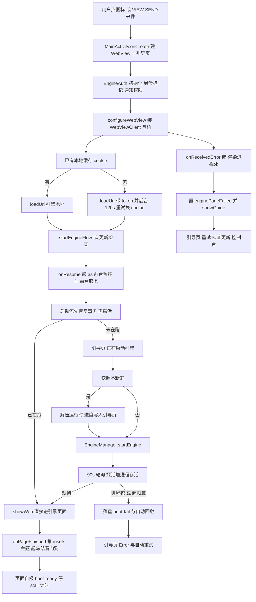
```mermaid
flowchart TD
  A["用户点图标 或 VIEW SEND 来件"] --> B["MainActivity.onCreate 建 WebView 与引导页"]
  B --> C["EngineAuth 初始化 崩溃标记 通知权限"]
  C --> D["configureWebView 装 WebViewClient 与桥"]
  D --> E["已有本地缓存 cookie"]
  E -->|"有"| F["loadUrl 引擎地址"]
  E -->|"无"| G["loadUrl 带 token 并后台 120s 重试换 cookie"]
  F --> H["startEngineFlow 或 更新检查"]
  G --> H
  H --> I["onResume 起 3s 前台监控 与 前台服务"]
  I --> J["启动流先恢复事务 再探活"]
  J -->|"已在跑"| K["showWeb 直接进引擎页面"]
  J -->|"未在跑"| L["引导页 正在启动引擎"]
  L --> M["快照不新鲜"]
  M -->|"是"| N["解压运行时 进度写入引导页"]
  M -->|"否"| O["EngineManager.startEngine"]
  N --> O
  O --> P["90s 轮询 探活加进程存活"]
  P -->|"就绪"| K
  P -->|"进程死 或 超预算"| Q["落盘 boot-fail 与自动回撤"]
  Q --> R["引导页 Error 与自动重试"]
  K --> S["onPageFinished 推 insets 主题 起冻结看门狗"]
  S --> T["页面自报 boot-ready 停 stall 计时"]
  D --> U["onReceivedError 或 渲染进程死"]
  U --> V["置 enginePageFailed 并 showGuide"]
  V --> W["引导页 重试 检查更新 控制台"]
```

#### K02 引擎生命周期与保活


- **一句话**：用自足 Termux 快照把 node 引擎拉在 127.0.0.1:3080，由 5s 探活驱动「确认死亡重启 / 半死受控重启 / 熔断停手 / 配置回撤」，并把启动与失败现场落盘。
- **入口/触发**：
  1. `MainActivity.onCreate` → `startEngineFlow()`（MainActivity.kt:265）→ `EngineStartFlow.start()`；`onResume` 再幂等补挂前台服务与前台监控（MainActivity.kt:282-293）。
  2. `BootReceiver.onReceive`（BOOT_COMPLETED，BootReceiver.kt:24-36）→ `startForegroundService(EngineService)`；持久化的 userShutdown 为真则不自启。
  3. `EngineService.onCreate/onStartCommand`（EngineService.kt:29-55）→ `ensureEngine()` 装 5s 看门狗；首个 tick 就可能重启。
  4. 设置面「重启引擎」→ `EngineStartFlow.restart()`（EngineStartFlow.kt:691）→ pkill bin.js + 1s 后重走 `start()`。
  5. `ConsoleSession`（ConsoleSession.kt:33-50）只复用 `usrDir`/`shellEnv()` 起交互 shell，不起第二个引擎。
- **运行顺序**：
  - **启动期（本块所属阶段，引导页可见）**：`EngineStartFlow.start()` 在工作线程上串行执行 `recoverInterruptedRefresh()`（先消费事务残留，K03）→ 探活已在跑则 `markListen` + `markFirstHttp` + `showWeb()` 早退 → `snapshotFresh()` 为假则 `refreshSnapshot()`（K03；失败即写 boot-fail.log 并停在错误页）→ `deployUndoCli()` → `startEngine()` → 90s 预算内轮询 `EngineProbe.check()`（进程死则提早宣判）→ 成功则 `startEngineService()` + `showWeb()`；失败/超时则 boot-fail.log + 最多 2 次自动重试 + `maybeAutoUndo()`。
  - **常驻期**：`EngineService` 每 5s 一拍 `WatchdogV2.assessProbe`（HTTP + 端口两级）再 `planTick`，只返回 IDLE / HOLD / UNDO / RESTART 之一，副作用（更新确认状态机、任务标记消费、唤醒锁续期）全部在 planTick 前置段无条件执行（EngineService.kt:116-186）。`EngineManager.onEngineProbe` 是「在线更新二版」的确认状态机：连续 3 拍健康才删 `usr-old`，180s 不健康则回滚到 `usr-old`（EngineManager.kt:1344-1393）。
  - **跑完交给谁**：引擎可用 → K01 的 `showWeb()` 交还 WebUI，同时 EngineService 看门狗接管保活；不可用 → 引导页 Error/Undoing 阶段 + `files/boot-fail.log` + 必要时 UndoGate 回撤后重起。
- **嵌套与线程**（最多 3 层）：
  1. `EngineStartFlow.start()`【工作线程 Thread】→ `EngineManager.refreshSnapshot/startEngine`【同一线程】→ `SnapshotTransaction/SnapshotExtractor`（K03）。
  2. `EngineService` 看门狗【ScheduledExecutorService 单线程，scheduleWithFixedDelay 5s，不重入】→ `WatchdogV2.assessProbe/planTick`【同线程，内含最多约 3.5s 探活阻塞】→ `EngineProbe.check/portReachable`【loopback HTTP/TCP，Proxy.NO_PROXY】；UNDO 分支另起 `Thread` 跑 `UndoGate.execute`（EngineService.kt:145-158）。
  3. `EngineManager.startWithArgs`【调用方线程】→ `ProcessBuilder.start` + `watchEngineListen`【新 daemon 线程，≤90s】+ `LogCollector.markBootStart` → `startProbeTail`【新 daemon 线程，≤90s】。`EngineService.onCreate/onStartCommand` 是 Service 回调主线程，UI 一律 `runOnUiThread`。
  - 进程级互斥：companion 的 `STARTING` CAS（EngineManager.kt:827）与 `snapshotRefreshing` 闸门（:813），对 MainActivity / EngineService 两个 EngineManager 实例同样生效。
- **耦合**（点名符号）：
  - `EngineManager` 有 3 个构造点：MainActivity.kt:88、EngineService.kt:35、ConsoleSession.kt:33；跨实例共享的是 companion 级 `STARTING` / `snapshotRefreshing` / `lastStartAttemptAt` / `sharedEngineProcess` / `ensurePickToken()`。
  - 偏好键：`engine_lifecycle/user_shutdown`（EngineService 写 :223、BootReceiver 读 :26、onStartCommand 门 :49）；`dsh_prefs/dev_log_enabled`（MainActivity.DevLogPrefs:1163-1173，默认关）；`notify.markerOffset`（WatchdogV2.kt:29，经 NotifyCenter.prefs:179）。
  - 文件面：`files/usr{-old,-broken}`、`files/.snapshot-fingerprint`、`files/.update-pending{,-at}`（UpdateManager.kt:84-85 写，EngineManager.onEngineProbe:1344-1369 消费）、`files/engine.log` 加 `.1`..`.5`、`files/boot-segments.log`、`files/boot-diag.log`、`files/boot-fail.log`、`files/home/.dsh/.task-done.ndjson`、`Documents/dshdata/{log,diagnostics}`。
  - `shellEnv()`（EngineManager.kt:1400-1478）是引擎/控制台/日志三处子进程环境的唯一来源：PATH、LD_LIBRARY_PATH、HOME、DSH_HOME、TMPDIR、LD_PRELOAD、TERMUX_EXEC__*、OPENSSL_CONF、DSH_PICK_TOKEN、NODE_COMPILE_CACHE、UV_THREADPOOL_SIZE、npm_config_store_dir。
  - 交叉读写：`WatchdogV2.consecutiveFailures/consecutiveDegradedHttp` 由看门狗写，被 EngineStartFlow.kt:349、EngineService.kt:134 读；`EngineManager.lastRefreshFailure` 被 EngineStartFlow.kt:482 读；`pendingRecoveryFailure` 由 EngineManager.kt:312 写。
  - `EngineProbe.ENGINE_URL`（EngineProbe.kt:26）被 MainActivity.kt:819/822 的 loadUrl 与 EngineAuth.AUTHORITY（EngineAuth.kt:48）共用，cookie 名 = sha256(authority)。
  - `ControlCarrier.ensureStarted` / `NotifyStore.start` / `NotifyBridge.start` 随 EngineService.onCreate 起停（EngineService.kt:40-43）。
  - `LiveProbe.kt` 是状态页 TTL 探测原语，与本块引擎生命周期无运行时交集：生产侧零调用点（`grep -rn "LiveProbe\|tcpProbe" app/src/main` 只剩定义行），仅 AdbLiveProbeTest 使用。
- **关键坐标**：
  - `app/src/main/java/com/dsharnessmobile/shell/EngineManager.kt:810`（startEngine 定义）/`:813`（刷新中闸门）/`:827`（STARTING CAS）
  - `EngineManager.kt:862-867`（argv：node --expose-internals bin.js web --port 3080 --no-open；spawn 后写 lastStartAttemptAt）
  - `EngineManager.kt:1400-1477`（shellEnv；PATH:1419、TMPDIR:1442、LD_PRELOAD:1449）
  - `EngineManager.kt:1301-1327`（killExistingEngine：destroy→6s→destroyForcibly→pkill bin.js→端口释放复核）
  - `EngineService.kt:107-188`（ensureEngine + 5s tick；planTick :123、UNDO :143、RESTART :160）
  - `WatchdogV2.kt:109-167`（planTick；前置副作用 :124-127、启动窗推迟 :146、undo 先于熔断 :158-163、RESTART :167）
  - `EngineProbe.kt:38`（check，200/401/303 = running）与 `:80`（portReachable，Proxy.NO_PROXY）
  - `LogCollector.kt:246/363/378`（markBootStart / markFirstHttp / markListen）与 `:458/:521`（boot-diag / boot-fail 落盘）
- **不变量**：
  1. `usr/bin/node` 与 `usr/lib/node_modules/@deepseek-ai/dsh/lib/bin.js` 必须在场（engineReady:44、stagedRuntimeComplete:360）；`usr/lib/libtermux-exec-ld-preload.so` 缺失时 `startEngine` 直接返回 false（:820-824）。违反症状：引导页「引擎启动失败」+ boot-fail.log `stage=engine-start-false`。
  2. LD_PRELOAD + `TERMUX_EXEC__SYSTEM_LINKER_EXEC__MODE=force` 必须注入（:1449-1451）；否则 Android 15+ 上 app 数据目录 ELF 不可 exec，任何子进程失败。
  3. 同一时刻只允许一个引擎进程占 3080；rebind 前必须确认端口已释放，否则 EADDRINUSE 循环（:1323-1327 会显式记一条）。
  4. 快照刷新期间（snapshotRefreshing=true）禁止拉起引擎（:813）；违反即引擎跑在半解压树上（坑 37 三重实锤）。
  5. 用户手动关停是持久真值（`engine_lifecycle/user_shutdown`）：BootReceiver 与 START_STICKY 重投递都必须尊重（EngineService.kt:49-53、BootReceiver.kt:26）。
  6. 探活「running」包含 401：cookie 尚未铸出时 401 也必须算活着，绝不能让 401 触发杀引擎（EngineProbe.kt:54 注释，D3/W2）。
  7. 壳侧不向 engine.log 写任何字节（它是 redirectOutput 目标，引擎会从自己的偏移覆盖壳侧追加，LogCollector.kt:78-83）；启动判据只落 `files/boot-segments.log`。
- **症状 → 排查**：
  1. 停在「引擎启动失败」或长时间 Starting → `adb shell run-as com.dsharnessmobile.shell cat files/boot-fail.log`（stage=engine-start-false / process-died-during-boot / boot-budget-exceeded / snapshot-refresh-failed），再 `cat files/engine.log`（首行即定性，`describeEngineLogState` 已把它折进 detail）；logcat tag `dsh-engine`。
  2. 引擎反复被重启或长时间不重启 → `cat files/boot-segments.log` 看 t_boot_start / t_listen 世代与失败密度；`grep dsh-watchdog`（logcat 或 `Documents/dshdata/log/dsh-日期.log`，需开发者日志开）；熔断态 grep `watchdog circuit open`，半死态 grep `DEGRADED_HTTP` 与 `DEGRADED_HTTP 连续`。
  3. 端口被占 / 双引擎 → grep `killExistingEngine: port 3080 still occupied`；设备侧 `adb shell "ps -A | grep -E 'linker|node'"`（进程名是 linker64 不是 node，坑 31）。
  4. 页面白屏但端口在 → `adb forward tcp:23080 tcp:3080` 后 `curl -i http://127.0.0.1:23080/`（200/401 都算活）；grep `DEGRADED_LOG` 与 `plugin tree failed to load`（后者只判不重启）。
  5. 诊断包找不到 → `mirrorDiagnosticsToShared` 无 All Files Access 时回落私有目录，界面按实际路径回填（EngineStartFlow.kt:721）；`adb shell run-as com.dsharnessmobile.shell ls files/diagnostics`。
- **可疑点**：
  1. 【已确认，评审 §5.14 / I-5 / H-12 点名】`LogCollector.writeBootDiag`/`writeBootFail` 出口不过 `EngineAuth.redact`：LogCollector.kt:458-480 直接 `appendText(line)`，:544/562-590 的 `bootFailLine` 也不脱敏 detail；MainActivity.kt:569-573 却把 `url=${request.url}` 写进 boot-diag，而页面 URL 形态是 `ENGINE_URL + "/?token=" + token`（MainActivity.kt:822）。影响：一次 401/5xx 即把 launch token 明文落进 `files/boot-diag.log`（对照 :885 是唯一过 redact 的日文件咽喉）。
  2. 【已确认，注释与实现不符】`startEngine` 的 90s 冷却窗不是闸门：`withinCooldown`（:831）只用于打一行日志（:845-847），真门槛是 `portReachable || managedProcessAlive`（:832-834）。影响：端口未开且句柄已失（孤儿 linker64 / 句柄被覆盖）时任何调用方都能立刻再 spawn；`START_COOLDOWN_MS` 注释（:1519-1524「no new start within this window」）会让排障者误判「90s 内不会再起」。
  3. 【已确认的代码事实，现场未证实】启动窗保护依赖同一个可被清零的时间戳：`bootAgeMs = now - EngineManager.lastStartAttemptAt`（EngineService.kt:129 + WatchdogV2.kt:146），而该字段在 stopEngine:1271 / resetCooldown:1333 / rollbackToOld:1382 / EngineStartFlow.restart:702 都被置 0，置 0 后 bootAgeMs 变成 epoch 量级，「托管子进程仍在启动窗内」这条保护立即失效，刚 spawn 的引擎可能被 RESTART(force) 再杀一次；且时间戳取的是 kill 前的 `now`（:825 取、:867 写，中间 killExistingEngine 最长约 13s），实际启动窗比 90s 短。
  4. 【未证实，属设计取舍】`DEGRADED_LOG` 无计数、无阶梯：WatchdogV2.kt:96-99 命中 engine.log 尾 4KB 的 `plugin tree failed to load`/`UncaughtException` 即判 DEGRADED_LOG，而 :70-71 只对 DEGRADED_HTTP 计数、:136 直接早退 IDLE（EngineService.kt:140 还每拍 `UndoGate.disarm`）。影响：HTTP 活着但插件树挂死的引擎永不自愈（理由「重开会打断活动 turn」成立），但也没有任何升级路径或用户提示，只能手动重启。
  5. 【已确认的代码事实，误杀未证实】`killExistingEngine` 的 pkill 比注释宽：注释称「pnpm/脚本子进程不含 bin.js web 特征，不会被误杀」（:1314-1316），实际命令是 `pkill -f "bin.js"`（:1318），没有 web 约束；同 uid 下任何命令行含 `bin.js` 的进程（例如 agent 工具里跑 `node xxx/bin.js`）都会被每次启动/重启杀掉。另 `.waitFor()` 无超时，同步阻塞调用线程（含看门狗线程）。

漂移：`docs/AGENTS/BRIDGE-API.md:114` 说 `shellEnv()` 注入 `DSH_ADB_*`/`DSH_ADB_FULLACCESS`，源码 `EngineManager.kt:1464-1465` 注明 0.14.0 内置 adb 已退役、环境 map 里没有这两个键。
漂移：`docs/AGENTS/ARCHITECTURE.md:45` 说 WatchdogV2.kt 负责「boot 恢复用户同意状态」，源码该文件已无任何 Receiver（`ActivityManager`/`BroadcastReceiver`/`Intent`/`IntentFilter` 只剩零使用的 import，WatchdogV2.kt:3-8），BOOT_COMPLETED 处理在 `BootReceiver.kt:23-36`。
漂移：`docs/AGENTS/ARCHITECTURE.md:76` 给 LogCollector.kt 记 332 行（2026-09-14 实测），现为 931 行；同表 EngineService.kt 记 201 行，现为 246 行。

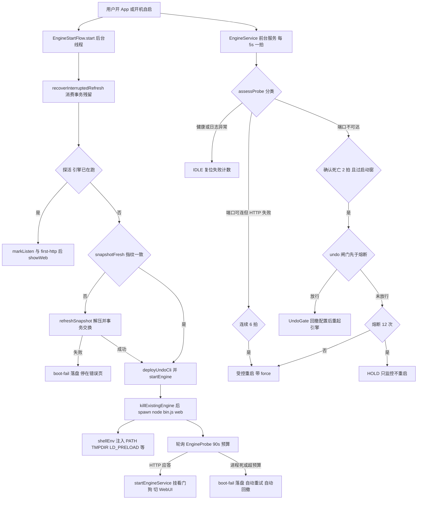
```mermaid
flowchart TD
  A["用户开 App 或开机自启"] --> B["EngineStartFlow.start 后台线程"]
  A --> C["EngineService 前台服务 每 5s 一拍"]
  B --> D["recoverInterruptedRefresh 消费事务残留"]
  D --> E{"探活 引擎已在跑"}
  E -->|"是"| F["markListen 与 first-http 后 showWeb"]
  E -->|"否"| G{"snapshotFresh 指纹一致"}
  G -->|"否"| H["refreshSnapshot 解压并事务交换"]
  H -->|"失败"| H2["boot-fail 落盘 停在错误页"]
  H -->|"成功"| I["deployUndoCli 并 startEngine"]
  G -->|"是"| I
  I --> J["killExistingEngine 后 spawn node bin.js web"]
  J --> K["shellEnv 注入 PATH TMPDIR LD_PRELOAD 等"]
  J --> L["轮询 EngineProbe 90s 预算"]
  L -->|"HTTP 应答"| M["startEngineService 挂看门狗 切 WebUI"]
  L -->|"进程死或超预算"| N["boot-fail 落盘 自动重试 自动回撤"]
  C --> O{"assessProbe 分类"}
  O -->|"健康或日志异常"| P["IDLE 复位失败计数"]
  O -->|"端口可连但 HTTP 失败"| Q{"连续 6 拍"}
  O -->|"端口不可达"| R{"确认死亡 2 拍 且过启动窗"}
  Q -->|"是"| S["受控重启 带 force"]
  R -->|"是"| T{"undo 闸门先于熔断"}
  T -->|"放行"| U["UndoGate 回撤配置后重起引擎"]
  T -->|"未放行"| V{"熔断 12 次"}
  V -->|"否"| S
  V -->|"是"| W["HOLD 只监控不重启"]
```

#### K03 快照事务与更新链

- **一句话**：把内嵌运行时快照以「暂存解压 → 逐条换位 → 指纹提交」三段事务换进 live 树，并包办中断恢复、残渣回收（含年龄门）、profiles 工厂/用户面合并，以及默认已下线的在线快照更新。
- **入口/触发**：① 启动流 `EngineStartFlow.runFlow`（工作线程）判 `snapshotFresh()` 为假 → `refreshSnapshot`；② 每次 `EngineService.ensureEngine()` → `recoverInterruptedRefresh()`（幂等，无事务时只是一次 stat）；③ 引导页「检查更新」按钮 → `UpdateManager.checkAndApply`；④ MainActivity 的 WebView 下载/外链回调 → `DownloadSaver`；⑤ APK 自更新按钮 → `UpdateChecker`（与引擎快照链完全分离，仅共用落盘目录语义）。
- **运行顺序**：
  1. 启动前置 `startupRecoverThenProbe`(EngineStartFlow.kt:424) 先恢复事务（读 `.snapshot-transaction`：STAGED 丢弃暂存 / SWAPPED 前滚并补写指纹 / SWAPPING 逐条回滚，回滚失败**保留** marker），再做引擎探活；
  2. 指纹不新鲜 → `refreshSnapshot`(EngineManager.kt:99)：清上次 stage（删不净则整体改名 `.snapshot-stage-orphan-<ts>` 挪开）→ `SnapshotExtractor.extract` 解压到 `.snapshot-stage` → `stagedRuntimeComplete` 校验 node/bin.js/profiles → 写 STAGED marker → `SnapshotTransaction.swap`（空间断言 → 写 SWAPPING → `usr` 与 `home` 工厂项逐条 rename 并先记账 → `mergeProfiles` 深拷贝备份后合并）→ `writeFingerprint` 提交 → `finish()` 删 previous/stage 并清 marker → 控制权交回启动流继续 `startEngine()`；
  3. 稳态：EngineService 看门狗每 5s 一拍 → `onEngineProbe(healthy)` 驱动 `.update-pending`（连续 `UPDATE_CONFIRM_TICKS=3` 拍健康删 `usr-old`；超 `UPDATE_ROLLBACK_MS=180s` 不健康 `rollbackToOld`）；
  4. 手动在线更新：`checkAndApply` 自建线程 → `DEFAULT_MANIFEST_URL` 为空即拒绝（S-10 姿态）→ 经 `overrideManifestUrl` 打开后：manifest → 下载 → sha256 → 解压 `update-stage` → 换 `usr`（`usr`→`usr-old`，新树→`usr`）→ 写 `.update-pending` 与指纹 → `pkill -f bin.js`；
  5. 启动期另有一次 `repairProfilePatch`(EngineManager.kt:1143)（每版本一次、失败可重试）清退役行 `disabled: true` 残留，与 `FactoryProfilePatch` 同源。
- **嵌套与线程**（调用链 ≤3 层）：
  - `EngineStartFlow` 工作线程 → `EngineManager.refreshSnapshot` → `SnapshotTransaction.swap` → `mergeProfiles` → `FactoryProfilePatch.merge`（纯文本，同线程；解压与合并期间由 companion 级 `snapshotRefreshing` 闸门禁止 `startEngine`）；
  - `EngineService` 看门狗单线程调度器（`scheduleWithFixedDelay`）→ `WatchdogV2.planTick(feedProbe=…)` → `EngineManager.onEngineProbe` → `rollbackToOld`（内部再调 `startEngine`）；
  - `EngineService.onStartCommand`（**主线程**）→ `ensureEngine()` → `recoverInterruptedRefresh()`：CAS 防重入，但重残渣删除在调用线程上同步执行；
  - 引导页主线程 → `EngineStartFlow.startUpdateCheck` → `UpdateManager` 内部 `Thread` → `onStatus` 回 `runOnUiThread`；
  - `DownloadSaver.downloadToDownloads`：WebView 回调线程 → 自建 `Thread` 流式写盘（`EngineAuth.attach` + 401 自愈一次）→ `runOnUiThread` + `webView.post` 回执。
- **耦合**（点名符号）：
  - 事务文件名常量：`SnapshotTransaction.STAGE_NAME`(:34)、`PREVIOUS_NAME`(:35)、`STAGE_ORPHAN_PREFIX`(:37)、`MARKER_NAME`(:50)、`Phase`(:53)、`RESIDUE_MIN_AGE_MS`(:220)；这三类残渣目录名由 `residueDirs`(:231) 按 30 分钟年龄门扫描。
  - 指纹文件 `.snapshot-fingerprint`：`EngineManager.fingerprintFile()`(:74) 写、`snapshotFresh()`(:81-86) 读、`UpdateManager`(:97) 也写 —— 三处共用一个文件是两条更新链的接缝。
  - 用户面集合：`SnapshotUserData.preservedNames`(:30-34) 由 `EngineManager` 传入 `swap`；`home` 顶层走 seed-if-absent(:331-337)；profiles 根两个清单走 `mergePackageJson`(:598) / `FactoryProfilePatch.merge`(:655-658)。
  - 退役插件迁移：`REMOVED_PROFILE_PLUGINS`(SnapshotTransaction.kt:43-46) 的「挂载 id + 包名」是 `reconcileRemovedProfilePlugins`(:385) 的唯一输入 —— 新增摘除必须在此登记，否则老设备摘不掉。
  - 退役 disabled 行：`FactoryProfilePatch.RETIRED_DISABLED_ROW_IDS`(FactoryProfilePatch.kt:41) 同时被 `EngineManager.repairProfilePatch`(:1159) 与 `FactoryProfilePatch.merge`(:88) 读。
  - 在线更新状态文件：`.update-pending` / `.update-pending-at` / `usr-old` / `update-stage` / `update.tar.xz` 由 `UpdateManager` 写、`EngineManager.onEngineProbe`(:1344) 读收口；`DEFAULT_MANIFEST_URL`(:154)、`EMULATOR_HOST`(:157)、`validateManifestUrl`(:168) 是入口准入面。
  - 下载落盘：`DownloadSaver` 依赖 `EngineProbe.ENGINE_URL`（`isEngineSource`，DownloadSaver.kt:17）、`EngineAuth.attach`(:101)、`dshDataDir/exports`；`UpdateChecker` 依赖 `BuildConfig.VERSION_NAME`(:115) 与 `Documents/dshdata/updates`(:38)。
- **关键坐标**：
  - `app/src/main/java/com/dsharnessmobile/shell/SnapshotTransaction.kt:283` — 交换前空间断言（口径 = live profiles 备份 + 25% + 64MB）
  - `app/src/main/java/com/dsharnessmobile/shell/SnapshotTransaction.kt:345` — 写 SWAPPED 提交哨兵（回滚/前滚的唯一判据）
  - `app/src/main/java/com/dsharnessmobile/shell/SnapshotTransaction.kt:688` — `recover` 回滚失败保留 marker（D-3）
  - `app/src/main/java/com/dsharnessmobile/shell/SnapshotTransaction.kt:787` — `rollbackEntry` 删不净则把 live 改名挪开再放回 displaced
  - `app/src/main/java/com/dsharnessmobile/shell/SnapshotFs.kt:61` — `newDirectoryStream` 枚举（P0-B：避开 API 34 的 `Stream.toList`）
  - `app/src/main/java/com/dsharnessmobile/shell/EngineManager.kt:196` — 刷新失败路径：回滚结果未判 + 无条件清 marker（D-3 逃逸点）
  - `app/src/main/java/com/dsharnessmobile/shell/UpdateManager.kt:34` — 未配置可信发布源即拒绝（S-10 fail-closed）
  - `app/src/main/java/com/dsharnessmobile/shell/FactoryProfilePatch.kt:79` — 工厂 disabled 语义纠正入口
- **不变量**：
  1. marker 是恢复唯一权威：任何条目被触碰前必须先写进 journal；`clearMarker` 只允许在「已收敛」时发生（STAGED 丢弃、前滚、**成功**回滚、finish）。违反 → 半成品树被当成正常树，症状是「插件注册了但不真实可用」。
  2. 用户数据从不被 move/copy/delete：`preservedNames` 命中即原地保留；`home` 顶层 seed-if-absent；profiles 根的两个清单是用户面（只做并集/按 id 增补）。
  3. stage 阶段 live 树绝不被写；`swap` 只做 rename（唯一的新分配是 profiles 深拷贝备份与 mergeTree 的补入文件）。
  4. 空间断言必须在动第一棵树之前，且以「交换这一步真正新占用的字节」为口径。
  5. `SnapshotFs.deletePath` 逐项容错：**返回不代表目录已空**，调用方一律复查 `exists`；把非空目录 move 到已存在目标会抛 `FileSystemException: Directory not empty`（0.14.0→0.14.1 升级卡死的真因形态）。
  6. 残渣回收有两个前置：marker 缺席 + 快照已激活（`snapshotFresh()`），且 `.failed-*` 与孤儿 stage 只回收年龄 > 30 分钟的。半程事务的 `.snapshot-previous` 是唯一回滚源，删它等于「只能前进」。
  7. 解压层的三类上限（条目/总字节/单文件）与 NOFOLLOW 删除原语是沙盒边界；在线更新默认关闭，明文 http 只放行回环与模拟器别名。
- **症状 → 排查**：
  1. 启动长期停在「正在更新运行时」或每次开机都重解压：`adb -s <serial> shell run-as com.dsharnessmobile.shell ls -la files/ | grep -E "snapshot|usr-old|update"`；`... cat files/.snapshot-transaction`（看 `phase=` 与 `moved=` 条目）；logcat grep `dsh-engine|dsh-snap`，失败真因在 `files/boot-fail.log` 的 `dsh-boot-fail stage=snapshot-refresh-failed` 行（`error=` / `cause=`），镜像副本在 `Documents/dshdata/diagnostics/snapshot-refresh-failed-*`。
  2. 报「运行时更新失败（诊断已保存）」但看不到原因：`grep -E "存储空间不足|Directory not empty|InsufficientSpace" files/boot-fail.log`；空间类真因只落在 cause 里（UI 文案是通用的），`df /data` 对账；`Directory not empty` 类看 `~/.failed-<ts>` 残渣是否在场。
  3. 插件列表在、点开不可用（0.14.0 实报形态）：`grep -n "disabled: true" files/home/.dsh/profiles/web/cordis.patch.yml`；查 `files/.profile-patch-repair-<版本名>` 标记是否已写（没写=上次启动修复失败，下轮重试）；对照 `files/home/.dsh/profiles/web/?` 的 node_modules 是否半合并（1/10 形态）。
  4. 已摘除插件疑似仍在跑：`ls files/home/.dsh/profiles/web/node_modules/@aiwayds`（应为空/不存在）；`grep -n "dsh-model-sync" files/home/.dsh/profiles/web/cordis.patch.yml`；迁移只在**发生刷新**时执行，指纹未变的老设备需要触发一次刷新。
  5. 在线更新/APK 更新：`cat files/update-status.txt`（`runUpdate` 逐行追加）、logcat grep `dsh-update`、`ls files/ | grep -E "update-pending|usr-old|update-stage|update.tar.xz"`；`snapshot-fingerprint` 内容与 `assets/snapshot.sha256` 不一致 = 走的不是内嵌链。
- **可疑点**：
  1. `app/src/main/java/com/dsharnessmobile/shell/EngineManager.kt:196-198` —— 刷新失败 catch 里 `SnapshotTransaction.rollback(...)` 的返回值未判、紧接着无条件 `clearMarker`，与 `SnapshotTransaction.recover` 的 D-3 处理（SnapshotTransaction.kt:688-699「回滚失败不得无条件清 marker」）自相矛盾，也与同文件的 `applyRecovery`（:308-313 把失败明细写进 `pendingRecoveryFailure`）不对称。触发：swap 中途抛异常且回滚有任一条目失败（例如删不净的 live 子树），marker 被清、失败条目无人上报。后果链：下一次刷新若在写 SWAPPING 之前就抛异常（空间断言拒绝 §7.2-F-4、或 stage 派生的任何异常），catch 会走 `rollback(marker=STAGED)`，而 `collectDisplacedNames`(SnapshotTransaction.kt:798) 会把**残留的 `.snapshot-previous`** 当成回滚源逐条覆盖回 live —— 即旧的工厂树被静默“复活”盖在新树上；此后 `hasResidue && snapshotFresh()` 的回收门（:253）也可能把仍需的残渣删掉。建议按 `recover` 的口径改：`if (!result.ok) { 保留 marker + 上报告警 } else clearMarker()`。
  2. `app/src/main/java/com/dsharnessmobile/shell/SnapshotTransaction.kt:283-289` —— 空间断言覆盖面窄于审查 §7.2-F-4 / B12 的原始发现：断言跑在**解压完成之后**（stage 已付过 2.5 GB 量级空间），解压阶段本身仍无任何 StatFs 前置检查（`EngineManager.extractSnapshotTo` :434 直调解压），所以「解压中途 ENOSPC → 报运行时更新失败」的原症状还在；且 required 只由 **live profiles 体积**推导（`backupBytes + 25% + 64MB`），当 live profiles 明显小于 staged（回滚补偿删剩 / 半合并的现场，正是「失败→留残渣→空间紧→更易失败」的自我强化回路）时，`mergeTree` 补入文件的新分配不在预算内，`SnapshotFs.sizeOf`(:89) 还会把不可读条目按 0 静默低估。后果：断言放行后仍在合并中途 ENOSPC。另有一致性问题：`InsufficientSpaceException` 的可照做文案只进 `lastRefreshFailure`/boot-fail.log，用户界面拿到的是通用「运行时更新失败」（EngineStartFlow.kt:494），B12 要的「专门文案」只实现了一半。
  3. `app/src/main/java/com/dsharnessmobile/shell/UpdateManager.kt:96-98` 与 `app/src/main/java/com/dsharnessmobile/shell/EngineManager.kt:81-86` —— 在线更新把 **manifest 的 sha256** 写进 `.snapshot-fingerprint`，而内嵌链的 `snapshotFresh()` 要求该文件**等于** `assets/snapshot.sha256`；两个口径天然不等，于是下次进程启动必然判「不新鲜」→ 重解压内嵌快照，把刚完成的在线更新整体回滚（且 `.update-pending`/`usr-old` 不会被这条路径清掉，看门狗仍按旧时间戳推进确认/回退状态机，`rollbackToOld`(EngineManager.kt:1372) 可能在新树已就位后又把 `usr` 换回 `usr-old` —— 这一段的最终表现未在设备上证实）。影响面受 S-10 限定：默认 `DEFAULT_MANIFEST_URL` 为空，只有 `overrideManifestUrl` 打开时可达。
  4. `app/src/main/java/com/dsharnessmobile/shell/UpdateManager.kt:69-80` —— 在线更新的 `usr` 换位是**非事务**的两步 `renameTo`（`usr`→`usr-old`→新树入位），既不写 `.snapshot-transaction`，也不进 `SnapshotFs.move`；`.update-pending` 只在两步都成功后才写。若在两次 rename 之间被杀（OOM、厂商清理），live 无 `usr`，而 `recoverInterruptedRefresh` 只认 `.snapshot-stage`/`.snapshot-previous`，看门狗也因缺 `.update-pending` 不会调 `rollbackToOld` —— 唯一恢复路径是内嵌快照全量重解压（实测 8 分钟量级）。同一函数开头 `SnapshotFs.deletePath(old)`(:71) 还会在上一次更新尚未确认/回退时先删掉唯一回退源 `usr-old`。
  5. `app/src/main/java/com/dsharnessmobile/shell/SnapshotExtractor.kt:81` 与 `:142` —— 同一条目把 `entry.size` 累加进 `done` 两次（一次用于上限判定、一次用于进度），于是总量上限 `maxTotalBytes = 8 GiB` 实际在约 4 GiB 处触发，`onProgress` 上报的解压字节数约翻倍（解压条在解压到一半时即报满）。后果：S-10 想要的「快照真实体量 3–5 倍余量」实际只剩约 1.6 倍，偏大的合法快照会被判成「解压炸弹」中止（错误文案指向超限而真因是重复计数）。进度口径同时失真——EngineStartFlow 的「已写入 N MB」由它派生。
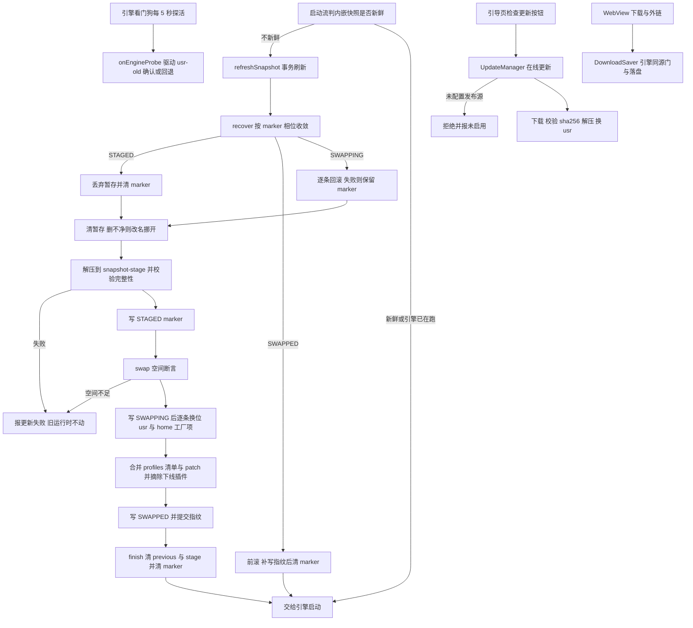
```mermaid
flowchart TD
  A["启动流判内嵌快照是否新鲜"] -->|"不新鲜"| B["refreshSnapshot 事务刷新"]
  A -->|"新鲜或引擎已在跑"| Z["交给引擎启动"]
  B --> C["recover 按 marker 相位收敛"]
  C -->|"STAGED"| D["丢弃暂存并清 marker"]
  C -->|"SWAPPED"| E["前滚 补写指纹后清 marker"]
  C -->|"SWAPPING"| F["逐条回滚 失败则保留 marker"]
  D --> G["清暂存 删不净则改名挪开"]
  F --> G
  E --> Z
  G --> H["解压到 snapshot-stage 并校验完整性"]
  H -->|"失败"| X["报更新失败 旧运行时不动"]
  H --> I["写 STAGED marker"]
  I --> J["swap 空间断言"]
  J -->|"空间不足"| X
  J --> K["写 SWAPPING 后逐条换位 usr 与 home 工厂项"]
  K --> L["合并 profiles 清单与 patch 并摘除下线插件"]
  L --> M["写 SWAPPED 并提交指纹"]
  M --> N["finish 清 previous 与 stage 并清 marker"]
  N --> Z
  O["引擎看门狗每 5 秒探活"] --> P["onEngineProbe 驱动 usr-old 确认或回退"]
  Q["引导页检查更新按钮"] --> R["UpdateManager 在线更新"]
  R -->|"未配置发布源"| X2["拒绝并报未启用"]
  R --> S["下载 校验 sha256 解压 换 usr"]
  T["WebView 下载与外链"] --> U["DownloadSaver 引擎同源门与落盘"]
```

#### K04 桥与控制协议面


- **一句话**：页面里的 `window.androidBridge` / `window.dshBackBridge` 方法面，加壳侧两条对引擎的 HTTP/WS 通道（浏览器 cookie 鉴权、控制队列长轮询）与崩溃自动回撤闸门，共同构成「模型动作怎么落到这台手机上、结果怎么回填、出事怎么自救」的底座。
- **入口/触发**：
  - 页面 JS 同步调 `window.androidBridge.*`（现状：53 个 `@JavascriptInterface` 注解、52 个唯一方法名，唯一安装点 `MainActivity.kt:719-799`）与 `window.dshBackBridge.*`（`BackGate.kt:132-148`，仅 2 个方法）；另有 `consoleBridge`（`ConsoleActivity.kt:105`）挂在控制台 WebView。
  - `EngineService.onCreate` → `ControlCarrier.ensureStarted`（`EngineService.kt:43`）；无障碍服务连接时同入口（`DeviceControlService.kt:452-453`）。轮询/心跳由此起步。
  - 任一出厂 HTTP 调用方（`EngineProbe.kt:51`、`DownloadSaver.kt:101`、`NotifyBridge.kt:328`、`OverlayPanel.kt:824`、`OverlayService.kt:580`、`MuxClient.kt:91`）在发请求前向 `EngineAuth` 取值。
  - 看门狗 tick 的 `undoReady`（`EngineService.kt:134`）与启动流（`EngineStartFlow.kt:349`）触发 `UndoGate`。
- **运行顺序**：
  1. 引导期（MainActivity.onCreate）：`:160` 先 `EngineAuth.initContext`（顺带 `ShellAppContext.bind`）→ `:204` 建 WebView → `:719`/`:803` 装两条桥 → `:812` 取本地缓存 cookie 注入 CookieManager → 载引擎页；此后页面任何时刻都能同步调桥（JavaBridge 线程）。
  2. 稳态起通道：`EngineService.onCreate` 幂等起 `ControlCarrier` → 两条守护线程（`dsh-control-poller` 长轮询 + `dsh-a11y-heartbeat` 2s 心跳）；同进程另起 `MuxClient` 常驻线程连 `/api/remote.mux` 并 open `$events`。
  3. 每次 op：`ControlPoller.loop` 取活 → `execute` 去重 → `ControlCarrier.handle` 分族 → 各族执行 → `ControlProtocolV2.encode`（仅语义树 op）→ 按 `pv`/`caps` 信封回填 `/api/android/ui/result` → 引擎 settle，控制权回到轮询循环。
  4. 返回键：主线程 `MainActivity.installBackGate` 同步判定 → 三条腿（跨文档历史 / 页面层栈 / finish）。
  5. 故障期：看门狗连续失败 → `UndoGate.onProbeFailure`（纯决策）→ 观察窗走完 → 新起 Thread 跑急救 CLI → 成功则 `WatchdogV2.reset` + 重启引擎，失败只留观测行。
- **嵌套与线程**：
  - 页面 JS →（JavaBridge 线程）`AndroidBridge.x` → MainActivity lambda → `ShellState`/浏览器宿主/控制器（最多 3 层，全同步）。
  - 系统返回 →（主线程）`installBackGate` 回调 → `BackGate.decide` → `WebView.goBack` / `evaluateJavascript(DISPATCH_SCRIPT)`。
  - （守护线程）`ControlPoller.loop` → `post(/pending)` → `execute` → `runOp` → `ControlCarrier.handle` → `BrowserHostHolder.control` / `VdisplayOps.handle` / `ShellOps.handle` / `DeviceControlService.handle` → `post(/result)`。
  - （独立心跳线程）`ControlPoller.start` 的 2s 循环 → `ControlCarrier` 心跳 lambda → `DeviceControlService.heartbeat`（a11y 缺席时不刷）。
  - （mux 线程）`MuxClient.loop` → `connectAndServe` → `EngineAuth.attachMux`（可能同步 HTTP 最长 8s）→ `frameLoop`（pong 兜底）。
  - （看门狗线程 → 新 Thread）`UndoGate.execute` → `runCli`（ProcessBuilder + `ProcIo.readBounded(proc, 60)`）。全链无协程，只有裸 Thread / 守护线程 / 主线程 / JavaBridge 线程。
- **耦合**（点名具体符号）：
  - 偏好键：`dsh_settings/immersive_mode`（`ShellState.kt:38-39`）、`MainActivity.DevLogPrefs`（`ShellState.kt:99`）、`dsh_engine_auth/cookie`（`EngineAuth.kt:46-47`）、`dsh-adb.xml` 的 `controlToken`（壳 `DeviceControlService.token` 写、引擎 `controlTokenFrom` 实时读）。
  - 文件：`filesDir/engine.log(.1/.2)`（`EngineAuth.tokenFromLog` 只读尾部 64KiB，取最后一个 `dsh web: …?token=`）、`filesDir/home/.dsh/.credentials.yaml`（`credentialsSecret` 读，值绝不进日志）、`filesDir/.undo-auto-armed` / `.undo-auto-done` / `undo-gate.log`（`UndoGate` 的三个幂等与观测面）、`filesDir/audit/audit.ndjson`（`ControlAudit` 写，与插件 `plugins/dsh-android-bridge/src/index.ts:135-144` 同路径同格式）。
  - 全局单例/共享态：`EngineAuth`（`@Volatile cached` + `appContext` + 对象锁）、`ShellAppContext`（桥 getter 无 Context 形参时的唯一真源入口）、`ControlCarrier.a11y`（`DeviceControlService` 连接/销毁时写）、`ControlCarrier` 的三组路由集合 `BROWSER_OPS`/`VD_OPS`/`SHELL_OPS`（与 `ControlProtocolV2.SUPPORTED_OPS` 是两份手抄清单，靠 `scripts/check-control-ops.mjs` 的 D2「carrier ⊇ 契约 neverA11y op」守）。
  - 协议常量：`ControlProtocolV2.PV=2`、`F_*` 掩码位、`o` 列＝walk 全量行号（`DeviceControlService.resolveTarget` 用 `rows[handle]` 索引 `Snapshot.rows`）、`b` 列恒 4n。
  - 环境变量：`DSH_HOME`/`DSH_UNDO_ROOT`/`DSH_UNDO_PROFILE`/`OPENSSL_CONF`（`UndoGate.runCli` 注入，缺 `OPENSSL_CONF` 会令 CLI 无输出被误判）。
  - 页面侧类型面（镜像自协调仓同名路径）：`dsh-client-ui-responsive/src/client/android-bridge.ts` 的 `AndroidShellBridge`、`dsh-client-ui-responsive/src/client/mobile/back-stack.ts` 的 `dshBackBridge`。
- **关键坐标**：
  - `app/src/main/java/com/dsharnessmobile/shell/AndroidBridge.kt:420`（`jsString` 注入转义实现）
  - `app/src/main/java/com/dsharnessmobile/shell/BackGate.kt:52`（`decide` 三输入判定）
  - `app/src/main/java/com/dsharnessmobile/shell/EngineAuth.kt:172`（`refresh` 主体：对象锁 + 同步 HTTP）
  - `app/src/main/java/com/dsharnessmobile/shell/MuxClient.kt:172`（文本帧重组缓冲，唯一跨帧累积点）
  - `app/src/main/java/com/dsharnessmobile/shell/ControlPoller.kt:125`（reqId 去重 + L1 降级重跑）
  - `app/src/main/java/com/dsharnessmobile/shell/ControlCarrier.kt:86`（三族 neverA11y 直连 + a11y 兜底）
  - `app/src/main/java/com/dsharnessmobile/shell/ControlProtocolV2.kt:215`（`o` 列发原始行号）
  - `app/src/main/java/com/dsharnessmobile/shell/ControlAudit.kt:34`（`result` 恒 ok）
- **不变量**：
  - 句柄＝walk 全量行号（`o` 列），不是载荷下标；违反即点错行（FX-206.1 实测 393→86 行下 86/86 错位，`DeviceControlService.kt:964-971`）。
  - cookie 被服务端拒绝后必须 `force` 刷新，本地 `stillValid`（只看 `expiresAt`）不构成复用理由；违反即 ST-13：手动失效 cookie 后审批卡/提问卡不再弹，只能重启 App。
  - `EngineAuth.refresh` 不得在主线程调（持锁 + 最长 8s HTTP，排队可叠到 ~16s）；违反即冻首帧（FX-210.5）。
  - `UndoGate` 每个「崩溃纪元」只自动执行一次（`.undo-auto-done` 时间戳 + 30 分钟重试窗）；违反会循环回滚。
  - `ControlPoller` 同一 `reqId` 只执行一次（有界 LRU 64）；违反即重复点击/重复输入。取活/回填令牌不匹配时引擎 403 fail-closed，绝不猜测、不重放。
  - 桥 getter 必须返「事实」而非「偏好」（`ShellState` 的合取式）；违反即呈现「开关显示开、日志不再增长」的乐观置位（ST-10/ST-11）。
- **症状 → 排查**：
  1. 「审批卡/提问卡不再弹出，必须重启 App」→ `adb logcat -d | grep dsh-overlay-mux`（应有 `mux handshake refused 401/403: invalidating + refreshing engine cookie`）+ `adb logcat -d | grep dsh-engine-auth`（`cookie acquired via token exchange` / `cookie minted from credentials grant`）；两条都静默则查 `dsh_engine_auth` prefs 里的 cookie 是否只剩本地未过期的死值。
  2. 「模型报设备控制超时/未知操作，可壳侧其实已经执行」→ `adb logcat -d | grep dsh-a11y`（`duplicate delivery skipped (reqId=…)`、`result post failed for <op> (HTTP …)`、`result too_large … L1 fallback`）+ 对比 `dsh-adb.xml → controlToken` 与引擎实时读到的值（不一致恒 403）。
  3. 「自动回撤到底跑没跑」→ `adb shell run-as com.dsharnessmobile.shell cat files/undo-gate.log`（前缀 `dsh-undo-gate`：`armed` / `trigger` / `executed ok snapshot=` / `aborted list-timeout` / `skipped no-snapshots` / `suppressed retry-window`），再看 `files/.undo-auto-done` 时间戳与 `files/.undo-auto-armed` 是否残留。
  4. 「页面里返回键没反应 / 直接退出应用」→ `adb logcat -d | grep dsh-back`（`page stack signal: available=` / `page stack pulled: available=… depth=` / `page stack reset (page started)`）；只有 reset 没有 pulled 说明页面侧 `window.__dshBackDepth` 缺席，该场景返回键会走 `FINISH_ACTIVITY`。
  5. 「审计对不上账」→ `adb shell run-as com.dsharnessmobile.shell tail -5 files/audit/audit.ndjson`：同一行里 `result:"ok"` 与 `args.ok:false` 并存即命中 §5.3；`screen-out-of-scope` 这类拒绝根本不落账。
- **可疑点**：
  1. **（已证实，机制层）`jsString` 的 U+2028/U+2029「修复」编译成恒等替换**：`AndroidBridge.kt:420-422` 源码是 `.replace(<裸 U+2028 字符>, "<单个反斜杠>u2028")`，第二个实参在 Kotlin 里是**同一个字符**（`\uXXXX` 是转义，不是六个字符）——编译产物 `app/build/tmp/kotlin-classes/debug/com/dsharnessmobile/shell/AndroidBridgeKt.class` 常量池里只有裸 U+2028/U+2029 两条字符串常量（`\x01\x00\x03 E2 80 A8`），**没有** `\u2028` 转义串，两个实参去重成同一条 ⇒ 该行不做任何转义。**为什么单测还是绿的（现场反证）**：JVM 单测类路径显式引入了另一份实现 `org.json:json:20240303`（`app/build.gradle.kts:136-137` 注释自陈「本地单测用真实 org.json，android.jar 桩在 JVM 里抛 Stub!」）；`BrowserHostNavigationPolicyTest.kt:129-141` 在恒等替换下仍判绿（`app/build/tmp/kotlin-classes/debugUnitTest/.../BrowserHostNavigationPolicyTest.class` 的常量池含断言用 `\u20` 字面量，`app/build/test-results/testDebugUnitTest/TEST-…BrowserHostNavigationPolicyTest.xml` 现场读到 tests=9 failures=0），只可能是这份 jar 的 `quote` 自己转义了 U+2028/U+2029（其 `JSONObject.class` 内含写 `\u` 的字符串字面量，与该区间转义实现相符）。设备运行时用的是 Android 框架 `org.json`，与单测类路径**不是同一实现** ⇒ 这条绿的判据测不到设备行为，是假保证。设备侧是否真需要该转义（审查 §3.1-C3 / F-3 断言 `JSONObject.quote` 不转义该区间）本轮无本机复算手段，**未证实**。
  2. **（已证实）审计语义：真实结果被塞进 args，`result` 恒 `ok`，拒绝完全不落账**：`ControlAudit.kt:34` 硬编码 `.put("result","ok")`，而调用方把真值放进参数里（`ShellOps.kt:588-597` 传 `"ok" to ok`）⇒ `audit.ndjson` 出现 `result:"ok"` 与 `args.ok:false` 自相矛盾；`ShellOps.kt:94` 的范围拒绝 `return` 早于 `audit(...)`（四族审计点只在 `:101/:110/:119/:127`），安全事件（`screen-out-of-scope`）零留痕。事后复盘不可信（审查 §5.3）。
  3. **（已证实，潜伏）跨语言「逐字同规则」在带空白文本上不成立**：壳侧编码器在符号表阶段就 trim（`ControlProtocolV2.kt:196-197` `sym(row.text.trim())`），参考实现 `protocol-v2.ts:349` 直接 `symOf(row.text)`，trim 只发生在 XML 入口 `rowsFromRaw`（`protocol-v2.ts:235-236`）；而跨语言 fixture `app/src/test/resources/protocol-v2/canonical-rows.json` 现场数出 393 行里 **0 行** text/desc 带前后空白 ⇒ 门禁看不见这条差异（任一侧 trim 口径回归都不会红），`ControlProtocolV2.kt:21-22` 的「逐字同规则」声明比实际成立范围宽。
  4. **（代码路径已证实，设备后果未证实）返回键的「观测不到」方向与硬约束相反**：`BackGate.kt:16-17` 的硬约束写「观测不到/关不掉的层一律消费，不得误退应用」，但 `parseDepth` 解析不出即回 0（`:70-73`，注释还自称「与观测不到不消费同向」），`onPageFinished(0)` → `available=false` → `decide` 落 `FINISH_ACTIVITY`（`:52-56`）⇒ 页面侧 `window.__dshBackDepth` 缺席（注入层/页面版本不匹配，正是审查 §7.7 那类「注册了但不真实可用」）时，返回键会退出应用而不是被消费。触发路径：`MainActivity.kt:502` 拉平拿 `undefined` → `parseDepth` 0；`:638` 只对引擎源页面拉平。
  5. **（已证实、审查 §5.7 未修）`MuxClient` 文本帧重组缓冲无总量上限**：`MAX_FRAME` 只管单帧（`MuxClient.kt:45`、`:167`），`textBuf` 是唯一的跨帧累积器（`:56`），`0x1` 起始帧持续 `fin=0` + 无限 `0x0` continuation 即可无界增长（`:172-173`）→ OOM；缓解措施只有「引擎不可信」这一条的威胁模型判断，没有代码兜底。
  - 备注（登记面而非代码缺陷）：`scripts/bridge-symmetry-baseline.json` 的 `preferenceGetters` 里 `getOverlayEnabled` 条目已过期，见下方漂移行。

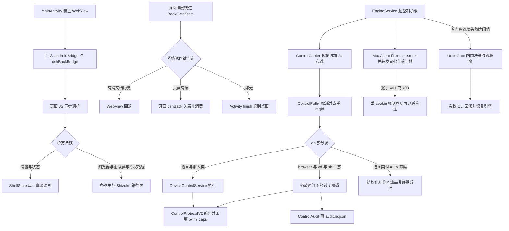
```mermaid
flowchart TD
  M["MainActivity 装主 WebView"] --> B["注入 androidBridge 与 dshBackBridge"]
  B --> J["页面 JS 同步调桥"]
  J --> Q{"桥方法族"}
  Q -->|"设置与状态"| S["ShellState 单一真源读写"]
  Q -->|"浏览器与虚拟屏与特权路径"| H["各宿主与 Shizuku 路径面"]
  C1["页面推层栈进 BackGateState"] --> R{"系统返回键判定"}
  R -->|"有跨文档历史"| G["WebView 回退"]
  R -->|"页面有层"| D["页面 dshBack 关层并消费"]
  R -->|"都无"| F["Activity finish 退到桌面"]
  E["EngineService 起控制承载"] --> O["ControlCarrier 长轮询加 2s 心跳"]
  O --> L["ControlPoller 取活并去重 reqId"]
  L --> W{"op 族分发"}
  W -->|"browser 与 vd 与 sh 三族"| N["各族直连不经过无障碍"]
  W -->|"语义与输入类"| V["DeviceControlService 执行"]
  V --> T["ControlProtocolV2 编码并回填 pv 与 caps"]
  N --> T
  N --> U["ControlAudit 落 audit.ndjson"]
  E --> X["MuxClient 连 remote.mux 并转发审批与提问帧"]
  X -->|"握手 401 或 403"| Z["丢 cookie 强制刷新再退避重连"]
  W -->|"语义类但 a11y 缺席"| RJ["结构化拒绝回填而非静默超时"]
  E -->|"看门狗连续失败达阈值"| UD["UndoGate 四态决策与观察窗"]
  UD --> UC["急救 CLI 回滚并恢复引擎"]
```

#### K05 无障碍控制面

- **一句话**：无障碍服务是设备的语义控制面——按需把当前窗口的节点树编成 V2 列式行表（行句柄 = 建树期下标），用「建树期节点句柄 → childPath → 文本几何特征」三级回指执行 click/longClick/setText/scroll/global 与 takeScreenshot，并给引擎提供 gen/invalidated 的便宜校验读数；ADB 键盘 IME 是它的文本注入补面（走广播而非 a11y）。
- **入口/触发**：
  - 队列取活：`ControlPoller.loop()`（`ControlPoller.kt:96`）向 `127.0.0.1:3080/api/android/ui/pending` 长轮询 → `ControlCarrier.handle`（`ControlCarrier.kt:86`）→ `DeviceControlService.handle`（`DeviceControlService.kt:607`）。
  - 服务生命周期：系统绑定 → `onServiceConnected`（:444，登记 `ControlCarrier.a11y` 并 `ensureStarted`）；`onAccessibilityEvent`（:457）只做失效标记；`onInterrupt`（:471）空实现；`onUnbind`/`onDestroy` → `teardown`（:485）。
  - 键盘：`AdbKeyboardReceiver.onReceive`（`AdbKeyboardReceiver.kt:23`）← `am broadcast -a ADB_INPUT_TEXT/ADB_CLEAR_TEXT --es msg/--es auth`（引擎 manage 的 `android_ui_input`，`plugins/dsh-android-manage/src/index.ts:1889`）。
  - 设置页只读：`statusJson`（:214）/`token`（:235）经 `AndroidBridge.a11yStatus`（`MainActivity.kt:793`）。
- **运行顺序**：
  1. 引擎工具面 → bridge `controlExec`（`plugins/dsh-android-bridge/src/index.ts:949`）→ 控制队列 enqueue（单在途；档位门、`A11Y_OPS` 门、`REAL_SCREEN_CONTROL_OPS` 范围门都在这一步）。
  2. `ControlPoller` 取活后在后台线程执行：`ControlCarrier.handle` 先分流 neverA11y 三组（`BROWSER_OPS`/`VD_OPS`/`SHELL_OPS` 直连各 Holder），其余交给已连接的无障碍服务；无连接 → `a11y-unavailable` 结构化拒绝（`ControlCarrier.kt:110`）。
  3. `handle` 先过第二道范围门 `realScreenScopeError`（:701）：未知屏 → `screen-not-found`；范围不含 → `screen-out-of-scope`；真实屏带非 0 displayId → `screen-display-mismatch`；虚拟屏经 `VdisplayController.displayIdForAlias`（`VdisplayController.kt:133`）取动态 displayId 并固定 `activeScreenId/activeDisplayId`（绝不回退 display 0）。
  4. `snapshot` → `buildSnapshot(force=true)`（:496，3s 预算）→ `ControlProtocolV2.encode`（`ControlProtocolV2.kt:96`）回 V2 载荷（gen/rotation/尺寸/truncated）；动作 op 先 `requireFresh` 校验 gen（:935，无快照则当场重建而不是报过期），再 `resolveTarget`（:964）三级回指 → `performAction`，失败退 `dispatchGesture`（`tapAt` :1143 / `pressAt` :1083）。
  5. 结果经 `ControlPoller.envelope`（:168）带 `pv`+`caps` 回填 `/api/android/ui/result`；413 时 snapshot 自动改 `view=target` 重跑一次；跑完控制权回到 `ControlPoller.loop` 继续长轮询。
  6. 键盘路径独立：广播 → 来源校验 → `commitText`，注入是否落地由引擎侧 260ms 后的 `nodeText` 回读断言闭环（`index.ts:1899-1917`）。
- **嵌套与线程**：
  - 主线程（系统回调）：`onServiceConnected`/`onAccessibilityEvent`/`onInterrupt`/`onUnbind`/`onDestroy`；`mainHandler`（:442）只用来承接 `takeScreenshot` 的 Executor 与 `evaluateJavascript` 调用。
  - 工作线程 `dsh-control-poller`：`ControlPoller.loop → execute → runOp → ControlCarrier.handle → DeviceControlService.handle → handle*` 全在同一线程串行；`handleScreenshot` 的 `latch.await(12s)`（:802）、`tapAt` 的 `await(3s)`、`handleScroll` 的 `await(4s)`、`pressAt` 的 `await(duration+2s)`、`evalWebScript` 的 `await(6s)` 都在这个线程上阻塞等待主线程回调，期间整条控制队列停摆（Binder 侧 `AccessibilityNodeInfo` 读写也在此线程）。
  - 工作线程 `dsh-a11y-heartbeat`：每 2s 写 `controlHeartbeat`（`ControlPoller.kt:74-85`，仅当 `ControlCarrier.a11y != null`）。
  - ADB 键盘：`onReceive` 在应用主线程 → `AdbKeyboardService.handle → commitText` 直调 `currentInputConnection`（`AdbKeyboardService.kt:60`），不经过控制队列，也不经过无障碍。
- **耦合**（点名符号）：
  - 引擎侧（K04）：`ControlProtocolV2.SUPPORTED_OPS`（`ControlProtocolV2.kt:46`）/`PV`/`Row`/`F_*` 与 `ControlPoller.envelope` 的 `caps`（`:170`）；`scripts/check-control-ops.mjs` 按行首引号解析 `handle` 分支名，所以 browser*/vd*/sh* 分支必须逐条留在 `handle` 里（:634-664）——**但它们运行时不可达**（`ControlCarrier` 已先分流），读代码时不要以为这些 op 在无障碍侧执行。
  - K06：`vd*`（:652-657）与 `sh*`（:661-664）在 handle 里只有一行转发（`VdisplayOps.handle` / `ShellOps.handle`），执行与授权全在 K06；`ControlCarrier.SHIZUKU_CACHE_MS`（`ControlCarrier.kt:47`）只回 `caps.shizuku`。
  - 偏好键：`dsh-adb.xml`（`PREFS` :42）的 `a11yEnabled`/`controlToken`/`controlHeartbeat`（:246-258，token 18 字节 base64url，:235）；屏幕范围 `dsh_screen_scope`/`scope`（`ScreenScope.kt:49`，K05 只读：:672、:703，写面在设置页 `MainActivity.kt:772`）。
  - 路径：截图落 `filesDir/home/tmp/dsh-tmp`（:770），与引擎 `TMPDIR`（`EngineManager.kt:1442`）/`DSH_FILES_DIR`（:1439）同源；`pruneShots` 只认同目录下 `shot-` 前缀（:1175）；`AdbKeyboardService.nonceFile` = `filesDir/adb-keyboard-nonce`（`AdbKeyboardService.kt:122`，引擎 `adbKeyboardAuthArg` 读同一文件，`index.ts:42`）。
  - 常量与纯函数：`MAX_NODES=4000` / `MAX_DEPTH=40` / `TREE_BUDGET_MS=3000` / `TOKEN_BYTES=18`（:48-52）、`WindowPick.order`（:409，回归 `WindowPickTest.kt`）、`GlobalActionCatalog.TABLE`（`GlobalActionCatalog.kt:23`，回归 `GlobalActionCatalogTest.kt`）、`WEB_SNAPSHOT_JS`/`WEB_ACTION_JS`（:60/:131）依赖 `MainActivity.webViewRef`（:852）。
  - 心跳口径：引擎 `a11ySource()`（`index.ts:829-840`）只认 `queue`（`pollAgeMs`）或 `heartbeat` 且同一 20s 窗口（`A11Y_FRESH_MS`，`index.ts:305`）。
- **关键坐标**：
  - `app/src/main/java/com/dsharnessmobile/shell/DeviceControlService.kt:607` — `handle` 唯一入口与 op 分支表（六面登记门禁的解析面）
  - `app/src/main/java/com/dsharnessmobile/shell/DeviceControlService.kt:678` — `REAL_SCREEN_OPS`（范围门覆盖面，含 state/webSnapshot/webAction）
  - `app/src/main/java/com/dsharnessmobile/shell/DeviceControlService.kt:701` — `realScreenScopeError` 第二道门与虚拟屏 displayId 解析
  - `app/src/main/java/com/dsharnessmobile/shell/DeviceControlService.kt:745` / `:770` — `takeScreenshot` 与落盘目录 `files/home/tmp/dsh-tmp`
  - `app/src/main/java/com/dsharnessmobile/shell/DeviceControlService.kt:496` / `:513` — `buildSnapshot` 与 3s 预算 `walk`
  - `app/src/main/java/com/dsharnessmobile/shell/DeviceControlService.kt:409` — `WindowPick.order` 钉住建树窗口（坑 136）
  - `app/src/main/java/com/dsharnessmobile/shell/GlobalActionCatalog.kt:47` — `available()` 三条可用性规则
  - `app/src/main/java/com/dsharnessmobile/shell/AdbKeyboardReceiver.kt:25` — 广播来源校验入口
- **不变量**：
  1. 语义/输入/截屏 op 一律先过范围门，范围不含目标屏即结构化拒绝，绝不静默回退 display 0；范围切换（`observeScreenScope` :683）立即丢快照并置 `invalidated`，旧 ref 不得再复活。违反症状：用户在 virtual-only 下看到真实屏被点。
  2. childPath/row 只在**建树那一棵树**里有意义：`snapshotWindowId` 被钉住（`WindowPick` 优先恒选 pin），换树即 stale。违反症状：dump 刚给出的 row 立刻报「行 N 已不存在」（坑 136 实测形态）。
  3. `AccessibilityNodeInfo` 只在同一快照内有效；解析不到就报 stale，不做猜测性点击。快照代次 `gen`（Long，秒级时间戳播种 + 自增）是唯一新鲜度判据。
  4. 截图必须落在引擎可读根（`filesDir/home/tmp/dsh-tmp` ≡ `TMPDIR`）；换目录 → 引擎 `read_image` 打不开（issue #127）。LRU 只兜底保留 8 份，工具层读完即删。
  5. ADB 键盘只在 IME 实例活跃时提交（`canCommit()`，`AdbKeyboardService.kt:106`）——注入面封闭；竞态是 `ime set` 后广播可能早于 `onCreate`，此时 `handle` 返回 false 且**无日志**，只靠引擎的 `nodeText` 回读断言兜底。
  6. 引擎判定「a11y 在线」只看心跳新鲜（20s）不看 `a11yEnabled` 裸标记（force-stop 会留僵尸 true）；注意注释里的 `serviceEpoch`（:436-439 声称 onServiceConnected 递增）**实际全仓零递增、零读取**，重连观测目前只能靠 `gen` 时间戳播种与日志。
- **症状 → 排查**：
  1. 工具回「设备控制超时（8000ms 内壳侧未回填结果）」或「无障碍服务未开启」：`adb shell dumpsys accessibility | grep -A2 "Bound services"`（空 = 没绑上）→ `adb shell settings get secure enabled_accessibility_services`（force-stop 后常见 null，需重设，坑 46）→ prefs `dsh-adb.xml` 的 `a11yEnabled`/`controlHeartbeat` → logcat tag `dsh-a11y`（`ControlPoller` 的 poll error / duplicate delivery / `result post failed for 某 op` / L1 降级日志都在这个 tag）。
  2. dump 给了行句柄但点击报「行 N 已不存在（页面已变化）」：grep `WindowPick`、`rowNodes`、`nodeByFingerprint`；对照 `adb shell uiautomator dump` 判断是否列表复用（坑 136）；
  3. 虚拟屏取树失败要读回执的 `reason` 字段：`no-window-on-display`（屏上没 App → 先 launch）与 `window-root-unavailable`（有窗口读不到 → 等待重试）指引不同；`adb shell dumpsys window windows | grep -i accessibilityobserver`、`uiautomator dump --display 虚拟屏 id` 交叉验证（坑 152）。
  4. 中文/长文本输入不落地：logcat tag `dsh-adb-kb`（`broadcast rejected` = 来源校验失败）；`adb shell settings get secure default_input_method` 看引擎是否临时切到 `com.dsharnessmobile.shell/.AdbKeyboardService`；`run-as com.dsharnessmobile.shell cat files/adb-keyboard-nonce` 与广播 `--es auth` 比对；回读不一致的文案里带期望/实际两串。
  5. 全局动作「点了没反应」：抓一次 `state` op 的 `globals` 数组（`handleState` :1167）即知设备实际支持面；grep `GlobalActionCatalog.available` 核对 minSdk 与 `getSystemActions()` 空集放行规则（见可疑点 2）。
- **可疑点**：
  1. 【已确认·代码路径】壳侧范围门比引擎侧宽 3 个 op，默认范围下必然误拒。`DeviceControlService.kt:678` 的 `REAL_SCREEN_OPS` 含 `state`/`webSnapshot`/`webAction`，而 `realScreenScopeError` 在 args 无 `screenId` 时按 `ScreenTargets.REAL` 判定（:701-702）；引擎侧两层已按块G F4b 摘除这三个（manage `SCREEN_ACTIONS` 无 web_dump、`controlExec` 用 8 项的 `REAL_SCREEN_CONTROL_OPS`，`plugins/dsh-android-bridge/src/screen-scope.ts:70` + `index.ts:991-997`），壳侧第三层没同步。触发：scope = virtual-only（prefs 未设置/损坏时的默认值）时，`android_web_dump {}` 不传 screenId（`plugins/dsh-android-manage/src/index.ts:2031` 显式不带）→ 壳侧回 `screen-out-of-scope` → 工具文案「WebView DOM 快照失败：screen-out-of-scope…」；同一根因让每次点击的生效校验退化成「（生效校验不可用：screen-out-of-scope…）」（`verifyClick` 的 `state` 调用不带 screenId，`index.ts:394`）。影响：默认配置下自有 WebView 通道整条失效，且成功点击的回执带一条误导性拒绝文案。现有测试只锁引擎两层（`plugins/dsh-android-bridge/test/screen-scope.test.mjs:336`、`plugins/dsh-android-manage/test/a11y-routing.test.mjs:479`），壳侧集合无任何覆盖。
  2. 【已确认】`GlobalActionCatalog.kt:33-34` 把 `menu`/`mediaPlayPause` 的 minSdk 写成 31，真实引入版本是 36（本机 SDK `platforms/android-36/data/api-versions.xml` 与 `android-36.1` 均为 `since="36"`；本仓 `docs/AGENTS/ACCESSIBILITY-API.md:99` 也写 36）。触发：API 31-35 机型且 ROM 的 `getSystemActions()` 返回空集（规则③ `GlobalActionCatalog.kt:47-48` 会按 API 下限放行）→ 动作被宣传为可用，`performGlobalAction` 返回 false → 「全局动作 menu 被系统拒绝」——正是该目录注释声称要消灭的「工具说能做、点了没反应」。且 `app/src/test/java/com/dsharnessmobile/shell/GlobalActionCatalogTest.kt:63-64` 断言 API 31 上整表可用，测试正在保护这个错值（改对会让该用例变红）。
  3. 【已确认·审查 §4.1-V-C0b（P1，0.14.0 报告、0.14.1 状态表标「未修」）】`api-below-30` 被映射成「等待重试/改用坐标」两条错指引。`rootProbe` 在 API<30 产出 `reason="api-below-30"`（:362-364），而 `handleSnapshot` 的文案只有 no-window 与 else 两支（:903-910），于是 API<30 的虚拟屏取树失败会得到「已有窗口但当前读不到语义树（可能仍在启动/切换中）：等待 1-2 秒后重试 android_ui_dump」——真因是平台没有 `getWindowsOnAllDisplays`，重试永不成功。对照 `handleScreenshot` 的 API<30 分支（:746-748）文案是对的，两处口径不一致。
  4. 【已确认·代码】截屏回填超时零余量，壳侧那句超时永远不会被模型看到。壳侧 `latch.await(12, SECONDS)`（:802）与引擎侧 `a11yExec('screenshot', …, 12_000)`（`plugins/dsh-android-manage/src/index.ts:517`）同为 12s，而引擎从 enqueue 起算、壳侧从收到请求起算（前面还有最长 5s 的长轮询等待，`ControlPoller.kt:49`）→ 壳侧触到 12s 时引擎必然已先超时，模型看到的是「设备控制超时（12000ms 内壳侧未回填结果）——检查无障碍服务是否在运行」，把「截屏慢」误导成「无障碍没在跑」，而图其实已落盘。同族 R3：这 12s 内单在途队列上的其他 op（含 `vdInput`/`shExec`）全部排队。
  5. 【未证实】`global` op 没有屏维度却按屏回执。`performGlobalAction(entry.id)`（:1330）不接受 displayId，但 `global ∈ REAL_SCREEN_OPS`，成功后回执被补上 `screenId`/`displayId`/`actionMode=a11y`（:669-674）。于是 `android_ui_global {screenId:"virtual-1", action:"back"}` 会回「已在 virtual-1 执行」，而 BACK 实际落在持有输入焦点的屏（通常是真实屏）。未证实：本轮为只读排查，未在设备上验证虚拟屏 active 时 `performGlobalAction` 的真实落点。

漂移：`docs/AGENTS/ARCHITECTURE.md:68` 说 `DeviceControlService.kt` 是 1094 行、能力面到「屏幕范围执行点复查」为止，源码 `app/src/main/java/com/dsharnessmobile/shell/DeviceControlService.kt` 现场为 1333 行（`wc -l`），且含该表未列的虚拟屏窗口选择面 `rootProbe`/`WindowPick`（:353-434）与 browser*/vd*/sh* 分支（:634-664）。
漂移：`docs/AGENTS/ARCHITECTURE.md:65` 说 ShizukuProbe.kt 被 MainActivity、DeviceControlService、VdisplayController 依赖，源码零引用——`grep -rl ShizukuProbe app/src/main` 只命中 `app/src/main/java/com/dsharnessmobile/shell/ShizukuProbe.kt` 自身（main 与 test 均无其它引用）。
漂移：`docs/AGENTS/ACCESSIBILITY-API.md:167` 说「⑤ 多窗口 `getWindows()` 的窗口选择面未接」，源码已接：`getWindowsOnAllDisplays()` + `WindowPick.order`（`app/src/main/java/com/dsharnessmobile/shell/DeviceControlService.kt:353-434`，回归 `app/src/test/java/com/dsharnessmobile/shell/WindowPickTest.kt`）。
漂移：`docs/AGENTS/ACCESSIBILITY-API.md:99` 说 `MENU` / `MEDIA_PLAY_PAUSE` 为 API 36，源码 `app/src/main/java/com/dsharnessmobile/shell/GlobalActionCatalog.kt:33-34` 写 minSdk=31（SDK `api-versions.xml` 两个 android-36 平台均 `since="36"`，支持文档口径，影响见可疑点 2）。

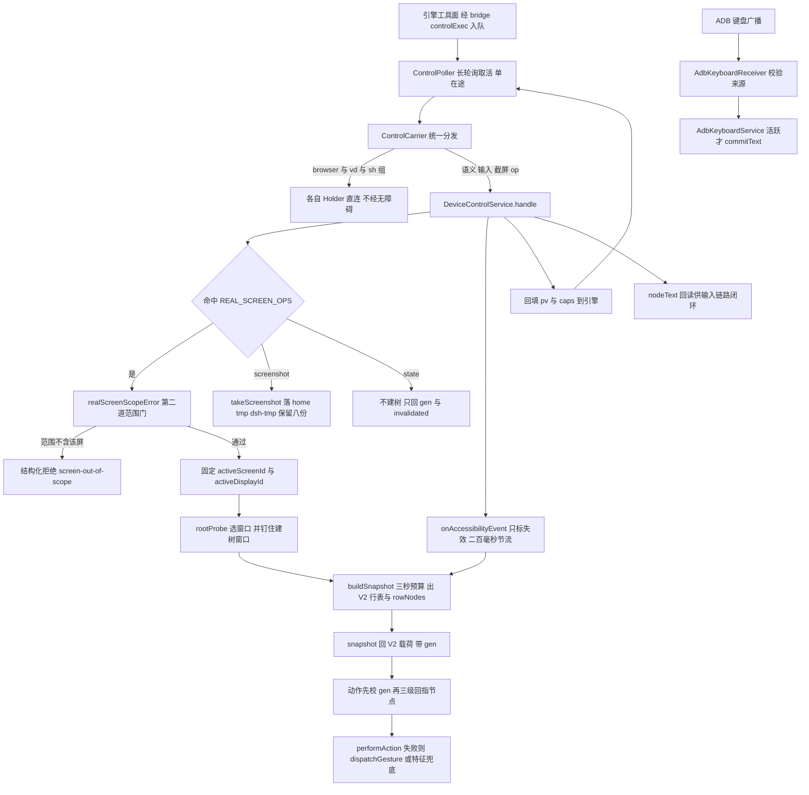
```mermaid
flowchart TD
  A["引擎工具面 经 bridge controlExec 入队"] --> B["ControlPoller 长轮询取活 单在途"]
  B --> C["ControlCarrier 统一分发"]
  C -->|"browser 与 vd 与 sh 组"| D["各自 Holder 直连 不经无障碍"]
  C -->|"语义 输入 截屏 op"| E["DeviceControlService.handle"]
  E --> F{"命中 REAL_SCREEN_OPS"}
  F -->|"是"| G["realScreenScopeError 第二道范围门"]
  G -->|"范围不含该屏"| H["结构化拒绝 screen-out-of-scope"]
  G -->|"通过"| I["固定 activeScreenId 与 activeDisplayId"]
  I --> J["rootProbe 选窗口 并钉住建树窗口"]
  J --> K["buildSnapshot 三秒预算 出 V2 行表与 rowNodes"]
  K --> L["snapshot 回 V2 载荷 带 gen"]
  L --> M["动作先校 gen 再三级回指节点"]
  M --> N["performAction 失败则 dispatchGesture 或特征兜底"]
  F -->|"screenshot"| O["takeScreenshot 落 home tmp dsh-tmp 保留八份"]
  F -->|"state"| P["不建树 只回 gen 与 invalidated"]
  E --> Q["onAccessibilityEvent 只标失效 二百毫秒节流"]
  Q --> K
  E --> R["回填 pv 与 caps 到引擎"]
  R --> B
  S["ADB 键盘广播"] --> T["AdbKeyboardReceiver 校验来源"]
  T --> U["AdbKeyboardService 活跃才 commitText"]
  E --> V["nodeText 回读供输入链路闭环"]
```

#### K06 特权执行、屏幕范围与本地文件面

- **一句话**：把模型/页面的特权请求落成 uid 2000 的 Shizuku shell 执行（含屏幕范围门与审计），并守好本机文件的进（SAF/分享）、出（外部打开）与配置导入导出三条口子。
- **入口/触发**：
  - 特权 shell：引擎插件 `androidPrivilege.execAdbShell/execAdbLine`（工具层 guard 之后）经控制队列投递 `shExec/shPull/shPush/shRemove`；页面与插件也可直连 `controlExec('shExec', …)`（`plugins/dsh-android-bridge/src/index.ts:1034`、`:949`）。
  - 屏幕范围：设置页 `getScreenScope/setScreenScope` 唯一写面（`MainActivity.kt:771-772`）。
  - 本地文件：系统分享/打开 intent（`MainActivity.kt:266`）、页面「文件提及 → 外部阅读器」（`MainActivity.kt:762`）、页面「文件管理 → 打开方式」（`MainActivity.kt:764`）、页面配置导入导出（`MainActivity.kt:726-727`）。
- **运行顺序**：
  1. 引擎第一道：档位门 + 危险命令黑名单（仅 `execAdbShell/execAdbLine`）+ 屏幕范围（`looksDangerousAdb` / `adbCommandScopeDenied`，`index.ts:1038`、`:1071`、`:707`），再 `controlExec` 投递（`index.ts:1052-1056`，壳侧 20s / 入队 25s）。
  2. 壳侧承载：`ControlCarrier` 随前台引擎服务起停（`EngineService.kt:43`），`ControlPoller` 长轮询取活并在**单线程** `dsh-control-poller` 上执行（`ControlPoller.kt:96`、`:123`）；`sh*` 走 `ControlCarrier.kt:107`，无障碍服务在场时也可能走 `DeviceControlService.kt:661-664` 的同名分支。
  3. `ShellOps.handle` 分发 → `exec` 先过执行点范围复查 `scopeDenied`（仅 `VIRTUAL_ONLY` 生效，`ShellOps.kt:132`）→ `ShizukuTransport.runShell` 组装 `sh -c <PATH 前缀 + command>`（`ShizukuTransport.kt:271`）。
  4. 绑定：`readyService` → `ensureBound`（15s 总预算内循环等绑，`ShizukuTransport.kt:169-199`）→ 协议版本 < 2 直接拒；Binder 调用 `ShizukuUserService.exec/execCapture`（独立进程 uid 2000，`ShizukuUserService.kt:60`、`:95`）→ Bundle 回执。
  5. 回写：`ShellOps` 补 `op/transport` 与 `ControlAudit.log`（`ShellOps.kt:102`、`:586`）→ `ControlPoller` POST `/api/android/ui/result` 回填 → 引擎把回执交给发起工具。
  6. 文件进：`processIncomingIntent` 主线程只做 intent 识别 + `validate`，其余交 `dsh-file-incoming` 单线程（`FileIncoming.kt:379`、`:301`）：`sweepExpired` → `copyIn` → `recordOpening` → `enqueuePending` → 20s 内 4s 一次 `flushPending`（POST 带 `X-DSH-Control-Token`）；引擎就绪时 `EngineStartFlow.kt:547` 补投；`EngineService.onTaskRemoved` 调 `cleanupTmp`（`EngineService.kt:66`）。
  7. 文件出/配置：`PathOpen.openChooser` / `FileIncoming.openWithExternalReader` / `ConfigTransfer.exportToShared|importFromShared` 同步返回 JSON 文本给页面。
- **嵌套与线程**：主线程（intent 识别与 `validate`、`ServiceConnection` 回调、`startActivity`）；WebView JavaBridge 线程（AndroidBridge 方法体，配置导入导出同步 IO）；`dsh-control-poller` 单线程（整条控制队列串行，长命令阻塞后续 op）；`dsh-file-incoming` 单线程（拷贝 + 投递 + 重试）；Shizuku UserService 独立进程（uid 2000）内自建 reader 线程（`execCapture`，`ShizukuUserService.kt:108`）；SF 反查是执行点内的额外一次 Shizuku 往返（`ShellOps.kt:200`）。
- **耦合**：
  - `ControlCarrier.SHELL_OPS` / `ControlProtocolV2.SUPPORTED_OPS` / 引擎 `SHELL_OPS`：四 op 名单三处必须同形，漏一条不是拒绝而是误导性错误（`ControlCarrier.kt:37`）。
  - `ScreenScopePrefs`（prefs 文件 `dsh_screen_scope`，键 `scope`）：写方只有 `MainActivity.kt:772`，读方有 `ShellOps.scopeDenied`、`DeviceControlService.realScreenScopeError`、引擎 `currentScreenScope`（读壳侧 XML）。
  - `VdisplayController.aliasForDisplayId/activeAliases`：displayId 与 SF token 两个 id 空间的真源，壳侧范围放行的唯一依据（`ShellOps.kt:197`、`:524`）。
  - `DeviceControlService.token(context)`：file-incoming 投递的共享控制令牌（`FileIncoming.kt:339`）。
  - `androidx.core.content.FileProvider` + `res/xml/file_paths.xml`：`FileIncoming.isReaderAllowed`（`FileIncoming.kt:467`）与 `PathOpen.isChooserAllowed`（`:95`）必须与映射面同口径。
  - `ControlAudit.log`：每条 sh* 写一条 `files/audit/audit.ndjson`（`ControlAudit.kt:24`）。
  - `ProcIo.readBounded`：`EngineManager.kt:1063`、`LogCollector.kt:841`、`UndoGate.kt:253` 共用；门禁 `scripts/check-bounded-io.mjs` 强制。
- **关键坐标**：
  - `app/src/main/java/com/dsharnessmobile/shell/ShellOps.kt:37`（SCREEN_FAMILIES 八家族表）
  - `app/src/main/java/com/dsharnessmobile/shell/ShellOps.kt:249`（decideScreenCommand 段级自证三态）
  - `app/src/main/java/com/dsharnessmobile/shell/ShellOps.kt:319`（双引号分支：整段引号区域不递归扫描）
  - `app/src/main/java/com/dsharnessmobile/shell/ShellOps.kt:523`（SF token 反查，fail-closed 空集）
  - `app/src/main/java/com/dsharnessmobile/shell/ShizukuTransport.kt:169`（ensureBound 15s 预算循环）
  - `app/src/main/java/com/dsharnessmobile/shell/ShizukuTransport.kt:278`（`sh -c` 组装：任意命令面的入口）
  - `app/src/main/java/com/dsharnessmobile/shell/ShizukuUserService.kt:29`（OUTPUT_LIMIT 16 KiB 内联上限）
  - `app/src/main/java/com/dsharnessmobile/shell/FileIncoming.kt:101`（safeTarget canonical 归属断言）
- **不变量**：
  - `scope == VIRTUAL_ONLY` 时真实屏读写命令必须拒；SF 反查不可达/超时/解析空 → 空集 → 拒（fail-closed，宁可误拒）。
  - 目标屏参数按**原样十进制串**比对，禁止数值化（SF token 超 Long 值域，见坑 147）；两个 id 空间（displayId、SF token）都要核对。
  - `onServiceConnected/onServiceDisconnected` 后 `bindLatch` 必须置 null（`ShizukuTransport.kt:59`、`:70`；否则复用已放行 latch → 恒「第一次必失败」）。
  - 协议 `protocolVersion() < 2` 一律结构化拒绝，不得静默降级。
  - pull/push 本地落点必须在 `filesDir` 内（canonical 比对），远端必须绝对路径；来件落盘前写后写后各做一次归属断言。
  - 边界：来件单文件 200 MB、远端单文件 512 MB、内联输出 16 KiB、`shExec` 超时 1s..120s。
- **症状 → 排查**：
  - 「第一次特权命令报通道失败、第二次成功」→ logcat tag `dsh-shizuku`（`user service connected` / `disconnected`）；回执看 `code=shizuku-user-service-connecting` 与 `retryAfterMs`。
  - virtual-only 下读自己的虚拟屏被拒（`screen-out-of-scope`）→ 先看 `VdisplayController.activeAliases()` 是否有值，再手工跑 `dumpsys SurfaceFlinger | grep -E '^(Virtual Display |    name=)'` 看是否有 `name="DSH virtual-1"`（行尾空白敏感，`ShellOps.kt:556`）。
  - 命令输出被砍在 16 KiB / 大输出命令返回失败 → 检查调用方是否传 `capture`（见可疑点 2），logcat tag `dsh-shizuku-user`。
  - 分享来件后划掉应用、草稿消失 → 看 `files/home/.dsh/workspaces/incoming` 下 `.pending-notify.ndjson` / `.meta.ndjson` / `.sessions`，logcat tag `dsh-file-open`（`temp workspace clean skipped`、`incoming processed`、`pending incoming flushed`）。
  - 页面「打开方式 / 文件提及」无反应 → logcat tag `dsh-path`（`chooser ok` / `not-allowed` / `uri-failed`）与 `dsh-image`（`openNativePath rejected`）；核对 `res/xml/file_paths.xml` 的映射面。
  - 导入配置后引擎行为不变 → 查 `files/home/.dsh/settings.yaml` 的 mtime 与 `settings.yaml.import-backup`，logcat tag `dsh-shell`（`config imported from`）。
  - 权限/范围类取证 → `files/audit/audit.ndjson` 里 `action=shExec|shPull|shPush|shRemove`，或直接读 prefs `dsh_screen_scope.xml` 的 `scope`。
- **可疑点**：
  1. 双引号内的命令替换不被扫描 → 范围门 fail-open（S-1/S-2 家族的残留面，已确认）。`ShellOps.kt:319-338` 的 `"` 分支整段吞掉引号区域且不递归；`decideScreenCommand` 再经 `stripQuotedText` 抹白引号，于是该段既无命令词也无目标屏参数 → `ALLOW`。引擎侧 `plugins/dsh-android-bridge/src/screen-scope.ts:242-250` 同一形态（跨语言 fixture 因此恒绿，`test/fixtures/screen-scope-cases.json` 只覆盖裸 `` ` ``/`$()`）。触发：scope=virtual-only 时 `shExec('echo "$(screencap -p /sdcard/real.png)"')`（或 `sh -c 'echo "$(input -d 0 tap 1 2)"'`）→ 放行且内层真实执行，随后 `shPull` 取回（`shPull` 无范围门）→ 范围门被绕过的净效果。
  2. `capture`/spool 面无任何生产调用方，大输出被 16 KiB 内联路径截断（S-6 面，已确认）。`ShellOps.exec` 的 `capture = args.optBoolean("capture", false)`（`ShellOps.kt:99`）在引擎 `execAdbShell`/`execAdbLine` 的投递参数里都不存在（`index.ts:1052-1055`、`:1092`），故走 `ShizukuUserService.exec`：读满 16 KiB 即 `break` 并关闭管道（`ShizukuUserService.kt:70-75`、`:29`）。总输出超过约 64 KiB 管道缓冲时子进程会被提前关闭的读端打死 → `ok=false` 而引擎却按 128 KiB 承诺（`index.ts:1063`）；AIDL 注释与 `ShizukuTransport.kt:269` 都按「capture 在用」措辞。
  3. 「危险命令黑名单在壳侧复查」不成立，且 `controlExec` 直连路径没有这层（S-5 残留，已确认）。`app/src/main/aidl/com/dsharnessmobile/shell/ShizukuUserService.aidl:31` 声称黑名单在壳侧；壳侧 Kotlin 无任何黑名单（`app/src/main` grep `黑名单|dangerous|危险命令` 零命中），黑名单只在引擎 `index.ts:368/1038/1074/1375`，而 `controlExec` 只做档位门（`index.ts:949-956`）。连带：`shRemove` 全仓零调用方（仅登记面），却可经 uid 2000 删除任意绝对路径且目录递归（`ShellOps.kt:123-129`、`ShizukuUserService.kt:207-233`）——登记了但没有任何一层守。未证实是否有意预留。
  4. `ensureBound` 15s 预算与 `shExec` 20s 执行时限叠加可越过引擎 25s 入队时限（S-6 不变量的缺口，已确认代码路径、未证实实机频度）。冷启动/Shizuku 重启后最早几条命令最坏 15s+20s=35s > 25s：引擎在 25s 放弃并报「设备控制超时」，壳侧稍后仍会执行该命令 → 正是 S-6 想消灭的「假失败 + 副作用已发生」（非幂等命令会被模型重试二次执行）。叠加 `ControlPoller` 单线程（`ControlPoller.kt:96` 循环、`:125` 执行）：慢命令期间 a11y/browser/vd 全部排队。
  5. `MainActivity` 两处直连 `ShizukuTransport.runShell`，绕开 `ShellOps.scopeDenied` 这个执行点（未证实有实害）。`unlockLegacyStorageApi29`（`MainActivity.kt:1054`、`:1059`）与 `unlockRestrictedSettingsViaShizuku`（`MainActivity.kt:1076`）的命令是固定 argv、不含屏幕命令词，故当前不构成真实屏绕过；但「所有特权命令都过执行点复查」这条不变量在此不成立，后续若有人把模型可控串接进来即失守。

漂移：`docs/AGENTS/BRIDGE-API.md:122` 说 ShizukuTransport/ShizukuUserService 是「固定 argv、16KB 输出上限；页面/引擎拿不到原始 binder 或任意 shell 面」（AIDL v1），源码 `ShizukuUserService.kt:30` 是 `PROTOCOL_VERSION = 2`（execCapture 落盘面 + 单文件 256 MiB），`ShizukuTransport.kt:271-301` 与 `ShellOps.kt:91-103` 交给引擎的正是任意 `sh -c` 命令面。
漂移：`docs/AGENTS/BRIDGE-API.md:125` 说 ScreenScope「执行点复查在 DeviceControlService」，源码 `ShellOps.kt:132`（scopeDenied）才是特权 shell 通道的执行点复查，`DeviceControlService.kt:703`（realScreenScopeError）只管无障碍 op 面。
漂移（注释）：`app/src/main/aidl/com/dsharnessmobile/shell/ShizukuUserService.aidl:31` 说「危险命令黑名单仍在壳侧判定」，源码壳侧无任何黑名单（`app/src/main` 下 grep `黑名单|dangerous|危险命令` 零命中），黑名单只在 `plugins/dsh-android-bridge/src/index.ts:368`。
漂移（注释）：`app/src/main/res/xml/file_paths.xml:3` 说安全边界「与 MainActivity.OPEN_READER_ROOTS 同步」，全仓无该符号（仅此注释一处），运行时白名单实为 `app/src/main/java/com/dsharnessmobile/shell/FileIncoming.kt:467` 的 `isReaderAllowed`。
漂移（提示文案）：`app/src/main/java/com/dsharnessmobile/shell/ShizukuProbe.kt:69` 说「本应用清单尚未声明 rikka.shizuku.ShizukuProvider，属已知未落地项」，`app/src/main/AndroidManifest.xml:158` 已声明该 provider（authorities 为 `${applicationId}.shizuku`）。

补充：本轮抽查的 6 个桥接镜像文件（`plugins/dsh-android-bridge/src/screen-scope.ts`、`src/index.ts`、`src/shell-ops.ts`、`src/control-queue.ts`、`test/screen-scope.test.mjs`、`test/fixtures/screen-scope-cases.json`）协调仓与 apk 仓副本**逐字节一致**；壳侧 fixture 副本 `app/src/test/resources/screen-scope/screen-scope-cases.json` 与插件侧权威源仅排版不同（规范化后的标准形态），内容等价。

#### K07 虚拟屏宿主


- **一句话**：以 Shizuku 已绑定为前提，用五种 flag 建一块**应用自有、非镜像**的 VirtualDisplay，并把它的输出 Surface 在「侧栏工位」与「后台浮窗」两个 viewer 之间按仲裁交接；不呈现时按空闲回收。
- **入口/触发**（四条互不相通的路，落点同一个 object）：
  1. 模型/引擎：`android_vdisplay_create|_destroy|_status` 与 manage 的 `screenId:"virtual-N"` → `androidPrivilege.controlExec` → 控制队列 → `DeviceControlService.handle` 的 `vd*` 分支 → `VdisplayOps.handle`。
  2. 可信侧栏/设置页（WebView JavaBridge 线程）：`window.androidBridge.vdisplayStatus/vdisplayCreate/vdisplayDestroy/vdisplaySelect/vdisplayBounds/forceDestroyVdisplay/getVdisplayFloatEnabled…` → `MainActivity` 的 lambda。
  3. Activity 生命周期：`onStart`（回挂侧栏 / 起 reaper）、`onStop`（交出 Surface 给浮窗 / 停 reaper）、`onDestroy`（拆宿主与浮窗）。
  4. 周期任务：`MainActivity.startVdisplayReaper` 每 2 分钟一次 → `reclaimIdle`。
- **运行顺序**：
  1. **建屏**（`create`，VdisplayController.kt:306）：先按「本机是否已有屏」幂等复用（`:322`）→ `ShizukuTransport.ensureBound`（`:324`，预算 15s）→ 按真实屏 × `VdisplayPrefs.scale` 与 `MIN_EDGE/MAX_EDGE` 钳出 width/height/dpi → 锁内建 `HandlerThread("dsh-vdisplay-reader")` + `ImageReader`（2 帧环形，只排空不做像素传输）→ `createVirtualDisplay("DSH $alias", …, 五 flag)` → `records[alias] = Record(...)`、`selectedAlias` 兜底、`generation += 1`（`:398-401`）→ 交回 `status()`。
  2. **呈现（viewer 两阶段契约）**：①页面侧 `plugins/dsh-android-vdisplay/src/client/index.ts:194` 用 ResizeObserver + 可见性 watcher 推 `vdisplayBounds`（含 `visible`、`target`、`viewerId`）→ `MainActivity` → `VdisplayHost.setStageBounds`（`:54`，编组主线程）→ 记几何、`setViewerBounds`、`ensureView` + `applyStageBounds` 让 1x1 SurfaceView 变 VISIBLE；②`SurfaceHolder.surfaceCreated` → `bindSurface`（`:134`）→ `VdisplayController.attachViewerSurface`（`:474`，`ViewerArbitration` 判 ATTACH/OCCUPIED）→ `display.setSurface(viewer Surface)`。`visible:false` 或 `surfaceDestroyed` → `releaseViewerSurface` 把输出**交回 ImageReader**（不销毁屏与 task）。
  3. **后台换手**：`onStop` → `vdisplayHost.detachForBackground()` + `VdisplayFloat.show()`（同一仲裁，`viewerId="float"`，TYPE_APPLICATION_OVERLAY 只读小窗，`collapse()` 只收成把手且释放 Surface）；`onStart` 反向 `float.hide()` → `host.reattach()`。
  4. **控制**：`vdInfo`/`status()` 由 `DisplayManager.displays` 真实枚举 + 产品别名生成 `screens[]`；`vdInput`/`vdLaunchApp` 把模型面的坐标/包名翻译成**固定 argv**（`/system/bin/input -d <displayId>`、`cmd package resolve-activity` + `am start --display <id> -n <component>`）交 `ShizukuTransport.runController`。
  5. **回收**：`VdisplayOps.handle` 入口（VdisplayOps.kt:20）与 2 分钟 reaper 都调 `reclaimIdle`（`:95`）→ `display.release()` + `reader.close()` + `thread.quitSafely()` + `generation += 1`，随后各自把 `status()` 交回调用方；显式销毁 `destroy`（`:418`）/设置页 `forceDestroy`（`:721`）同款释放，且**不按归属拒绝**。
- **嵌套与线程**（最多三层：`DeviceControlService.handle` → `VdisplayOps.handle` → `VdisplayController.*`）：
  - **主线程**：`MainActivity` 桥面 lambda、`VdisplayHost` 全部视图/几何（`onMain` 编组）、`VdisplayFloat` 全部窗口与手势、reaper 的 Handler。
  - **控制队列线程**（EngineService 持有）：`ControlCarrier.handle` → `VdisplayOps.handle` → `create/destroy/input/launchApp/screens`（`records` 的第二个写者）。
  - **WebView JavaBridge 线程**：`@JavascriptInterface` 直接进 `MainActivity` lambda → `VdisplayController.create`（不经 `onMain`）。
  - **工作线程**：`dsh-vdisplay-reader`（ImageReader 排空帧）、`dsh-shizuku-kick`（后台绑定）。
  - **Binder 回调**：Shizuku `ServiceConnection` 与 `UserService.exec`（8s）；`status()` 内含 `kickBind` + `status()` 两次 binder 往返。
- **耦合**（点名符号；插件与子仓的权威源在协调仓同名路径，apk 仓为逐字节镜像）：
  - `ShizukuTransport.ensureBound/kickBind/status/runController`（`BIND_TOTAL_MS=15s`、exec 8s）；`ShizukuUserService` 一死 → 全链 `shizuku-user-service-connecting`。
  - 显示器名 `"DSH <alias>"` 是**跨仓契约**：壳侧 `createVirtualDisplay` 写，引擎侧 `screen-scope.ts` 与 `plugins/dsh-android-manage/src/vd-shot.ts` 按该前缀把 SF token 配回 `virtual-N`。
  - `ScreenTargets.REAL / REAL_DISPLAY_ID / isVirtual`（ScreenScope.kt:31-44）、`ScreenScopePrefs`：`screen-not-selectable`、`screen-not-found`、`screen-out-of-scope` 的判据来源。
  - `VdisplayPrefs`：SharedPreferences 文件 `dsh-vdisplay`，键 `resolutionScale`（0.4-1.0，默认 0.75）、`floatEnabled`（默认 true）——设置页写，`create` 与 `onStop` 读。
  - `AndroidBridge.kt:316-348` 的 `vdisplay*` 桥方法 + `MainActivity.kt:782-791` 的 lambda；`VdisplayHost.setStageBounds` 的入参由 `plugins/dsh-android-vdisplay/src/client/index.ts` 发布（`VIEWER_ID='files-sidebar'` 与宿主的 `viewer-<identityHashCode>` **不是同一个 id**）。
  - 面板轮询：`dsh-client-ui-responsive/src/client/dev-section/screen-control.tsx:52` 每 2s 读 `vdisplayStatus`。
  - `DeviceControlService.activeScreenId/activeDisplayId` 与 `realScreenScopeError`（`:718` 用 `displayIdForAlias` 把 `virtual-N` 钉成动态 displayId）；反向 `ShellOps.kt:197` 用 `aliasForDisplayId` 核对模型给的 displayId，`:524` 用 `activeAliases()` 收敛 SF token 反查的**有效期**（屏一销毁 token 立即失效）。
  - `Record.viewerId/viewerSurface`（`:56-57`）是仲裁唯一状态；`generation`（`:117`）是面板与「回收后自动重挂」的观测点。
- **关键坐标**：
  - `app/src/main/java/com/dsharnessmobile/shell/VdisplayController.kt:306` `create` 入口
  - `app/src/main/java/com/dsharnessmobile/shell/VdisplayController.kt:322` 幂等判定（锁外读 `records.size`）
  - `app/src/main/java/com/dsharnessmobile/shell/VdisplayController.kt:372` 五 flag 组合（`OWN_CONTENT_ONLY` 是必须项）
  - `app/src/main/java/com/dsharnessmobile/shell/VdisplayController.kt:474` `attachViewerSurface` 仲裁
  - `app/src/main/java/com/dsharnessmobile/shell/VdisplayController.kt:95` `reclaimIdle` 回收判定
  - `app/src/main/java/com/dsharnessmobile/shell/VdisplayController.kt:84` `touch` 定义（零调用点，见可疑点）
  - `app/src/main/java/com/dsharnessmobile/shell/VdisplayHost.kt:157` `applyStageBounds` 舞台映射与重挂
  - `app/src/main/java/com/dsharnessmobile/shell/VdisplayHost.kt:207` `onMain`（2s 预算、无 catch）
  - `app/src/main/java/com/dsharnessmobile/shell/VdisplayFloat.kt:76` `show` 三条 fail-closed 判据
  - `app/src/main/java/com/dsharnessmobile/shell/VdisplayOps.kt:15` `handle` 分发表
  - `app/src/main/java/com/dsharnessmobile/shell/VirtualDisplayProbe.kt:97` `runMatrix`（`BuildConfig.DEBUG` 门）
- **不变量**：
  1. 别名**永不映射 display 0**：`aliasForDisplayId` 显式把 0 判空（`:140`），无屏时回 `screen-not-ready`，绝不回退真实屏。
  2. 一块 Surface 同时只属于一个 viewer：第二个 viewer 必得 `viewer-target-occupied`，不得静默抢占或共享。
  3. `records` / `viewerBounds` 的任何结构修改都必须在 `synchronized(lock)` 内（现有写者：控制队列线程、主线程 reaper、JavaBridge 线程）。
  4. 缺 `FLAG_OWN_CONTENT_ONLY` 必抛 `SecurityException`（系统按镜像索要投屏权限）；缺 `DESTROY_CONTENT_ON_REMOVAL` 会让第三方 task 被搬回真实屏抢焦点。
  5. `records` 非空 ⇒ `MAX_VIRTUAL_DISPLAYS=1` 的上限语义成立（别名分配、回收、面板下拉都建立在此）。
  6. 违反症状：黑框/黑边、模型收到 `screen-not-ready`、进程闪退、`shizuku-user-service-connecting`。
- **症状 → 排查**：
  1. 侧栏虚拟屏 Tab 显示「已激活」但画面黑框 → `adb logcat -s dsh-vdisplay`（create/attach/reclaim 行）；`adb shell dumpsys display | grep -A2 "DSH virtual"` 看 display 是否真在；回执 `viewers[].presenting=false` 即 attach 没成（仲裁或 Surface 已死）。
  2. 建屏满 10 分钟后，模型第一条 vd op 报 `screen-not-ready` → grep `vdisplay-reclaimed`；`grep -n "touch(" app/src/main/java/com/dsharnessmobile/shell/VdisplayController.kt`（当前只有定义）。
  3. 输入/拉起全失败 → `adb logcat | grep -E "conflicting per-domain rules|shizuku-user-service"`（NSC 崩溃打死 UserService）；`adb shell dumpsys activity services | grep -i shizuku`。
  4. 虚拟屏截图拿到真实屏画面 → 坑 147：必须 `dumpsys SurfaceFlinger | grep -E '^(Virtual Display |    name=)'` 取 SF token，`screencap -d <displayId>` 对虚拟屏必然 Status -2。
  5. 浮窗不出现或出现黑框 → 查 `Settings.canDrawOverlays`、`adb shell run-as com.dsharnessmobile.shell cat shared_prefs/dsh-vdisplay.xml`（`floatEnabled`）、以及侧栏是否仍占着目标（`viewer-target-occupied`）；`VdisplayFloat.show()` 的返回值当前不反映 attach 结果。
  6. 设备回归入口：`node scripts/verify-vdisplay-viewer.mjs --ws=…`、`node scripts/verify-vdisplay-float.mjs`（前者正是「推 bounds → 验 attach → 推 visible:false → 验释放」的两阶段契约脚本）。
- **可疑点**（评审 ID 对应协调仓 `docs/COMPAT-REVIEW-0.14.0-2026-09-19.md`）：
  1. **已确证（V-R0 / F-10）**：`touch()` 全仓零调用点（`VdisplayController.kt:84` 只有定义），`lastUsedAt` 的唯一写入是 `Record` 构造默认值（`:60`）。于是「空闲回收」实际是「**建屏后满 10 分钟必回收**」：长任务里模型第一条 vd 调用会在解析阶段把屏删掉并回 `screen-not-ready`，guidance 只说「已回收空闲虚拟屏」，归因误导。插件侧 `tools-callable.test.mjs` 只断言 `reclaimIdle/IDLE_RECLAIM_MS/lastUsedAt` 三个字符串在场，所以失效不会判红。
  2. **未证实（有触发条件，与 S-8 同族）**：`touch()` 的 `records.values.forEach`（`:86`）与 `status()` 里的 `records[selected]`（`:253`）都在 `synchronized(lock)` **之外**读 `records`，而 `records` 有两个跨线程写者（控制队列线程的 `create/destroy`、主线程 reaper 的 `reclaimIdle`）。今天 `touch` 是死代码所以不发作；**F-10 的修法（在 status/select/input/screens 里刷新）一落地，主线程就会在遍历中撞上控制线程的 `records.remove`** → ConcurrentModificationException 打穿主线程 = 闪退。修 F-10 时必须同时把刷新点收进锁内。
  3. **已确证（V-R5）**：`create()` 的幂等判定在锁外（`:322`），锁内（`:343` 起）**不复查** `records`，中间还夹着最长 15s 的 `ensureBound`（`:324`）。控制队列线程（模型 `vdCreate`）与主线程桥面（面板 `vdisplayCreate`）并行时两侧都通过检查 → 各建一块，`MAX_VIRTUAL_DISPLAYS=1` 的全链假设被打破。
  4. **已确证（V-R7）**：`attachViewerSurface` 用 `runCatching { record.display.setSurface(surface) }` 吞掉失败（`:495`），但 `record.viewerId/viewerSurface` 已被占用（`:492-493`）且 `status()` 因 `state=active` 回 `ok:true` → 宿主 `attached=true`，黑屏且重开修不好；同处 `viewerBounds`（`:116`、`:520-523`）无上限、`VdisplayHost.destroy()` 也不注销，Activity 每次重建留一条永不回收的 JSON，并被 2s 轮询的 `status()` 整个序列化。
  5. **已确证（S-8）**：`VdisplayHost.onMain`（`:207-213`）没有 catch —（a）`block` 在主线程抛异常时（`releaseViewerSurface → status → kickBind/Shizuku 往返`）经 `main.post` 成为**主线程未捕获异常 = 进程闪退**；（b）2s `latch.await` 超时只回 `main-thread-timeout`，不报是哪个 block。`BrowserHost.kt` 是同一份实现的第二份（S-8 要求两份同改）。

- **漂移**：
  - 漂移：`docs/AGENTS/ARCHITECTURE.md:90` 说 `VdisplayController.kt` 389 行、`:91` 说 `VdisplayHost.kt` 177 行，源码 `app/src/main/java/com/dsharnessmobile/shell/VdisplayController.kt` 是 766 行、`VdisplayHost.kt` 是 214 行（`wc -l` 现场数）。
  - 漂移：`docs/AGENTS/BRIDGE-API.md:117` 与 `:195` 说页面桥面有 `vdisplayLaunchSettingsProbe`/`backProbe`，源码 `app/src/main/java/com/dsharnessmobile/shell/AndroidBridge.kt:316-348` 没有这两个方法（`sendBackProbe` 只有定义、无调用点，`VdisplayController.kt:529`）；实际存在的 `vdisplaySelect`、`get/setVdisplayScale`、`get/setVdisplayFloatEnabled`、`forceDestroyVdisplay` 未列出。
  - 漂移：`docs/AGENTS/ARCHITECTURE.md:136` 与 `docs/AGENTS/BRIDGE-API.md:201` 说建屏 flag 是「公开 `PUBLIC|OWN_CONTENT_ONLY|SUPPORTS_TOUCH`」，源码 `VdisplayController.kt:372-373` 是 5 个（另含 `DESTROY_CONTENT_ON_REMOVAL`、`ROTATES_WITH_CONTENT`），且同文件 `:366-368` 的实测注释已写明 13+ 上 `FLAG_PUBLIC` 不生效。
  - 漂移：`VdisplayController.kt:124` 的 `ops()` 说支持 5 个 vd op（缺 `vdLaunchApp`/`vdInput`，且把只回 `unsupported` 的 `vdMoveTask` 列成支持），而 `VdisplayOps.kt:21-44` 实际分发 7 个，引擎侧 `plugins/dsh-android-vdisplay/src/status.ts:14` 的 `VD_OPS` 也是 7 个 —— 面板读载荷里的 `ops`（`mapStatusPayload`）时 capabilities 会少报两条。

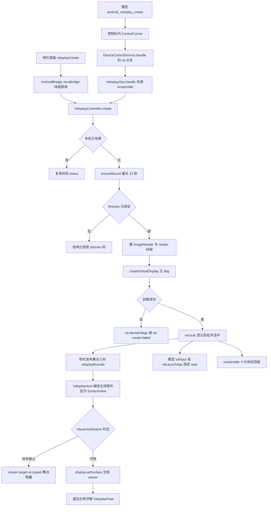
```mermaid
flowchart TD
  A["模型 android_vdisplay_create"] --> B["控制队列 ControlCarrier"]
  C["侧栏面板 vdisplayCreate"] --> D["AndroidBridge JavaBridge 线程直调"]
  B --> E["DeviceControlService.handle 的 vd 分支"]
  E --> F["VdisplayOps.handle 先跑 reclaimIdle"]
  D --> G["VdisplayController.create"]
  F --> G
  G --> H{"本机已有屏"}
  H -->|"有"| I["复用并回 status"]
  H -->|"无"| J["ensureBound 最长 15 秒"]
  J --> K{"Shizuku 已绑定"}
  K -->|"否"| L["结构化拒绝 shizuku 码"]
  K -->|"是"| M["建 ImageReader 与 reader 线程"]
  M --> N["createVirtualDisplay 五 flag"]
  N --> O{"创建成功"}
  O -->|"否"| P["vd-denied-flags 或 vd-create-failed"]
  O -->|"是"| Q["records 登记别名并选中"]
  Q --> R["侧栏发布舞台几何 vdisplayBounds"]
  R --> S["VdisplayHost 编组主线程并显示 SurfaceView"]
  S --> T{"ViewerArbitration 判定"}
  T -->|"目标被占"| U["viewer-target-occupied 舞台隐藏"]
  T -->|"可用"| V["display.setSurface 交给 viewer"]
  V --> W["退后台转浮窗 VdisplayFloat"]
  Q --> X["模型 vdInput 或 vdLaunchApp 固定 argv"]
  Q --> Y["reclaimIdle 十分钟后回收"]
```

#### K08 浏览器宿主

- **一句话**：给模型与侧栏一个**无桥的独立 WebView 工作面**：自己一套 renderer、自己一套 URL 准入与请求级过滤、自己按可信侧栏下推的舞台矩形做原生覆盖层。
- **入口/触发**：三条。① 模型工具 `browser_*`（P03）：引擎 control-queue → 壳侧 ControlPoller 轮询线程 → `DeviceControlService` 的 `browser*` 分支 → `BrowserHostHolder.control` → `BrowserHost.controlOp`（BrowserHost.kt:498）。② 可信侧栏面板（S01）`window.androidBridge.browserHost*`（MainActivity.kt:774-781），其中 `browserHostBounds` 每 300ms 一拍（browser-tab.tsx:268）。③ 主线程自身：root 布局变化监听、500ms 保鲜看门狗、WebView 回调。
- **运行顺序**：宿主随 Activity 常驻（MainActivity.kt:205 构造、:210 挂 holder、:277/:369 恢复与暂停、:439 销毁）。控制 op 到达后先 `switchTo(workspaceFor(args.session))` 选会话工作台 → 需要页面时 `ensureViewFor` 惰性建该 tab 的 WebView（同时注册 document-start 脚本、挂看门狗）→ 导航面过 `normalizeUrl` 准入再 `loadUrl`；几何面由面板 bounds 下推驱动 `applyStageBounds` → `applyVisibility`。跑完把 JSON 回执交回控制队列线程 → 引擎 → 模型。
- **嵌套与线程**：主线程是唯一 View 所有者（`onMain` 编组，2s 预算）。① 控制队列线程 → `controlOp`（:498）→ `switchTo`（切工作台是纯赋值，重排投主线程）→ `awaitMain(8s)` 阻塞等主线程的 `evaluateJavascript` 回调；`navigateOp` 另在**调用线程**上自旋 `awaitNavigation`。② 服务回调：`DeviceControlService.handle` 的 `browser*` 分支（:634-652）→ `BrowserHostHolder.control`（:1807）。③ JavaBridge 线程（面板 `@JavascriptInterface`）→ MainActivity lambda → `onMain`。④ WebView 回调在主线程，`shouldInterceptRequest` 在 WebView 的 IO 线程池（只碰 `tab.blockedRequests`）。最深链：控制队列线程 → controlOp → awaitMain → JS 回调。
- **耦合**：
  - 会话键：`Workspace.sessionKey`、`ANONYMOUS_SESSION="__anonymous__"`（:74）、`TAB_ID="tab-1"`（:71）、`viewerSessionId`（:324）。写：`controlOp`（args.session，:505）、`setStageBounds`（面板 session，:448-453）、`show`（:375）；读：`status().ownerSessionId`（:923），面板 S01 用它做 `foreign` 判定（browser-tab.tsx:251）。
  - op 面 14 条：`browserCaps/State/Tabs/FollowTab/CloseTab/Show/Hide/Close/Open/Viewport/SetUa/Js/Input/Shot`（BrowserHost.kt:509-525）逐字对应契约 `BROWSER_OPS`（plugins/dsh-android-browser/src/contract.ts:42-58）；同一分支表被 `scripts/check-control-ops.mjs` 冻结（DeviceControlService.kt:634-652）。
  - 准入纯函数：`BrowserHostNavigationPolicy.normalize` / `blockedRequestReason` / `canonicalHost(denyLinkLocal)`；被 `BrowserHost.isAllowedNavigation`、`normalizeUrl`（:957-959）、`shouldOverrideUrlLoading`（:625）、`shouldInterceptRequest`（:644）四处共用，另被 `BrowserHostCleartextConsistencyTest` 真调。
  - 覆盖层判据纯函数：`BrowserOverlayPolicy.visible/boundsAge/shouldDropStaleStage` 与常量 `STAGE_BOUNDS_TTL_MS=4000`、`STAGE_BOUNDS_WATCHDOG_MS=500`；状态 `Workspace.boundsAt`（写 :465）、`requestedVisible/stageVisible`（写 :402-407、:756、:793、:865）。
  - 跨块契约字段：`caps()` 的 `rendererProcesses/cdpEnabled/browserWebViewAvailable/androidxWebkit*` 与 `status()` 的 `loadState/reason/blockedRequests/pageGeneration/tabId/tabs` 被 P03 的 `facts.ts`、`tier.ts`、`tools.ts` 消费；契约声明 `platform/mobile`（contract.ts:169）由 tools.ts:389/980 发送，壳侧 `identityApply` 从不读取。
  - 进程级 `CookieManager`：引擎鉴权 cookie 注入点 MainActivity.kt:815，与隔离 WebView 同池。
- **关键坐标**：
  - `app/src/main/java/com/dsharnessmobile/shell/BrowserHost.kt:498` controlOp 入口与 op 分发表（:509-525）
  - `app/src/main/java/com/dsharnessmobile/shell/BrowserHost.kt:584` ensureViewFor（唯一建隔离 WebView 点，全类无 addJavascriptInterface；:726 挂看门狗）
  - `app/src/main/java/com/dsharnessmobile/shell/BrowserHost.kt:642` shouldInterceptRequest（403 空体 + 计数 + :649 日志上限 20）
  - `app/src/main/java/com/dsharnessmobile/shell/BrowserHost.kt:670` onPageStarted 的内置错误页守卫（此路径不推进代次）
  - `app/src/main/java/com/dsharnessmobile/shell/BrowserHost.kt:732` applyStageBounds（letterbox 换算）；`:884` layoutDetached（收起态非退化排版兜底）
  - `app/src/main/java/com/dsharnessmobile/shell/BrowserHost.kt:853` boundsWatchdog（保鲜停画）；`:871` 自续条件
  - `app/src/main/java/com/dsharnessmobile/shell/BrowserHostNavigationPolicy.kt:35` normalize（用规范化 host 重建 URL）；`:81` blockedRequestReason；`:108` canonicalHost
  - `app/src/main/java/com/dsharnessmobile/shell/BrowserOverlayPolicy.kt:38` TTL=4000；`:56` visible 四判据；`:84` shouldDropStaleStage
- **不变量**：
  1. View 操作只在主线程；`workspaces`/`currentWorkspace` 的 map 结构只应由主线程改（违反 → 主线程 CME 闪退，见可疑点 1）。
  2. 准入放行的 http host 必须在平台 NSC 撑开面内（跨层同向，由 `BrowserHostCleartextConsistencyTest` 真调准入函数 + 解析 NSC 守住）。
  3. 动作必须携带与**同一页同一次** snapshot 一致的 `pageGeneration` 与 ref，否则 `resolveRef`（:1433）结构化拒绝；`lastSnapshotGeneration<0` 一律 `snapshot-required`。
  4. 覆盖层只在「当前工作台 ∧ 调用方请求过可见 ∧ 最近一次 bounds 判可见 ∧ 发布者在保鲜期内」时绘制；任一缺失即 fail-closed 停画，但停画一律用 INVISIBLE（保留布局盒，`window.innerWidth/innerHeight` 不得为 0）。
  5. 面板下推的 `session` 决定当前工作台；`ANONYMOUS_SESSION` 工作台永不出表，其余会话工作台在 `browserClose`/`disposeView` 时整体销毁（`dropWorkspace`，:229）。
  6. `tab.blockedRequests` 只增不减：`recycleView` 重建 WebView 与页面重载都不清零（计数跨重载累计）。
- **症状 → 排查**：
  1. 「模型说已打开，侧栏只有错误页」→ `adb logcat | grep dsh-browser` 看 403 子资源与 `load-error:`；调 `browser_state` 看 `reason/loadState/blockedRequests`；若为明文站点先对账 `res/xml/network_security_config.xml` 与 `BrowserHostCleartextConsistencyTest`（issue #232 家族）。
  2. 「进程闪退」→ logcat 搜 `ConcurrentModificationException` + `BrowserHost.applyVisibility`/`BrowserHost$boundsWatchdog`；触发条件 = 模型开页的同时用户侧栏展开（300ms 下推）。
  3. 「收起侧栏后浏览器仍盖在聊天上，怎么收都不消失」→ 查 `applyVisibility` 的四判据与 `boundsAt` 保鲜：grep `BrowserOverlayPolicy`、`switchTo`、`dropWorkspace`（切工作台/丢弃工作台都会改当前工作台）。
  4. 「点不动 / 点错页」→ 对照 `browser_snapshot` 的 `tabId/pageGeneration/nodeCount` 与 `browser_follow_tab` 回执；拒绝码 `stale-page-generation`/`stale-ref`/`snapshot-required` 直接区分代次过期与 ref 过期；`pageWidth/pageHeight=0` 表示布局盒塌陷（看 `layoutDetached` 是否被走到）。
  5. 「browser_open 卡约 10 秒才回来」→ 查是否落进内置错误页（`onPageStarted` 被守卫不推进代次 → `awaitNavigation` 等满冷启动预算），同时段其它设备控制 op 全部排队。
- **可疑点**：
  1. 【已确认，S-8 / R1】`workspaces` 与 `currentWorkspace` 跨线程。控制队列线程在 `workspaceFor` 里写 map（:187-192，由 :506 `switchTo(workspaceFor(session))` 每次 op 触发），主线程在 `applyVisibility`（:821）与看门狗（:871）里遍历同一张 `LinkedHashMap`；`currentWorkspace`（:184）无 `@Volatile`，而 `onMain`（:1661-1673）只有 `finally` 没有 `catch`。复现：模型连开新会话页面 + 用户侧栏展开（300ms 一拍 `setStageBounds` → `applyVisibility`）。一次 CME 即 uncaught on main Looper = 进程闪退，且 `workspaces` 可能停在半写状态。
     同族【已确认，R2 / H-1】：`workspaces` 无上限、无 LRU/TTL，全仓无 `onTrimMemory`（grep 零命中），`MAX_TABS=8` 只是**每工作台**上限，也没有「会话被删除 → `dropWorkspace`」的可信信号。每个新 session 开页即多一个 WebView，驻留到 Activity 销毁。
  2. 【已确认，S-7 / R3 / R6 / F-6】浏览器 op 在控制队列线程上忙等：`awaitNavigation`（:1101-1107）用 `Thread.sleep(40)` 自旋，冷启动预算 10s（:1087）；而内置错误页的 `onPageStarted` 被守卫 `return`（:670）**不推进代次** → DNS 立即失败时必然等满预算再 `return ok:true`（:1088）。影响：一次 `browser_open` 最坏占住整条设备控制队列 10s（a11y / vd / `sh*` 全排队），回执仍是成功（`reason` 只有 `status()` 带出）。
  3. 【已确认，S-6 / R7 / F-7】截图生命周期与回执：`shotOp` 写 `filesDir/home/tmp/dsh-tmp/browser-shot-<ts>.png`（:1565），全仓 grep `browser-shot` 只命中这一处写入点、**无任何删除点**，而 :1590 的 note 与工具层文案都称「读完即删」；`health` 是字面量 `"ok"`（:1589，契约声明 `ok|suspect`）；失败分支 `lastError.ifBlank { "shot-failed" }`（:1581）会把**上一次**遗留的 `lastError`（如 `load-error:-2`）当成截图失败原因。影响：长任务磁盘累积（全页 ARGB_8888 PNG 100%）+ 失败原因误导。
  4. 【已确认，H-7 / F-1 / F-4 / F-8】回执与能力不实四处：① `caps()` 的 `rendererProcesses:0`、`cdpEnabled:false`、`browserWebViewAvailable:true`、`androidxWebkitCompiled:true`、`densityOverrideSupported:false`（:1015-1017）与 `status().available:true`（:912）全是常量，被 P03 的 `facts.ts/tier.ts` 当设备事实消费；② `applyDocumentStartScript` 在能力门不过时静默 `return`（:1196），而 `viewportOp`/`setViewport` 成功体只有 `ok/route/width/height`（:1117、:1131），不报 `scriptApplied/degraded`（隔壁 `identityResult`:1182-1189 是如实上报的）→ 视口没生效也回 ok；③ 视口区间两侧不同源：面板 240..4096（dsh-client-ui-responsive/src/client/mobile/browser-tab.tsx:83、:89）vs 壳侧 240..3840（:482、:1122、:1159），面板校验通过、壳侧拒、面板不渲染错误 → 用户看到「什么都没发生」；④ 隔离 WebView 无 `onReceivedHttpError`、无 `setDownloadListener`（grep 只命中可信 WebView：MainActivity.kt:565、:648），404/403/500 与「点了 PDF」在 `loadState` 上仍报 `loaded`、在工具回执上仍是 `ok:true, changed:false`。
  5. 【已确认，S-3 / F-9】「隔离」只是无桥，不是存储隔离：`app/src/main/java` 全域无 `setDataDirectorySuffix` / `removeAllCookies` / `WebStorage.deleteAllData`，也无 `browserClearData` 一类清理 op（grep 零命中），而引擎鉴权 cookie 注入的是**进程级** `CookieManager`（MainActivity.kt:815）。影响：隔离 WebView 与引擎会话共用 cookie/存储池，AI 访问过的站点 cookie/localStorage 持久驻留且用户无撤销入口；请求级过滤一旦出现缺口，被解析到回环同源的请求会带引擎 cookie。
     未证实：请求级过滤把 `ws`/`wss` 也纳入 scheme 判定（BrowserHostNavigationPolicy.kt:87），似假定 WebSocket 握手会进 `shouldInterceptRequest`；Android 是否真把 WS 升级交进该回调，本轮未在设备上确认。若否，页面可用 `ws://127.0.0.1:3080/` 绕过 403 面（验证法：加载公网页后 `new WebSocket("ws://127.0.0.1:3080/")`，看 `blockedRequests` 是否 +1、logcat 是否出 `dsh-browser`）。

漂移：`docs/AGENTS/ARCHITECTURE.md:18` 说 `BrowserHostNavigationPolicy.kt` / `BrowserOverlayPolicy.kt` 为 210 / 82 行，现场 `wc -l` 是 231 / 86 行（同行的 BrowserHost.kt 1813 与文档一致）。
漂移：`dsh-client-ui-responsive/src/client/mobile/browser-tab.tsx:248` 注释说「原生层 foreignViewer 亦 fail-closed」，源码 `BrowserHost.kt:810-814` 明写 foreignViewer 判定已随按会话隔离删除（全仓只剩这条注释提及该符号）；同文件 `:398-401` 的口径才是现状。

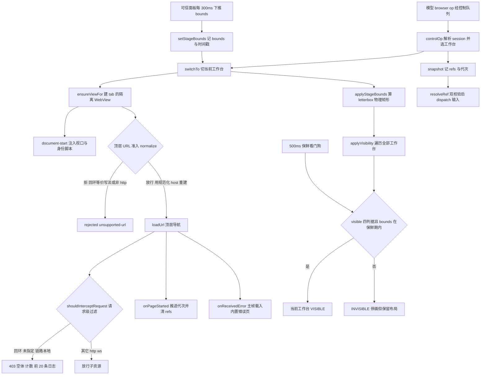
```mermaid
flowchart TD
  A["模型 browser op 经控制队列"] --> B["controlOp 解析 session 并选工作台"]
  C["可信面板每 300ms 下推 bounds"] --> D["setStageBounds 记 bounds 与时间戳"]
  B --> E["switchTo 切当前工作台"]
  D --> E
  E --> F["ensureViewFor 建 tab 的隔离 WebView"]
  F --> G["document-start 注入视口与身份脚本"]
  F --> H{"顶层 URL 准入 normalize"}
  H -->|"拒 回环等价写法或非 http"| I["rejected unsupported-url"]
  H -->|"放行 用规范化 host 重建"| J["loadUrl 顶层导航"]
  J --> K{"shouldInterceptRequest 请求级过滤"}
  K -->|"回环 未指定 链路本地"| L["403 空体 计数 前 20 条日志"]
  K -->|"其它 http ws"| M["放行子资源"]
  J --> N["onPageStarted 推进代次并清 refs"]
  J --> O["onReceivedError 主帧载入内置错误页"]
  E --> P["applyStageBounds 算 letterbox 物理矩形"]
  P --> Q["applyVisibility 遍历全部工作台"]
  Q --> R{"visible 四判据且 bounds 在保鲜期内"}
  R -->|"是"| S["当前工作台 VISIBLE"]
  R -->|"否"| T["INVISIBLE 停画但保留布局"]
  U["500ms 保鲜看门狗"] --> R
  B --> V["snapshot 记 refs 与代次"]
  V --> W["resolveRef 双校验后 dispatch 输入"]
```

#### K09 悬浮球与面板

- **一句话**：系统级悬浮球与展开面板的全套交互面——三窗口生命周期、拖动钳制、状态行/待答卡渲染、应答回流引擎、完成态常驻文案与自动收起。
- **入口/触发**：
  - 启停：设置页开关（桥 `androidBridge.setOverlayEnabled` → `MainActivity.kt:769` 的 λ）与回前台补启 `MainActivity.kt:306` 经 `OverlayController.setEnabled/ensureStarted`；停：`OverlayController.stop`、`EngineService.kt:70`（划掉后台=完整停机）。
  - 球手势：球窗 `ACTION_UP` 未移动 → `togglePanel`（`OverlayService.kt:382`）；拖动中每帧钳制并同步光环。
  - 数据触发：10s 探活 `scheduleProbe`（`OverlayService.kt:547`）、MuxClient 的 `$events` WS 帧（`OverlayPanel.kt:87`）、FileObserver 的 `.live.ndjson`（`OverlayLiveFeed.kt:28`）。
  - 面板手势：状态行长按=报告栏、三击=跳应用（`OverlayPanel.kt:423`）；发送/停止=输入行两按钮（`OverlayPanel.kt:308/318`）。
- **运行顺序**：
  1. `onCreate`（`OverlayService.kt:155`）：建三窗口（`buildRoot`，光环窗先 add 保 z 序）→ `live.startWatcher` → `probeEngine` → `scheduleProbe` → `panel.startMux`，进入稳态。
  2. 稳态三条事件源都 `main.post` 汇聚到主线程改状态：探活（工作线程 `EngineProbe.check`）→ `applyAgentStatus`/`setHalo(deriveHalo())`；WS 帧（MuxClient 读线程 → `handleMuxFrame`）→ pending 表与忙态；live 文件（FileObserver 回调线程 → `drainLive`）→ busy/工具计数/完成语义标签。任一变化都收口到 `updateBallOnly()` + `deriveHalo()`。
  3. 用户动作：点球 → `showPanel`/`hidePanel`（主线程增删面板窗、消费完成位、刷新会话选择器）；发送/停止/应答 → `postRpc`/`postEventResult`（工作线程 HTTP）→ `main.post` 回调再改状态。
  4. 轮次结束（`api-session/status running=false` 或 `.live.ndjson turn_end`）：清 pending → 置完成位 → 满足条件时 900ms 后自动收起；控制权交回宿主（点球重开）或 K10（报告栏数据源）。
  5. `onDestroy`（`OverlayService.kt:166`）：停 watcher、关 mux、收报告栏、清零避让帧、remove 三窗口。
- **嵌套与线程**（≤3 层）：
  - 主线程：`onCreate` → `buildRoot` → `wm.addView`×3；`ACTION_UP` → `togglePanel` → `showPanel` → `panel.buildUnit` → `refreshSessionPicker`。
  - MuxClient 读线程 → `OverlayPanel.handleMuxFrame` → 主线程 `handleEventValue` → `applyAgentStatus`（`OverlayService.kt:470`）→ `panel.updateBallOnly` → `halo.setHalo`（内部再 `main.post` 一次，`OverlayHalo.kt:113`）。
  - FileObserver 回调线程 → `OverlayLiveFeed.drainLive`（读文件）→ 主线程 `onTurnEnd`/`dropPendingFor`/`renderPanelOnly`。
  - 工作线程：`postRpc`、`postEventResult`、`probeEngine` 的 `HttpURLConnection` 调用 → `main.post` 回调。
- **耦合**（具体符号）：
  - 偏好键：`overlay_display` 的 `auto_collapse_on_done`（`OverlayService.kt:427`）与 `template_thinking`/`template_tool`/`template_completion`（`OverlayPanel.kt:387/390/396`）；`dsh-overlay` 的 `enabled`（`OverlayController.kt:22-23`）。
  - 跨块符号：`OverlayService.instance`（`OverlayService.kt:775`）被 `OverlayController.isEnabled`、`NotifyCenter.kt:153`、`MainActivity.kt:642` 读；`OverlayService.frameConsumer`（`OverlayService.kt:783`）被 `MainActivity.kt:296` 写、`:424` 清。
  - 服务级共享字段：`activeSessionId`/`userPinnedSession`/`engineRunning`/`sessionBusy`/`toolCount`/`optimisticBusyAt`/`currentToolName`/`pendingKind`/`panelOccupied`/`completion`/`report`（`OverlayService.kt:85-111`）由 OverlayPanel/OverlayLiveFeed/OverlayHalo 直接读写。
  - 网络与鉴权：`http://127.0.0.1:3080/api/<method>`（`OverlayService.kt:574`）与 `POST /api/$events/result`（`OverlayPanel.kt:818`），均 `EngineAuth.attach`（`:580`、`OverlayPanel.kt:824`）+ 401 重试一次（`:586`）。
  - 引擎事件流：streamId `dsh-overlay-events`（`MuxClient.kt:46`）与 K10 的 `dsh-notify-responder`（`NotifyBridge.kt:28`）并行，两条流首答者结算、另一方收 `cancel`。
  - 文件：`files/home/.dsh/.live.ndjson`（`OverlayLiveFeed.kt:26`）、调试注入 `files/home/.dsh/.overlay-test-pending`（`:35`，debuggable 门控）、临时工作区 `files/home/.dsh/storages/workspace.json`（`OverlayService.kt:449`）。
  - 报告栏数据：`NotifyStore.latestReportLine()` + `NotifyStore.parseEntry`（`OverlayReport.kt:180-181`，K10 的窄接口）。
  - 资源/锚点：`R.drawable.ic_launcher_foreground`、`dsh_ic_close`、`dsh_ic_send`、`dsh_ic_stop`、`R.style.OverlayPickerAnim`（`OverlayPanel.kt:1174`）；控件 tag `overlay-sessionpicker`/`overlay-toolchip`/`overlay-clock`/`overlay-send`/`overlay-stop`（`OverlayPanel.kt:204/232/243/309/319`，UI dump 定位用）。
- **关键坐标**：`OverlayService.kt:216`（球窗 TYPE_APPLICATION_OVERLAY + NOT_FOCUSABLE/NOT_TOUCH_MODAL/ADJUST_NOTHING）、`OverlayService.kt:252`（光环窗先 add 定 z 序）、`OverlayService.kt:382`（点球与拖动分叉）、`OverlayService.kt:504`（权威完成位置位）、`OverlayService.kt:509`（有草稿不收的自动收起门）、`OverlayPanel.kt:177`（currentPending 审批优先）、`OverlayPanel.kt:818`（应答回流 URL）、`OverlayHalo.kt:143`（deriveHalo 唯一权威）。
- **不变量**：
  1. 光环窗必须先于球窗 `addView`，且三窗口生命周期内禁止 remove/re-add 重排；状态切换只走 `setHalo`/`syncHalo`。违反 → 辉光整窗盖住球面，表现为「球不是一圈氛围光而是整球变色」（`OverlayService.kt:232-235`）。
  2. `rootParams.width/height` 运行期恒为球尺寸（面板自 0.13.3 起是独立窗口），`edgeMarginPx` 与 `haloSizeDp` 同源恒等式 `haloSizeDp/2 == ballSizeDp/2 + edgeMarginPx`（`BALL_EDGE_MARGIN_DP = 8`，`OverlayService.kt:765`）。违反 → 贴边时光环窗请求坐标为负、被 WMS 整窗平移回屏，表现为球与光环偏心。
  3. 完成位必须挂在服务级字段且只能被 `showPanel` 消费一次（`OverlayReport.kt:348`）。放进视图状态 → 默认的自动收起 `removeView` 后丢失，用户点球重开永远看不到完成文案（坑 155）。
  4. 应答必须带 ready 帧分配的 `eventsClientId`（`OverlayPanel.kt:835` 空则判失败）；HTTP 200 只代表受理、不等于结清，权威收敛点是引擎 `cancel` 帧、`turn_end`/`running=false` 的 `dropPendingFor`、以及重连换代的 3s 宽限（`OverlayPanel.kt:112-129`）。违反 → 卡片提前消失或永挂。
  5. `OverlayService` **不是前台服务**：manifest 未声明 `foregroundServiceType`，全仓 `startForeground` 只在 `EngineService.kt:37`。它作为后台服务的存活依赖 EngineService 的前台服务抬升进程优先级。
- **症状 → 排查**：
  - 球消失而设置页开关仍显示不一致：`adb shell dumpsys activity services | grep -i dsharness`、`adb shell dumpsys window wins | grep -i overlay`；logcat tag `dsh-overlay`（授权引导与启停失败）、`dsh-overlay-mux`（WS 重连）、`dsh-overlay-halo`（取层失败）。
  - 球在但点球不出面板：窗口数用 `dumpsys window` 数 `TYPE_APPLICATION_OVERLAY` 实例；面板窗 addView 异常当前无日志（`OverlayService.kt:299`），可与 picker/report 的 `dsh-overlay` 日志对照。
  - 待答卡不出现或答了没反应：debuggable 包用 `run-as <pkg> sh -c 'echo question > files/home/.dsh/.overlay-test-pending'` 合成 pending；grep `pendingApprovals`/`pendingQuestions`/`applyAgentStatus`；应答失败看状态行提示与 POST `/api/$events/result` 的 HTTP 码。
  - 状态行长期停在「已完成」或永不显示完成：查 `overlay_display` 的 `auto_collapse_on_done`/`template_completion`，grep `completionLabel`/`activeLabelFor`/`onAuthoritativeIdle`；对照 `.live.ndjson` 的 `turn_end.kind`（`turnEndLabel` 映射，`OverlayReport.kt:238`）。
  - 球或光环偏心 / 拖动出屏：grep `clampBallPos`/`edgeMarginPx`/`haloSizeDp`，`dumpsys window` 比对两窗 frame 中心；单测 `OverlayHaloInvariantTest`。
- **可疑点**：
  1. `activeSessionId` 的 id 域混用（已确认代码事实，影响未在设备复现）：`OverlayService.kt:473-474` 把 `api-session/status` 的 agentId 写进 `activeSessionId`，而 `OverlayPanel.kt:1060-1061` 的 A-R5 口径明说「agent id 不得当 session id」，且清理只发生在 `userPinnedSession` 为真时（`:1062-1064`）。该值随后被三处消费——`session/prompt` 的 sessionId（`OverlayService.kt:621`）、pending 匹配（`OverlayPanel.kt:179-181`）、完成位比对门（`OverlayReport.kt:370-372`）。两者不同域时症状为发送落到不存在/别的会话、待答卡不显示、完成文案永不出现。源码自述该映射未确证（`OverlayService.kt:502-503`）。
  2. 面板窗 addView 失败被静默吞掉（已确认）：`OverlayService.kt:299` `try { wm.addView(unit, pp) } catch (_: Exception) {}`，而 `expanded` 已在 `:274` 置 true，异常既无日志也无回滚。用户只见「点球没反应」，且下一次点球会走 hidePanel。同族 picker（`OverlayPanel.kt:1177-1179`）与报告栏（`OverlayReport.kt:164-166`）都留了 `LogCollector` 痕迹（判据见坑 149）；对照 `:254` 的球窗 addView 未包 try，那边抛异常会直接崩服务。
  3. 自动收起守卫覆盖不到待答卡草稿（已确认）：守卫是 `!panel.hasDraft()`（`OverlayService.kt:509`），而 `hasDraft`（`OverlayPanel.kt:947`）只看输入行 `inputBox`；提问卡的「输入你的答案」存在 `qCustom` 与卡片 EditText（`OverlayPanel.kt:73`、`:734-744`）。轮次结束时先 `dropPendingFor`（`OverlayService.kt:499` 使 `pendingKind` 变空）再过 900ms 自动收起（`:509-515`）。触发：展开面板 → 提问卡输入到一半 → 不提交 → 引擎轮次结束或 `turn_end` 清理（`OverlayLiveFeed.kt:160`）→ 答案与卡片一起消失且无提示。
  4. 自动收起分支里的 `flashStatus("已完成")` 是死调用（已确认，坑 148 已登记）：`OverlayService.kt:512-513` 先 `hidePanel()`（`:327` 同步置 `expanded=false`）再 `flashStatus`（`:686` 有 `if (expanded)` 守卫）→ 永不显示；真正可见的是 `:516-518` 的 else 分支。影响：无用户可见后果（完成位已接管提示），但会误导维护者以为此处有反馈。
  5. `frameConsumer` 避让帧恒为 0px 的死通道（已确认）：`OverlayService.kt:737-745` 把 `lastRight`/`lastBottom` 恒置 0，`replayFrame`（`:748-752`）重放同样 0px；`emitFrame` 在拖动松手、开合面板、onDestroy 都向 WebView 注入一次 JS（消费方 `MainActivity.kt:296`）。影响：0.13.2 起不再挤开页面属预期，但排查「WebView 被挤开一条缝」类旧症状会误入此路，且每次拖动松手多一次跨进程 `evaluateJavascript`。

漂移：`dsh-mobile-apk/docs/AGENTS/ARCHITECTURE.md:27-34` 说 OverlayService.kt 772 / OverlayHalo.kt 164 / OverlayPanel.kt 1217 / OverlayReport.kt 325 行，源码实测 `OverlayService.kt` 785 / `OverlayHalo.kt` 168 / `OverlayPanel.kt` 1222 / `OverlayReport.kt` 384（差 59 行正是块H 的 CompletionNotice 段）

漂移：`dsh-mobile-apk/docs/AGENTS/ARCHITECTURE.md:29` 与 `dsh-mobile-apk/docs/AGENTS/modules.md:39` 说「应答 POST /api/respond 全信封，approval value={sessionId,approvalId,outcome}；question 取消发 ok:false error cancelled」，源码 `OverlayPanel.kt:818` 是 POST /api/$events/result、payload={args:{clientId,eventId,outcome}}，审批取值 allowed-once/rejected（`OverlayPanel.kt:616-617`）、提问跳过是 kind=rejected 加 error{name:UserQuestionError,code:cancelled}（`OverlayPanel.kt:904-908`）；同族过期注释仍在源码里：`OverlayPanel.kt:24`、`OverlayPanel.kt:489`、`OverlayLiveFeed.kt:166`

漂移：`dsh-mobile/docs/0.14.1-preview-OVERLAY-COMPLETION-CARD.md` 的 1.1 表说 OverlayService.kt 673 / OverlayPanel.kt 1046 / OverlayLiveFeed.kt 172 / OverlayHalo.kt 91 / OverlayTheme.kt 33 行，源码实测 785 / 1222 / 196 / 168 / 38；该详档被源码注释当准绳引用（`OverlayService.kt:106`、`OverlayReport.kt:252`）

漂移：`app/src/main/java/com/dsharnessmobile/shell/NotifyCenter.kt:133` 说 flashStatus 在 `OverlayService.kt:669`，源码该函数在 `OverlayService.kt:683`

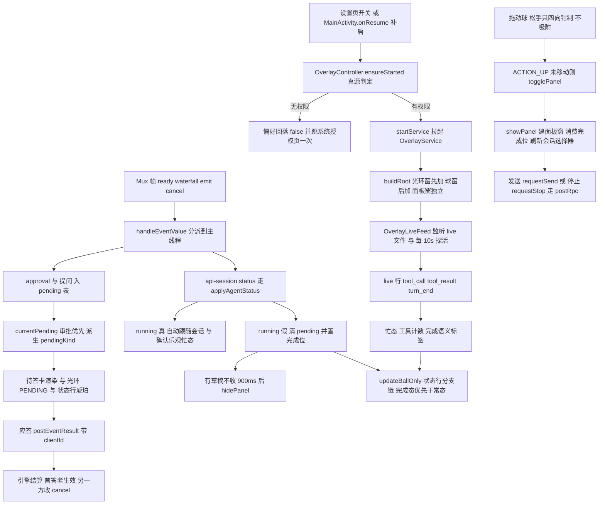
```mermaid
flowchart TD
  A["设置页开关 或 MainActivity.onResume 补启"] --> B["OverlayController.ensureStarted 真源判定"]
  B -->|"无权限"| C["偏好回落 false 并跳系统授权页一次"]
  B -->|"有权限"| D["startService 拉起 OverlayService"]
  D --> E["buildRoot 光环窗先加 球窗后加 面板窗独立"]
  E --> F["OverlayLiveFeed 监听 live 文件 与 每 10s 探活"]
  G["拖动球 松手只四向钳制 不吸附"] --> H["ACTION_UP 未移动则 togglePanel"]
  H --> I["showPanel 建面板窗 消费完成位 刷新会话选择器"]
  J["Mux 帧 ready waterfall emit cancel"] --> K["handleEventValue 分派到主线程"]
  K --> L["approval 与 提问 入 pending 表"]
  L --> M["currentPending 审批优先 派生 pendingKind"]
  M --> N["待答卡渲染 与 光环 PENDING 与 状态行琥珀"]
  K --> O["api-session status 走 applyAgentStatus"]
  O --> P["running 真 自动跟随会话 与 确认乐观忙态"]
  O --> Q["running 假 清 pending 并置完成位"]
  Q --> R["有草稿不收 900ms 后 hidePanel"]
  F --> S["live 行 tool_call tool_result turn_end"]
  S --> T["忙态 工具计数 完成语义标签"]
  I --> U["发送 requestSend 或 停止 requestStop 走 postRpc"]
  N --> V["应答 postEventResult 带 clientId"]
  V --> W["引擎结算 首答者生效 另一方收 cancel"]
  T --> X["updateBallOnly 状态行分支链 完成态优先于常态"]
  Q --> X
```

#### K10 通知中心

- **一句话**：把引擎的两条事件信道（文件 `.notify.ndjson` + WS waterfall）渲染成五类系统通知，并把用户在通知栏里做的回答/授权经耐久队列投回引擎（`$events/result`）。
- **入口/触发**：① 文件信道：引擎只写 `todo` / `report` 两行（`plugins/dsh-android-bridge/src/index.ts:1593` / `:1612`），`NotifyStore.start` 的 FileObserver（`NotifyStore.kt:90`）与启动 drain（`:99`）消费；② WS 信道：`NotifyBridge.onFrame`（`NotifyBridge.kt:165`）收 `ready` / `waterfall` / `cancel` 三种帧，承载 question / approval；③ 用户动作：通知栏回复/选项/批准/拒绝/重试广播 → `NotifyActionReceiver.onReceive`（`NotifyActionReceiver.kt:82`）；④ 设置面：`AndroidBridge.getNotifySetting/setNotifySetting`（`AndroidBridge.kt:372` / `:381`）→ `NotifyCenter.settingsSnapshot/applySetting`（`NotifyCenter.kt:248` / `:276`）；⑤ 常驻拉起：`EngineService.onCreate`（`EngineService.kt:40-41`）。
- **运行顺序**：进程启动 → `EngineService.onCreate` → `NotifyStore.start`（装 `ShellListener`、跑存量抑制迁移、挂 FileObserver、启动即 drain 一次）→ `NotifyBridge.start`（建 MuxClient 流、`NotifyDecisionQueue.ensureScheduled` 重评滞留决策、起心跳线程）。事件到达 → `drain` 读偏移 → `drainBytes` 取完整行 → 推进偏移 → 逐行 `dispatch`（置 `notifyChannelActive`、登记 `lastReportLineRaw`、打延迟点）→ `notifyEvent` → `deliverEvent`：kind 分流（`resolve` 撤通知即终态）→ 类别门 → 权限门 → report 抑制门 → `formDecision` 定形态 → `channelFor` 解析渠道 → `notify()` → 探针 `result=`。WS 到达 → `handleValue`：`ready` 换代并 3s 后对账过期 pending + 后台线程补投决策队列；`waterfall` 登记 pending 并投递提问/审批；`cancel` 走 `markSettled → settleInteractive`（重投后撤）。用户点动作 → `outcomeFor` 构造协议 outcome → `enqueue` 落盘 → 幂等热身 `NotifyStore.start`/`NotifyBridge.start` → `goAsync` + 后台线程 `flush → postResult` → 成功本地结算 / 失效或失败走 `postDeliveryFailure` 可见态。跑完交给谁：成功投递交给系统通知栏与 `NotifyProbe` 记账；决策交给引擎网关；失败交给可见的「提交失败，点击重试」条目。
- **嵌套与线程**：最多三层。主线程（服务回调）：`EngineService.onCreate → NotifyStore.start → drain → dispatch → notifyEvent → NotificationManager.notify`（含文件 IO 与 prefs 写，同步跑在 onCreate 里）。FileObserver 回调线程：`onEvent → drain → dispatch → notifyEvent`；MuxClient 读线程：`onFrame → handleValue → notifyEvent`，其 `ready` 分支把 3s 对账 `handler.postDelayed` 抛回主线程。动作广播主线程：`onReceive → outcomeFor → NotifyDecisionQueue.enqueue` 只落盘，重活交 `goAsync` + 后台线程 `flush → postResult`（同步 HTTP，禁主线程）。定时器：`scheduleRetry` 与 `scheduleTick` 都挂主线程 Handler，前者再起后台线程 flush、后者在主线程直接 flush；`NotifyBridge` 心跳是独立 daemon 线程 `notify-probe`。结算：`settleInteractive` 在主线程 notify，400ms 后再 cancel。
- **耦合**：偏好文件 `dsh-notify`（`NotifyCenter.PREFS`，`NotifyCenter.kt:33`）被四处共用——`channelsInitialized` / `channel.<category>`（`:34-35`）、`suppressForeground` + `suppressForegroundSchema` + `suppressForegroundLegacy`（`:36` / `:55` / `:59`，读写方都是 NotifyCenter）、`notify.offset`（`NotifyStore.KEY_OFFSET`，`NotifyStore.kt:34`）、`notify.markerOffset`（`WatchdogV2.kt:29`，经 `NotifyCenter.prefs(context)` 读写，`WatchdogV2.kt:236` / `:243`）。落盘面：`files/notify-decisions.ndjson`（`NotifyDecisionQueue.kt:28`，>256KB 压缩）、`files/notify-responder.log`（`NotifyProbe.kt:21`，>128KB 清空）、`files/home/.dsh/.notify.ndjson` 与 `.1` 残段、`.task-done.ndjson`（`NotifyStore.kt:27-29`）。引擎契约：`plugins/dsh-android-bridge/src/index.ts:1457-1479`（写盘 + 512KB 轮转；`kind` 是唯一分类权威）、`notify-projection.ts:55` / `:79`（outcomeLabel / popup 判定）；引擎侧插件权威源在协调仓同名路径，apk 仓为逐字节镜像（本轮 md5 核对一致）。双流：`NotifyBridge.STREAM_ID = "dsh-notify-responder"`（`NotifyBridge.kt:28`）与 `OverlayPanel` 的 `eventsClientId` 是两条独立 `$events` 流，同一 waterfall 事件分别落在 `NotifyBridge.pending`（`:66`）与 `OverlayPanel.pendingQuestions/pendingApprovals`（`OverlayPanel.kt:69-70`）。其它：`Face` 候选 ID 落 `channel.<category>`（`NotifyCenter.kt:84-103`）、固定 ID `ID_WATCHDOG/ID_TODO`（`:62-63`）、反馈面 `ShellListener` 只依赖 `OverlayService.instance` + `flashStatus`（`OverlayService.kt:683`）、桥面 `AndroidBridge.getNotifySetting/setNotifySetting` → 页面 `dsh-client-ui-responsive/src/client/dev-section/notify-settings.tsx`（`applied !== true` 不置位）。
- **关键坐标**：
  - `app/src/main/java/com/dsharnessmobile/shell/NotifyCenter.kt:49` 抑制默认值常量（`DEFAULT_SUPPRESS_FOREGROUND = false`）
  - `app/src/main/java/com/dsharnessmobile/shell/NotifyCenter.kt:336` 渠道三态纯函数 `selectChannel`；`:357` / `:374` 映射读取与落 prefs
  - `app/src/main/java/com/dsharnessmobile/shell/NotifyCenter.kt:528` 唯一投递入口 `notifyEvent`（异常边界）；`:570` 唯一抑制判定
  - `app/src/main/java/com/dsharnessmobile/shell/NotifyStore.kt:215` `drain`；`:246` 偏移先推进再投递
  - `app/src/main/java/com/dsharnessmobile/shell/NotifyBridge.kt:200` 帧分发 `handleValue`；`:307` `postResult`（`:339-346` 404/410→STALE）
  - `app/src/main/java/com/dsharnessmobile/shell/NotifyActionReceiver.kt:51` outcome 闭集 `outcomeFor`；`:82` `onReceive`（只落盘 + 一次快速 flush）
  - `app/src/main/java/com/dsharnessmobile/shell/NotifyDecisionQueue.kt:266` NOT_READY 处置；`:292` `flush`
  - `app/src/main/java/com/dsharnessmobile/shell/NotifySuppressQueue.kt:119` 补投 `flush`；`:153` 自续 tick
- **不变量**：
  1. `kind` 是唯一分类权威、六类闭集，未知 kind 显式忽略并记账（`NotifyCenter.kt:543-556`）；`resolve` 只撤提问/审批通知（`:640-648`）。
  2. 渠道 importance 应用不可调高：弹窗类首次必须 HIGH 建，候选 ID 序列是唯一迁移手段，选中项落 `channel.<category>` 后只读映射（`NotifyCenter.kt:361-371`）。违反＝弹窗类永久只能静默，只能换新候选 ID 救。
  3. 前台抑制只作用于 `report`、默认关闭；提问/审批永不因前台抑制丢弃，引擎 `popup=false` 也不能把它们静默（`NotifyCenter.kt:520` / `:567-577`）。类别开关（`cat.*`）、权限、渠道全降级是三条硬拒发路径，每条都有独立记账串（表驱动锁死见 `NotificationContractTest.kt:242`）。
  4. 经 RemoteInput 回复过的通知受平台 `LIFETIME_EXTENDED_BY_DIRECT_REPLY` 保护，直接 `cancel()` 无效：必须先同 `(tag,id)` 重投再撤（`NotifyCenter.kt:669-701`），否则通知撤不掉、回复框可再点。
  5. 动作 receiver 的权限面＝manifest `android:exported="false"`（`app/src/main/AndroidManifest.xml:98-104`）+ 显式 `Intent(app, NotifyActionReceiver::class.java)`（`NotifyCenter.kt:843`）：外部应用无法构造有效动作（只有同 UID 能投递到它），唯一 `FLAG_MUTABLE` 的回复动作仍是显式 Intent，不存在 intent redirection 面；主 WebView 桥面也没有任意广播出口。outcome 是闭集 `allowed-once` / `rejected` / `answers`。
  6. 决策先落盘再投递、状态只追加（`NotifyDecisionQueue.kt:192-231`），读侧 `fold` 折叠；`requestId = sha1(eventId|kind|outcome)` 前 16 位 ⇒ 同一次点击重复触发只投一次；`SUBMITTED/SETTLED/EXPIRED` 不再重投，`FAILED` 仍可被后续 flush 重投（设计如此，见计划 §6.7.7）。
  7. 消费是 at-most-once：`drain` 先写偏移再 dispatch（`NotifyStore.kt:246-247`），投递失败、被抑制、进程死亡都不会重放该行——延后队列是唯一补偿面。
  8. 所有 `NotifyCenter.Result` 取值必须各有互不相同的记账串（`NotificationContractTest.kt:242`），`notifyEvent` 与 `onFrame` 都不得把异常冒到读线程（`:292`）。
- **症状 → 排查**：
  1. 「前台仍然收不到工作汇报」：`run-as cat shared_prefs/dsh-notify.xml | grep suppressForeground`；再 `grep -E "suppressForeground (set to|migration)" files/notify-responder.log` 看是 `explicit=true`（磁盘被显式写成开）还是 `implicit`（走新默认 false）。
  2. 「汇报只在划到后台后才弹」：`grep -E "result=SUPPRESSED_FOREGROUND|suppress deferred|suppress deferred flushed" files/notify-responder.log`；只有 `deferred` 没有 `flushed` ⇒ 延后条目随进程一起没了（见可疑点 2）。
  3. 「点了批准/回复没反应」：`run-as cat files/notify-decisions.ndjson` 看该 `requestId` 的 `state` 与 `waitAttempts`；再 `grep -E "decision (queued|waiting|delivered|failed)|NOT_READY budget"`——注意这些行默认落空（见可疑点 1），只能靠 decisions 文件本身。
  4. 「引擎重启后点旧通知」：`grep "settle re-post ok"` 有行、decisions 是 `submitted`，但引擎侧无动作 ⇒ 网关对未知 eventId 的 200 no-op 路径（NT-17），不是投递成功。
  5. 「渠道显示已降级、在系统设置里调回高优仍静默」：`run-as cat shared_prefs/dsh-notify.xml | grep "channel\."`，值为空串即降级态被固化（见可疑点 5）；端到端连通性另用 `grep -E "responder started|ready gen=|waterfall event=|notify: kind=" files/notify-responder.log` 四段判定，心跳行 `alive ready= frames= waterfalls= pending=` 判流是否活着。
- **可疑点**：
  1. 决策链与动作链的记账**只走 `LogCollector`**（`NotifyDecisionQueue.kt:194/200/229/271/281/299/316/334/338/367/382/388`、`NotifyActionReceiver.kt:89/101/110/119/127`），而 `LogCollector.log` 在采集器未开时直接 return（`LogCollector.kt:785`，闸门 `MainActivity.kt:1167` 缺键即 false）⇒ 默认设备上「点了动作 → 是否落盘 → 是否投递成功」全链路零可观测面，`files/notify-responder.log` 里没有任何 decision 行（只有 `NotifyBridge` 的 waterfall/ready/cancel 行）。这与已修的 J-2（`NotificationContractTest.kt:206` 要求投递结果改走 `NotifyProbe`）是同一族缺陷，只是当时只修了 `NotifyStore`。影响：用户报「批准没生效」时无法从设备取证。
  2. `NotifySuppressQueue` 是**纯进程内** `@Volatile List`（`NotifySuppressQueue.kt:83`），而 `drain` 早已推进字节偏移（`NotifyStore.kt:246`）⇒ 命中抑制后进程被回收（后台被杀的常见场景）即永久丢该条，与 FIX-1「抑制＝延后而非丢弃」的承诺只对存活进程成立。已登记：评审 `N-8`（`coord:docs/COMPAT-REVIEW-0.14.0-2026-09-19.md:1238`，锚点正是 `NotifySuppressQueue.kt:83` 与 `:153-167`）与 `H-17`（`coord:docs/0.14.1-REVIEW-CHECKLIST-PROGRESS.md:94`），修法为落盘 sidecar + 启动恢复。
  3. `PostStatus.STALE` 分支（`NotifyDecisionQueue.kt:323-327`，404/410 才触发）在本版本**不可达**：设备实测网关对未知 eventId 返回 200 no-op（`coord:docs/0.14.0-preview-ACCEPTANCE-LEDGER.md:177` 的 NT-17 注、`coord:docs/NEXT-ITERATION-PLAN-2026-09-12.md:1440` NT-17B）⇒ 旧事件会被判 `OK`、标记 `submitted` 并本地撤通知（`NotifyDecisionQueue.kt:310-316`），用户以为答复已提交而引擎从未收到，「该请求已失效」文案永不出现。已登记为未决项，未证实有壳侧可行替代信号（评审建议查 cancel 帧）。
  4. FIX-2 的可见反馈面是 `OverlayService.flashStatus`，而它要求面板展开且只闪现 2.5s（`OverlayService.kt:683-692` 的 `if (expanded)` 守卫，坑 148 已记该可见性条件）⇒ 「通知已延后」「通知未授权」这类提示在面板收起（最需要提示的前台场景）时依然不可见，`ShellListener`（`NotifyCenter.kt:137-159`）只解决了「零实现」，没解决「不可见」。影响：开启抑制后用户仍可能观察到「什么都没发生」。
  5. 渠道降级结果被**空串固化**：`resolveChannel` 把 `chosen = null` 写成 `channel.<category> = ""`（`NotifyCenter.kt:392-395`），`channelFor` 命中已初始化标记后直接 `stored.ifEmpty { null }` 返回、不再复查 `getNotificationChannel`（`:361-371`）；`selectedCache` 同进程内同样固化。用户按自检页文案去系统设置把 importance 调回高优后，应用仍永久判「已降级为静默」并只发静默条目（`:443-463` 文案继续报降级）——除非清数据或换新候选 ID。源码级可判，本轮无设备复现。
漂移：
- 漂移：`docs/AGENTS/ARCHITECTURE.md:70` 说 `NotifyCenter.kt` 834 行，源码（`wc -l`）是 1051 行。
- 漂移：`docs/AGENTS/ARCHITECTURE.md:71` 说 `NotifyStore.kt` 287 行，源码是 330 行。
- 漂移：`docs/AGENTS/ARCHITECTURE.md` 模块表缺 `NotifySuppressQueue.kt`（0.14.1 新增，只在 `docs/AGENTS/modules.md:36` 有条目）。
- 漂移：`app/src/main/java/com/dsharnessmobile/shell/OverlayReport.kt:233-234` 注释说与 `notify-projection.ts` 的 `reportOutcomeLabel` **逐字同构**，实际 `interrupted` 文案不同——`plugins/dsh-android-bridge/src/notify-projection.ts:68` 是「被中断（进程重启）」，`OverlayReport.kt:244` 与 `NotifyCenter.kt:1041` 是「被中断」。
- 漂移：`app/src/main/java/com/dsharnessmobile/shell/NotifyCenter.kt:133` 注释指向 `OverlayService.kt:669` 的 `flashStatus`，实际在 `OverlayService.kt:683`。
- 漂移：`app/src/main/java/com/dsharnessmobile/shell/OverlayService.kt:706` 注释说先例在 `NotifyCenter.kt:605-606`，实际 `Intent(app, MainActivity::class.java)` 在 `NotifyCenter.kt:822`（605-606 是 `deferredKey` 的注释）。
- 漂移：`plugins/dsh-android-bridge/src/index.ts:1458` 注释说「壳侧 FileObserver 按偏移消费后截断/轮转」，实际壳侧只读不截断不轮转（`NotifyStore.kt:18-20` 明写「引擎超过 512KB 时轮转 .1」，轮转方是引擎）。
- 漂移：`docs/0.14.1-preview-NOTIFY-REALTIME-AND-STATE-SYNC.md` §0/§1.2 仍用旧行号（`:377` 抑制判定、`:114` 默认值、`:88-97` Listener、`:307-311` Result），当前源码对应 `NotifyCenter.kt:570`、`:49` / `:191`、`:111-120`、`:500-504`。

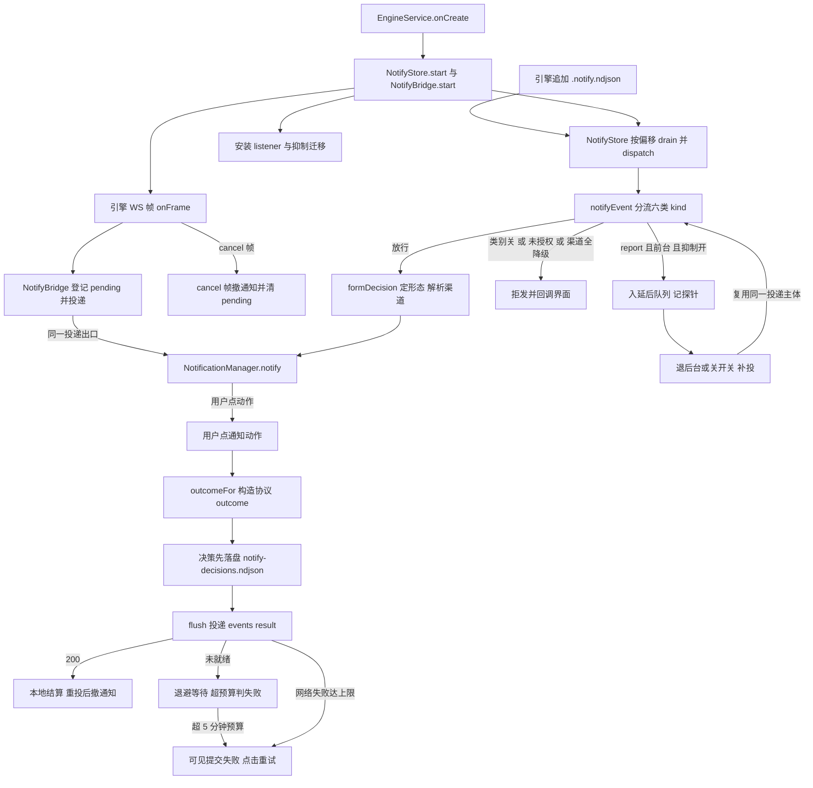
```mermaid
flowchart TD
  A["引擎追加 .notify.ndjson"] --> B["NotifyStore 按偏移 drain 并 dispatch"]
  B --> C["notifyEvent 分流六类 kind"]
  D["引擎 WS 帧 onFrame"] --> E["NotifyBridge 登记 pending 并投递"]
  E -->|"同一投递出口"| M
  D -->|"cancel 帧"| N["cancel 帧撤通知并清 pending"]
  F["EngineService.onCreate"] --> G["NotifyStore.start 与 NotifyBridge.start"]
  G --> B
  G --> D
  G --> H["安装 listener 与抑制迁移"]
  C -->|"report 且前台 且抑制开"| I["入延后队列 记探针"]
  I --> J["退后台或关开关 补投"]
  J -->|"复用同一投递主体"| C
  C -->|"类别关 或 未授权 或 渠道全降级"| K["拒发并回调界面"]
  C -->|"放行"| L["formDecision 定形态 解析渠道"]
  L --> M["NotificationManager.notify"]
  M -->|"用户点动作"| O["用户点通知动作"]
  O --> P["outcomeFor 构造协议 outcome"]
  P --> Q["决策先落盘 notify-decisions.ndjson"]
  Q --> R["flush 投递 events result"]
  R -->|"200"| S["本地结算 重投后撤通知"]
  R -->|"未就绪"| T["退避等待 超预算判失败"]
  T -->|"超 5 分钟预算"| U["可见提交失败 点击重试"]
  R -->|"网络失败达上限"| U
```

#### K11 Kotlin 单测面

- **一句话**：壳侧 49 个测试源文件（50 个测试类、456 例）在纯 JVM 上钉住壳侧行为与调用点，由「逐类用例数 + 缺席 + 新鲜度」三重基线反回归门禁防止防线被悄悄删掉。
- **入口/触发**：执行入口 `cd dsh-mobile-apk && gradlew :app:testDebugUnitTest`（CI 在 `.github/workflows/pr-gate.yml:140`）；判据入口 `node scripts/check-kotlin-test-count.mjs`（打包链 `scripts/build-apk.mjs:197`、`scripts/build-apk-013.ps1:145` 带 `--allow-missing`；发布链经 `scripts/check-release-gates.mjs:104` 聚合，登记 `ci: false`）。本块不被任何产品路径触发，只在验证/打包/发布链里跑。
- **运行顺序**：改壳侧源码或测试 → 手动或 CI 跑 gradle 单测 → Gradle 写出 `app/build/test-results/testDebugUnitTest/TEST-*.xml` → 打包链在 gradle **之前**执行数量门禁（`scripts/build-apk.mjs:197`）：通过则继续 `:app:assembleDebug` 出产物；无结果则打印 `SKIP(#1)` 计数（不计入绿）；判红则整条链拒绝打包。CI 只跑 gradle 那一步并把报告作为工件上传（`.github/workflows/pr-gate.yml:143-147`），**不跑**数量门禁。
- **嵌套与线程**：三层。① 外层：Gradle 测试任务在独立 worker JVM 里执行（JDK 17，非设备进程；`app/src/test/java/com/dsharnessmobile/shell/ApiLevelGuardTest.kt:17` 自述「宿主机 JDK 面 ⊃ 设备 API 面」的系统性盲区）；② 中层：JUnit4 逐类、逐方法反射调用被测代码，方法序不保证（`app/src/test/java/com/dsharnessmobile/shell/WatchdogLadderTest.kt:21` 用 `@Before` 调 `WatchdogV2.reset()` 清全局单例）；③ 内层：`app/src/test/java/com/dsharnessmobile/shell/ProcIoTest.kt:99` 会 spawn 真实子进程（Windows 走 `cmd.exe` + `ping`，Linux 走 `/bin/sh` + `sleep`）并用排水线程读管道；其余测试均为单线程同步调用。门禁脚本本身是 node 单线程同步读文件，无网络、无设备。
- **耦合**：`scripts/kotlin-test-baseline.json` 的 `testsByClass`（50 个键）与 `totalTests = 456`（只许升，`--update-baseline` 拒绝降档）；`app/build.gradle.kts:88` 的 `unitTests.isReturnDefaultValues`（android.* 一律打桩成默认值）；`scripts/check-kotlin-test-count.mjs:71-92` 的「文件里 `class XxxTest` → 类名」映射与 `:57` 的结果目录常量；11 个测试文件直接读主源文本（`File("src/main/java/com/dsharnessmobile/shell/...")`，依赖 Gradle 默认工作目录 = `app/`）；报表资源 `app/src/test/resources/protocol-v2/*.json`、`app/src/test/resources/screen-scope/screen-scope-cases.json`（分别由 `scripts/gen-protocol-v2-fixture.mjs`、`scripts/gen-screen-scope-fixture.mjs` 生成）；跨仓读取 `../plugins/dsh-android-bridge/src/index.ts`、`../dsh-client-ui-responsive/src/client/*`、`dsh-host-web-compat/lib/index.js`；`WatchdogV2` 的静态计数器与 offset 是跨用例共享状态。
- **关键坐标**：
  - `app/build.gradle.kts:88`（`unitTests.isReturnDefaultValues = true`，本目录一切 android.* 断言的假绿总闸）
  - `scripts/check-kotlin-test-count.mjs:124`（`evaluate`，判据 A/B 与失败用例断言）
  - `scripts/check-kotlin-test-count.mjs:137`（新鲜度：XML mtime 必须晚于最新测试源码）
  - `scripts/kotlin-test-baseline.json:3`（`totalTests = 456`，逐类下限的权威值）
  - `.github/workflows/pr-gate.yml:140`（唯一产出单测结果的执行点）
  - `scripts/build-apk.mjs:197`（唯一消费结果的打包入口，`--allow-missing`）
  - `app/src/test/java/com/dsharnessmobile/shell/ApiLevelGuardTest.kt:240`（反证主判据：Java Stream `.toList()` 必须判红）
  - `app/src/test/java/com/dsharnessmobile/shell/SnapshotUserDataTest.kt:84`（`assumeTrue(..., false)` = 唯一会让用例静默跳过的点）
- **不变量**：① 每个已跟踪测试源里声明的 `*Test` 类都必须在结果中出现（违反 = 防线整体消失，判红并点名）；② 逐类用例数不得低于基线、总数不得低于 456（违反 = 用例被成批删/`@Test` 被摘，判红）；③ 结果 XML 必须晚于最新测试源码（违反 = 陈旧报告，判红）；④ 结果里不得有 failures/errors（skipped **不判**）；⑤ 测试工作目录必须是 `app/`（否则读主源路径的契约用例抛 `AssertionError` 判红，而不是跳过）；⑥ 基线只许升。
- **症状 → 排查**：
  1. `CHECK-KOTLIN-TEST-COUNT FAILED：缺 Kotlin 单测结果 app/build/test-results/testDebugUnitTest` → 该目录不存在（本轮从未跑过 gradle 单测）；先 `gradlew :app:testDebugUnitTest`；无 gradle 环境用 `--allow-missing` 得到 `SKIP(#1)`。
  2. 判红「结果陈旧（早于测试源码）」→ 判据按**最新一个**测试源文件的 mtime 比**每个** XML，改任意一个 `app/src/test/java/com/dsharnessmobile/shell/*.kt` 后没重跑就全体判陈旧（不是只红那一个类）。
  3. 判红「测试类缺席结果」→ `grep -rn "class .*Test" app/src/test/java/com/dsharnessmobile/shell` 与 `app/build/test-results/testDebugUnitTest/` 的文件名对账；真因通常是类被改名、文件被删、漏编译。
  4. 判红「用例数低于基线」→ 逐类对比 `scripts/kotlin-test-baseline.json` 与 XML 的 `tests="N"` 属性；新增用例只出 `NOTE 新增测试类（可升基线）`，用 `--update-baseline` 升档（降档会被拒）。
  5. 怀疑有用例根本没执行 → `grep -c "<skipped" app/build/test-results/testDebugUnitTest/*.xml`（当前仅 1 例：`SnapshotUserDataTest` 的符号链接假设）+ `grep -rn "assumeTrue\|?: return$" app/src/test/java/com/dsharnessmobile/shell/` 找静默跳过点。
  6. 明明跑过 gradle 却报「缺结果」→ 看 `scripts/check-kotlin-test-count.mjs:106` 的 `<testsuite name= tests= skipped= failures= errors=` **属性顺序**正则是否仍匹配 gradle 新格式（失配时结果被整体视为不存在，报错文案会指错方向，但仍是判红而非假绿）。
- **可疑点**：
  1. 已确认：**判据的产出者与消费者分属两条链**。唯一产出结果的执行点是 `.github/workflows/pr-gate.yml:140`（CI 跑 gradle），而数量门禁只在打包/发布链里（`scripts/build-apk.mjs:197`、`scripts/build-apk-013.ps1:145`，均 `--allow-missing`；`scripts/check-release-gates.mjs:104` 登记 `ci: false`），CI 里的 `check-release-gates.mjs`（`.github/workflows/pr-gate.yml:91`）不带 `--run`，只断接线不跑门禁。且两条构建链自己只跑 `:app:assembleDebug`（`scripts/build-apk.mjs:347`、`scripts/build-apk-013.ps1:388`），从不跑 `:app:testDebugUnitTest`。影响：CI 里删掉一个测试类（gradle exit 仍 0）全绿，本地链则只能读到上一次手动跑留下的 XML——改了测试源码就判陈旧。两半防线各自成立，但没有一条链同时具备「产出 + 判据」。
  2. 已确认：`app/build.gradle.kts:88` 的 `unitTests.isReturnDefaultValues = true` 把 android.* 打桩成 0/null/false。本目录已有两条针对性反桩判据（`app/src/test/java/com/dsharnessmobile/shell/CallSiteContractTest.kt:294` 禁 `Color.argb`、`app/src/test/java/com/dsharnessmobile/shell/OverlayHaloInvariantTest.kt:92` 要求四态色互不相同），说明风险真实；将来任何新增的 android.graphics/Log 断言会静默恒真。已确认配置在场；未证实本目录还存在其它被桩恒真的断言（49 文件逐个读过，除 `app/src/test/java/com/dsharnessmobile/shell/NotifyCenterChannelTest.kt:33` 的常量同义反复外未发现）。
  3. 已确认：`app/src/test/java/com/dsharnessmobile/shell/SnapshotUserDataTest.kt:84` 在宿主不允许建符号链接时 `assumeTrue(..., false)` → 整例被 JUnit 假设失败跳过；而 `scripts/check-kotlin-test-count.mjs:143-147` 只对 failures/errors 判红，**不判 skipped**，基线仍按 5 例计。现场件：`app/build/test-results/testDebugUnitTest/` 下该类的 XML `skipped="1"`，即当前 456 例里实际执行 455 例（总数与基线比对完全一致，这个 skip 不会被任何判据点出来）。
  4. 已确认（自述）：`app/src/test/java/com/dsharnessmobile/shell/SnapshotTransactionTest.kt:319` 的回滚兜底用例自认「删掉兜底本用例仍然全绿」——「live 删不净仍能放回」这一分支在 JVM 上不可能被触发，判据没有牙，真证据只在设备（16384 覆盖安装实测）。影响：这条 P0 恢复路径的单测给不出保护，回归只能靠设备门禁。
  5. 已确认（自述）：`app/src/test/java/com/dsharnessmobile/shell/WatchdogMarkerConsumeTest.kt:45-61` 的 `consumeAll` 与 `app/src/test/java/com/dsharnessmobile/shell/BootPageConsoleRouteTest.kt:114-122` 的 `extractRuntimeForTest` 都是**在测试里复刻生产算法**，断言跑的是复刻件；守真实实现的只有同文件里的源码文本断言（`app/src/test/java/com/dsharnessmobile/shell/WatchdogMarkerConsumeTest.kt:159`）。生产循环改了而文本形态未变 → 复刻件照样全绿。

| 测试文件 | 被测块（K01..K10 或写「横切」） | 守什么不变量（≤25 字） | 关键断言坐标 | 假绿风险（无 / 具体原因） |
|---|---|---|---|---|
| app/src/test/java/com/dsharnessmobile/shell/AcceptRoutingTest.kt | 横切 | 仅纯图片 accept 进相册，其余退 SAF | app/src/test/java/com/dsharnessmobile/shell/AcceptRoutingTest.kt:24,app/src/test/java/com/dsharnessmobile/shell/AcceptRoutingTest.kt:45 | 无（纯函数，混合/空/扩展名/大小写反例齐备） |
| app/src/test/java/com/dsharnessmobile/shell/AdbLiveProbeTest.kt | 横切 | TTL 内复用、过期重探、失败不遮盖 | app/src/test/java/com/dsharnessmobile/shell/AdbLiveProbeTest.kt:18,app/src/test/java/com/dsharnessmobile/shell/AdbLiveProbeTest.kt:60 | 无（含真实 loopback ServerSocket 正反对照；时钟可注入） |
| app/src/test/java/com/dsharnessmobile/shell/ApiLevelGuardTest.kt | 横切 | 壳侧源码不得用高于 minSdk 的平台 API | app/src/test/java/com/dsharnessmobile/shell/ApiLevelGuardTest.kt:209,app/src/test/java/com/dsharnessmobile/shell/ApiLevelGuardTest.kt:282 | 白名单式静态断言（自述）：只证明清单内 API 不出现，清单外越级 API 全漏；扫描面靠「>5000 行 + 指定文件在场」自证，门槛是硬编码数字 |
| app/src/test/java/com/dsharnessmobile/shell/ApkArtifactCheckTest.kt | 横切 | 缓存与下载两分支产物判定一致 | app/src/test/java/com/dsharnessmobile/shell/ApkArtifactCheckTest.kt:25,app/src/test/java/com/dsharnessmobile/shell/ApkArtifactCheckTest.kt:36 | 有：`:36-40` 所谓「两分支」是**同一个函数、同一组实参调用两次**再断言相等，恒等恒真；真正的两分支同源由 `app/src/test/java/com/dsharnessmobile/shell/W3ShellContractTest.kt:85` 的源码文本断言守 |
| app/src/test/java/com/dsharnessmobile/shell/BackGateTest.kt | 横切 | 三输入回退判定与页面脚本契约 | app/src/test/java/com/dsharnessmobile/shell/BackGateTest.kt:21,app/src/test/java/com/dsharnessmobile/shell/BackGateTest.kt:126 | 低：桥方法用反射取 `setAvailable/getBackAvailable` 查注解，改签名即红；脚本常量逐字断言（改文案判红，属假红不属假绿） |
| app/src/test/java/com/dsharnessmobile/shell/BootFailLogTest.kt | 横切 | 失败终态必落盘、一条一行、字段不留空 | app/src/test/java/com/dsharnessmobile/shell/BootFailLogTest.kt:39,app/src/test/java/com/dsharnessmobile/shell/BootFailLogTest.kt:160 | 中：前半用 TemporaryFolder 真写真读；后半（`:160-190`）是源码文本在场断言，「失败调用点接了 5 处」只在设备上见真章 |
| app/src/test/java/com/dsharnessmobile/shell/BootPageConsoleRouteTest.kt | 横切 | 页面控制台前缀分流与 runtime 取值 | app/src/test/java/com/dsharnessmobile/shell/BootPageConsoleRouteTest.kt:39,app/src/test/java/com/dsharnessmobile/shell/BootPageConsoleRouteTest.kt:113 | 有：`:114` 的 `extractRuntimeForTest` 复刻生产取值算法（注释自认「同一算法两处实现会漂移」）；另 `:169` 在页面侧文件缺席时 `?: return` = 静默跳过该用例 |
| app/src/test/java/com/dsharnessmobile/shell/BrowserHostCleartextConsistencyTest.kt | 横切 | 准入放行明文 ⇔ 平台 NSC 撑开明文 | app/src/test/java/com/dsharnessmobile/shell/BrowserHostCleartextConsistencyTest.kt:42,app/src/test/java/com/dsharnessmobile/shell/BrowserHostCleartextConsistencyTest.kt:49 | 低：真解析 NSC 本体 + 真调 `normalize`；但「非回环明文」只取两条样本地址，样本外的同向性无覆盖 |
| app/src/test/java/com/dsharnessmobile/shell/BrowserHostNavigationPolicyTest.kt | 横切 | 回环等价写法一律拒、公网重建规范 host | app/src/test/java/com/dsharnessmobile/shell/BrowserHostNavigationPolicyTest.kt:10,app/src/test/java/com/dsharnessmobile/shell/BrowserHostNavigationPolicyTest.kt:62 | 无（纯函数，含 17 条回环等价反例与 UTF-8 往返） |
| app/src/test/java/com/dsharnessmobile/shell/BrowserOverlayContractTest.kt | 横切 | 可见性走保鲜期、hide 清两半记忆 | app/src/test/java/com/dsharnessmobile/shell/BrowserOverlayContractTest.kt:49,app/src/test/java/com/dsharnessmobile/shell/BrowserOverlayContractTest.kt:66 | 全为源码文本断言：`memberBody` 靠「下一个同级 `fun` 的固定缩进」切函数体，缩进/声明形态一变即误切（自述踩过）；语义等价重写可漏 |
| app/src/test/java/com/dsharnessmobile/shell/BrowserOverlayPolicyTest.kt | 横切 | 发布者过期即停画，幽灵覆盖层不复活 | app/src/test/java/com/dsharnessmobile/shell/BrowserOverlayPolicyTest.kt:27,app/src/test/java/com/dsharnessmobile/shell/BrowserOverlayPolicyTest.kt:43 | 无（纯函数，且自带 `legacyVisible` 旧实现作反向对照证明判据有判别力） |
| app/src/test/java/com/dsharnessmobile/shell/CallSiteContractTest.kt | 横切 | 调用点与真源表达式不得回退旧形态 | app/src/test/java/com/dsharnessmobile/shell/CallSiteContractTest.kt:54,app/src/test/java/com/dsharnessmobile/shell/CallSiteContractTest.kt:294 | 全为源码文本断言（含第二个类 `BootDiagnosticsContractTest`，同文件 `:494` 起）：同一形态仍有其它写法时文本在场即绿；颜色类断言专门规避了 `Color.argb` 桩（`:294-310` 逐字节钉 8 个字面量） |
| app/src/test/java/com/dsharnessmobile/shell/ControlProtocolV2Test.kt | 横切 | Kotlin 编码器与 TS 期望逐字段等价 | app/src/test/java/com/dsharnessmobile/shell/ControlProtocolV2Test.kt:50,app/src/test/java/com/dsharnessmobile/shell/ControlProtocolV2Test.kt:76 | 中：期望值来自仓库内已生成的 fixture（`app/src/test/resources/protocol-v2/expected-v2.json`）。TS 侧改了规则但不重跑 `scripts/gen-protocol-v2-fixture.mjs` → 本测试照样绿（跨语言契约已断）；跨语言那一半由 CI 的 `scripts/check-protocol-v2.mjs` 另行守 |
| app/src/test/java/com/dsharnessmobile/shell/DiagnosticsMirrorTest.kt | 横切 | 诊断镜像有界读且 token 必打码 | app/src/test/java/com/dsharnessmobile/shell/DiagnosticsMirrorTest.kt:20,app/src/test/java/com/dsharnessmobile/shell/DiagnosticsMirrorTest.kt:43 | 无（真实文件、真实 `mirrorLogBounded`，含「缺席源不写目标」反向用例） |
| app/src/test/java/com/dsharnessmobile/shell/EngineBootBudgetTest.kt | 横切 | 等待与剩余同源互补且非负单调 | app/src/test/java/com/dsharnessmobile/shell/EngineBootBudgetTest.kt:16,app/src/test/java/com/dsharnessmobile/shell/EngineBootBudgetTest.kt:28 | 无（纯函数按 250ms 步长扫全程） |
| app/src/test/java/com/dsharnessmobile/shell/EngineBootInstrumentationTest.kt | 横切 | 分段字段解析、未知一律显式 -1 | app/src/test/java/com/dsharnessmobile/shell/EngineBootInstrumentationTest.kt:20,app/src/test/java/com/dsharnessmobile/shell/EngineBootInstrumentationTest.kt:45 | 中：解析器逐字依赖引擎侧探针行格式；引擎改格式后解析器返回 null，判据从「有值」静默退化成「未知」而不是判红（gotchas 143/144 同型教训） |
| app/src/test/java/com/dsharnessmobile/shell/FactoryProfilePatchTest.kt | 横切 | 出厂语义纠正旧 disable 且幂等 | app/src/test/java/com/dsharnessmobile/shell/FactoryProfilePatchTest.kt:50,app/src/test/java/com/dsharnessmobile/shell/FactoryProfilePatchTest.kt:228 | 低：merge/repair 是真跑真文件内容；唯 `:228` 镜像文件缺席时 `return` = 静默跳过该用例 |
| app/src/test/java/com/dsharnessmobile/shell/FileIncomingCleanupTest.kt | 横切 | 拷贝/投递在途不得全清，元数据豁免 | app/src/test/java/com/dsharnessmobile/shell/FileIncomingCleanupTest.kt:17,app/src/test/java/com/dsharnessmobile/shell/FileIncomingCleanupTest.kt:25 | 无（纯函数；真实删除路径由源码契约在 W3ShellContractTest 守） |
| app/src/test/java/com/dsharnessmobile/shell/FileIncomingSafetyTest.kt | 横切 | 净化名与落点归属 fail-closed | app/src/test/java/com/dsharnessmobile/shell/FileIncomingSafetyTest.kt:25,app/src/test/java/com/dsharnessmobile/shell/FileIncomingSafetyTest.kt:92 | 无（真实临时目录 + canonical 归属断言，含 `..` 逃逸反例） |
| app/src/test/java/com/dsharnessmobile/shell/GlobalActionCatalogTest.kt | 横切 | 核心动作恒在、高版本动作双门放行 | app/src/test/java/com/dsharnessmobile/shell/GlobalActionCatalogTest.kt:25,app/src/test/java/com/dsharnessmobile/shell/GlobalActionCatalogTest.kt:50 | 无（用目录自身取 id，不与 SDK 常量脱钩） |
| app/src/test/java/com/dsharnessmobile/shell/LogRedactionTest.kt | 横切 | 日志出口 fail-closed，短令牌同样打码 | app/src/test/java/com/dsharnessmobile/shell/LogRedactionTest.kt:23,app/src/test/java/com/dsharnessmobile/shell/LogRedactionTest.kt:46 | 无（含把旧「短令牌不替换」断言刻意反转成 fail-closed 的反证） |
| app/src/test/java/com/dsharnessmobile/shell/LogRotationTest.kt | 横切 | rename 失败不得删旧代 | app/src/test/java/com/dsharnessmobile/shell/LogRotationTest.kt:24,app/src/test/java/com/dsharnessmobile/shell/LogRotationTest.kt:39 | 无（注入 rename/delete 原语，把「删不掉的更早一代」真造出来） |
| app/src/test/java/com/dsharnessmobile/shell/MuxHandshakeAuthTest.kt | 横切 | 仅 401/403 触发 cookie 强刷 | app/src/test/java/com/dsharnessmobile/shell/MuxHandshakeAuthTest.kt:17,app/src/test/java/com/dsharnessmobile/shell/MuxHandshakeAuthTest.kt:37 | 低：纯函数三例；「MuxClient 真按状态码分流」由 W3ShellContractTest 的源码断言补 |
| app/src/test/java/com/dsharnessmobile/shell/NotificationContractTest.kt | 横切 | 通知面接线可达且拒因可分辨 | app/src/test/java/com/dsharnessmobile/shell/NotificationContractTest.kt:81,app/src/test/java/com/dsharnessmobile/shell/NotificationContractTest.kt:170 | 大：33 例里多数是源码文本在场断言（成员存在 ≠ 被调用，正是本文件 `:170-203` 自述的「假绿」教训）；只有 `settingKeyKnown` 一条真跑，可达性靠跨仓文本对账 |
| app/src/test/java/com/dsharnessmobile/shell/NotifyActionOutcomeTest.kt | 横切 | 审批闭集两结局、空回复不入队 | app/src/test/java/com/dsharnessmobile/shell/NotifyActionOutcomeTest.kt:14,app/src/test/java/com/dsharnessmobile/shell/NotifyActionOutcomeTest.kt:53 | 无（逐字段断言，规避 org.json 键序不确定） |
| app/src/test/java/com/dsharnessmobile/shell/NotifyCenterChannelTest.kt | 横切 | 渠道 ID 与 importance 一次定死 | app/src/test/java/com/dsharnessmobile/shell/NotifyCenterChannelTest.kt:15,app/src/test/java/com/dsharnessmobile/shell/NotifyCenterChannelTest.kt:33 | 有一处恒真：`:33` 是 `IMPORTANCE_LOW.coerceAtMost(2) == 2` 的常量同义反复；importance 常量被编译期内联，不属 stubs 面（写错目标值仍会红） |
| app/src/test/java/com/dsharnessmobile/shell/NotifyDecisionQueueTest.kt | 横切 | requestId 幂等、退避封顶、重启后重评 | app/src/test/java/com/dsharnessmobile/shell/NotifyDecisionQueueTest.kt:16,app/src/test/java/com/dsharnessmobile/shell/NotifyDecisionQueueTest.kt:82 | 低：退避/预算两条用「常量 × 常量」断言（`:82-90` 部分近似同义反复），其余是真行为（序列化往返、fold、resumePlan） |
| app/src/test/java/com/dsharnessmobile/shell/NotifyFormDecisionTest.kt | 横切 | popup=false 必降级，交互类不降级 | app/src/test/java/com/dsharnessmobile/shell/NotifyFormDecisionTest.kt:14,app/src/test/java/com/dsharnessmobile/shell/NotifyFormDecisionTest.kt:26 | 无（纯函数）；「通知 ID 不占看门狗」用真 id 比对 |
| app/src/test/java/com/dsharnessmobile/shell/NotifyProtocolTest.kt | 横切 | 只消费完整行、偏移不按块长推进 | app/src/test/java/com/dsharnessmobile/shell/NotifyProtocolTest.kt:18,app/src/test/java/com/dsharnessmobile/shell/NotifyProtocolTest.kt:131 | 低：字节级真行为；`:131` 那条只断言开关初始语义与文件常量——「服役后不再投递」半边因 JVM 无 Context 而未测（注释自述） |
| app/src/test/java/com/dsharnessmobile/shell/NotifySuppressQueueTest.kt | 横切 | 同会话覆盖、TTL 过期、队列有界 | app/src/test/java/com/dsharnessmobile/shell/NotifySuppressQueueTest.kt:24,app/src/test/java/com/dsharnessmobile/shell/NotifySuppressQueueTest.kt:71 | 无（纯函数 + 边界值） |
| app/src/test/java/com/dsharnessmobile/shell/OverlayCompletionNoticeTest.kt | 横切 | 完成位置位/消费/复位与会话分桶 | app/src/test/java/com/dsharnessmobile/shell/OverlayCompletionNoticeTest.kt:28,app/src/test/java/com/dsharnessmobile/shell/OverlayCompletionNoticeTest.kt:113 | 无（纯 Kotlin 状态机，且 `:113-125` 明确替换掉了旧的无会话形参假断言） |
| app/src/test/java/com/dsharnessmobile/shell/OverlayHaloInvariantTest.kt | 横切 | 四态色值真可读且 ring 与 halo 同源 | app/src/test/java/com/dsharnessmobile/shell/OverlayHaloInvariantTest.kt:92,app/src/test/java/com/dsharnessmobile/shell/OverlayHaloInvariantTest.kt:192 | 几何恒等式自认「单独不是防线」（`:180-191`）：真正有牙的是「派生关系 + 边距下限」；色值断言恰好是防 `Color.argb` 被桩成 0 的假绿闸门 |
| app/src/test/java/com/dsharnessmobile/shell/ProcIoTest.kt | 横切 | 超时、排水超时、截断三态可区分 | app/src/test/java/com/dsharnessmobile/shell/ProcIoTest.kt:27,app/src/test/java/com/dsharnessmobile/shell/ProcIoTest.kt:82 | 低：桩 Process 造三态 + 真实子进程（`ping`/`sleep`）交叉验证；真实子进程部分引入平台与墙钟依赖 |
| app/src/test/java/com/dsharnessmobile/shell/ScreenScopeTest.kt | 横切 | 未知 wire 值一律 fail-closed | app/src/test/java/com/dsharnessmobile/shell/ScreenScopeTest.kt:8,app/src/test/java/com/dsharnessmobile/shell/ScreenScopeTest.kt:15 | 无（纯枚举判据） |
| app/src/test/java/com/dsharnessmobile/shell/ShellOpsScopeTargetTest.kt | 横切 | 目标屏 token 逐字保留、无注册表恒拒 | app/src/test/java/com/dsharnessmobile/shell/ShellOpsScopeTargetTest.kt:21,app/src/test/java/com/dsharnessmobile/shell/ShellOpsScopeTargetTest.kt:121 | 有：`:162` 的生产入口在 JVM 只能传 null context → 恒 fail-closed，放行分支靠另抽的纯判据（注释自述）；SF token 配对用的是设备夹具文本，非真实 dumpsys 产物 |
| app/src/test/java/com/dsharnessmobile/shell/ShellOpsScreenCommandFixtureTest.kt | 横切 | 两侧 screen-scope 判据共一份 fixture | app/src/test/java/com/dsharnessmobile/shell/ShellOpsScreenCommandFixtureTest.kt:44,app/src/test/java/com/dsharnessmobile/shell/ShellOpsScreenCommandFixtureTest.kt:54 | 中：fixture 由 `scripts/gen-screen-scope-fixture.mjs` 从插件侧同步；不重跑生成器则「两侧一致」只是旧事实（与 ControlProtocolV2Test 同型漂移风险） |
| app/src/test/java/com/dsharnessmobile/shell/SnapshotExtractorTest.kt | 横切 | 符号链接目标白名单与解压上限 | app/src/test/java/com/dsharnessmobile/shell/SnapshotExtractorTest.kt:18,app/src/test/java/com/dsharnessmobile/shell/SnapshotExtractorTest.kt:83 | 低：上限用可注入小值真跑（避免自造解压炸弹），并配正向对照防「恒拒」假绿 |
| app/src/test/java/com/dsharnessmobile/shell/SnapshotFileModeTest.kt | 横切 | 仅 ELF/shebang 视为可直接执行 | app/src/test/java/com/dsharnessmobile/shell/SnapshotFileModeTest.kt:7,app/src/test/java/com/dsharnessmobile/shell/SnapshotFileModeTest.kt:10 | 低：全目录唯一单例用例，纯字节判定，无分支遗漏风险但覆盖极薄 |
| app/src/test/java/com/dsharnessmobile/shell/SnapshotTransactionTest.kt | 横切 | 交换/回滚/收敛与工厂语义合并 | app/src/test/java/com/dsharnessmobile/shell/SnapshotTransactionTest.kt:16,app/src/test/java/com/dsharnessmobile/shell/SnapshotTransactionTest.kt:319 | 有（自述）：`:319` 回滚兜底分支在 JVM 上不可能触发，「删掉兜底仍全绿」，真证据只在设备；`:155` 用反射调私有 `compensateFailedProfilesMerge`（改名即红）；本次未提交改动把空间断言口径钉成「live profiles ×1.25 + 64MB」区间 |
| app/src/test/java/com/dsharnessmobile/shell/SnapshotUserDataTest.kt | 横切 | 旧备份只补缺、绝不覆盖较新内容 | app/src/test/java/com/dsharnessmobile/shell/SnapshotUserDataTest.kt:14,app/src/test/java/com/dsharnessmobile/shell/SnapshotUserDataTest.kt:84 | 有：`:84` symlink 建不出来时 `assumeTrue(false)` → 该例被 skip；基线仍计 5 例、门禁不判 skipped，当前结果正含这 1 例 skipped |
| app/src/test/java/com/dsharnessmobile/shell/UndoGateDecisionTest.kt | 横切 | 五态闸门与两阶段观察窗边界 | app/src/test/java/com/dsharnessmobile/shell/UndoGateDecisionTest.kt:20,app/src/test/java/com/dsharnessmobile/shell/UndoGateDecisionTest.kt:61 | 无（纯决策函数，边界值两侧都钉） |
| app/src/test/java/com/dsharnessmobile/shell/UpdateCheckerSuffixTest.kt | 横切 | 只剥 rc/preview/SN，fx 修订链保留 | app/src/test/java/com/dsharnessmobile/shell/UpdateCheckerSuffixTest.kt:18,app/src/test/java/com/dsharnessmobile/shell/UpdateCheckerSuffixTest.kt:54 | 无（含「剥所有非数字尾巴」的反向自证） |
| app/src/test/java/com/dsharnessmobile/shell/UpdateCheckerTest.kt | 横切 | 版本比较与资产名、ABI 首选 | app/src/test/java/com/dsharnessmobile/shell/UpdateCheckerTest.kt:15,app/src/test/java/com/dsharnessmobile/shell/UpdateCheckerTest.kt:60 | 低：纯函数；资产名与打包脚本产物名同源靠人工比对（脚本改命名则本测试不红） |
| app/src/test/java/com/dsharnessmobile/shell/UpdateManagerPolicyTest.kt | 横切 | 在线更新默认关闭、明文仅回环 | app/src/test/java/com/dsharnessmobile/shell/UpdateManagerPolicyTest.kt:19,app/src/test/java/com/dsharnessmobile/shell/UpdateManagerPolicyTest.kt:28 | 无（纯判据，含默认空串与 null 两形态） |
| app/src/test/java/com/dsharnessmobile/shell/VdisplayArbitrationTest.kt | 横切 | 一个 Surface 不得被两个 viewer 抢 | app/src/test/java/com/dsharnessmobile/shell/VdisplayArbitrationTest.kt:14,app/src/test/java/com/dsharnessmobile/shell/VdisplayArbitrationTest.kt:30 | 低：纯判据；控制器集成与真实 VirtualDisplay 只在设备验 |
| app/src/test/java/com/dsharnessmobile/shell/W3ShellContractTest.kt | 横切 | 收口、预算同源、env 注入等调用点 | app/src/test/java/com/dsharnessmobile/shell/W3ShellContractTest.kt:52,app/src/test/java/com/dsharnessmobile/shell/W3ShellContractTest.kt:107 | 大：19 例几乎全为源码文本断言，同一形态换写法即漏；`:271` 的退役守卫只判文件是否存在（恒真）；`pnpmStoreDir` 那条真跑但「注入这一半」仍是文本在场 |
| app/src/test/java/com/dsharnessmobile/shell/WatchdogLadderTest.kt | 横切 | 阶梯退避、前置副作用、熔断不锁死 undo | app/src/test/java/com/dsharnessmobile/shell/WatchdogLadderTest.kt:25,app/src/test/java/com/dsharnessmobile/shell/WatchdogLadderTest.kt:189 | 中：`WatchdogV2` 是全局单例状态，靠 `@Before reset` 兜底，用例间顺序敏感；`:205` 用生产 `UndoGate.decide` 驱动属真行为 |
| app/src/test/java/com/dsharnessmobile/shell/WatchdogMarkerConsumeTest.kt | 横切 | 按偏移消费、半行不推进、CAP 只吃整行 | app/src/test/java/com/dsharnessmobile/shell/WatchdogMarkerConsumeTest.kt:69,app/src/test/java/com/dsharnessmobile/shell/WatchdogMarkerConsumeTest.kt:159 | 有：`:45-61` 的 `consumeAll` 是测试内**复刻**的生产消费循环，跑的是复刻件；守真实实现的只有 `:159-186` 的源码文本断言 |
| app/src/test/java/com/dsharnessmobile/shell/WindowPickTest.kt | 横切 | 已 pin 的窗口恒选，childPath 不换树 | app/src/test/java/com/dsharnessmobile/shell/WindowPickTest.kt:22,app/src/test/java/com/dsharnessmobile/shell/WindowPickTest.kt:40 | 无（纯判据，含「pin 的窗口消失则回落」与「无可用窗口返回 -1」） |

- **无测试直接覆盖的壳侧源文件清单**：对照 `app/src/main/java/com/dsharnessmobile/shell/*.kt` 全量 72 个文件，用类名在 `app/src/test/java/com/dsharnessmobile/shell/` 里逐个 grep（命中数 0 才算无引用），共 20 个文件在测试目录里**零引用**：
  - Shizuku 特权面（4）：`app/src/main/java/com/dsharnessmobile/shell/ShizukuProbe.kt`、`app/src/main/java/com/dsharnessmobile/shell/ShizukuSupport.kt`、`app/src/main/java/com/dsharnessmobile/shell/ShizukuTransport.kt`、`app/src/main/java/com/dsharnessmobile/shell/ShizukuUserService.kt`
  - 虚拟屏面（4）：`app/src/main/java/com/dsharnessmobile/shell/VdisplayHost.kt`、`app/src/main/java/com/dsharnessmobile/shell/VdisplayOps.kt`、`app/src/main/java/com/dsharnessmobile/shell/VdisplayFloat.kt`、`app/src/main/java/com/dsharnessmobile/shell/VirtualDisplayProbe.kt`
  - 无障碍/键盘与 ADB 写面（2）：`app/src/main/java/com/dsharnessmobile/shell/AdbKeyboardService.kt`、`app/src/main/java/com/dsharnessmobile/shell/AdbKeyboardReceiver.kt`
  - 控制台（2）：`app/src/main/java/com/dsharnessmobile/shell/ConsoleActivity.kt`、`app/src/main/java/com/dsharnessmobile/shell/ConsoleSession.kt`
  - 控制链路（2）：`app/src/main/java/com/dsharnessmobile/shell/ControlAudit.kt`、`app/src/main/java/com/dsharnessmobile/shell/ControlCarrier.kt`
  - UI 与主题（5）：`app/src/main/java/com/dsharnessmobile/shell/DsUi.kt`、`app/src/main/java/com/dsharnessmobile/shell/ShimmerTextView.kt`、`app/src/main/java/com/dsharnessmobile/shell/OverlayTheme.kt`、`app/src/main/java/com/dsharnessmobile/shell/GuideChrome.kt`、`app/src/main/java/com/dsharnessmobile/shell/PathOpen.kt`
  - 下载落盘（1）：`app/src/main/java/com/dsharnessmobile/shell/DownloadSaver.kt`
  - 这 20 个是排查时的高风险区：改它们不会有任何单测变红。注意区分口径——另有约 11 个文件只在**源码文本契约**里出现（测试读它们的源码字符串，不执行其行为），例如 `app/src/main/java/com/dsharnessmobile/shell/MainActivity.kt`、`app/src/main/java/com/dsharnessmobile/shell/OverlayService.kt`、`app/src/main/java/com/dsharnessmobile/shell/OverlayPanel.kt`、`app/src/main/java/com/dsharnessmobile/shell/OverlayReport.kt`、`app/src/main/java/com/dsharnessmobile/shell/OverlayHalo.kt`：它们有「改写法即红」的弱保护，但没有行为判据。
- **漂移**：
  - `.github/workflows/pr-gate.yml:136` 说单测「全量实跑 417 例 / 0 failures / 1 skipped」，源码实况是 `scripts/kotlin-test-baseline.json:3` 的 `totalTests = 456`（现场解析 `app/build/test-results/testDebugUnitTest/` 下 50 个 XML 同样得 456/0/1）。
  - `scripts/check-kotlin-test-count.mjs:5` 与 `scripts/check-release-gates.mjs:99` 说「CI 从不跑 Kotlin 单测 / pr-gate 只跑 compileDebugKotlin」，而 `.github/workflows/pr-gate.yml:140` 已在跑 `./gradlew :app:testDebugUnitTest`（该缺口已在 CI 侧修掉，两处注释仍是旧陈述）。
  - `scripts/build-apk.mjs:195` 说「云端链无 gradle 产物…**本地链才有真结果**」，而本地链 `scripts/build-apk-013.ps1:388` 与云端链 `scripts/build-apk.mjs:347` 都只跑 `:app:assembleDebug`，两条链都不产出单测结果（唯一产出点是 `.github/workflows/pr-gate.yml:140`）。
  - `AGENTS.md:122` 与 `AGENTS.md:147`（工作树未提交改动）把 `docs/AGENTS/EXECUTION-MAP.md` 与 `scripts/check-code-map.mjs` 当既有资产/门禁引用，而 EXECUTION-MAP.md 尚不存在、check-code-map.mjs 在 `git ls-files` 里为空（未跟踪，且 `scripts/check-release-gates.mjs` 声明集合与两条构建链、CI 均未引用它）。
  - `docs/AGENTS/build-and-env.md` 与 `AGENTS.md` 的构建命令区都没有「怎么跑 Kotlin 单测」的入口，而 `docs/AGENTS/modules.md:171`、`docs/AGENTS/modules.md:180` 等多处写「纯函数，单测」/「配并发单测」；命令只出现在 `scripts/check-kotlin-test-count.mjs:286` 的报错文案里。

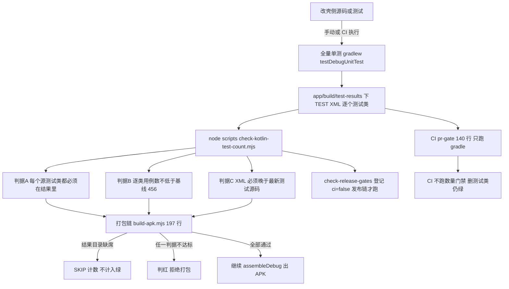
```mermaid
flowchart TD
  A["改壳侧源码或测试"] -->|"手动或 CI 执行"| B["全量单测 gradlew testDebugUnitTest"]
  B --> C["app/build/test-results 下 TEST XML 逐个测试类"]
  C --> D["node scripts check-kotlin-test-count.mjs"]
  D --> E["判据A 每个源测试类都必须在结果里"]
  D --> F["判据B 逐类用例数不低于基线 456"]
  D --> G["判据C XML 必须晚于最新测试源码"]
  E --> H["打包链 build-apk.mjs 197 行"]
  F --> H
  G --> H
  H -->|"结果目录缺席"| I["SKIP 计数 不计入绿"]
  H -->|"任一判据不达标"| J["判红 拒绝打包"]
  H -->|"全部通过"| K["继续 assembleDebug 出 APK"]
  C --> L["CI pr-gate 140 行 只跑 gradle"]
  L --> M["CI 不跑数量门禁 删测试类仍绿"]
  D --> N["check-release-gates 登记 ci=false 发布链才跑"]
```

### 引擎侧插件（TypeScript，权威源在协调仓 plugins/）

#### P01 桥插件（dsh-android-bridge）


> 权威源在协调仓 `plugins/dsh-android-bridge/`，本仓 `dsh-mobile-apk/plugins/dsh-android-bridge/` 是逐字节镜像（本轮 10 个文件 md5 全同）；以下行号取自 apk 仓副本。

- **一句话**：把「模型或插件要驱动设备」收敛成一条受控链——档位门与屏幕范围门先判、单槽控制队列投递、壳侧执行、回执过无损 JSON 出口——并把会话事件投影成通知与实时流文件。
- **入口/触发**：四类。① 模型工具 `android_privilege_status` / `android_shell_exec` / `android_termux_channel_exec`（`plugins/dsh-android-bridge/src/index.ts:1224`、`:1280`、`:1343`）与常驻 facade `android_capabilities`（`plugins/dsh-android-bridge/src/capability-gate.ts:250`，设备工具默认被 `tools.restrict` 掩蔽，调它才解锁）；② 其它插件经 cordis 服务面直调（`ctx.provide('androidPrivilege', svc)` 在 `index.ts:1438`，manage/vdisplay/browser/file-open 都走这条）；③ 壳侧 ControlPoller 长轮询两条 exact 路由 `/api/android/ui/pending`、`/api/android/ui/result`（`control-queue.ts:347`、`:367`），设置页读 `/api/android/privilege/status`（`index.ts:1669`）；④ 引擎 `session/event`（`index.ts:1558`）→ 写 `.notify.ndjson` / `.live.ndjson` / `.task-done.ndjson`。
- **运行顺序**：装配期 `apply`（`index.ts:1416`）跑一次：按 `inject=['tools','webServer','shell','sandboxPolicy']`（`:112`）取面 → `provide androidPrivilege` → 注册 3 个工具（`:1649`）→ `installCapabilityGate`（`:1652`）→ 注册 3 条路由（`:1669`/`:1682`）→ 注册 `session/event` 监听。稳态期每次工具调用：工具 execute → 工具壳黑名单/`gateFor`（UX 快速路径）→ 服务面 `authorizePrivileged`（`index.ts:909`：会话档位或具名 internal）→ `controlExec`（`:949`：档位门、A11Y 门、目标屏范围门）→ `ControlQueue.enqueue`（`control-queue.ts:139`，单槽）→ 壳侧长轮询 `waitForWork/take`（`:167`/`:191`）→ 壳侧执行（ShellOps / DeviceControlService）→ `settle`（`:202`）→ 工具回执给模型。轮次结束由事件监听投影 `kind:'report'`（`index.ts:1612`）交壳侧通知中心。插件 dispose 时 `controlQueue.cancel('plugin disposed')`（`index.ts:1444`）。
- **嵌套与线程**：引擎侧全在 Node 单线程事件循环，最深三层 `工具 execute → execAdbShell/execAdbLine → controlExec → enqueue`（之后是 Promise 挂起，不占线程）；`callerAuth`（`index.ts:477`）是 AsyncLocalStorage，绑定的是**异步上下文**而不是线程，manage 在 `guard()` 里 `bindSession`（`plugins/dsh-android-manage/src/index.ts:137`）后才让 40+ 私有调用点继承。壳侧：`dsh-control-poller` 工作线程（`ControlPoller.kt:65` 起线程）HTTP 取活 → a11y 类 op 经 Handler 转主线程由 `AccessibilityService` 回调执行、sh/浏览器/虚拟屏 op 走各自承载 → 结果回填 POST；Shizuku 执行是另一进程的 Binder 线程（`ShizukuUserService`）。通知投影在引擎事件循环内同步跑纯函数 + `appendFileSync`，壳侧靠 FileObserver 按字节偏移消费（`NotifyStore.kt`、`OverlayLiveFeed.kt`）。
- **耦合**：服务名与注入面 `androidPrivilege`（`index.ts:1438`）、`inject=['tools','webServer','shell','sandboxPolicy']`（`index.ts:112`）、`ctx.get('connection')` 供路由鉴权（`index.ts:1664`）。环境键：`DSH_WRITE_MODE`/`DSH_ADB_FULLACCESS`/`DSH_ADB_ALLOW`/`DSH_ADB_PAIRED`/`DSH_ADB_WIRELESS`（`currentStatus`，`index.ts:263-276`）、`DSH_ADB_PREFS_PATH`（`:193`）、`DSH_ADB_AUDIT_PATH`（`:136`）、`DSH_CONTROL_TOKEN_TEST` + `DSH_CONTROL_TOKEN`（`control-queue.ts:230-233`、`:323`）、`DSH_SCREEN_SCOPE_TEST` + `DSH_SCREEN_SCOPE`（`screen-scope.ts:549`）、`DSH_HOME`。只读的壳侧真值文件：`/data/user/0/com.dsharnessmobile.shell/shared_prefs/dsh-adb.xml`（`SHELL_PREFS_DEFAULT`，`index.ts:165`；`parseAdbPrefsXml` `:202` 读 allowSwitch/paired/connected/pairPort/connectPort/a11yEnabled/controlToken/controlHeartbeat/fullAccess/wirelessOn）与 `shared_prefs/dsh_screen_scope.xml`（`screen-scope.ts:25`、`:533`）——写端唯一在壳侧 `AdbState`/`ScreenScopePrefs`，插件只读（Shizuku 对照：被提权方不得自改授权）。本插件写的文件：`$DSH_HOME/.notify.ndjson`（`index.ts:1463`，512KB 轮转 `.1`）、`.live.ndjson`（`:1489`）、`.task-done.ndjson` 与 `.notify-probe.log`（`:1450`、`:1482`）、`files/audit/audit.ndjson`（`:136-154`）。op 名单真源：`SHELL_OPS`（`shell-ops.ts:17`）、`A11Y_OPS`（`control-policy.ts:79`）、`REAL_SCREEN_CONTROL_OPS`（`screen-scope.ts:70`）、`TIER_REQUIRED_OPS`（`index.ts:428`）、`INTERNAL_PRIVILEGED`（`index.ts:453`）；门禁 `scripts/check-control-ops.mjs` 按 `scripts/control-ops-pending.json` 的 families/neverFaces 校验六面登记，`scripts/check-tool-surface-budget.mjs` 从 `DEVICE_TOOL_GROUPS` 推导初始可见集，`scripts/gen-screen-scope-fixture.mjs` + `plugins/dsh-android-bridge/test/fixtures/screen-scope-cases.json` 锁死与壳侧 `ShellOps.decideScreenCommand`（`app/src/main/java/com/dsharnessmobile/shell/ShellOps.kt:249`）的等价性。跨块符号：manage 用 `bindSession` 与 `execAdbShell(cmd,{internal:'animation-scales'})`（`plugins/dsh-android-manage/src/index.ts:137`、`:423`）、vdisplay 用 `controlExec('vdInfo')`（`plugins/dsh-android-vdisplay/src/status.ts:190`）、browser 用 `controlExec(BROWSER_OPS.caps/op)`（`plugins/dsh-android-browser/src/facts.ts:66`、`tools.ts:262`）；`shizukuReady` 读 `ControlQueue.stats().caps.shizuku`（`index.ts:584`）而 caps 由壳侧 `ControlCarrier.capsExtra` 产出（`app/src/main/java/com/dsharnessmobile/shell/ControlCarrier.kt:70`）；令牌 `shellControlToken()`（`index.ts:251`）被 file-open 复用；路由策略表 `scripts/api-route-auth-policy.json:126-155`。
- **关键坐标**：`plugins/dsh-android-bridge/src/index.ts:949`（controlExec：档位门→A11Y 门→目标屏范围门→入队）、`plugins/dsh-android-bridge/src/index.ts:909`（authorizePrivileged：internal 按命令形态校验，无来源即拒）、`plugins/dsh-android-bridge/src/index.ts:472` 与 `:474`（SHELL_EXEC_TIMEOUT_MS=20s / SHELL_QUEUE_TIMEOUT_MS=25s 的不变式）、`plugins/dsh-android-bridge/src/index.ts:1034`（execAdbShell：黑名单 + 范围复查 + 双时限一并下发）、`plugins/dsh-android-bridge/src/control-queue.ts:139`（单槽 enqueue 与超时）、`plugins/dsh-android-bridge/src/screen-scope.ts:405`（screenCommandVerdict 段级自证四态）、`plugins/dsh-android-bridge/src/index.ts:755`（gateFor 两条通道等价、档位为唯一会话级门）、`plugins/dsh-android-bridge/src/index.ts:1558`（session/event → notify/live/marker 三路投影）。
- **不变量**：① `SHELL_EXEC_TIMEOUT_MS(20s) < SHELL_QUEUE_TIMEOUT_MS(25s)`（`index.ts:472`/`:474`，单测 `plugins/dsh-android-bridge/test/screen-scope.test.mjs:779` 钉死）——反了会造出「引擎报超时但壳侧已执行」，模型重试即二次执行点击/输入/写入；② 特权面无会话来源一律拒、`internal` 名字必须在 `INTERNAL_PRIVILEGED` 且本次命令通过该名字的形态校验器（`index.ts:909-941`）——违反则要么被拒（可见），要么静默放行任意命令；③ 未知/未就绪/越界的屏一律拒，绝不回退 display 0（`screen-scope.ts:569-609`、`index.ts:991`、`ShellOps.kt:132`）——违反=读真实屏的隐私门失效；④ 队列一次只允许一个在途请求（`control-queue.ts:140`、`take` 的在途即拒 `:196`）——双交付会让同一 reqId 执行两次；⑤ 令牌缺失或短于 8 字符一律 403（`control-queue.ts:227`/`:236`）——违反=同机任意应用可取活/回填控制请求；⑥ 工具/HTTP 出口必须过 `toLosslessJson`（`lossless-json.ts:30`：可选键缺省整键不发）——违反则整条回执被工具面判 not lossless JSON 拒收；⑦ `reason.kind` 未知一律 `unknown`，不得映射成 `completed`（`notify-projection.ts:37-43`）——违反则失败轮次在通知栏显示「已完成」。
- **症状 → 排查**：
  - 工具报「已有在途的设备控制请求——壳侧单线程，请串行调用」→ 上一个请求没回填：`grep -n "已有在途" plugins/dsh-android-bridge/src/control-queue.ts`，再看 `android_privilege_status` 的 `control.queue.lastTakeAt/lastResultAt` 差值（取了活很久不回填=壳侧执行卡住），审计 `files/audit/audit.ndjson` 末行有无对应 op。
  - 工具报「设备控制超时 25000ms 内壳侧未回填结果」→ 壳侧没取活或掉线：`dumpsys accessibility | grep -A2 "Bound services"`、`grep -n "pollAgeMs\|lastResultAt" plugins/dsh-android-bridge/src/control-queue.ts`，真值看 `shared_prefs/dsh-adb.xml` 的 `a11yEnabled`/`controlHeartbeat`/`controlToken`。
  - 命令被拒且文案含「用户当前开放屏幕范围为 virtual-only」→ 范围门两道：`grep -n "realScreenAdbCommandDenied" plugins/dsh-android-bridge/src/screen-scope.ts` 与 `grep -n "private fun scopeDenied" app/src/main/java/com/dsharnessmobile/shell/ShellOps.kt`；真值 `adb shell run-as com.dsharnessmobile.shell cat shared_prefs/dsh_screen_scope.xml`。
  - 命令被拒且文案含「服务面拒绝」或「缺少调用方会话」→ 档位门或内部白名单：查审计 `files/audit/audit.ndjson` 的 `denied-no-session` / `denied-not-gated` / `denied-internal-shape` / `denied-danger-service` 四种 result，`grep -n "INTERNAL_PRIVILEGED\|isAnimationScaleCommand" plugins/dsh-android-bridge/src/index.ts`。
  - 通知栏该弹不弹、用户按停仍弹、或失败轮次显示「已完成」→ 投影纯函数与落盘：`tail -n 5 files/home/.dsh/.notify.ndjson` 看 `kind/outcome/outcomeLabel/popup`，`cat files/home/.dsh/.notify-probe.log` 看 `apply-ran` / `listener-registered` / `listener-FAILED`，`grep -n "turnEndKind\|shouldPopupReport" plugins/dsh-android-bridge/src/notify-projection.ts`。
- **可疑点**：
- [已确认·静态推演] `sh -c "<屏幕命令>" <尾随词>` 绕过屏幕范围门（两层同源；与 K06 可疑点 1 的「双引号内 `$()`」是两条不同形态，勿合并计数）。`screen-scope.ts:200` 的 `SHELL_C_PAYLOAD` 要求载荷直达段尾、`screen-scope.ts:203` 的 `unwrapOneQuote` 只在首尾成对时才剥引号；`sh -c "screencap -p -d 0" > /sdcard/a.png` 因尾部有重定向而不剥，内层只作为「带引号的一段」进判定，`screen-scope.ts:293` 又把引号内文本抹成空白 ⇒ 命令词面与 `-d 0` 同时消失，`screenCommandVerdict`（`screen-scope.ts:405`）两段都判 allow。壳侧 `ShellOps.kt:451`/`ShellOps.kt:132` 同算法同解。影响：virtual-only 下经 `android_shell_exec`/`execAdbLine` 读真实屏（fixture `plugins/dsh-android-bridge/test/fixtures/screen-scope-cases.json` 无「载荷+尾随词」用例，现有 `sh -c` 用例是全引号形态故绿）。建议补一条 fixture 反证。
- [已确认·静态推演] `controlExec` 自身没有危险命令黑名单，S-5 的「服务面地板」只落到一半（与 K06 可疑点 3 同源，本条给引擎侧坐标）。`index.ts:949` 的门只有档位 / A11Y / 屏幕范围，`looksDangerousAdb` 只在 `execAdbShell`（`index.ts:1038`）与 `execAdbLine`（`index.ts:1074`）里；而 `index.ts:393` 的注释声称黑名单已下沉、服务面是地板（审查 P1-3 / B3 的原始要求是「档位门 + 危险命令黑名单」一起下沉）。影响：拿到 `androidPrivilege` 的插件在 danger-full-access 会话里可 `controlExec('shExec',{command:'settings put global …'})` 直驱 uid 2000，绕过工具面与该判据（仍需会话档位，壳侧仍写审计）。
- [已确认·静态推演] 状态/诊断面把 Shizuku 当 ADB，会输出自相矛盾的可达性结论。渲染只用 `a11yEnabled`/`adbReady` 三选一（`index.ts:1255-1257`），Shizuku 的 message 被贴上「ADB 提示」标签（`:1258`）；`controlDecision`（`:864-875`）把 `engineLevelReady(st) || shizukuReady()` 折进 `adbReady`，于是 `control-policy.ts:126` 返回 `backend:'adb'`。影响：无障碍关 + Shizuku 就绪时，`android_privilege_status` 同时输出「结论：不可用——开启任一通道即可」与「ADB 提示：特权通道 Shizuku（已授权）」，`route` 表把 Shizuku 承载的 op 标成 adb（与 vdisplay「声称不可用而实际可用」同族，会让模型放弃可用路径）。
- [未证实] `shizukuReady` 依赖「上一次控制回填」带回的 caps，冷启动后首次特权调用可能被误拒。`index.ts:584` 读 `controlQueue.stats().caps.shizuku`，而 `noteShell`（`control-queue.ts:128`）只在 `/api/android/ui/result` 回填里被调用，caps 也只挂在回填信封（`ControlPoller.kt:167-181`）。触发条件：引擎刚起、只有 Shizuku 就绪（无障碍关、ADB 三门口不齐）、此前无任何控制 op 完成 → `gateFor` 的 shizukuReady 仍 false，`android_shell_exec` 被拒并引导去开无障碍/授权 Shizuku（用户已完成）。未证实点：现场是否总会被设置页/面板轮询的 vdInfo、browserCaps 先填上 caps；建议查一次冷启动后的第一跳。
- [已登记未修·S-7] 单槽队列 + browser op 长超时，并发设备 op 立即失败而非排队。`control-queue.ts:139-142`（pending 在场即拒）、`enqueue` 默认 8000ms 而 browser 由调用方传更长（`plugins/dsh-android-browser/src/tools.ts:262`）。影响：冷启动 `browser_open` 期间并发 `android_ui_dump` 拿到「已有在途」；审查 S-7 只做了范围门与回执面，独立串行执行器未做（`coord:docs/0.14.1-REVIEW-CHECKLIST-PROGRESS.md:73`），本轮复述不重复登记。

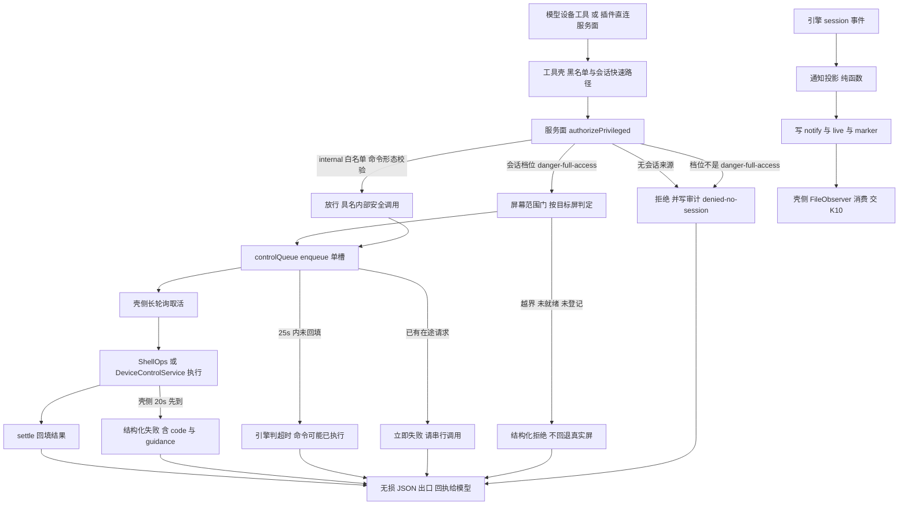
```mermaid
flowchart TD
  A["模型设备工具 或 插件直连服务面"] --> B["工具壳 黑名单与会话快速路径"]
  B --> C["服务面 authorizePrivileged"]
  C -->|"无会话来源"| D["拒绝 并写审计 denied-no-session"]
  C -->|"internal 白名单 命令形态校验"| E["放行 具名内部安全调用"]
  C -->|"会话档位 danger-full-access"| F["屏幕范围门 按目标屏判定"]
  C -->|"档位不是 danger-full-access"| D
  F -->|"越界 未就绪 未登记"| G["结构化拒绝 不回退真实屏"]
  F --> H["controlQueue enqueue 单槽"]
  E --> H
  H -->|"已有在途请求"| I["立即失败 请串行调用"]
  H -->|"25s 内未回填"| O["引擎判超时 命令可能已执行"]
  H --> J["壳侧长轮询取活"]
  J --> K["ShellOps 或 DeviceControlService 执行"]
  K -->|"壳侧 20s 先到"| N["结构化失败 含 code 与 guidance"]
  K --> L["settle 回填结果"]
  L --> M["无损 JSON 出口 回执给模型"]
  N --> M
  O --> M
  I --> M
  G --> M
  D --> M
  P["引擎 session 事件"] --> Q["通知投影 纯函数"]
  Q --> R["写 notify 与 live 与 marker"]
  R --> S["壳侧 FileObserver 消费 交 K10"]
```

漂移：`dsh-mobile-apk/docs/AGENTS/known-gaps.md:127` 说 0.14.1 块G F1 落在 `bridge/index.ts` 第 832-838 行，源码该处是 `a11ySource()` 的心跳判定（`plugins/dsh-android-bridge/src/index.ts:829-838`），F1 的「按 args.screenId 经 screenAccessResolved 判定」实际在 `plugins/dsh-android-bridge/src/index.ts:991-997`。
漂移：`dsh-mobile-apk/docs/AGENTS/ARCHITECTURE.md:151`（§9「0.13.5 设备控制面」）说 `adb → execAdbLine/execAdbShell（shell 执行、原图截图、pm/dumpsys 等系统面）`，源码 `plugins/dsh-android-bridge/src/index.ts:1034`/`:1070` 与 `plugins/dsh-android-bridge/src/shell-ops.ts:120` 已在 0.14.0 改成经控制队列投递壳侧 Shizuku、不再有 adb 客户端语义（该节自带 0.13.5 标注，属历史段落，按「以源码为准」记录）。

#### P02 管理插件（dsh-android-manage）

- **一句话**：引擎侧 14 个 `android_*` 工具的实现——把模型意图经「屏幕范围门 + 会话档位门」翻译成壳侧无障碍队列 op 或特权 shell 命令，再把壳侧载荷剪枝成紧凑语义清单（含两级披露与「界面未变」快路径）。本块 5 个源文件在协调仓 `plugins/dsh-android-manage/src/` 是权威源，apk 仓为逐字节镜像（本轮 diff 逐文件一致）。
- **入口/触发**：
  - 装配期（一次性）：`apply`（`plugins/dsh-android-manage/src/index.ts:2286`）取 `ctx.androidPrivilege`（`inject` 声明在 `:53`，要求 android-bridge 先装配），调用 `tools(ctx, face)`（`:105`）并把返回的 14 个工具逐个 `ctx.tools.register`（`:2295`）。服务缺失时退化为 fail-closed 桩（`:2291`）并 warn（`:2289`）。
  - 运行期（每次调用）：模型发起一次 tool call → 该工具的 `execute(args, exec)`；`exec.agent.session` 是档位判定的会话来源。
  - 内部触发：截图内联取 `ctx.get('attachments')`/`ctx.get('llm')`（`:339`/`:347`）；明细落盘写 `TMPDIR/dsh-tmp/`（`:906`）；审计写 `files/audit/audit.ndjson`（`:152`）。
- **运行顺序**：
  1. **门（每个工具的第一步，唯一必经点）**：`guard(action, 完整 args, exec)`（`:133`）三件事串联——`bindSession`（`:137`，把会话绑到当前异步上下文，供 bridge 服务面复查档位）→ 屏幕范围门（`:138`，仅 `SCREEN_ACTIONS` 的 10 个 action；一律用异步 `screenAccessResolved`，同步面拿不到 vdInfo 的动态 displayId）→ `gateFor(session)` 档位门 + `audit`（`:151`）。任一不过即原样回引导文案，不再往下走。
  2. **通道分叉**：按工具的 `controlDecision(op).backend`（`:982`）与自身策略三选一——无障碍队列（`a11yExec` → `controlExec`，`:1071`）、特权 shell（`execAdbShell`/`execAdbLine`）、坐标或广播兜底（`vdInput`、ADBKeyboard 广播）。ADB 专属工具在动手前先问一次 `adbChannelOnly`（`:1003`，用 `forceBackend:'adb'` 探针，只有明确的 `deny` 才拒）。
  3. **语义树落缓存 + 两级披露**：`android_ui_dump` 的 a11y 分支收 `snapshot`（15s）→ `isV2Payload` 分流（`:1284`，V2 走 `decodeV2`/`cacheFromV2`，V1 走 `pruneNodes`）→ `treeFingerprint` 指纹比对（`:1300`）命中即 `unchangedResponse`（`:967`）短路返回；未命中才写 `uiCache`（`:1318`）、落明细 `publishDetail`（`:1341`）、返回 `nodes` + `detailHandle`/`detailPath`。ADB 回落分支同型（`:1397`/`:1405`）。
  4. **动作后校验**：点击类（`click`/`longClick`/WebView click）成功后调 `verifyClick`（`:392`）读壳侧便宜状态 `state`，把结论写进 `text`；之后控制权回引擎，等下一次 tool call。
  5. **取明细（第二级）**：`android_ui_detail` 不碰壳侧，用最近一次 dump 的 `uiCache` + 模块级 `detailHandle`/`detailPath`（`:940`）按 ref 取单节点或按 `all=true` 分页（`pageRows`）。
- **本块 14 个工具的通道落点（模型可见清单 → 通道 → 壳侧 op → 返回键）**：

| 工具 | 通道分叉 | 壳侧 op / 命令 | 返回键（schema 声明面） |
|---|---|---|---|
| `android_screen_list` | 只读注册表，无屏操作 | `controlExec('vdInfo')` | `scope` `screens[]` `text` |
| `android_screenshot` | a11y `screenshot` 优先，失败或离线回落 ADB | `controlExec('screenshot')` / `execAdbLine` 的 `screencap -p` + `pull` | `imagePath` `width` `height` `denied` `image?` `text` `screenId` `displayId` `scope` `actionMode` |
| `android_ui_tree` | 仅特权 shell（`adbChannelOnly` 提前门） | `execAdbLine` 的 `uiautomator dump` + `pull`（dump 前后关/还原动画） | `treeXmlPath` `denied` `text` |
| `android_device_info` | 仅特权 shell | `execAdbShell` 的 `getprop`/`dumpsys window` + `execAdbLine` 的 `adb devices -l` | `model` `androidVersion` `frontApp` `resolution` `devices[]` `denied` `text` |
| `android_act_input` | 仅特权 shell | `execAdbShell` 的 `input tap/swipe/keyevent/text` | `ok` `denied` `text` |
| `android_ui_dump` | a11y `snapshot`（15s）优先，否则 ADB 回落 | `controlExec('snapshot')` / `execAdbLine` 的 `uiautomator dump` + `wm size` | `ok` `screen{w,h}` `rotation` `count` `rawCount` `nodes[]` `detailHandle` `detailPath` `note` `text` `denied` `unchanged?` `gen?` `screenId` `displayId` `scope` `actionMode` `guidance` |
| `android_ui_detail` | 无壳侧调用（本地缓存 + 明细文件） | 无（ref 走 `resolveRef`，`all` 走 `pageRows`） | `ok` `denied` `handle` `path` `node?` `rows?` `total` `offset` `omitted` `text` |
| `android_ui_click` | ① WebView DOM `webAction`（wN/css:/role:）② 虚拟屏 x/y → `vdInput` ③ a11y `click`/`longClick` ④ ADB `input tap` | `webAction` / `vdInput` / `controlExec` / `execAdbShell` | `ok` `ref` `id` `label` `x` `y` `text` `denied` `screenId` `displayId` `scope` `actionMode` |
| `android_ui_scroll` | a11y `scroll` 优先，否则 ADB `input swipe` | `controlExec('scroll')` / `execAdbShell` | `ok` `from[]` `to[]` `text` `denied` `screenId` `displayId` `scope` `actionMode` `guidance` |
| `android_ui_input` | ① WebView DOM `webAction setText` ② a11y `setText` ③ ADBKeyboard 广播（注入后经 a11y `nodeText` 回读）④ `input text` | `webAction` / `controlExec('setText')` + `nodeText` / `execAdbShell` 的 `am broadcast` | `ok` `channel` `text` `denied` `screenId` `displayId` `scope` `actionMode` `guidance` |
| `android_web_dump` | a11y 队列 `webSnapshot`（读壳自有 WebView，刻意不进 `SCREEN_ACTIONS`，无 screenId） | `controlExec('webSnapshot')` | `ok` `denied` `count` `url?` `title?` `nodes[]` `text` |
| `android_env_prepare` | 仅特权 shell | `execAdbShell` 的 `settings put global` + `ime enable/list` | `ok` `denied` `text` |
| `android_app_launch` | 虚拟屏 → `vdLaunchApp`；真实屏 → ADB `monkey` | `controlExec('vdLaunchApp')` / `execAdbShell` | `ok` `denied` `pkg` `foreground` `text` |
| `android_ui_global` | a11y `global`（不需要 ADB） | `controlExec('global')` | `ok` `denied` `action` `text` |

- **嵌套与线程**：
  - 引擎侧全在 Node 单进程事件循环（async/await），无自建线程；三条链最多三层：`apply → tools(ctx) → ctx.tools.register`；`execute → guard → priv.screenAccessResolved/controlExec`；`execute → a11yExec → priv.controlExec → controlQueue.enqueue → 壳侧 ControlPoller 长轮询（服务回调）→ 回执`。
  - 工具调用可并发，故模块级单槽状态是跨调用共享的：`uiCache`（`:901`）、`detailHandle`/`detailPath`（`:940`）、`UI_CACHE_TTL`（`:900`）。
  - 两处 `setTimeout` 在事件循环内挂起（不阻塞别的工具）：`verifyClick` 的 260ms（`:393`）、ADBKeyboard 回读的 260ms/320ms（`:1908`/`:1913`）。
  - 壳侧执行分别在 DeviceControlService 的 mainThread executor（无障碍）与 Shizuku UserService 进程（特权 shell），回到引擎只是 enqueue 的 Promise 完成回调；`bindSession` 用 AsyncLocalStorage 绑定，嵌套 helper 自动继承。
- **耦合**（具体符号）：
  - `PrivilegeFace` 的十个成员（`:55-87`，提供者是 android-bridge 的 AndroidPrivilegeService）：`bindSession` / `gateFor` / `screenScope` / `screenAccessResolved`（优先，缺失时才回退同步 `screenAccess`）/ `controlDecision` / `controlExec` / `execAdbShell` / `execAdbLine` / `audit`。
  - 壳侧 op 字符串（写死，改名即断）：`snapshot` `click` `longClick` `setText` `scroll` `global` `screenshot` `state` `nodeText` `webSnapshot` `webAction`（无障碍承载，DeviceControlService 的 `A11Y_OPS`/`REAL_SCREEN_OPS`）+ `vdInfo` `vdInput` `vdLaunchApp`（VdisplayOps）；ADB 面 `execAdbShell`→`shExec`、`execAdbLine`→`shExec`/`shPull`。
  - 环境变量与路径：`DSH_FILES_DIR` + `adb-keyboard-nonce`（`:39-43`，壳侧 `app/src/main/java/com/dsharnessmobile/shell/AdbKeyboardService.kt:166` 写、`app/src/main/java/com/dsharnessmobile/shell/MainActivity.kt:255` 幂等补建）；`TMPDIR` + `dsh-tmp/`（`:446`），前缀 `dsh-shot-`（保留 20）/`dsh-ui-`（10）/`ui-detail-`（20）。
  - 输入法实体与广播：硬编码 `com.dsharnessmobile.shell/.AdbKeyboardService`（`:1874`、`:2119`），广播 action `ADB_INPUT_TEXT`/`ADB_CLEAR_TEXT` + `--es msg`/`--es auth`（`:1889`）。
  - 引擎服务面：`ctx.get('attachments')`（`:339`）、`ctx.get('llm').resolveModelInfo`（`:352`）供截图内联一次性读图；`ctx.tools.register`（`:2295`）；日志 tag `ctx.logger('dsh-android-manage')`（`:2289`，仅服务缺失时 warn）。
  - 跨块文案/入口：工具描述把模型引向 `android_vdisplay_input`/`android_vdisplay_status`/`android_vdisplay_create`（`:1268`、`:1511`）与 `android_web_dump`（`:1339`）；`android_screen_list` 的别名枚举真源是壳侧 `vdInfo` 注册表，不硬编码 virtual-1（`:248`）。
  - 偏好与门禁：屏幕范围偏好 `ScreenScopePrefs`（壳侧 XML → `currentScreenScope()`，默认 `virtual-only`）由 `guard` 每次调用现读；审计落 `files/audit/audit.ndjson`（bridge 与壳侧 ControlAudit 同路径同格式）。
- **关键坐标**：
  - `plugins/dsh-android-manage/src/index.ts:114` — `SCREEN_ACTIONS`：范围门覆盖的 10 个 action（`device_info` 与 `web_dump` 已被刻意移出，注释给出理由）。
  - `plugins/dsh-android-manage/src/index.ts:133` — `guard`：bindSession → 范围门 → 档位门 → audit，是所有工具的唯一必经点。
  - `plugins/dsh-android-manage/src/index.ts:1300` — 「界面未变」快路径判定（指纹 + TTL；ADB 分支同型在 `:1397`）。
  - `plugins/dsh-android-manage/src/index.ts:1341` — `publishDetail`：两级披露的第二级（ADB 分支 `:1405`）；落盘失败清空句柄的逻辑在 `:923-927`。
  - `plugins/dsh-android-manage/src/index.ts:571` — 虚拟屏截图反查 SF token；`:574` 反查不到即 fail-closed。
  - `plugins/dsh-android-manage/src/index.ts:1507` — nx/ny 在非 real 屏上的歧义拒绝；`:1519` 起 x/y + screenId 走 vdInput 坐标模式。
  - `plugins/dsh-android-manage/src/index.ts:2283` — 注册数组：14 个工具（`uiDetail` 是 0.14 D4 补回的第 14 个，见 `:2282` 注释）。
  - `plugins/dsh-android-manage/src/protocol-v2.ts:114` — `o` 列（句柄 = 原始行号）；缺列或非严格递增即整体拒绝解码。
- **不变量**：
  1. 返回面必须与 `output.schema` 逐键对齐（a11y、ADB、「未变」快路径三个分支都算），可选键缺省**整键不发**。违反症状：引擎整值校验 `ToolOutputError`，模型拿不到任何数据，而编译与人工看代码都发现不了（坑 72；门禁 `scripts/check-tool-output-schema.mjs:7`）。
  2. `guard` 必须收到**完整实参**（不是手搓子集），且范围判定必须走异步 `screenAccessResolved`。违反症状：screenId 像没生效——无论传什么都被按 real 判定，或已就绪的虚拟屏被判「尚未就绪」。
  3. 范围门与投递必须成对：`guard` 判范围 + `screenArgs` 把 screenId 投到壳侧执行。只判不投的后果是「门按 virtual-N 放行、执行落真实屏」，比直接拒绝更难排查。
  4. 协议 V2 失败关闭：`o` 列缺失或非严格递增 → 拒绝产出清单；句柄语义是「壳侧 walk 全量行表的原始行号」，不是载荷行下标（FX-206.1）。
  5. 虚拟屏截图 fail-closed：反查不到 SF token 只返回专用文案，绝不回落 displayId 硬试、也不回落无参 `screencap`；token 全程字符串（超 2^53 与 2^63-1，数值化即失真）。
  6. `uiCache` 单槽 + 10 分钟 TTL + 结构指纹：ref 只对最近一次 dump 有效（`android_ui_dump` 的 `note` 明说）；「页面真的变了」的权威判据是壳侧 `gen` 校验，不是墙钟（TTL 放宽到 10 分钟的理由见 `:892`）。
  7. 授权与档位失败关闭：未授权或非 `danger-full-access` 时全部工具返回引导，不静默降级、不绕行；服务面（bridge）会再查一次，工具层只是 UX 快速路径。
- **症状 → 排查**：
  - 模型说「拿不到数据 / 结果被拒」→ 跑 `node scripts/check-tool-output-schema.mjs`（源码级 `defineTool({name})` 名集合 vs 运行时注册名集合 + 引擎同款校验器）；grep `additionalProperties` 与三个返回分支的键集合。
  - 传了 screenId 却像没生效（画面没变、截图拍到真实屏）→ grep `screenArgs(`、`screenAccessResolved(`、`guard('`，核对调用点是否把完整 args 进门；设备侧 `adb shell dumpsys activity activities | grep -i display`，审计痕迹看 `files/audit/audit.ndjson` 里的 `args.screenId`。
  - ref 点不动或回「不在最近一次 dump 中」→ 查单槽缓存是否被后续 dump 覆盖：grep `UI_CACHE_TTL`、`uiCache =`；用 `android_ui_detail all=true` 取全量核对后重新 dump。
  - 虚拟屏截图失败（`Failed to take screenshot. Status: -2` 或 token 解析不到）→ `adb shell "dumpsys SurfaceFlinger | grep -E '^(Virtual Display |    name=)'"` 找 `name="DSH virtual-N"`；用 `android_screen_list` 与 `android_vdisplay_status` 复核别名；文案来自 `vdTokenMissingText`。
  - 中文或长文本输入丢字/被汉字化 → `adb shell settings get secure default_input_method`（注入前后应还原一致）、`adb shell ime list -s | grep -c dsharnessmobile`；grep `ADB_INPUT_TEXT`、`adbKeyboardAuthArg`、`nodeText`；壳侧凭据文件 `files/adb-keyboard-nonce`，插件日志 tag `dsh-android-manage`。
- **可疑点**：
  1. `verifyClick` 不认屏且 `beforeGen` 恒为 undefined（已确认代码事实，设备侧未实测）：`plugins/dsh-android-manage/src/index.ts:394` 调 `a11yExec('state', {}, 4000)` 不带 screenId，而壳侧 `state` 属于 `REAL_SCREEN_OPS` 且 `realScreenScopeError` 把缺省 screenId 当 real（`app/src/main/java/com/dsharnessmobile/shell/DeviceControlService.kt:701`）。默认范围 `virtual-only` 下必被 `screen-out-of-scope` 拒，每次点击都回「生效校验不可用」；范围 `all` 时读的是真实屏的 state 而操作在虚拟屏。三处调用点（`:1563`/`:1606`/`:1622`）又都传 `undefined`，`gen` 比对成死分支，只剩 `invalidated` 能判「已变化」。影响：连点校验默认恒不可用，且可能给出别屏结论。
  2. `android_ui_tree` / `android_act_input` 收 screenId 却不投递（代码路径可读证，未证实实测）：`plugins/dsh-android-manage/src/index.ts:728` 的 `uiautomator dump` 无 `-d`、`:880` 的 `input ${line}` 无屏维度。范围含 real 时（real-only / all）命令被放行并落默认屏，返回值仍 `ok:true`；范围 `virtual-only` 时被 bridge 的命令词面拦住（uiautomator 声明为「无目标屏参数」家族，`plugins/dsh-android-bridge/src/screen-scope.ts:366`；`input` 家族需 `-d`/`--display` 认证，同文件 `:360`）。同一族缺陷在 `android_screenshot` 已修（0.14.0 实锤 + 0.14.1 块G F6），而 `android_ui_dump` 的失败文案仍把模型引向 `android_ui_tree`（`:1270`）。
  3. x/y 绝对坐标 + 非虚拟屏的组合没有执行路径（已确认代码事实）：`plugins/dsh-android-manage/src/index.ts:1494` 的 `useAbs` 一旦通过就不再校验 screenId；screenId 缺省或为 `real` 时，a11y 分支发 `nx/ny = undefined`（`:1615`，壳侧回「需要 row 或 nx/ny」），ADB 分支 `Math.round(nx! * size.w)` 得 NaN（`:1650`）后执行 `input tap NaN NaN`（`:1678`）。触发条件：模型按 `SCREEN_PARAM` 文案（real|virtual-N）传 x/y + `screenId:"real"`，或只传 x/y。
  4. 单槽 `uiCache` 不记录屏幕归属（未证实，代码路径可读证）：`plugins/dsh-android-manage/src/index.ts:901` 的缓存结构没有 screenId，`:948` 的结构指纹也不含屏幕维度。多屏会话里「dump 虚拟屏 → dump 真实屏 → 用虚拟屏的 n3 点击」会按最新一次缓存解析 ref，命中另一块屏的同名 n3，载荷再带上本次调用的 screenId，返回仍是 `ok:true` 与一组坐标；排查时表现为「点击坐标与预期不符」而看不出是串屏。
  5. vdInput 分支把 displayId 塞进 `x` 键（已确认代码事实）：`plugins/dsh-android-manage/src/index.ts:1537` 返回 `x: data.displayId, y: 0`，而 schema 与工具描述里的 `x`/`y` 语义是点击坐标（真实坐标只在 `text` 里）。影响：模型若据返回值的 x/y 推算下一步点击会拿到无意义坐标。
- 漂移：`docs/AGENTS/gotchas.md:178` 说坑 72 的锚点是 `plugins/dsh-android-manage/src/lossless-json.ts` 与 `plugins/dsh-android-manage/test/privilege-status.test.mjs`，源码里这两个文件只在 bridge 插件下（`plugins/dsh-android-bridge/src/lossless-json.ts:1`、`plugins/dsh-android-bridge/test/privilege-status.test.mjs:1`），manage 的 `src/` 只有 index/ui-tree/protocol-v2/detail-store/vd-shot 五个文件。
- 漂移：`plugins/dsh-android-manage/src/index.ts:7` 的文件头工具集注释只列 8 个工具（screenshot/ui_tree/device_info/act_input/ui_dump/ui_click/ui_scroll/ui_input），源码 `plugins/dsh-android-manage/src/index.ts:2283` 实际注册 14 个（另有 screen_list/ui_detail/web_dump/env_prepare/app_launch/ui_global）。
- 漂移：`scripts/check-code-map.mjs:152` 的注释说耦合边右端可以是「外部角色」文字，同文件 `scripts/check-code-map.mjs:103` 的解析正则却要求两端都形如查点 ID，凡右端写外部角色的边一律判 `bad-coupling`。

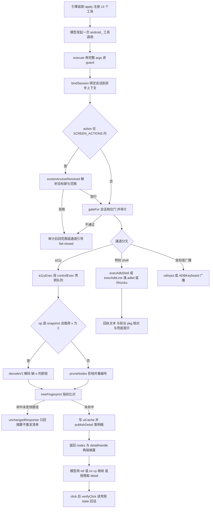
```mermaid
flowchart TD
  A["引擎装配 apply 注册 14 个工具"] --> B["模型发起一次 android_ 工具调用"]
  B --> C["execute 用完整 args 进 guard"]
  C --> D["bindSession 绑定会话到异步上下文"]
  D --> E{"action 在 SCREEN_ACTIONS 内"}
  E -->|"是"| F["screenAccessResolved 解析目标屏与范围"]
  F -->|"拒绝"| G["审计后回范围或通道引导 fail-closed"]
  F -->|"放行"| H["gateFor 会话档位门 并审计"]
  E -->|"否"| H
  H -->|"不通过"| G
  H --> I{"通道分叉"}
  I -->|"a11y"| J["a11yExec 投 controlExec 壳侧队列"]
  I -->|"特权 shell"| K["execAdbShell 或 execAdbLine 落 adbd 或 Shizuku"]
  I -->|"坐标或广播"| L["vdInput 或 ADBKeyboard 广播"]
  J --> M{"op 是 snapshot 且载荷 v 为 2"}
  M -->|"是"| N["decodeV2 解码 缺 o 列即拒"]
  M -->|"否"| O["pruneNodes 剪枝并重编号"]
  N --> P["treeFingerprint 指纹比对"]
  O --> P
  P -->|"命中未变快路径"| Q["unchangedResponse 只回摘要不重发清单"]
  P -->|"未命中"| R["写 uiCache 并 publishDetail 落明细"]
  R --> S["返回 nodes 与 detailHandle 两级披露"]
  S --> T["模型用 ref 或 nx ny 继续 或按需取 detail"]
  T --> U["click 后 verifyClick 读壳侧 state 回话"]
  K --> V["回执文本 与前台 pkg 核对 与兜底提示"]
```

#### P03 浏览器与虚拟屏插件


说明：本块两个插件的源码权威在协调仓同名路径，apk 仓是逐字节镜像（本轮对八个文件逐一 `cmp`，全部一致）。行号按 apk 仓副本读取。

- **一句话**：把模型面的 `browser_*`（开页/导航/快照/点击/输入/按键/截图/多页签/档位）与 vdisplay 的 `android_vdisplay_*`（状态/建屏/销毁）逐条翻译成壳侧控制 op，并把壳侧真值（loadState/title/reason、四态能力）如实回执给模型。

- **入口/触发**：
  - 工具调用：模型调 `browser_open`/`browser_snapshot`/`browser_click`/`browser_type`/`browser_press`/`browser_scroll`/`browser_get_text`/`browser_wait`/`browser_navigate`/`browser_back`/`browser_forward`/`browser_reload`/`browser_list_tabs`/`browser_follow_tab`/`browser_close_tab`/`browser_set_identity`/`browser_set_viewport`/`browser_screenshot`/`android_browser_tier`，以及 `android_vdisplay_status`/`android_vdisplay_create`/`android_vdisplay_destroy`（`BROWSER_TOOLS` 在 `plugins/dsh-android-browser/src/contract.ts:14`，vdisplay 工具在 `plugins/dsh-android-vdisplay/src/index.ts:96/:251/:262`）。
  - 注册：引擎启动时 `apply(ctx)` 里注册（`plugins/dsh-android-browser/src/index.ts:274`、`plugins/dsh-android-vdisplay/src/index.ts:92`），两个插件都在装配集 `scripts/plugin-dirs.json` 内。
  - 只读 HTTP：`GET /api/android/browser/status`（`index.ts:295`，自带令牌/同源鉴权）、`GET /api/android/vdisplay/status`（vdisplay `index.ts:298`，exact 路由 + 回环栅栏 + 405/403）。
  - 侧栏面板：浏览器面板与虚拟屏 Tab 在注入层/客户端侧（`dsh-client-ui-responsive/src/client/mobile/browser-tab.tsx:229`、`plugins/dsh-android-vdisplay/src/client/index.ts:171`），数据面走 `window.androidBridge` 直连壳侧，不经控制队列。

- **运行顺序**：`稳态控制`阶段，与快照/更新无关，引擎起来即注册完毕。每次工具调用自成一轮：工具 `execute` → `withFailureText` 包裹（失败文本兜底 + 会话注入）→ `call()` 经 `androidPrivilege.controlExec` 入控制队列 → 壳侧 `DeviceControlService.handle` 分支 →（browser）`BrowserHostHolder.control` → `BrowserHost.controlOp` 按 `args.session` 切 Workspace 后执行 op → 回填 `{ok,data|error}` → 动作/导航类工具（open/navigate/click/type/press/back/forward/reload）再补一次 `browserState` 取 `loadState/title/reason`（snapshot/scroll/get_text/wait/screenshot/页签类不补）→ `render` 出模型可见文本。vdisplay 的生命周期工具同路（`callVdOp`），状态工具优先 `vdInfo`、面板/端点也读同一真源。跑完把控制权交回模型，无后续阶段。

- **嵌套与线程**（三层）：
  1. 引擎进程（Node 事件循环）：`execute` → `withFailureText.execute` 里 `sessionScope.run(session, ...)`（`tools.ts:245-250`）→ `call()`（`tools.ts:254`）→ `browserTools()` 返回的工具数组（`tools.ts:1075`）。
  2. 壳侧服务线程：`ControlPoller.runOp` 由轮询线程执行 `handle(op,args)`（`app/src/main/java/com/dsharnessmobile/shell/ControlPoller.kt:158`），把 `__error` 归一成 `{ok:false,error}`；`BrowserHost.controlOp` 内部再用 `onMain`（`BrowserHost.kt` 主线程 Handler）跑 WebView 操作，`awaitNavigation` 在调用线程等代次前进（`BrowserHost.kt:1085`）。
  3. WebView/原生回调（主线程）：`onPageStarted/onPageFinished/onReceivedError` 写 `tab.loadState`、`lastError`（`BrowserHost.kt:677/686/699`）；vdisplay 侧 `VdisplayHost.setStageBounds` 走 `onMain`，`surfaceCreated/Changed` 回调里 `attachViewerSurface` 做仲裁（`VdisplayHost.kt:54/120-123/134`），`VdisplayController` 内部 `synchronized(lock)`。

- **耦合**（点名符号）：
  - 契约面：`BROWSER_OPS`/`BROWSER_TOOLS`/`VIEWPORT_PRESETS`/`IDENTITY_PROFILES`（`contract.ts:41/14/75/96`）是插件内唯一 op 名与档位表；`VD_OPS`/`VD_STATUS_PATH`（`status.ts:14/21`）与壳侧 `ControlProtocolV2.SUPPORTED_OPS`、`DeviceControlService.handle` 分支、`scripts/control-ops-pending.json` 的 families 三方对齐（`scripts/check-control-ops.mjs` 守）。
  - 控制面：`androidPrivilege.controlExec`（`plugins/dsh-android-bridge/src/index.ts:949`）是唯一通路；它内部按 `TIER_REQUIRED_OPS`（`index.ts:428`）判档位——`browser*` 与 `vdInfo/vdCreate/vdDestroy` 刻意不在列，`vdInput/vdLaunch/vdLaunchApp/vdMoveTask` 在列。
  - 会话键：`sessionScope`（`AsyncLocalStorage`，`tools.ts:193`）自动把 `session` 塞进每个 op 参数；vdisplay 用 `sessionOf(exec)`（`plugins/dsh-android-vdisplay/src/index.ts:162`）。
  - 壳侧真源字段：`BrowserHost.status()` 的 `url/title/loadState/pageGeneration/canGoBack/canGoForward/tabId/tabs/reason`（`BrowserHost.kt:908-939`）、`tabSummaries()` 五字段（`BrowserHost.kt:91-101`）、`lastError`（`BrowserHost.kt:304`）；`VdisplayController.status()` 的 `state/code/guidance/ops/screens/viewers/ownerSessionId`（`VdisplayController.kt:233-268`）。
  - 面板/客户端：`window.androidBridge.vdisplayStatus/vdisplaySelect/vdisplayBounds/forceDestroyVdisplay`（`AndroidBridge.kt:316/330/326/348`），`vdisplayBounds` 的 `viewerId='files-sidebar'`（`plugins/dsh-android-vdisplay/src/client/index.ts:93`）与壳侧 viewer 仲裁表同名；收起信号 `[data-sidebar-right-expand]`（`dsh-client-ui-responsive/src/client/index.ts:192`）。
  - 环境/事实：`DSH_BROWSER_FACTS`（`facts.ts:50`）、`DSH_ADB_PREFS_PATH`/`TERMUX__PREFIX`/`DSH_HOME` 决定控制令牌读取路径（`index.ts:69-74`），令牌头 `x-dsh-control-token`（`index.ts:31`）。
  - 门禁：`scripts/check-tool-output-schema.mjs`（VARIANTS 覆盖全部 `browser_*`，`scripts/check-tool-output-schema.mjs:153`）、`scripts/check-control-ops.mjs`、`scripts/check-bridge-symmetry.mjs`。

- **关键坐标**：`plugins/dsh-android-browser/src/tools.ts:254`（`call()` 唯一出口与超时表）、`plugins/dsh-android-browser/src/tools.ts:281-294`（gate 恒放行及其理由）、`plugins/dsh-android-browser/src/tools.ts:33`（单槽快照记忆，写入点 `:470`）、`plugins/dsh-android-browser/src/tools.ts:136-145`（loadState/reason 回执渲染）、`plugins/dsh-android-browser/src/facts.ts:99-113`（事实三源与 5s 缓存）、`plugins/dsh-android-browser/src/tier.ts:57-118`（档位/视口/身份判定）、`plugins/dsh-android-vdisplay/src/status.ts:131-162`（四态映射与 fail-closed 回落）、`plugins/dsh-android-vdisplay/src/status.ts:186-212`（`readVdToolSnapshot` 优先 vdInfo）。

- **不变量**：
  - 壳侧 `loadState` 取值域只有 `idle/loading/loaded/error`（`BrowserHost.kt:128/677/686/699`）；引擎侧 `unknown` 只表示「这一次没读到状态」（`tools.ts:119-121`），永不等于成功。`browser_open` 只等「导航已开始」（调用点 `BrowserHost.kt:1087`，判据说明 `:1098`），故回执 `loadState=loading` 是正常态，不是失败。
  - 动作工具必须先 `browser_snapshot`：无记忆即 `snapshot-required`（`tools.ts:505-507`、`:551-553`）；壳侧再验代次与 ref（`BrowserHost.kt:1432-1447`，`stale-page-generation`/`stale-ref`）。换页类工具会清记忆（`resetBrowserMemory()` 在 open/navigate/back/forward/reload/follow/closeTab/setIdentity/setViewport）。
  - 单工位：`MAX_TABS=8`（`BrowserHost.kt:75`），超限 `tab-limit`；`browser_close_tab` 关最后一页等价于关整个工作台（`BrowserHost.kt:1336`、`:1343`）。
  - URL 准入门只在原生侧：`isAllowedNavigation`/`shouldInterceptRequest`（`BrowserHostNavigationPolicy.kt:35/81`），工具层不复制；环回等价写法（数值/八进制/十六进制/IPv4-mapped/结尾点）一律拒。
  - vdisplay 四态 fail-closed：未知/缺失/异常一律 `blocked`（`status.ts:141-153`、`mapStatusPayload:313-326`）；有屏则全局唯一（`MAX_VIRTUAL_DISPLAYS=1`，`VdisplayController.kt:40`），建屏幂等；销毁任何会话可做（`VdisplayController.kt:418-423`），`requireOwner` 只用于 `vdLaunch`（`VdisplayController.kt:554`）。
  - viewer 两阶段契约：① 可信页面下发 `vdisplayBounds`（几何 + `visible` + `target` + `viewerId`）先落 bounds 记录；② Surface 创建后 `attachViewerSurface` 单独仲裁（同一 Surface 只归一个 viewer，冲突 `viewer-target-occupied`）。`visible:false` 立即 `releaseSurface`（`VdisplayHost.kt:70-73`）。

- **症状 → 排查**：
  1. 模型说「ref 点不动 / 点错元素」：先 grep 壳侧拒绝码 `stale-ref|stale-page-generation|snapshot-required|ref-not-found`，再看是否换页后没重新 snapshot；并发两个会话时怀疑单槽记忆（`tools.ts:33`），`browser_list_tabs` 核对当前活动页。
  2. 回执「已打开」但页面是错误页：看 `loadState` 与 `reason`（壳侧值形如 `load-error:-1`）；`renderLoadState`（`tools.ts:136`）已把 error 态渲染成失败动词 + 指引，若看不到说明工具路径走了失败渲染兜底（`tools.ts:225-236`）。`browser_get_text` 读正文核对。
  3. 虚拟屏「模型说不可用但面板有屏」：对比两条通路——`android_vdisplay_status` 走 `vdInfo`，面板走 `vdisplayStatus`；grep code `vdisplay-control-failed|vdisplay-control-unavailable|vdisplay-shell-not-wired`，并跑 `node plugins/dsh-android-vdisplay/test/tools-callable.test.mjs`（严格接收者校验，专门抓「方法摘出来裸调」）。
  4. 档位/事实来源可疑：`android_browser_tier` 的 `factsSource` 若为 `measured-baseline(...)` 说明 `browserCaps` 没取到；对照 `capsNote`（注意它把所有失败都归因成「壳侧 op 待落地」，见可疑点之外的注释 `facts.ts:104-110`，真实原因常是壳侧 `browser-host-unavailable`——工作台尚未创建）。设备侧可 `adb logcat | grep BrowserHost`。
  5. 门禁自证：`node scripts/check-tool-output-schema.mjs`（含 G2a 语义可区分性判据）、`node scripts/check-control-ops.mjs`（六面登记差集）、`node scripts/check-bridge-symmetry.mjs`（桥面方法对称）；插件单测 `node --test plugins/dsh-android-browser/test/browser-receipt.test.mjs`。注意本块源码注释里的壳侧行号锚点部分是 0.14.0 基线已漂（见漂移行），排查以 `grep -n` 现场结果为准。

- **可疑点**：
  1. 已确认（注释与壳侧事实相反，权限面）：`tools.ts:281-294` 以「壳侧 `bindOwner/requireOwner` 按 `args.session` 判定、非归属会话结构化拒绝」作为工具层不加校验的理由，而壳侧明写该锁已在 0.14.0 移除、`controlOp` 不再做归属校验（`BrowserHost.kt:396`、`:501`），改为按会话隔离 Workspace。影响：读者据此以为存在归属门，实际唯一边界是 URL 准入（`BrowserHost.kt:625-628`）；同时 `contract.ts:136-156` 的 `permission` 档（approval/full-access/confirm）没有任何执行点，与实现不符（H-8 已登记为本轮未做）。
  2. 已确认（跨会话/跨页记忆）：`tools.ts:33` 的 `lastSnapshot` 是模块级单槽（评审 §M5、H-6 未修），B 会话的 `browser_click` 会直接消费 A 会话的 ref + 代次；新页首快照都是 `bx1` 起、代次 1-2 极易相同，壳侧只验代次与 ref、自述不校验 tab（`BrowserHost.kt:1412-1415`、`:1432-1447`）。引擎侧 `SnapshotMemory.tabId/refs`（`tools.ts:26-30`、`:470`）从不被读，页维度全程无校验 → 症状是「点在了本会话的另一页上但仍报成功」。
  3. 已确认（同一事实两种读数）：`status.ts:135` 的 `ops` 恒为静态 `VD_OPS`（7 条），`snapshotFromRaw` 全程忽略壳侧回执里的 `ops`；面板路径 `mapStatusPayload:299` 读的却是壳侧值，而壳侧 `VdisplayController.ops():124` 只列 5 条（缺 `vdLaunchApp`/`vdInput`）。于是 `android_vdisplay_status` 报 7 条可用、面板报 5 条。F-13（`ops()` 由 `SUPPORTED_OPS` 派生、==7 条）本轮未做，H-14（消费 `caps.ops`）同源。
  4. 已确认（回执丢字段，同 issue #232 族）：`plugins/dsh-android-vdisplay/src/index.ts:140` 的 render 只输出 `guidance`，失败时模型看不到 `code`（工具说明却让模型「看 code/guidance」），active 时看不到 `screens` 里的 alias（`screenId` 需要 `virtual-N`）；`execute` 里算好的 `text`（`:157`）从不被渲染。判据同 `tools.ts:73-87` 记的「能力声明与可用通道不一致」。
  5. 已确认（客户端声明与壳侧不符且不在门禁面内）：`plugins/dsh-android-vdisplay/src/client/index.ts:83` 声明 `vdisplayDestroy(target?: string)`、`:284` 按别名调用，壳侧 `AndroidBridge.kt:322` 是无参方法、`MainActivity.kt:784` 不传 target → 别名被 JS 桥静默丢弃，「关闭全部」的兜底路径（`:281-287`）实际按壳侧默认顺序（选中→本会话→任意）销毁一块。该声明不在 `scripts/bridge-symmetry-baseline.json` 的 surfaces（只覆盖 androidBridge/backGateBridge），门禁看不见；注入层同名声明是无参形态（`dsh-client-ui-responsive/src/client/android-bridge.ts:82`）。同处 `:40` 的 `VD_POLL_MS=10_000` 与真实 1s 轮询（`:252`）不符，是死常量。

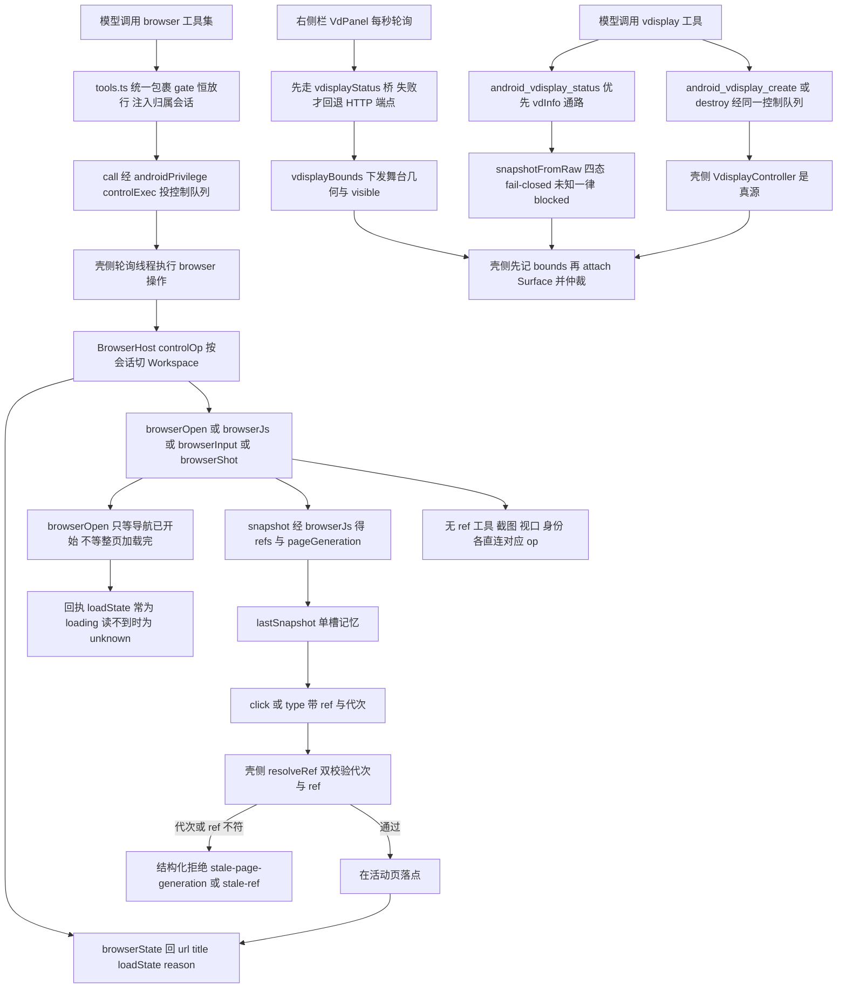
```mermaid
flowchart TD
  A["模型调用 browser 工具集"] --> B["tools.ts 统一包裹 gate 恒放行 注入归属会话"]
  B --> C["call 经 androidPrivilege controlExec 投控制队列"]
  C --> D["壳侧轮询线程执行 browser 操作"]
  D --> E["BrowserHost controlOp 按会话切 Workspace"]
  E --> F["browserState 回 url title loadState reason"]
  E --> G["browserOpen 或 browserJs 或 browserInput 或 browserShot"]
  G --> H["browserOpen 只等导航已开始 不等整页加载完"]
  H --> I["回执 loadState 常为 loading 读不到时为 unknown"]
  G --> J["snapshot 经 browserJs 得 refs 与 pageGeneration"]
  J --> K["lastSnapshot 单槽记忆"]
  K --> L["click 或 type 带 ref 与代次"]
  L --> M["壳侧 resolveRef 双校验代次与 ref"]
  M -->|"代次或 ref 不符"| N["结构化拒绝 stale-page-generation 或 stale-ref"]
  M -->|"通过"| O["在活动页落点"]
  O --> F
  G --> P["无 ref 工具 截图 视口 身份 各直连对应 op"]
  R["模型调用 vdisplay 工具"] --> S["android_vdisplay_status 优先 vdInfo 通路"]
  R --> T["android_vdisplay_create 或 destroy 经同一控制队列"]
  S --> U["snapshotFromRaw 四态 fail-closed 未知一律 blocked"]
  T --> V["壳侧 VdisplayController 是真源"]
  W["右侧栏 VdPanel 每秒轮询"] --> X["先走 vdisplayStatus 桥 失败才回退 HTTP 端点"]
  X --> Y["vdisplayBounds 下发舞台几何与 visible"]
  Y --> Z["壳侧先记 bounds 再 attach Surface 并仲裁"]
  U --> Z
  V --> Z
```

漂移：`plugins/dsh-android-browser/src/tools.ts:407` 说壳侧 `reason` 在 `BrowserHost.kt:818` 的 `lastError`，同文件 `:160` 说 `tabSummaries()` 在 `BrowserHost.kt:80-91`；源码 `lastError` 声明在 `app/src/main/java/com/dsharnessmobile/shell/BrowserHost.kt:304`、`tabSummaries()` 在 `:91`（`:818` 是 `ORPHAN_REFS`），注释锚点按 0.14.0 基线写死。
漂移：`docs/AGENTS/ARCHITECTURE.md:17` 说 AndroidBridge.kt 383 行、`:90` 说 VdisplayController.kt 389 行、`:91` 说 VdisplayHost.kt 177 行；源码现数 422 / 766 / 214 行（`wc -l`，文件末行分别为 `app/src/main/java/com/dsharnessmobile/shell/AndroidBridge.kt:422`、`VdisplayController.kt:766`、`VdisplayHost.kt:214`），同文档 `:18` 自己注明「行数每次改都会漂、不要写死」。
漂移：`docs/AGENTS/BRIDGE-API.md:117` 与 `:195` 把虚拟屏桥面写成 `vdisplayStatus/create/destroy/launchSettingsProbe/backProbe/bounds`，未列 `vdisplaySelect`（`app/src/main/java/com/dsharnessmobile/shell/AndroidBridge.kt:330`）、`forceDestroyVdisplay`（`:348`）与 Scale/Float 四个存取（`:334/:337/:341/:344`），而面板侧正在调用前两个（`plugins/dsh-android-vdisplay/src/client/index.ts:84`、`:89`）。

#### P04 文件打开、Linux 环境与模型能力插件


- **一句话**：三个引擎侧插件的合块——`dsh-android-file-open` 把壳侧拷好的外部文件变成一条「强制新会话、未发送的附件草稿」（配五条受鉴权的 exact 路由与自有临时项清单）、`dsh-android-linux-env` 提供工具链/环境配方视图与开发者选项的运行时缓存白名单清理、`dsh-model-capability` 为手填供应商路由探测能力并把缺失字段写回 settings.yaml。
- **入口/触发**：① 外部应用 `ACTION_VIEW`/`ACTION_SEND` → 壳侧 `FileIncoming.processIncomingIntent`（`app/src/main/java/com/dsharnessmobile/shell/FileIncoming.kt:379`）→ POST `/api/android/file-incoming`；② 设置页/开发者选项 → file-incoming 五条 exact 路由（GET 统计、claim、content、complete、clean）、`/api/android/env/status|recipe`、`/api/android/runtime-cache/scan|execute`；③ cordis 装配调三个插件的 `apply()`：注册工具 `android_file_incoming_status` / `android_toolchain_status` / `android_env_recipe` / `model_capability_probe` / `model_capability_apply`，并给 model-capability 起 auto-apply 轮询。
- **运行顺序**：
  1. **装配期**（引擎起来即跑）：file-open `apply`（`plugins/dsh-android-file-open/src/index.ts:481`）先 `purgeStaleUnclaimed('boot')` 清上个进程的未认领残骸 → `mkdirSync(tmpWorkspace())` → `void incomingWorkspaceId()` 异步登记「临时工作区」→ 注册五条 exact 路由（每条都 `ctx.effect` 包裹）；linux-env `apply`（`plugins/dsh-android-linux-env/src/index.ts:337`）注册两个工具 + 两条 env 路由 + 两条 runtime-cache 路由；model-capability `apply`（`plugins/dsh-model-capability/src/index.ts:238`）读构建期注入的 `lib/catalog-snapshot.json` → 注册两个工具 → `autoApply !== false` 时装一个 `setTimeout(8s)` + `setInterval(5s)` 的签名轮询 effect。
  2. **来件链**（用户动作触发）：壳侧后台单线程校验/净化/`copyIn` → POST → 鉴权 → `enqueueSession` 断言路径在临时工作区内 → 写 `.sessions/<entryId>.json` 并把 canonical 路径记进 `.tool-temp.ndjson`。
  3. **草稿链**（浏览器轮询驱动）：GET 拿公开元数据（顺带 TTL 复核）→ `ensureSessions()` 经 `ensureChain` 串行补建空白会话 → 用户导航到该会话后 POST claim（删队列记录、发进程内 ticket）→ GET content 流式回字节 → POST complete 收口；未认领记录在 boot/TTL 两档被墓碑化。
  4. **清理链**：设置页 POST clean（只删自有清单项）；开发者选项 GET scan → 展示体积 → POST execute 逐项删并落审计。
  5. **能力补给链**：签名变化才跑 `runAutoPass`（离线目录查表）→ 只对 `reasoningEfforts` 缺口出补丁 → `settings.mutate('llm-pi-ai', …)` 写 `providers.<route>.models`。
  6. 跑完把控制权交回：file-open 交浏览器 composer（不发送任何 user message）；linux-env/model-capability 把结果回给工具调用方或 HTTP 响应方。
- **嵌套与线程**：全部 HTTP handler 与工具 `execute` 跑在引擎 Node 事件循环（上游 `webServer` 同一线程）——file-open 的 `readItems/statSync/rmSync/writeFileSync`、linux-env 的 `measure/removeTree` 都是**同步 fs**，会阻塞事件循环；`createReadStream` 的 data 回调同样在事件循环。壳侧拷贝在 `dsh-file-incoming` 单线程守护执行器（`FileIncoming.kt:301`），与引擎进程无关。典型三层链：`browser GET handler → purgeStaleUnclaimed → readItems(queueDir)`；`tools.execute → toolchainStatus → liveFacts(ctx,session) → sandboxPolicy.resolve`；`interval tick → runAutoPass → discover → probePassive`。model-capability 的探测是 `globalThis.fetch` 异步，不阻塞；`ensureSessions` 的并发由 `ensureChain` promise 链串行化。
- **耦合**（点名符号）：
  - 鉴权三件套全由 `@dsh-android/dsh-android-bridge` 拥有：`shellControlToken()`（实时读壳侧 prefs `dsh-adb.xml` 的 `controlToken`，`plugins/dsh-android-bridge/src/index.ts:251`）、`authorizeMobileRoute`/`sendMobileRouteRejection`、常量 `CONTROL_TOKEN_HEADER = 'x-dsh-control-token'` 与 `FALLBACK_LOOPBACK_HOSTS = ['127.0.0.1:3080','localhost:3080']`（`plugins/dsh-android-bridge/src/route-auth.ts:4/7`）。file-open 经 `plugins/dsh-android-file-open/src/route-auth.ts:47/50` 原样转发（本包不复制安全逻辑），linux-env 直接调用。
  - 路径契约：壳侧 `FileIncoming.tmpWorkspace`（`FileIncoming.kt:32`）= `filesDir/home/.dsh/workspaces/incoming`；引擎侧 `tmpWorkspace()`（`plugins/dsh-android-file-open/src/index.ts:36`）= `$DSH_HOME/workspaces/incoming`。两侧各持一份元数据名：`.sessions`、`.meta.ndjson`、`.pending-notify.ndjson`（壳）、`.tool-temp.ndjson`（引擎）。
  - 消费端注入层：`dsh-client-ui-responsive/src/client/mobile/incoming-draft.ts`（GET + claim + content + complete）、`dsh-client-ui-responsive/src/client/dev-section/DevSection.tsx`（GET + clean）、`dsh-client-ui-responsive/src/client/dev-section/runtime-cache.tsx`（scan + execute）。
  - 路由登记表 `scripts/api-route-auth-policy.json`（五条 file-incoming + env/status + env/recipe + runtime-cache scan/execute 全列 `access: protected`）；缺登记由 `scripts/check-api-route-auth.mjs` 判红。
  - 工具链**单一来源** = `dsh-shell-termux` 根导出 `PROBE_BINARIES` / `REQUIRED_TOOLCHAIN` / `TOOLCHAIN_REPRESENTATIVE`（`dsh-shell-termux/src/index.ts:42/39/45`），linux-env 只消费（`plugins/dsh-android-linux-env/src/index.ts:30`），其 `package.json` 依赖 `file:../../dsh-shell-termux`。
  - 授权档位权威 = `ctx.androidPrivilege.status().tier`（bridge `AndroidPrivilegeService.status`，`plugins/dsh-android-bridge/src/index.ts:569`），linux-env 只在服务缺席时回落 `deployedAdbTier()`（env 快照，恒 T0）；档位实时值来自 `sandboxPolicy.resolve({session})`（`plugins/dsh-android-linux-env/src/index.ts:72`）。
  - settings 面：读必须 `.find((d) => d.ns === 'llm-pi-ai')`（坑 48，`plugins/dsh-model-capability/src/settings-config.ts:50`、`plugins/dsh-model-capability/src/index.ts:417/429`）；写是 `settings.mutate('llm-pi-ai', [{ op: 'set', path: ['providers', route, 'models'] }], descriptor.revision)` + `SETTINGS_CONFLICT` 单次重试（`plugins/dsh-model-capability/src/settings-writer.ts:239`）。
  - 目录快照 `plugins/dsh-model-capability/lib/catalog-snapshot.json`（由 `scripts/build-snapshot-013.mjs:456` 按本次 ABI 引擎树生成，`scripts/check-patch-mirror.mjs` 豁免该文件）→ `lookupCatalog`。
  - 装配集：`scripts/profile-web.cordis.patch.yml` 三条 `insert`（android-linux-env / android-file-open / model-capability）+ `scripts/plugin-dirs.json`。
  - 运行时缓存读写的路径面：`$DSH_HOME`（壳侧注入点 `EngineManager.kt:1314`）、`$DSH_FILES_DIR`（`EngineManager.kt:1316`）、当前代 `engine.log`（壳侧 `EngineAuth.tokenFromLog` 的唯一输入）。
- **关键坐标**：
  - `plugins/dsh-android-file-open/src/index.ts:238` — `enqueueSession`：路径断言 + 队列落盘 + 自有临时项记账（POST 的验收判定）
  - `plugins/dsh-android-file-open/src/index.ts:431` — `safeResolveInside`：两侧 realpath 后的工作区包含判定（H3 + 前缀混用修复）
  - `plugins/dsh-android-file-open/src/index.ts:525` — 五条 exact 路由的鉴权注册（拒绝先于 method 判定与任何副作用）
  - `plugins/dsh-android-file-open/src/index.ts:216` — `purgeStaleUnclaimed('boot'|'ttl')`：未认领草稿的墓碑化判据
  - `plugins/dsh-android-linux-env/src/index.ts:353` — 两条 env 路由的 `wsvc.register`（对照同文件 `:342` 注释与 `:386/:400` 的 `ctx.effect` 形态）
  - `plugins/dsh-android-linux-env/src/runtime-cache.ts:469` — `insideAllowedScope`：执行前的第二道白名单闸门
  - `plugins/dsh-model-capability/src/index.ts:134` — `pickDialect`：无 `compat.thinkingFormat` 即不写 `reasoningEfforts`（坑 54）
  - `plugins/dsh-model-capability/src/settings-writer.ts:239` — 唯一的 settings 写入点（set + revision + 冲突重试）
- **不变量**：
  - POST 的 `path` 必须在 `$DSH_HOME/workspaces/incoming` 内（两侧 canonical 化后比较）且存在；违反 → HTTP 200 但 body `{ok:false}`，而壳侧只认 `body.ok`（`FileIncoming.kt:342-344`）→ **静默丢件**。
  - 五条 exact 路由的鉴权必须发生在读 body、统计、删除之前；违反 → 无令牌的 GET 就能触发 `/clean` 的递归删除（FX-205.2 的原始缺陷形态）。
  - 队列记录被认领前必须拿到 durable 会话 id（`/^session-[0-9a-f]{8}-/`）；非 durable 形态（遗留 `session-1`）被判为待补建并重建（IX-TW-02）；违反症状=同一来件反复新建临时会话/草稿面板里出现两份。
  - 运行时缓存只删 `scanTargets()` 枚举出的具体项，且 `PRESERVED_TOP` 与当前代 `engine.log` 永不进删除通道；违反症状=`/api` 整条鉴权断链（`tokenFromLog` 拿不到令牌）或用户资产被删。
  - 写回只填缺失字段（或我方旧戳值），且**方言不明时不写 `reasoningEfforts`**；违反症状=请求按错误方言序列化被网关 400，且档位被新会话继承。
  - `settings.describe(options)` 的 options 被实现忽略（坑 48）：只能用 `.find(d => d.ns === 'llm-pi-ai')`；违反症状=能力自动补给静默不写回、永不生效。
- **症状 → 排查**：
  1. **分享文件后不出现草稿会话、也没有提示**：`adb logcat -s dsh-file-open`（找 `incoming processed` / `pending incoming flushed` / `incoming rejected (ownership assertion)` / `temp workspace clean skipped`）；再看引擎日志 grep `未认领来件过期清理`、`路径不在临时工作区内`；队列现场 `adb shell run-as com.dsharnessmobile.shell ls files/home/.dsh/workspaces/incoming/.sessions`（残留记录 = 补建失败或未领取）。401 形态的静默丢件查壳侧与引擎的令牌是否同源（`dsh-adb.xml` 的 `controlToken`，`X-DSH-Control-Token` 头）。
  2. **设置页「临时工作区」占用不清零 / 点清理返回 `removed: 0`**：`/clean` 只删 `.tool-temp.ndjson` 记账项；前缀形态不一致会让 `ownedInsideWorkspace` 判为越界。grep 引擎日志 `已自愈删除非 canonical 的临时工作区残留`、`workspaceRegistry.list 失败`；对照响应里的 `removed` 与清单文件行数。
  3. **自定义供应商不出现思考档位 / 出现了但请求被网关拒**：轨迹文件 `$DSH_HOME/model-capability.log`（默认开，`DSH_MODEL_CAPABILITY_TRACE=0` 关）grep `tick:`、`runAutoPass(`、`未给出统一 thinkingFormat`、`仅部分目录声明`、`SETTINGS_CONFLICT`、`namespace-absent`；引擎日志 grep `auto-apply`。
  4. **工具链状态与设置页/实际不符**：`android_toolchain_status` 的 `missing` 是**包名**口径（bash 缺失 → 整表 `unusable`），也是 ST-17 单一表的回归点：`grep -n "PROBE_BINARIES" dsh-shell-termux/src/index.ts plugins/dsh-android-linux-env/src/index.ts`；档位显示以 `android_privilege_status`（`androidPrivilege.status()`）为准，工具文本里的 adbTier 只是部署默认视图。
  5. **点了「清除运行时缓存」几乎没释放**：本版白名单只有 `engine.log.1..N` 与 `DSH_HOME/.node-compile-cache`（`cache/**` 整类以 `reason=not-allowlisted` 跳过）。看 GET `/api/android/runtime-cache/scan` 返回的 `skipped[].reason`（`log-root-unresolved` / `current-generation-absent` / `not-allowlisted` / `preserved` / `scope-rejected`）与 `label`（`$DSH_HOME/...` 形态）；审计落 `$DSH_FILES_DIR/audit/runtime-cache.ndjson`。
- **可疑点**：
  1. 【已确认，安全面；COMPAT-REVIEW §5.12 / H-11 仍在待办】`FileIncoming.SAFE_PREFIXES`（`app/src/main/java/com/dsharnessmobile/shell/FileIncoming.kt:35-38`）含本应用私有目录 `/data/user/0/com.dsharnessmobile.shell/` 与 `/data/data/...`，任意第三方应用 `ACTION_VIEW` 一个 `file://…/home/.dsh/.credentials.yaml` 就能让壳把它拷进临时工作区；引擎侧 `enqueueSession`（`plugins/dsh-android-file-open/src/index.ts:238-261`）只断言「在临时工作区内且存在」，**不验来源**，于是该文件变成一条未发送草稿，经 claim/content 可被取出（借壳读自身凭据）。
  2. 【已确认（代码面），一致性】linux-env 的两条 env 路由没有走 `ctx.effect`：`plugins/dsh-android-linux-env/src/index.ts:349-376` 在 `for` 循环里直接 `wsvc.register(...)`，而同文件 `:342` 的注释明确要求「热重载/卸载必须回收路由，不留重复 handler」，同文件 `:386/:400` 的 runtime-cache 路由与 file-open 五条（`plugins/dsh-android-file-open/src/index.ts:525/603/695/750/811`）都用了 `ctx.effect`。触发条件=热重载或卸载本插件；影响=旧 handler 残留、同名路由重复注册（未在设备上复现，运行期影响未证实）。
  3. 【已确认（代码 + 目录快照实测），写回口径】`mergeCatalog` 给模型设 `model.compat` 时不写 `model.sources`（`plugins/dsh-model-capability/src/index.ts:166-169`），而 `report.unknown` 按 `sources` 是否为空判定（`:195-198`）；按真实算法在 `plugins/dsh-model-capability/lib/catalog-snapshot.json` 上实测：**181 / 961** 个模型 id 会落到「有 dialect、无 thinkingLevelMap」。于是 `model_capability_apply`（offline 默认 true）会把 `compat.thinkingFormat` 等写进 settings，同时工具文本把这批模型列进「未获得能力元数据：…」——报告与实际写入自相矛盾（触发条件：路由声明了这批 id 之一并调用 apply）。
  4. 【已确认（代码面），配置写入面】`planModelPatch` 把字符串形态的模型条目规范化成对象（`plugins/dsh-model-capability/src/settings-writer.ts:134`），而第 181 行的判据 `changes.length > 0 || next !== entry` 中 `next !== entry` **恒真**（`next` 是新对象）→ 只要该 id 命中 patch，条目必被替换；若同一次调用里该路由另有字段被写，用户写的 `models: ['a','b']` 会被改写成 `[{id:'a'},…]`（值不变、representation 变）。同函数 `changes` 跨 patch 累积，判据本身形同虚设（可单测复现）。
  5. 【已确认（代码面），存储面】诊断轨迹默认开启且 `tick()` 在早退前无条件写一行（`plugins/dsh-model-capability/src/index.ts:105-113` 与 `:462`，interval 见 `:474`），默认每 5 秒一次 → `$DSH_HOME/model-capability.log` 约 1.7 万行/天、无轮转、无上限；它不在运行时缓存白名单里（`plugins/dsh-android-linux-env/src/runtime-cache.ts:59` 的 `CACHE_SUBDIR_ALLOW` 为空集、`:73` 的 `HOME_CACHE_ALLOW` 只有 `.node-compile-cache`），所以本块新上线的「清除运行时缓存」收不回这份增长。
- **漂移**：
  - 漂移：`app/src/main/java/com/dsharnessmobile/shell/FileIncoming.kt:326` 注释说「三条 file-incoming exact 路由」（`plugins/dsh-android-file-open/src/index.ts:20` 同样写「三条」），实际注册五条（`plugins/dsh-android-file-open/src/index.ts:527/605/697/752/813`，`scripts/api-route-auth-policy.json` 也列五条），`docs/AGENTS/BRIDGE-API.md:198` 按五条记。
  - 漂移：`app/src/main/java/com/dsharnessmobile/shell/FileIncoming.kt:97-99` 注释说「canonical 形态会被插件 `safeResolveInside` 的**词法首门**拒绝」，源码 `plugins/dsh-android-file-open/src/index.ts:431-452` 是**两侧都 realpath 后**比较（只有 ws 侧 realpath 抛错时才回落词法），不存在会拒 canonical 的词法首门——该注释会把维护者引向不必要的路径形态限制。

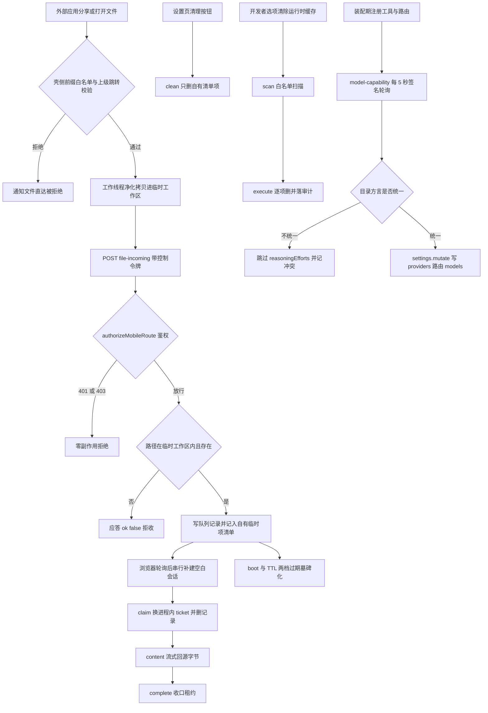
```mermaid
flowchart TD
  A["外部应用分享或打开文件"] --> B{"壳侧前缀白名单与上级跳转校验"}
  B -->|"拒绝"| B2["通知文件直达被拒绝"]
  B -->|"通过"| C["工作线程净化拷贝进临时工作区"]
  C --> D["POST file-incoming 带控制令牌"]
  D --> E{"authorizeMobileRoute 鉴权"}
  E -->|"401 或 403"| E2["零副作用拒绝"]
  E -->|"放行"| F{"路径在临时工作区内且存在"}
  F -->|"否"| F2["应答 ok false 拒收"]
  F -->|"是"| G["写队列记录并记入自有临时项清单"]
  G --> H["浏览器轮询后串行补建空白会话"]
  H --> I["claim 换进程内 ticket 并删记录"]
  I --> J["content 流式回源字节"]
  J --> K["complete 收口租约"]
  G --> L["boot 与 TTL 两档过期墓碑化"]
  M["设置页清理按钮"] --> N["clean 只删自有清单项"]
  O["开发者选项清除运行时缓存"] --> P["scan 白名单扫描"]
  P --> Q["execute 逐项删并落审计"]
  R["装配期注册工具与路由"] --> S["model-capability 每 5 秒签名轮询"]
  S --> T{"目录方言是否统一"}
  T -->|"不统一"| T2["跳过 reasoningEfforts 并记冲突"]
  T -->|"统一"| U["settings.mutate 写 providers 路由 models"]
```

### 注入层子仓

#### S01 引擎侧注入层（三个子仓）


> 权威源在协调仓同名路径，`dsh-mobile-apk/<同名目录>` 是逐字节镜像（本轮三个子仓 `src`/`lib`/`scripts` 均一致，仅 `dsh-shell-termux/README.md` 有 6 行行尾差异，见漂移行）。行号按 apk 仓副本读取。

- **一句话**：在引擎返回的页面里发布五个 DOM 锚点与若干桥入口（手机形态、会话身份、返回栈、打开路径、弹出面板几何），并给老内核补 polyfill——页面侧一切「安卓味」都从这里进。
- **入口/触发**：
  - 引擎侧装载：`scripts/profile-web.cordis.patch.yml` 的 insert 行拉起三个子仓（`shell-termux` 引擎插件、`host-web-compat` 宿主插件、`ui-responsive` 客户端插件）。
  - 每个 index 响应：`host-web-compat` 用 `ctx.webServer.tapIndex` 在 `</head>` 前注入四段脚本（polyfill + 看门狗 + 主题桥 + 目录选择/打开路径桥）。
  - 页面事件：客户端插件 `apply()` 装载后，全部由 click/keydown/MutationObserver/ResizeObserver/定时器驱动；壳侧回呼 `window.__dshBack`、`window.__dshOpenPath`、`window.__dshBridge.onDirectoryPicked`。
- **运行顺序**：
  1. 引擎启动、WebUI 被打开：`host-web-compat.apply()` 先做 `assertInjectionsParse`（`dsh-host-web-compat/lib/index.js:770`），失败即抛 → 插件树装载失败、引擎起不来；通过则注册两次 `tapIndex`（`:783` 主体注入、`:791` 静态失败占位）与三条端点 `/api/android/dir-pick/poll`、`/dir-pick/result`、`/open-path`（`:803-878`）。页面先跑注入脚本（主题桥同步取 `getSystemDark`、picker poll 每 500ms、看门狗 40s 判据 + `readyWatch` 500ms 报就绪），再跑上游 boot 与客户端插件。
  2. 客户端插件装载：`index.ts:125` 的 `apply()` 按固定顺序注入样式表（mobile-form → mobile-settings → composer-row → composer-insets → composer-menu → attachment-picker-menu → trajectory-details → dev-section），再挂各 marker/守卫（`form-marker` `:135`、`composer-popup-guard` `:163`、`trajectory-panels-observer` `:182`、`enter-guard` `:198`、`keyboard-boundary` `:209`、`theme-bridge` `:218`）、注册槽位（`settings.section` ×2、`settings.general.item`、`shell.overlay` ×2、`conversation.session.header.utilities`、`sidebar.right.pane.tab` ×2）、注册两个 tab 类型（open-with、AI 浏览器）、启动 browser auto-place 轮询（1s）与来件草稿轮询（4s）。
  3. 交给谁：标记与桥交给壳侧（K04：`dshBackBridge.setAvailable`、`__dshExportResult`、`__dshThemeBridge`、`browserHost*`），控件交给上游 frame 渲染；此后每次返回键/点击/可见性变化回到本块的入口函数。
  - `shell-termux` 与页面无关：引擎启动时以 `ctx.shell` provider 身份装载，模型每次 bash 调用走 `resolve()`（盖 Termux env）→ `run()/start()`；`probe()` 的工具链表被 `plugins/dsh-android-linux-env` 与 `android_toolchain_status` 复用。
- **嵌套与线程**：调用链最多 3 层，全部书写于页面主线程（JS 单线程），跨语言处才换线程：
  1. 目录选择：注入脚本 poll → `fetch(/api/android/dir-pick/poll)` → `androidBridge.pickDirectory`（JavaBridge 线程）→ SAF Activity（壳侧主线程）→ 回来经 `__dshBridge.onDirectoryPicked` → `POST /result` → 引擎侧 Promise 结算（引擎线程）。
  2. 打开路径：document capture click → `window.__dshOpenPath` → `androidBridge.openPathChooser`（JavaBridge 线程）→ 系统选择器。
  3. 返回键：Activity `OnBackPressedCallback`（主线程）读 `BackGateState` 的 `@Volatile` 缓存（JavaBridge 线程写）→ `evaluateJavascript(window.__dshBack())`（页面主线程关层）→ 层锚点消失（MutationObserver 异步批）→ `dshBackBridge.setAvailable`（JavaBridge 线程，同步跳）。
  另有定时器：picker poll 500ms、incoming-draft 4s（加最多 100×100ms 等 session scope）、BrowserAutoPlace 1s、browser-tab 300ms/200ms、`useShellState` 轮询（虚拟屏 2s、无障碍 3s）。
- **耦合**（发布者 → 消费者，全部点名符号）：
  - `html[data-dsh-mobile-form]` ← `form-marker.ts:88`；消费者：`mobile-form.css.ts:26,48,55`、`mobile-settings.css.ts:15`、`composer-menu.css.ts:25-41`、`trajectory-details.css.ts:16`、`reference-menu.ts:133`、`back-stack.ts:347`，以及引擎树补丁 `reference-drill-F6` 的 `document.documentElement.hasAttribute("data-dsh-mobile-form")`（`scripts/patches/apply-patches.mjs:865`）与设备侧 `scripts/verify-webview-015.mjs:11`。
  - `[data-dsh-frame]` ← `form-marker.ts:96`（由 `[data-rightbar-col]` 反查）；消费者：`mobile-form.css.ts`、`keyboard-boundary.ts:67`、`MobileChrome.tsx:35`、`back-stack.ts:348`、`host-web-compat` 看门狗 `rendered()`（`dsh-host-web-compat/lib/index.js:136`）。
  - `html[data-dsh-modal-open]` / `[data-dsh-settings-dialog]` ← `form-marker.ts:83` / `:81`；消费者：`mobile-form.css.ts:55`（modal 在场时抽屉不位移）、`mobile-settings.css.ts:15`、`settings-document.ts:65`。
  - `[data-dsh-mobile-topbar]` ← `MobileChrome.tsx:85`；消费者：`composer-popup-guard.ts:140`（取 topbarBottom 算高度钳制）。`data-dsh-mobile-mask`（`MobileChrome.tsx:82`）两仓全量 grep 无消费者，仅发布。
  - 弹出面板几何：`composer-popup-guard.ts:165/171/184` 写 `--dsh-mobile-popup-max-width`、`--dsh-mobile-popup-shift`、`--dsh-mobile-menu-max-height` 与 `[data-dsh-popup]`；消费者 `composer-menu.css.ts:25-48`。
  - 引用菜单多选：`data-dsh-ref-check/-on/-key/-bar/-bar-count/-add` ← `reference-menu.ts:211-244`；消费者 `REFERENCE_BAR_CSS`（同文件 `:57`）+ 内联 `style.setProperty(..., 'important')`。
  - 附件来源菜单：`data-dsh-attachment-picker-menu/-item/-trigger` ← `attachment-picker-menu.ts:158/165/179`；消费者 `ATTACHMENT_PICKER_MENU_CSS`。
  - `html[data-dsh-session-id]` ← `session-marker.ts:67`；消费者：`browser-auto-place.ts:85`（`domCurrentSessionId`）、`dsh-host-web-compat/lib/index.js:480`（随 open-path 请求带 sessionId）。
  - `html[data-dsh-incoming-draft-consumer]` / `-poll` ← `index.ts:444` / `incoming-draft.ts:86-189`；消费者：测试 `dsh-client-ui-responsive/tests/incoming-draft.spec.ts:166`（页面侧标记，壳侧不读）。
  - `dsh-mobile-ledger-raised` / `dsh-mobile-hide-session-log-dialog` class ← `trajectory-panels-observer.ts:43` / `session-log-dialog-observer.ts:56`；消费者 `trajectory-details.css.ts:44` / `session-log-dialog.css.ts:40`。
  - 壳写页读的变量：`--dsh-android-system-top/-bottom/--dsh-android-ime-bottom/-left/-right` ← `MainActivity.kt:923-924`（pushWebInsets）；消费者 `mobile-form.css.ts:21,45,74`、`composer-insets.css.ts:13-17`、`keyboard-boundary.ts:94`。
  - 插件内服务面：`ctx.layout.toggleSidebar`（`index.ts:265`、`back-stack.ts:416`）、`ctx.sidebarRight.openTabIn`（`browser-auto-place.ts:239`）、`ctx.sessions.refresh/open/scope` 与 `ctx.conversation.addFiles`（`index.ts:448-474`）。
  - 端点面：本块自建 `/api/android/dir-pick/*`、`/api/android/open-path`（token 门 `x-dsh-pick-token`，`dsh-host-web-compat/lib/index.js:802`）；页面另有消费 `/api/android/file-incoming*`（`plugins/dsh-android-file-open/src/index.ts:527`）与 `/api/android/runtime-cache/*`（`plugins/dsh-android-linux-env/src/index.ts:388`）。
  - **与壳侧桥（K04）的调用点清单**（`androidBridge` 方法 → 页面调用点）：
    - `getSystemDark` → `dsh-host-web-compat/lib/index.js:389`、`theme-bridge.ts:81`
    - `pickDirectory` → `dsh-host-web-compat/lib/index.js:430`；`getPickToken` → `dsh-host-web-compat/lib/index.js:400,424,515`
    - `openPathChooser` → `dsh-host-web-compat/lib/index.js:411`、`open-path.ts:33`、`settings-document.ts:78`；`openNativePath` 回退 → `dsh-host-web-compat/lib/index.js:416`
    - `settingsPath` / `exportSettingsDocument` → `settings-document.ts:34,50`（页面类型面未声明，已在 `scripts/bridge-symmetry-baseline.json` 登记）
    - `getImmersiveMode` / `setImmersiveMode` → `GeneralSettings.tsx:43,71`
    - `getDevLogEnabled` / `setDevLogEnabled` → `DevSection.tsx:60,186`；`getOverlayEnabled` / `setOverlayEnabled` → `DevSection.tsx:31,199`
    - `hasAllFilesAccess` → `DevSection.tsx:72`；`exportConfig` / `importConfig` → `DevSection.tsx:220,230`
    - `restartEngine` / `shutdownToGuide` / `reloadWebUI` / `openConsole` → `DevSection.tsx:152,162,170,178`
    - `getScreenScope` / `setScreenScope` → `phone-control.tsx:42,116`、`screen-control.tsx:18,55`
    - `vdisplayStatus` → `phone-control.tsx:52`、`screen-control.tsx:28`；`getVdisplayScale` / `setVdisplayScale` → `phone-control.tsx:68,121`
    - `getVdisplayFloatEnabled` / `setVdisplayFloatEnabled` → `phone-control.tsx:78,126`；`a11yStatus` / `openA11ySettings` → `phone-control.tsx:86,131`
    - `forceDestroyVdisplay` → `phone-control.tsx:143`；`getNotifySetting` / `setNotifySetting` → `notify-settings.tsx:66,86`
    - `incomingWorkspacePath` → `incoming-draft.ts:150`；`browserHostStatus` → `browser-tab.tsx:200,250,317` 与 `index.ts:380`
    - `browserHostBounds` → `browser-tab.tsx:229`；`browserHostViewport` → `:335`；`browserHostIdentity` → `:373`；`browserHostShow` → `:256,354`；`browserHostHide` → `:274,283`；`browserHostReload` → `:352`
    - 本块无页面调用点（归壳侧/文件面板/浏览器插件）：`version`、`checkEngine`、`keepScreenOn`、`showNotification`、`copyText`、`requestAllFilesAccess`、`unlockRestrictedSettings`、`vdisplayCreate`、`vdisplayDestroy`、`vdisplayBounds`、`vdisplaySelect`、`browserHostClose`
  - **非 androidBridge 的页壳契约**：`window.dshBackBridge.setAvailable` ← `back-stack.ts:428`（消费方 `MainActivity.kt:803` 注入、`BackGate.kt:126`）；`window.__dshBack` / `__dshBackDepth` 被 `BackGate.kt:38,44` 求值；`window.__dshExportResult` ← `index.ts:432`，生产方 `MainActivity.kt:1030`、`DownloadSaver.kt:61`；`window.__dshThemeBridge.setDark` ← `theme-bridge.ts:68` 与 `dsh-host-web-compat/lib/index.js:381`，生产方 `MainActivity.kt:880,886`；`window.__dshBridge.onDirectoryPicked/onPermissionRequired` ← `dsh-host-web-compat/lib/index.js:398-405`，生产方 `ConfigTransfer.kt:117,241`；`window.__dshOpenPath` ← `dsh-host-web-compat/lib/index.js:409`；看门狗/就绪行经 `console.error` 的 `[dsh-boot-stall]` / `[dsh-boot-ready]` 前缀（`dsh-host-web-compat/lib/index.js:302,267`）被 `LogCollector.kt:740,742` 与 `EngineStartFlow.kt:206,224` 消费。
- **关键坐标**：
  - `dsh-host-web-compat/lib/index.js:552` — `POLYFILL_SCRIPT_BODY` 逐段补分号 + 换行装配（坑 61 防线①）。
  - `dsh-host-web-compat/lib/index.js:770` — 装载期 `assertInjectionsParse` 四段脚本逐段 `new Function` 断言（防线②）。
  - `dsh-host-web-compat/lib/index.js:783` 与 `:791` — 两次 `tapIndex`：前者带 `x-dsh-pick-token` 幂等哨兵，后者是独立哨兵的静态失败占位。
  - `dsh-client-ui-responsive/src/client/mobile/form-marker.ts:88` — `html[data-dsh-mobile-form]` 唯一发布点。
  - `dsh-client-ui-responsive/src/client/mobile/back-stack.ts:252` — `window.__dshBack` 入口（壳侧返回键唯一可达点）；`:428` 是上行 `setAvailable` 的唯一出口。
  - `dsh-client-ui-responsive/src/client/mobile/browser-tab.tsx:229` — `browserHostBounds` 跨桥下推（原生覆盖层几何/可见性的唯一来源）。
  - `dsh-client-ui-responsive/src/client/enter-guard.ts:63` — 形态门用 `window.innerWidth` 直读（与标记不同源）。
  - `dsh-shell-termux/src/index.ts:184` — `DSH_WRITE_MODE/DSH_WORKSPACE/DSH_SHARED_DIRS` 拒绝被 `request.env` 覆盖。
- **不变量**：
  1. 注入脚本必须「装配后可解析」：`POLYFILL_SCRIPT_BODY` 给每段补分号，`apply()` 装载期断言失败即抛，`scripts/smoke-injections.mjs` 为门禁③。违反 → 整个 `<script>` 被解析器拒绝，页面报 `Iterator is not defined` / `Promise.withResolvers is not a function`，表现为 Failed to load plugins（坑 61）。
  2. 手机形态只有 `html[data-dsh-mobile-form]` 一个锚点（767px 单一来源）。违反 → 弹出面板越界、设置页窄条、轨迹详情被顶栏遮（坑 59）；反面是宽视口注入手机专用 chrome。
  3. 任何 `tapIndex` 注入体的**求值后**文本不得含裸 `</head>` 或 `</script>`（第二次注入的 `replace` 会命中注释里的 `</head>`，把内容塞进 `<script>` 内部并渲染成满屏源码）。判据在 `dsh-host-web-compat/scripts/boot-watchdog.test.mjs:231`。
  4. `/api/android/dir-pick/*` 与 `/open-path` fail-closed：`DSH_PICK_TOKEN` 为空一律 403（`dsh-host-web-compat/lib/index.js:802`）；只有 `/storage/emulated/0/` 前缀且无 `..` 的路径被接受（`:726-730`）。
  5. 返回栈只通过「层锚点消失」收敛，观测不到或关不掉的层必须消费返回键，绝不退出应用（`back-stack.ts:30-33`）。
  6. 壳侧状态展示一律回读真源：组件不得在 `useState` 初值器直读桥（`use-shell-state.ts:26` 的单入口；`tests/shell-state-discipline.spec.ts` 守）。违反 → 从系统设置返回后显示旧值。
- **症状 → 排查**：
  - 白屏/停在 Loading plugins，且服务出的 HTML 里能看到垫片文本 → 装配后不可解析（坑 61）：跑 `node dsh-host-web-compat/scripts/smoke-injections.mjs`（逐段解析 + 页面标记）；看 `files/boot-diag.log`（`adb shell "run-as com.dsharnessmobile.shell cat files/boot-diag.log"`）里的 `dsh-boot-diag` 行与 `pageSideRuntime=`；logcat 过滤 `[dsh-boot-stall]` / `[dsh-boot-ready]`；grep `POLYFILL_SCRIPT_BODY`、`assertInjectionsParse`。
  - 抽屉打不开、设置页只显示窄条、轨迹详情被遮 → 锚点没发布或没人消费（坑 59）：CDP 求值 `document.documentElement.hasAttribute('data-dsh-mobile-form')`、`document.querySelectorAll('[data-dsh-frame]').length`、`document.querySelector('[data-dsh-mobile-topbar]')`;再 grep 这五个锚点确认消费方样式在场。
  - 点工具行文件链接弹「无法打开该文件」或点击无反应 → 会话身份/端点：CDP 读 `document.documentElement.getAttribute('data-dsh-session-id')`；页面 console 的 `[dsh-open-path]` 警告与底部提示条；端点返回体里的 `error` 取值 `session-unknown` / `not-found-in-session` / `not-found`（`dsh-host-web-compat/lib/index.js:895-940`）。
  - 目录选择器连弹多次或选完无反应 → poll 一次性投递与 token：`adb logcat` 看 SAF 与 `dsh-log`；grep `takePoll`（同一 requestId 只投一次）、`x-dsh-pick-token`；返回 `403 forbidden` 即 `DSH_PICK_TOKEN` 与页面 `getPickToken()` 不一致（`EngineManager.kt:1463`）。
  - 返回键直接退出应用或层数不降 → `adb logcat -d | grep dsh-back`（`BackGate.TAG`）；CDP 读 `window.__dshBackDepth` / `__dshBackKinds`；层判据 grep `RIGHT_FULLSCREEN_SELECTOR`（`data-sidebar-right-open` 是权威 open 信号）、`data-sidebar-right-expand`。
- **可疑点**：
  - `dsh-host-web-compat/scripts/smoke-injections.mjs:50` + `dsh-host-web-compat/lib/index.js:783,791`（已确认，静态可推）：脚本断言 `transforms.length === 1`，而 `apply()` 现在注册两次 `tapIndex`（polyfill 块 + 静态占位块）→ 该断言必红、`npm test` 与子仓 PR gate 的「注入冒烟」整条红。这是坑 61 防线③（门禁）与源码脱同步；apk 仓自己的 `.github/workflows` 不跑这个脚本，所以本仓 CI 不会暴露。修法：断言改 `>= 1` 或按哨兵分别断言。
  - `dsh-client-ui-responsive/src/client/mobile/attachment-picker-menu.ts:132-138`（代码路径确认，设备未证实）：附件来源菜单只订阅 click/pointerdown/Escape，**不是返回栈的一层**（`back-stack.ts:83` 只认 `[data-trigger-menu]`）。系统返回键不产生 pointerdown/Escape，而 `BackGate.decide` 在「无历史 + 无层」时给 `FINISH_ACTIVITY`（`BackGate.kt:56-60`）→ 菜单开着按返回会直接退应用而不是先关菜单。
  - `dsh-client-ui-responsive/src/client/mobile/browser-tab.tsx:206-241` + `:142-166`（已确认，COMPAT-REVIEW N-9 已登记）：`publishBounds` 每次都做 `getBoundingClientRect` + `getComputedStyle` + 跨桥 `browserHostBounds`，无「上次元组」去重，而 `watchStageVisibility` 在 `[style,class,hidden,...]` 任意属性变化时按帧触发 → 流式输出期间可能每帧一次桥调用与原生 `setStageBounds`。
  - `dsh-client-ui-responsive/src/client/enter-guard.ts:63`（未证实）：767 形态门在本块有多个副本——`enter-guard` 读 `window.innerWidth`，`keyboard-boundary.ts:48`、`reference-menu.ts:45`、`mobile-form.css.ts:25`、`MobileChrome.module.css:18` 各自写 `(max-width: 767px)`。视口与 `matchMedia` 在同一帧不一致（旋转/缩放/滚动条）时，Enter 守卫与已发布标记会给出不同答案；`coord:docs/STATE-STALENESS-AUDIT-2026-09-12.md:196` 已把这条列为已知多副本。
  - `dsh-client-ui-responsive/src/client/mobile/form-marker.ts:45`（未证实，潜伏项）：`syncModal` 只观察 `childList` 不观察 `attributes`，`data-dsh-modal-open` / `data-dsh-settings-dialog` 依赖「对话框条件挂载」这一上游实现细节。上游若改成属性切换同一节点，modal 标记会滞留或缺失 → 抽屉被顶到设置弹层之上/之下；`coord:docs/STATE-STALENESS-AUDIT-2026-09-12.md:681` 记为潜伏项。

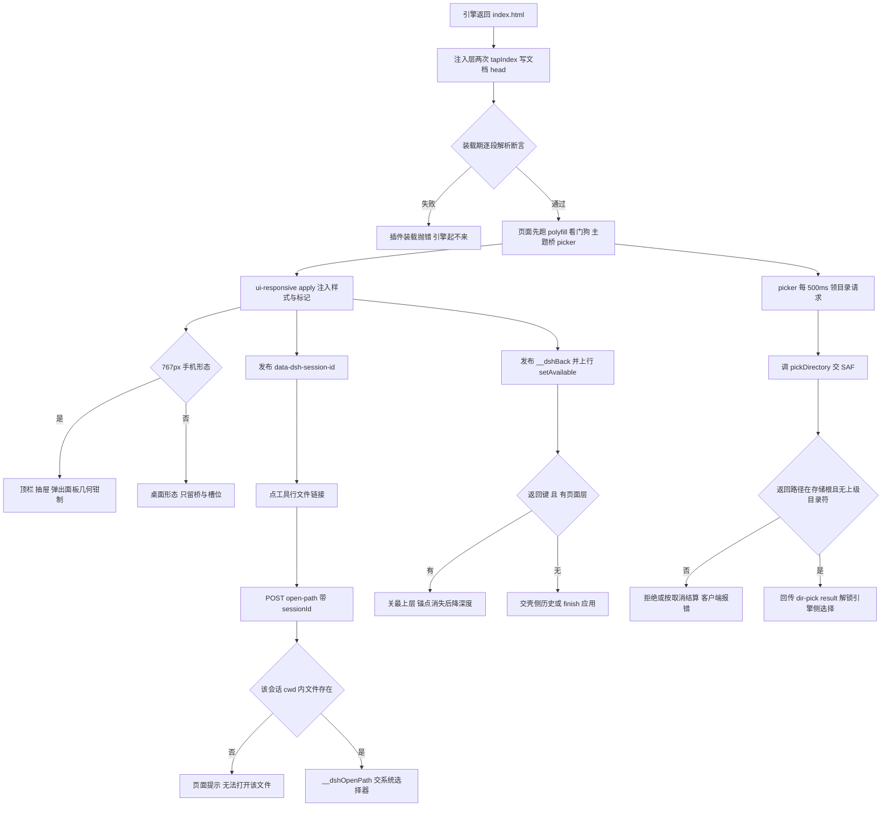
```mermaid
flowchart TD
  T1["引擎返回 index.html"] --> T2["注入层两次 tapIndex 写文档 head"]
  T2 --> T3{"装载期逐段解析断言"}
  T3 -->|"失败"| F1["插件装载抛错 引擎起不来"]
  T3 -->|"通过"| T4["页面先跑 polyfill 看门狗 主题桥 picker"]
  T4 --> T5["ui-responsive apply 注入样式与标记"]
  T5 --> G1{"767px 手机形态"}
  G1 -->|"是"| G2["顶栏 抽屉 弹出面板几何钳制"]
  G1 -->|"否"| G3["桌面形态 只留桥与槽位"]
  T4 --> P1["picker 每 500ms 领目录请求"]
  P1 --> B1["调 pickDirectory 交 SAF"]
  B1 --> B2{"返回路径在存储根且无上级目录符"}
  B2 -->|"否"| F2["拒绝或按取消结算 客户端报错"]
  B2 -->|"是"| B3["回传 dir-pick result 解锁引擎侧选择"]
  T5 --> S1["发布 data-dsh-session-id"]
  S1 --> C1["点工具行文件链接"]
  C1 --> C2["POST open-path 带 sessionId"]
  C2 --> C3{"该会话 cwd 内文件存在"}
  C3 -->|"否"| F3["页面提示 无法打开该文件"]
  C3 -->|"是"| O1["__dshOpenPath 交系统选择器"]
  T5 --> K1["发布 __dshBack 并上行 setAvailable"]
  K1 --> K2{"返回键 且 有页面层"}
  K2 -->|"有"| K3["关最上层 锚点消失后降深度"]
  K2 -->|"无"| K4["交壳侧历史或 finish 应用"]
```

漂移：`dsh-mobile-apk/docs/AGENTS/gotchas.md:103`（坑 61）说防线③是「常驻 `node dsh-host-web-compat/scripts/smoke-injections.mjs` 门禁」，源码 `dsh-host-web-compat/lib/index.js:783,791` 已是两次 `tapIndex`，而 `dsh-host-web-compat/scripts/smoke-injections.mjs:50` 仍断言 `transforms.length === 1` —— 该门禁当下是红的（apk 仓 `.github/workflows` 不跑它）。

漂移：`dsh-mobile-apk/docs/AGENTS/BRIDGE-API.md:117` 说 AndroidBridge 桥面「方法计数由 `check-bridge-symmetry.mjs` 从源码守」，但该清单及其余各表都未收录 0.14.1 新增的 `getNotifySetting` / `setNotifySetting`，源码 `app/src/main/java/com/dsharnessmobile/shell/AndroidBridge.kt:372,381` 已实现，页面 `dsh-client-ui-responsive/src/client/dev-section/notify-settings.tsx:66,86` 已在调用。

漂移：apk 仓 `dsh-shell-termux/README.md` 与协调仓同名副本不是逐字节镜像（6 行行尾 CRLF/LF 差异，正文逐字相同，无功能影响）。

### 构建、门禁与设备验收

#### B01 构建链与快照注入

- **一句话**：把「一次打包命令」变成可发布的 APK：先在 WSL 内从基座建出注入前的运行时快照，再逐 ABI 注入插件与补丁、过完整门禁集、写快照指纹并 gradle 出包，任一 ABI 被拒即整链非 0。
- **入口/触发**：
  - 快照段：`node scripts/build-snapshot-013.mjs arm64 或 x86_64`（Windows 上自动重入 WSL；前置是 `.deploy-tmp/{arm64-base,x64-base}/base-usr.tar.xz`）。
  - 打包段：`pwsh -File scripts\build-apk-013.ps1 [-Suffix ""] [-Fast] [-OnlyAbi 指定 ABI] [-SkipInject] [-ExportSnapshots]`，**在协调仓根执行**（apk 仓 AGENTS.md:30；apk 仓副本 scripts/ 与协调仓逐字节镜像，权威源在协调仓同名路径——本条目行号一律取 apk 仓副本）。
  - 间接入口：发布链 `scripts/build-release.ps1:56,60,147` 与 CI/云端 `dsh-mobile-apk/scripts/build-apk.mjs` 跑同一套门禁集（`check-release-gates.mjs:136-140` 断言接线）。
- **运行顺序**：
  - 第 1 段（快照构建，无注入）：Windows 宿主自重重入 WSL（`build-snapshot-013.mjs:31-45`，可用 `DSH_NO_WSL_REEXEC=1` 关闭）→ 基座与 base-dsh 解压到 ext4 stage（`:120-126`，`xz -dT「XZ_THREADS 线程」 | tar -x`）→ 机密剥离 + seed settings.yaml + patchReload 出厂值（`:134-153`）→ 剥离清单后置断言（`:168-175`）→ 引擎 overlay 逐包 tgz 覆盖（`:192-275`，登记表 snapshot-config/engine-overlay.json）→ 引擎树补丁 `apply-patches.mjs --apply --scope engine` 并逐条复查 marker、再跑四项行为回归（`:291-350`）→ chrome87 语法降级 + 复扫（`:366-413`）→ combo 缓存预计算（`:415-447`）→ 能力目录快照（`:449-460`）→ Termux 索引/依赖闭包/deb 下载校验/提取（`:462-599`）→ dpkg status 初始化（`:601-615`）→ shebang 与 RUNPATH 重写（`:617-624`）→ 三缺陷固化 tar/git/rg + cordis.patch.yml 权威覆盖（`:626-693`）→ pnpm/canvas/apt-dpkg wrapper/install-clang.sh（`:694-864`）→ 错位目录剔除与瘦身（`:866-925`）→ 软链自净化（`:933-966`）→ 归档 `tar -c --mtime=@「固定纪元」 | xz -T「XZ_THREADS 线程」 -6` 并写 snapshot.sha256（`:968-989`）→ 归档内 LICENSES、旧 Termux 前缀软链、A1 出厂值三道自检（`:997-1046`）。产出 `.deploy-tmp/snapshot-013/「abi」/snapshot.tar.xz`。
  - 第 2 段（打包编排）：循环外先跑静态门禁（`build-apk-013.ps1:37-146`，含补丁镜像 `:38`、契约 `:45`、状态登记/桥对称/SKIP 纪律 `:51-58`、中止语义自检 `:62`、指纹预检 `:69`、manifest/注释/有界读/路由鉴权/协议 V2/工具 schema/控制 op/插件单测/冷启动预算/构建器产出面/并发上限/Kotlin 单测数量）→ pi-ai 目录 diff（`:150-161`，信息性不拒）→ 读 build.gradle.kts 版本定 out 目录（`:164-165`）→ 逐 ABI（arm64、x86_64 顺序，`:182`）：overlay 抽验（`:193`）→ vendor 补丁门禁（`:211`）→ 注入段语法降级到暂存副本（`:229-264`，vendor 是入库跟踪文件，禁就地改写）→ 注入段 combo 增量预计算（`:270-276`）→ `inject-all.py` 单 pass 注入（`:283`）→ 挂载集（`:287`）、注入成员完整性（`:291`）、combo 覆盖（`:295`）、语法下限复扫（`:303`）、工具面预算（`:308`）、注入后鉴权（`:312`）、strip 后置（`:316`）→ 权限模式（`:326`）、第三方合规（`:338`）、许可资产入 assets（`:341-344`）、机密（`:350`）、elf（`:355`）、运行时补丁资产（`:365`）、A1 出厂值（`:370`）→ 清 assets 残留并写 snapshot.tar.xz + snapshot.sha256（`:377-381`）→ 指纹 `--require` 严格对账（`:384`）→ `gradlew :app:assembleDebug -PversionNameSuffix=`（`:388`）→ 拷到 `out/v「版本」/dsh-mobile-apk-v「版本」「后缀」-「abi」.apk`（`:391`）。
  - 第 3 段（可选归档）：`-ExportSnapshots` 导出注入后快照 + 写 .sha256，并用 `check-snapshot-asset.ps1` 比对 APK 内嵌快照逐字节一致（`:403-420`）→ 交发布链/上传面。
  - 收口：任一 ABI 被门禁拒绝或零产出 → 打印汇总后 `exit 1`（`:427-428`），由 `check-build-chain-abort.mjs:53-89` 静态锁住记账纪律。
- **嵌套与线程**：主线程 = PowerShell 编排，逐 ABI 串行；每 ABI 一次 `gradlew --no-daemon`（`:388`，独立 JVM）。快照段在 Windows 上是父子进程：父进程 `execSync wsl.exe -e bash -lc`（`build-snapshot-013.mjs:40`）只转发退出码，子进程在 WSL 的 ext4 stage 里跑完全链，压缩/解压线程数统一取 `scripts/lib/shell.mjs:31` 的 XZ_THREADS（默认 8，`DSH_CPU_THREADS` 可覆写）。Python 注入（inject-all.py）与 node 门禁都是子进程调用、各自单线程；调用深度最多 3 层（ps1 → node/python 工具；build-snapshot → apply-patches.mjs → 其内部再无 spawn）。
- **耦合**：
  - `scripts/plugin-dirs.json` 的 `dirs`/`externals` 是注入集唯一出处：ps1:174-178 读它、`check-inject-completeness.mjs:37-38` 也读它；增删包只改这一处。
  - `profile-web.cordis.patch.yml` 的 `name:` 行集合 ↔ 注入包 package.json 的 name：`check-patch-mounts.mjs:28-40` 双向差集（挂载 ⊇ 注入，且反向差集只允许 `@deepseek-ai/*` 在挂载侧）。
  - registry.json 的 `scope` 分区：`engine` 归快照段（build-snapshot-013.mjs:294,297），`vendor` 归打包段（build-apk-013.ps1:211）；`marker` 由 build-snapshot-013.mjs:300-311 逐条复查，`requires` 由 apply-patches.mjs:2125-2138 提前诊断。
  - 环境变量面：`DSH_INJECT_PRESET`（ps1:17 写入 → inject-all.py:174 决定重压缩 preset，`-Fast`=1、发布档默认 9）、`SOURCE_DATE_EPOCH`（build-snapshot-013.mjs:982 与 inject-all.py:304 共用的固定 mtime，保可复现）、`DSH_SNAPSHOT_STAGE`/`DSH_NO_WSL_REEXEC`/`DSH_PROFILE_PATCH_RELOAD`（:88/:31/:149）、`XZ_THREADS`/`DSH_CPU_THREADS`（scripts/lib/shell.mjs:31）。
  - 装配 profile 常量 `PROFILES=(web,headless)` 与负控 `headless-bad`（inject-all.py:32,35）必须与 `check-inject-completeness.mjs:28` 默认 `--profiles web,headless` 一致；权威 patch 只覆盖前两者、负控显式跳过（inject-all.py:273-281）。
  - 路径契约：构建器写 `.deploy-tmp/snapshot-013/「abi」/snapshot.tar.xz`（:970）＝ 打包链读同一路径（ps1:186），由 `check-snapshot-builder-output.mjs:139-146` 锁同源；打包段再把它写进 `app/src/main/assets/{snapshot.tar.xz,snapshot.sha256}`（ps1:379-381），壳侧按此指纹判「快照是否变化」。
  - 注入段与快照段的 combo 缓存键都以 sha256(client.js) 为准，所以降级必须发生在预计算之前（build-snapshot:359 顺序硬约束、ps1:268 注释同一约束）。
  - 门禁集是唯一声明处 `check-release-gates.mjs:28-104`（现数 27 项），本地链必须逐条出现其脚本名，聚合入口只由 build-release.ps1 与 CI 调用。
- **关键坐标**：
  - `scripts/build-apk-013.ps1:182`（逐 ABI 主循环；-OnlyAbi/-Fast 只改循环范围）
  - `scripts/build-apk-013.ps1:283`（inject-all.py 单 pass 注入调用）
  - `scripts/build-apk-013.ps1:388`（gradle assembleDebug，出包唯一一步）
  - `scripts/build-apk-013.ps1:427`（被拒非空即 exit 1 的收口）
  - `scripts/build-snapshot-013.mjs:31`（Windows 宿主重入 WSL 的判据）
  - `scripts/build-snapshot-013.mjs:297`（引擎树补丁 --apply --scope engine）
  - `scripts/build-snapshot-013.mjs:985`（归档 tar | xz，快照产物的唯一产出点）
  - `scripts/inject-all.py:321`（补缺循环：包内新增文件补 push，坑 63 的主链修复点）
  - `scripts/patches/apply-patches.mjs:2096`（mode 推导：无 --apply 即 check）与 `:2100`（--scope 默认 vendor）
- **不变量**：
  - 注入集与 patch 挂载集双向一致，注入成员集合与源包逐项一致且 lib 内相对 import 可解析（`check-patch-mounts.mjs`、`check-inject-completeness.mjs:98-115`）——违反的症状是设备侧 `ERR_MODULE_NOT_FOUND`、引擎启动即死。
  - 归档里不得有指向旧 Termux 前缀的绝对软链（build-snapshot-013.mjs:1029 判 0），权限只能由 inject-all.py 重打包按内容归一（ELF/shebang=0700、数据=0600，`:210-214`）——WSL 9p 下 chmod 无效，所以「归档前 chmod」是无效步骤。
  - 产物 tar 与声明 sha256 逐字节一致（ps1:384 `--require`）；发布快照资产必须与 APK 内嵌快照同源（check-snapshot-asset.ps1:26），禁止手工从 `.deploy-tmp/snapshot-013/` 拷发布资产。
  - 双仓逐字节镜像：`scripts/patches/**`（registry.json / apply-patches.mjs / README.md / tests 共有文件）、`scripts/build-apk-013.ps1`、`scripts/build-snapshot-013.mjs`、`scripts/inject-all.py`、`scripts/plugin-dirs.json`、`scripts/profile-web.cordis.patch.yml`、`scripts/lib/shell.mjs`、`scripts/snapshot-config/engine-overlay.json` 等（check-patch-mirror.mjs:109,160-279）；补丁改动先合 apk 镜像 PR 再合协调仓权威源。
  - `-Fast` 与发布档的差异只有两处：`OnlyAbi` 缺省 x86_64（ps1:16）与 `DSH_INJECT_PRESET=1`（ps1:17）；门禁集不缩、产物体积更大、禁作发布资产。`-SkipInject` 是另一条 dev 档：跳过注入与文件模式门禁（只告警，ps1:326-335），直接打包 build-snapshot 原始产物。
- **症状 → 排查**：
  - 打包刚起步就红在「补丁镜像不一致」：跑 `node scripts/check-patch-mirror.mjs`；对端探测顺序与镜像面清单见该脚本 `:14-16,109,160-279`（脚本自身也在镜像面内）。
  - 设备装上后引擎起不来、日志 `Cannot find module` / `ERR_MODULE_NOT_FOUND`：注入丢件，跑 `node scripts/check-inject-completeness.mjs .deploy-tmp\build-\13-「abi」\snap-final2.tar.xz`，并在构建日志 grep `[fill]` `[prune]` `[add]`（inject-all.py:336-358）。
  - 快照「看起来没更新」：比对 `.deploy-tmp\snapshot-013\「abi」\snapshot.tar.xz` 的 mtime 与同级 snapshot.sha256 内容；跑 `node scripts/check-snapshot-builder-output.mjs`（坑 151：产出面被删会静默复用陈旧 tar）。
  - 老 WebView 白屏无报错：`node scripts/check-browser-syntax-floor.mjs --scan 「注入后 tar」`；降级落点在 build-snapshot-013.mjs:366-413（快照段）与 build-apk-013.ps1:229-264（注入段，vendor 走暂存副本）。
  - 权限模式门禁红 / 发行 tar 可执行位丢失：确认没走 `-SkipInject`（ps1:329-334），并核「该 ABI」的 snap-final2 是否由 inject-all.py 重打包产出（9p 下 chmod 不生效，gotchas.md 第 44 条）。
  - 引擎补丁「marker 全绿但行为不对」：看快照构建日志里四项行为回归（boot-pending-G1 / pi-toolcall-G2 / arkweb-resource-protocol-H1 / external-draft-conversation-seam-J1，build-snapshot-013.mjs:315-349）与 `apply-patches.mjs --list`。
- **可疑点**：
  1. `scripts/build-apk-013.ps1:166` 无条件重设 `$apkDir = Join-Path $Root "dsh-mobile-apk"`，把 `:22-23` 的「apk 仓自包含布局」检测**作废**（已确认，代码可判）：从 apk 仓根直跑时该目录不存在，第 3 步写 assets 与 `Push-Location` 会失败；与脚本自身注释（`:20-21` 声称两种布局共用同一份脚本）矛盾。当前文档口径是「在协调仓根执行」（apk AGENTS.md:30），故影响为潜在；协调仓 `coord:docs/review/state-audit/build-runtime.md:385` 已记录同一条。
  2. `scripts/build-apk-013.ps1:206-212` 注释称 vendor 补丁「默认 ensure 语义（缺席即施加）」，实际调用不带 `--apply`/`--scope`，`apply-patches.mjs:2096,2100` 推导为 `mode=check`（已确认）：只校验不施加，补丁必须先打在入库的 `vendor/*/lib/` 里；缺一条即 `Deny-Abi` 拒打包（失败关闭，但排查时按注释预期会找不到「自动施加」这一步）。0.13.7-CERTIFICATION.md:11 亦记 `mode=check`，即注释是旧语义残留。
  3. `scripts/make-snapshot.sh:8` 的 `SNAP_PKG_ROOT` 默认 `/data/user/0/com.dsharnessmobile.shell`（不含 `/files`），`:158` 的 sed 会把 heredoc 兜底 patch 的 `/data/data/com.termux/files/usr` 改写成 `.../com.dsharnessmobile.shell/usr/bin/bash`（已确认，触发条件 = 设备上找不到外部权威 patch，走 `:156` 警告分支）→ 设备侧 assertBash 失败、注入包全不装配。该脚本是备选发布入口的输入端（`build-release.ps1:89-114` 要求设备侧产出 `snapshot/snapshot-*.tar.xz`），且这条入口的快照无软链净化、无归档自检（协调仓 `coord:docs/COMPAT-REVIEW-0.14.0-2026-09-19.md:1337` 记 I-4）。
  4. `scripts/build-apk-013.ps1:141-144` 注释称「本次构建前必须重跑 Kotlin 单测由发布链步骤保证」，但 `build-release.ps1` 全文没有 `testDebugUnitTest`（已确认）：发布链经 `check-release-gates.mjs --run --require` 调用 `check-kotlin-test-count.mjs`（`:104` 条目、通用 argvFor 不带 `--allow-missing`），干净机器上无结果即 `exit 1`。本地链用 `--allow-missing`（ps1:145）所以不红——症状是「本地全绿、发布链在干净机器上红」（协调仓 `coord:docs/COMPAT-REVIEW-0.14.0-2026-09-19.md:1334` 记 I-1，P1）。
  5. 镜像门禁覆盖缺口（已确认读数）：`check-patch-mirror.mjs:109` 的 MIRROR_FILES 只含 registry.json/apply-patches.mjs/README.md，`:160-279` 的 MIRROR_TOP 未列 `scripts/patches/data/compat-map.json`、`scripts/snapshot-config/` 除 engine-overlay.json 外的 6 个数据/模板文件、`scripts/make-snapshot.sh`、`scripts/relocate-snapshot.py`、`scripts/inject-snapshot.py`、`scripts/inject-external-plugins.py`、`scripts/update-snapshot-patch.py`——这些面单边演进不会被拦（当前工作树里它们逐字节一致；`scripts/patches/tests/` 的 3 个文件仅 CRLF 差异，git blob 相同，门禁按 EOL 告警不判红）。
  - 补充（非可疑，语义澄清）：坑 63 的「只替换已有成员、新增文件丢弃」在**主链已被 inject-all.py 修复**（`:204-208` 注释 + `:321-338` 补缺循环 + 门禁 `check-inject-completeness.mjs:2`），但 `inject-snapshot.py:106-121`（只在整包缺席时走 need_add）仍是另外两条路径的注入器：`build-release.ps1:109` 与 `dsh-mobile-apk/.github/workflows/build-snapshot.yml:104`——后者的云端快照链只注入 3 个包、不做引擎 overlay/引擎补丁/语法降级，故仍带坑 63 语义。

漂移：`docs/AGENTS/build-and-env.md:32,41-42` 说快照归档/解压用 `xz -T0`/`xz -dT0`，源码 `scripts/build-snapshot-013.mjs:985` 是 `xz -T${XZ_THREADS} -6`、`:120` 是 `xz -dT${XZ_THREADS}`（`scripts/lib/shell.mjs:31` 默认 8，`scripts/check-build-parallel-cap.mjs` 把「吃满全部核心」判红）。
漂移：`docs/AGENTS/BRIDGE-API.md:33` 同一句「瘦身 + xz -T0 归档」与源码 `scripts/build-snapshot-013.mjs:985` 的 `xz -T${XZ_THREADS}` 不符（该文件的构建段落是 build-and-env.md 的拷贝）。
漂移：`docs/AGENTS/BRIDGE-API.md:41` 说聚合门禁「当前 17 项」，源码 `scripts/check-release-gates.mjs:28-104` 声明 27 项（同目录 build-and-env.md:48 亦写 27）。
漂移：`docs/AGENTS/build-and-env.md:48` 与 `docs/AGENTS/BRIDGE-API.md:41` 说「门禁（build-apk-013.ps1 内）：聚合入口 scripts/check-release-gates.mjs」，源码 `scripts/build-apk-013.ps1` 全文无该脚本调用（逐条内联 27 项；聚合入口只由 `scripts/build-release.ps1:56,60,147` 与 CI 调用，本地链里它只出现在 `:43` 的注释）。
漂移：`docs/AGENTS/RUNTIME-PATCHES.md:56` 说 scope=vendor 补丁「在 build-apk-013.ps1 阶段施加」，源码 `scripts/build-apk-013.ps1:211` 的调用无 `--apply`/`--scope` → `scripts/patches/apply-patches.mjs:2096,2100` 默认 `mode=check`（只校验不施加；`docs/AGENTS/0.13.7-CERTIFICATION.md:11` 也记 mode=check）。
漂移：`docs/AGENTS/RUNTIME-PATCHES.md:58` 的 engine 补丁「当前全量」清单 14 项，源码 `scripts/patches/registry.json` 现 18 项 engine（缺 combo-single-lazy-A5、combo-parallel-C3、combo-probe-P1、boot-third-party-isolation-G3）。
漂移：`AGENTS.md:21` 说 `vendor/`（marketplace / undo-savepoint / dsh-model-sync），源码实际 `vendor/` 只有 `dsh-undo-savepoint` 与 `dshmarketplace-plugin`（model-sync 已随 0.14.1 整体摘除，见 `scripts/profile-web.cordis.patch.yml:128-138` 与 `scripts/check-patch-mirror.mjs:231-233`）。

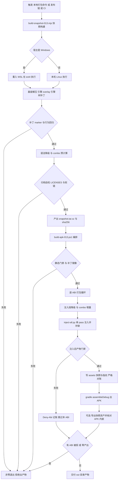
```mermaid
flowchart TD
  A["触发 本地打包命令 或 发布链 或 CI"] --> B["build-snapshot-013.mjs 快照构建"]
  B --> C{"宿主是 Windows"}
  C -->|"是"| D["重入 WSL 在 ext4 执行"]
  C -->|"否"| E["本机 Linux 执行"]
  D --> F["基座解压 引擎 overlay 引擎树补丁"]
  E --> F
  F --> G{"补丁 marker 与行为回归"}
  G -->|"失败"| X["非零退出 拒绝出产物"]
  G -->|"通过"| H["语法降级 与 combo 预计算"]
  H --> I{"归档自检 LICENSES 与软链"}
  I -->|"失败"| X
  I -->|"通过"| J["产出 snapshot.tar.xz 与 sha256"]
  J --> K["build-apk-013.ps1 编排"]
  K --> L{"静态门禁 与 补丁镜像"}
  L -->|"失败"| X
  L -->|"通过"| M["逐 ABI 打包循环"]
  M --> N["注入段降级 与 combo 增量"]
  N --> O["inject-all.py 单 pass 注入并补缺"]
  O --> P{"注入后产物门禁"}
  P -->|"失败"| Q["Deny-Abi 记账 跳过本 ABI"]
  P -->|"通过"| R["写 assets 快照与指纹 严格对账"]
  Q --> S{"有 ABI 被拒 或 零产出"}
  R --> T["gradle assembleDebug 出 APK"]
  T --> U["可选 导出快照资产并核对 APK 内嵌"]
  U --> S
  S -->|"是"| X
  S -->|"否"| V["交付 out 目录产物"]
```

#### B02 静态门禁链与 CI


- **一句话**：用 33 个 `scripts/check-*.mjs` 静态脚本守住「产物形态、跨层集合一致、SKIP 纪律」三类不变量，并由 `scripts/check-release-gates.mjs` 一处声明门禁集（当前 27 项），强制两仓 CI 与两条打包链逐项接线；发布链再以 `--run --require` 要求 SKIP=0。
- **入口/触发**（四条路径，脚本集合同源、调用参数不同）：
  1. **两仓 CI**：`.github/workflows/pr-gate.yml`（apk 仓同名文件）——`pull_request` 与 `push main` 触发；`static` 作业串行 16 步，`compile` 作业跑 `compileDebugKotlin` + `:app:testDebugUnitTest` 全量。
  2. **本地链**：`scripts/build-apk-013.ps1`（`pwsh -File scripts\build-apk-013.ps1 -Suffix ""`）——注入前 21 项门禁段 → 逐 ABI 注入 → 注入后 7 项产物级门禁 → 打包。
  3. **云端链**：`.github/workflows/build-apk.yml` → `scripts/build-snapshot-013.mjs <abi>`（归档自检）→ `scripts/build-apk.mjs`（`GATE_SCRIPTS` 与本地链差集须为 0）。
  4. **发布链**：`scripts/build-release.ps1`——`node scripts/check-release-gates.mjs`（静态接线）→ `--run --require`（注入前）→ 手工快照注入 → `--run --require`（注入后产物体）→ gradle。
- **运行顺序**（什么时候跑 / 被谁触发 / 跑完交给谁）：
  - **提交期（秒级到分钟级）**：pr-gate `static` 作业按「文本扫描 → 补丁自洽 → npm 构建前置 → 协议/契约/登记 → 加固/路由 → 冷启动预算 → 快照构建器产出面 → 接线聚合 → 制度性门禁 → 工具面预算」推进（见下表），全绿后交 `compile` 作业；`compile` 绿即 PR 可评审。这一步**不依赖快照**，也不接触设备。
  - **本地构建期**：`build-apk-013.ps1` 在注入之前跑完注入前门禁段；任一项非 0 立即 `exit 1`（不打包）。逐 ABI 循环内，注入后门禁失败走 `Deny-Abi` 记账并 `continue`，循环结束后若 `$rejectedAbis.Count > 0` 则整链 `exit 1`（`scripts/build-apk-013.ps1:427`）——控制权在此交还给调用者（人），不自动重试。
  - **发布期**：`build-release.ps1` 先 `git status --porcelain` 脏检查（含协调仓根的 `plugins/scripts/vendor/LICENSES` 面），再跑聚合入口；`--require` 档下任何 SKIP 即中止组装（`scripts/build-release.ps1:60`、`:147`）。
  - **跑完交给谁**：门禁本身不产出交付物，只以退出码裁决；通过后控制权依次交给注入链（`scripts/inject-all.py`）、gradle（`:app:assembleDebug`）、上传/发布步骤。
- **嵌套与线程**：
  1. `build-apk-013.ps1`【PowerShell 主线程】→ `node scripts/check-*.mjs`【每个门禁一个短命进程，串行，`$LASTEXITCODE` 判定】→ 门禁内部多为单线程流式读 tar（`scripts/check-runtime-assets.mjs` 另 `spawnSync` 跑行为回归测试）。
  2. `check-release-gates.mjs --run`【node 主线程】→ `spawnSync(process.execPath, [scripts/<gate>])`【逐个子进程，串行，`maxBuffer` 128MB】→ 子进程 stdout 回写父进程，父进程用 `/SKIP=(\d+)/` 累计 SKIP（`scripts/check-release-gates.mjs:246`）。
  3. pr-gate `static`【GitHub runner 的 bash 步骤，串行】→ `npm install/npm run build`【子进程】→ `node scripts/check-plugin-tests.mjs`【该门禁再 `spawnSync` 每个插件的 `node --test` 或 `npx vitest`】（`scripts/check-plugin-tests.mjs:54`）。CI 的 `static` 与 `compile` 两个作业并行，互不阻塞。
- **耦合**（点名符号）：
  - **唯一声明处**：`GATES` / `CI_GATES` / `ALL_GATES`（`scripts/check-release-gates.mjs:28`/`:106`/`:107`）与云端链的 `GATE_SCRIPTS`（`scripts/build-apk.mjs:61`）；`CI_GATES` 决定两仓 CI 必须出现的门禁名，`ALL_GATES` 决定两条链与发布链。
  - **注入集单一常量**：`scripts/plugin-dirs.json` 的 `dirs`/`externals` 被 `scripts/build-apk-013.ps1:174`、`scripts/build-apk.mjs`、`scripts/check-release-gates.mjs:164`、`scripts/check-patch-mirror.mjs:170` 共同消费；`scripts/release-plugin-src-gaps.json` 只承载 `$pluginSrcs ⊇ dirs` 的显式差集理由。
  - **台账（谁读谁写）**：`scripts/kotlin-test-baseline.json`（`scripts/check-kotlin-test-count.mjs` 读、`--update-baseline` 只许升档写）、`scripts/bridge-symmetry-baseline.json`（`scripts/check-bridge-symmetry.mjs` 只许减少）、`scripts/tool-surface-budget.json`（`scripts/check-tool-surface-budget.mjs` 取 +2% 阈值）、`scripts/contract.json` 与 `scripts/contract-pin-gaps.json`（`scripts/check-contract.mjs`）、`scripts/state-registry.json`（`scripts/check-state-registry.mjs` 逐条核对 evidence）、`scripts/api-route-auth-policy.json`（`scripts/check-api-route-auth.mjs`）、`scripts/control-ops-pending.json` 与 `scripts/control-ops-known-gaps.json`（`scripts/check-control-ops.mjs`）、`scripts/perf-instrumentation-gaps.json`（`scripts/check-perf-instrumentation.mjs`，gaps 为空是合法终态）、`scripts/third-party-licenses.json`（`scripts/check-third-party.mjs`）。
  - **跨块符号**：`ProcIo.readBounded`（`scripts/check-bounded-io.mjs` 守的调用面）、`AndroidBridge.kt` 的 `@JavascriptInterface` 与 `dsh-client-ui-responsive/src/client/android-bridge.ts` 的 `interface AndroidShellBridge`（`scripts/check-bridge-symmetry.mjs` 的 `baseline.surfaces`）、`DeviceControlService.kt` 的 `handle` when 分支 + `ControlProtocolV2.kt` 的 `SUPPORTED_OPS`（`scripts/check-control-ops.mjs` 的六处之一）、`assets/snapshot.sha256` 与 `assets/patched/*`（指纹与运行时资产两门禁的事实面）、`files/boot-segments.log`（`scripts/check-boot-budget.mjs` 的真数据输入）。
  - **反假绿自证符号**：`--self-test`、`SKIP(#n)`、`SKIP=`、`--require`、`--allow-missing`、`--require-real`、`--require-peer`、`--snapshot`。
- **关键坐标**：
  - `scripts/check-release-gates.mjs:28`（GATES 唯一声明处，当前 27 项）/`:152`（接线断言 = `text.includes(gateName)`）/`:246`（SKIP 汇总正则）
  - `scripts/check-gate-skips.mjs:62`（声明集合必须被两条链逐项调用）/`:72`（SKIP 发射点静态审计）
  - `scripts/build-apk.mjs:61`（云端链 GATE_SCRIPTS，与本地链差集须为 0）/`:197`（`--allow-missing`）
  - `scripts/build-apk-013.ps1:145`（本地链 `check-kotlin-test-count --allow-missing`）/`:427`（任一 ABI 被拒 = 整链非 0）
  - `scripts/build-release.ps1:60`（注入前 `--run --require`）/`:147`（注入后产物级复跑）
  - `.github/workflows/pr-gate.yml:40`（apk CI 只跑 `check-patch-mirror.mjs --self`）/`:82`（语法下限只跑 `--self-test`）/`:138`（全量 Kotlin 单测接进 CI）
  - `scripts/check-boot-budget.mjs:681`（`SKIP(#1)(real-data)` 发射点）/`:684`（随即 `selfTest()` 退出，`SKIP=` 汇总不打印）
  - `scripts/check-code-map.mjs:36`（UNIVERSE 覆盖全域；本门禁当前零调用点）
- **不变量**：
  1. `GATES` 声明的每个脚本必须在 `scripts/` 在场，且被两条编排器（`scripts/build-apk-013.ps1` / `scripts/build-apk.mjs`）逐项调用（`scripts/check-gate-skips.mjs:62`）。违反症状：新门禁写在 `scripts/` 却从不执行——「假防线」。
  2. 两条编排器的门禁集差集必须为 0（`scripts/check-release-gates.mjs:212`）。违反症状：本地链绿、云端自包含链少跑一道，产物缺陷只在云端出现。
  3. 任何 SKIP 必须带计数器（`SKIP(#n)` 或 `SKIP=` 汇总），发布链 `--run --require` 下 SKIP 合计必须为 0。违反症状：以「无产物 = 通过」结案。
  4. 需要产物/快照的门禁在缺件时不得判绿：`check-snapshot-fingerprint`、`check-runtime-assets`、`check-perf-instrumentation`、`check-contract`、`check-snapshot-secrets` 都支持 `--require` 把 SKIP 变失败。
  5. 台账类基线只许朝「更严」方向变（用例数只升、不对称条目只减、工具字节只降），且 stale 条目（已修却仍在册）必须判红，迫使当场删除。
- **症状 → 排查**：
  1. PR 卡在 `static` 作业某一步 → 读该步名对应脚本，本地复现：`git status` → `node scripts/check-release-gates.mjs`（先看接线断言）→ `node scripts/check-gate-skips.mjs --list`（看声明/接线/SKIP 审计三张表）。
  2. 「本地全绿、云端建不出」→ `node scripts/check-release-gates.mjs` 的 `两份编排器门禁集差集 = 0` 一行；再 grep `GATE_SCRIPTS`（`scripts/build-apk.mjs:61`）与 `scripts/build-apk-013.ps1` 的 `node (Join-Path $Root "scripts\check-` 行。
  3. 「门禁说 PASSED 但问题还在」→ 先在输出里找 `SKIP(` 与 `SKIP=`：SKIP 不为 0 表示该判据本轮没真跑（`SKIP(#n)` 行会写落点）；再确认跑的是真检档还是 `--self-test`（CI 里 `scripts/check-browser-syntax-floor.mjs` 只有自证）。
  4. 「改了门禁脚本却没生效」→ `node scripts/check-patch-mirror.mjs`（两仓逐字节 + `MIRROR_TOP` 清单），注意它只对 `content` 差异判红、行尾差异只 WARN（`scripts/check-patch-mirror.mjs:339`）。
  5. 「发布链以 SKIP=0 通过但真检没跑」→ 在 `check-release-gates.mjs --run` 输出里逐门禁找 `SKIP(#`；聚合入口只认 `SKIP=`（`scripts/check-release-gates.mjs:246`），`scripts/check-boot-budget.mjs:681` 那种带 `#` 的 SKIP 不进合计；设备真检必须显式跑 `node scripts/check-boot-budget.mjs --require-real`（当前零调用点）。
- **可疑点**：
  1. 【已确认，源码可复现】Kotlin 单测数量门禁的「防净零抵消」可被**整类删除**绕过：A 判据只对**现存源码测试类**要求有结果（`scripts/check-kotlin-test-count.mjs:129`），B 判据对结果里缺席的类直接 `continue`（`:153`）→ 删掉整个测试文件（例如 29 例的 `SnapshotTransactionTest.kt`）再在别处补足总数即恒绿。影响：一整类防线被无声削掉，而该门禁不在 CI（`ci:false`），只在两条链以 `--allow-missing` 跑。
  2. 【已确认】发布链的「SKIP=0」存在盲区：聚合入口用 `/SKIP=(\d+)/` 统计（`scripts/check-release-gates.mjs:246`），而 `scripts/check-boot-budget.mjs` 真检缺席时打印的是 `SKIP(#1)(real-data)`（`:681`）并立刻 `selfTest()` 退出（`:684`）——该 SKIP 既不入合计、在 `--require` 档下也不判红；唯一能判红的 `--require-real` 零调用点（仅注释提到）。影响：无设备产物时发布链可打印 SKIP=0 全绿，冷启动预算真判据从未执行。
  3. 【已确认，apk 树结构性必红】`plugins/dsh-android-vdisplay/test/tools-callable.test.mjs:122`（另 `:144`/`:161`/`:174`）用 `../../../dsh-mobile-apk/app/src/main/java/com/dsharnessmobile/shell/VdisplayController.kt` 读壳侧源码——该相对路径只在协调仓布局成立；apk 自包含树里 4 个用例 `readFileSync` 抛错。而 `scripts/check-plugin-tests.mjs` 在 `GATES` 里 `ci:true`，apk 仓 `.github/workflows/pr-gate.yml:64` 会跑它。影响：apk 仓 CI 与 apk 自包含构建结构性变红（对应协调仓评审 S-11 第二项 / §4.4-V-M4，本轮工作树仍未修）。
  4. 【已确认】`scripts/check-snapshot-builder-output.mjs:156` 的「两树同版」用**硬编码**`<ROOT>/dsh-mobile-apk/scripts/build-snapshot-013.mjs` 且 `existsSync` 为假时静默跳过（无 SKIP 计数，`:157`）——apk 自包含树里这条判据根本不存在，而它正是「0.14.0 归档段被删、构建器 exit 0 不产 tar」事故的反回归防线。
  5. 【未证实，需跑一次才能定性】`scripts/check-plugin-tests.mjs:33` 对「没有 test 目录」的插件只 WARN（删测试即从判据里消失）；且本轮工作树里 `scripts/patches/tests/` 的 16 个补丁回归测试只有 3 个被 pr-gate 硬编码调用（`.github/workflows/pr-gate.yml:41-43`），第 4 个经 `scripts/check-runtime-assets.mjs:96` 的行为回归间接执行，其余 12 个仍无执行路径（评审 I-6 的同族结论，未本轮复测是否已改）。

- **门禁速查表**（触发点缩写：CI = 两仓 `pr-gate.yml`；链 = `build-apk-013.ps1` + `build-apk.mjs`；发布 = `build-release.ps1`；快照构建 = `build-snapshot-013.mjs`）

| 门禁脚本 | 守什么不变量 | 触发点 | 失败时的典型真因 | 需要快照或设备 |
|---|---|---|---|---|
| check-patch-mirror.mjs | 双仓镜像面逐字节（patches/** + 门禁脚本自身 + 注入集目录）+ registry↔IMPLS id 集合一致 | CI（apk 侧只 `--self`）/链/发布 | 改了协调仓忘了镜像到 apk 仓；apk 副本落后 | 否 |
| check-manifest-hardening.mjs | manifest XML 语义：唯一 application、allowBackup=false、无 cleartext、NSC exclude 在场、接收器来源校验 | CI/链 | 加固项被删或改成全域明文 | 否 |
| check-bounded-io.mjs | 壳侧子进程与连接流输出必须走 `ProcIo.readBounded` | CI/链 | 新写的流读取绕过有界读（超时失效/死锁） | 否 |
| check-api-route-auth.mjs | mobile-owned `/api` exact/prefix 路由必须有登记行 + 本地 auth guard（公开白名单需理由） | CI（源码档）/链与发布（`--snapshot` 注入后 tar） | 新路由未登记，或注册本身不鉴权 → 绕过 browser auth | 注入后档需快照 |
| check-snapshot-fingerprint.mjs | `sha256(assets/snapshot.tar.xz) == assets/snapshot.sha256` | CI（净检出 SKIP）/链 `--require` | 手工替换 tar；两个 ABI 各自写入声明值 | 需 assets 内 tar |
| check-tool-output-schema.mjs | 工具各分支返回值过引擎同一 `validateJsonSchemaValue` + `lib` 不陈旧 | CI（先 build manage）/链 | 成功分支多返回未声明键；lib 落后 src（旧产物判绿） | 需 plugins/*/lib |
| check-protocol-v2.mjs | 协议 V2 往返等价 + 报文体量基线 | CI（先 build manage）/链 | 列式化多带字段、去重口径变宽致报文回涨 | 需 plugins/*/lib |
| check-control-ops.mjs | 控制 op 六处登记集合一致 | CI/链 | 新增 op 漏一处 → a11y 通道静默 deny | 否 |
| check-runtime-assets.mjs | `assets/patched/*` 与快照逐字节同源 + 行为回归 | 仅链（`--require`） | 快照重出后 `assets/patched` 未重生成 → 设备上补丁被改回 | 需快照 |
| check-snapshot-secrets.mjs | 归档成员路径级 + `settings.yaml` 内容级无机密 | 仅链/发布（`--require`） | 打进了 credentials/sessions/npmrc/私有源映射 | 需快照 |
| check-contract.mjs | 上游 bundle 行引用、注入包 lib 产物、客户端槽位、版本钉台账 | 仅链（本地 `--require`） | 版本钉漂移；槽位改名；上游 `dsh/` 缺席（云端只计 SKIP） | 本机需 `dsh/` 上游 checkout |
| check-state-registry.mjs | 两份 PR 模板四栏齐全 + `state-registry.json` 每条 evidence 机器可核对 | CI/链 | 新增状态未登记；写路径消失致 evidence 失效 | 否 |
| check-bridge-symmetry.mjs | 壳侧 `@JavascriptInterface` 与页面类型面双向对称（基线只许减少） | CI/链 | 新增桥方法只写不声明；setter 无只读 getter | 否 |
| check-gate-skips.mjs | 声明集合 ⊆ 实际文件 ⊆ 两条链调用；SKIP 必须计数；发布链 `--run --require` | CI/链 | 新门禁没接线；SKIP 静默；发布链少了 `--require` | 否 |
| check-perf-instrumentation.mjs | 度量入口自检 + A1 出厂 `patchReload` 对账 + 缺口台账无 stale | CI（无快照计 SKIP）/链与快照构建 `--require` | seed 未落或快照 profile 清单缺出厂值 | A1 面需快照 |
| check-inject-completeness.mjs | 逐 profile × 逐注入包的成员集合 + 相对导入可解析 | 仅链（注入后 tar） | `inject-all.py` 漏掉包内新增文件 → 设备侧 `ERR_MODULE_NOT_FOUND` | 需注入后快照 |
| check-kotlin-comments.mjs | Kotlin 块注释嵌套（KDoc 里写 glob 会吞掉后续代码） | CI/链 | 注释里出现 `/*` | 否 |
| check-build-chain-abort.mjs | 任一 ABI 被拒 → 整链非 0（静态锁拒绝记账与文案） | CI/本地链 `--self-test` | 新增拒绝路径只 `continue` 不记账 | 否 |
| check-strip-noop.mjs | 剥离清单项在产物里必须不存在（反 no-op） | 链（注入后 tar）/快照构建 `--stage` | 剥离键名写错或被后续步骤写回 | 需快照 |
| check-combo-cache.mjs | 注入后每条 `client.js` 有 sha256 命中的缓存条目 | 仅链 | 降级步骤排在 combo 预计算之后 → 键全 miss（fail-open 回退） | 需注入后快照 |
| check-tool-surface-budget.mjs | 模型面工具 name+description+parameters 字节 ≤ 基线 +2%（注册集 + 初始可见集） | CI（先 build 八个包）/链 | 新增工具使每会话固定预算膨胀；需归组掩蔽或改基线 | 需 plugins/*/lib |
| check-plugin-tests.mjs | 每个插件 `test/*.test.mjs` 真跑且有效通过数 > 0（全 skip 判红） | CI（先 build）/链 | 测试全 skip；依赖没装（报错与真失败混报）；跨仓路径读不到文件 | 需 plugins/*/lib |
| check-boot-budget.mjs | 冷启动 C1-C6（首个 HTTP 响应、p99、无 >2s 同步块） | CI/链默认档；真检需设备产物 | 无产物 → SKIP 只跑自证；有产物超预算 | 需设备产物（boot-segments.log + 探针） |
| check-snapshot-builder-output.mjs | 构建器产出面构造在场 + slim 配置键无死键 + 与打包链路径同源 | CI/链 | 归档段被删 → 构建器 exit 0 不产 tar，静默复用陈旧快照 | 否 |
| check-browser-syntax-floor.mjs | 发往浏览器的 bundle 不得含老内核解析不了的语法（AST + 双 arm 差分） | CI 只 `--self-test`；链 `--degrade`/`--scan` | vendor 无构建源未降级；降级排在 combo 预计算之后；顺序反了 13 条 combo 键必 miss | 真扫需构建树/快照 |
| check-build-parallel-cap.mjs | 压缩/解压线程上限 = 单一常量 8 且被链消费 | CI/链 | 回到 `-T0`；新增脚本吃满全部逻辑核 | 否 |
| check-kotlin-test-count.mjs | Kotlin 单测逐类不低于基线 + 无缺席 + 结果新鲜 + 无失败用例 | 仅两条链（`--allow-missing`）；CI 不跑 | 结果目录缺失/陈旧；整类被删（绕过面，见可疑点 1） | 需 gradle 测试结果 |
| check-engine-overlay.mjs（未进声明集合） | `engine-overlay.json` 登记包在快照内全量落位且版本精确 | 仅链（每 ABI）/发布 | overlay 清单与快照不同版；presets 空 | 需快照 |
| check-patch-mounts.mjs（未进声明集合） | 权威 patch 的 `name` 集合 ⊇ 注入集（双向） | 仅链/发布 | 注入了但 patch 未挂载 → 功能静默不装载 | 否 |
| check-snapshot-file-modes.mjs（未进声明集合） | 归档权限符合 Android 解压策略（ELF/shebang 0700、数据 0600） | 仅链/发布 | 重打包层（`inject-all.py`）未做归一化 | 需快照 |
| check-third-party.mjs（未进声明集合） | dpkg 矩阵完整 + copyleft 许可证全文随包 | 仅链/发布 | 新增包未登记许可；缺 copyright 全文 | 需快照 |
| elf-check.mjs（未进声明集合） | 归档内 ELF 的 `e_machine` 与目标 ABI 一致 | 仅链 | 拿错 ABI 的 node/base 归档 | 需快照 |
| check-code-map.mjs | 执行地图覆盖完整 + 锚点有效 + 编号一致 + 无 emoji | **无任何调用点**（本轮唯一） | 地图文档未写或锚点漂移 | 否 |

- **CI 与打包链的顺序**（含依赖：`npm` = 必须先构建插件 `lib/`，`快照` = 需要注入后 tar 或快照资产）

**A. pr-gate `static` 作业（`.github/workflows/pr-gate.yml:11-111`，串行 16 步）**
1. 冲突标记扫描（`app/src` 的 kt/java/xml/html/js/yml）。
2. 敏感信息扫描（`sk-`/`ghp_`/`AKIA`/`xox` 四类正则）。
3. `check-patch-mirror.mjs --self` + 三份补丁回归测试（`scripts/patches/tests/{spj-migration-link-f5,atomic-stale-lock,publish-exclusive-reclaim}.test.mjs`）——**不读对端树**，跨仓一致性显式让给协调仓 CI 的 `--require-peer`。
4. `npm install && npm run build`（`plugins/dsh-android-manage`）→ `check-protocol-v2.mjs`（npm）。
5. `npm install && npm run build`（同上，重复一次）→ `check-tool-output-schema.mjs`（npm）。
6. `check-control-ops.mjs`（无前置）。
7. `npm install && npm run build` 八个目录（`dsh-shell-termux` 必须在前，`linux-env` 直接 import 它；顺序 termux → 插件）→ `check-plugin-tests.mjs`（npm）。
8. `check-manifest-hardening.mjs` + `check-bounded-io.mjs` + `check-api-route-auth.mjs`（源码档，不需要快照）。
9. `check-boot-budget.mjs` 默认档（CI 无设备 → `SKIP(#1)(real-data)` + 自证）。
10. `check-snapshot-builder-output.mjs`（只读源码与配置）。
11. `check-browser-syntax-floor.mjs --self-test`（六向自证 + 接线反回归；真扫在打包链）。
12. `check-build-parallel-cap.mjs`。
13. `check-snapshot-fingerprint.mjs`（净检出下 tar 被 gitignore → 计 SKIP；链上以 `--require` 严格跑）。
14. `check-release-gates.mjs`（静态接线断言：五位置 + apk 仓同版 + 两份编排器差集）。
15. `check-state-registry.mjs` + `check-bridge-symmetry.mjs` + `check-gate-skips.mjs` + `check-kotlin-comments.mjs` + `check-build-chain-abort.mjs` + `check-perf-instrumentation.mjs`（离线可跑，与两条链同源）。
16. `npm install && npm run build` 八个目录 → `check-tool-surface-budget.mjs`（npm；真跑各插件 `apply()`，缺产物时门禁拒绝而非假绿）。

**B. pr-gate `compile` 作业（`.github/workflows/pr-gate.yml:113-148`）**：setup-java 17 → Android SDK 36 → `./gradlew :app:compileDebugKotlin --no-daemon` → `./gradlew :app:testDebugUnitTest --no-daemon`（全量，0.14.1 新增）→ 失败时上传 HTML 报告。**不依赖 A 的任何产物**，也不依赖快照。

**C. 本地链 `scripts/build-apk-013.ps1`**
1. 注入前门禁段（`:38-146`，顺序即文件顺序）：patch-mirror → contract `--require` → state-registry → bridge-symmetry → gate-skips → build-chain-abort `--self-test` → snapshot-fingerprint（预检）→ manifest-hardening → kotlin-comments → bounded-io → api-route-auth（源码档）→ protocol-v2 → tool-output-schema → control-ops → plugin-tests（**需本机 `plugins/*/lib`**）→ boot-budget（默认档）→ snapshot-builder-output → build-parallel-cap → kotlin-test-count `--allow-missing`（**用的是上一次 gradle 结果**）。
2. 逐 ABI（arm64 / x86_64）：
   a. `check-engine-overlay.mjs <snap>`（快照）。
   b. 注入段：`apply-patches.mjs`（vendor 补丁）→ `check-browser-syntax-floor.mjs --degrade`（vendor 暂存副本降级，**必须在 combo 预计算之前**）→ `lib/combo-precompute.mjs` → `inject-all.py`（单 pass 全 profile 注入）。
   c. 注入后门禁：patch-mounts → inject-completeness（快照）→ combo-cache（快照）→ browser-syntax-floor `--scan`（快照）→ tool-surface-budget（npm）→ api-route-auth `--snapshot`（快照）→ strip-noop（快照）。
   d. 产物与资产门禁：snapshot-file-modes → third-party（快照）→ 许可资产拷贝 → snapshot-secrets `--require`（快照）→ elf-check（快照）→ runtime-assets `--require`（快照）→ perf-instrumentation `--require --snapshot`（快照）。
   e. `check-snapshot-fingerprint.mjs --require`（写入 assets 后复核）→ gradle `:app:assembleDebug`。
3. `-ExportSnapshots` 档：导出 `snapshot-<abi>.tar.xz` 后跑 `check-snapshot-asset.ps1`（APK 内嵌与发布快照一致性）。
4. 尾部：`$rejectedAbis.Count > 0` 或 `$producedAbis.Count -eq 0` → `exit 1`。

**D. 云端链（`build-apk.yml` → `build-snapshot-013.mjs` → `build-apk.mjs`）**
1. checkout（含 LFS 底座）→ node 24 → python → java 17。
2. `npm ci`（有锁文件）/`npm install` + `npm run build` 七个目录（bridge/manage/linux-env/file-open/model-capability/shell-termux/ui-responsive）。
3. stage 底座 `base/` → `node scripts/build-snapshot-013.mjs <abi>`：剥离阶段跑 `check-strip-noop.mjs --stage`（`scripts/build-snapshot-013.mjs:169`）→ 浏览器语法降级 + `--scan`（`:383`/`:405`）→ 归档 → 归档内 LICENSES 自检（≥4，`:1007`）→ 归档内旧 Termux 前缀软链必须为 0（`:1029`）→ `check-perf-instrumentation.mjs --require`（`:1039`）。
4. `node scripts/build-apk.mjs --abi <abi>`：注入前门禁（`:156-206`，与本地链同集）→ 注入（降级 → combo 预计算 → inject-all）→ 注入后门禁（`:290-325`）→ 许可资产 → 指纹 `--require` → gradle。
5. `upload-artifact`（`out/v*/*.apk`）。

**E. 发布链 `scripts/build-release.ps1`**
1. git 脏检查（四个子仓 + 协调仓根的 `plugins/scripts/vendor/LICENSES`）。
2. `node scripts/check-release-gates.mjs`（静态接线）→ `--run --require --snapshot-dir dsh-mobile-apk/snapshot`（**注入前**：验的是输入快照）。
3. 插件 build + `npm pack` → `inject-snapshot.py` 宿主注入 → 快照内插件与 tgz 逐字节一致性。
4. `--run --require --snapshot-dir <release/vX/snapshot>`（**注入后产物级复跑**）+ patch-mounts / engine-overlay / snapshot-file-modes / third-party（不在声明集合的长驻门禁）。
5. 双 ABI：换 assets 快照 → 写指纹 → `check-snapshot-fingerprint.mjs --require` → gradle。
6. `check-snapshot-secrets.mjs`（两个 ABI，无 `--require`）→ MANIFEST + notes。

- **门禁存在但从未被调用**：
  - `scripts/check-code-map.mjs`——33 个 `check-*.mjs` 里**唯一零外部调用点**：不在 `GATES`、不在两条链、不在两仓 CI、不在 `MIRROR_TOP`（`scripts/check-patch-mirror.mjs:160`），且只存在于 apk 仓（协调仓 `scripts/` 无同名文件）；文档 `docs/AGENTS/EXECUTION-MAP.md` 未写时它会 `exit 2`。
  - `scripts/check-snapshot-secrets.ps1`——旧 PowerShell 实现，已被 `.mjs` 取代，零调用点（其旧缺陷正是「归档不可读时静默继续」）。
  - `scripts/tests/boot-pending.test.mjs`、`scripts/tests/pi-toolcall.test.mjs`——零调用点。
  - `scripts/patches/tests/` 的 16 个补丁回归测试里，只有 3 个被 pr-gate 硬编码（`.github/workflows/pr-gate.yml:41-43`），第 4 个经 `scripts/check-runtime-assets.mjs:96` 的行为回归间接执行，其余 12 个无执行路径（与评审 I-6 同族）。
  - 旗标模式零调用点：`--require-real`、`--pull`（`scripts/check-boot-budget.mjs`）、`--list`（`scripts/check-build-parallel-cap.mjs` / `scripts/check-bridge-symmetry.mjs` / `scripts/check-state-registry.mjs` / `scripts/check-code-map.mjs`）；`--as-shipped` 无显式调用方，但其行为已折进 `scripts/check-browser-syntax-floor.mjs` 的默认真实产物反向对照（`scripts/check-browser-syntax-floor.mjs:658-670`）。
  - 半接线：apk 侧 `check-patch-mirror.mjs --self` 会打印 `CHECK-PATCH-MIRROR PASSED（SKIP=0）`（`scripts/check-patch-mirror.mjs:347`），但 `--self` 分支连镜像层的 SKIP 计数都不写 → 看起来「SKIP=0 全绿」，实际跨仓比对根本没跑（靠协调仓 CI 的 `--require-peer`）。
- **假绿机制（只看文本在场或判据可绕过）**：
  1. `scripts/check-release-gates.mjs:152` 的接线断言是 `text.includes(<门禁文件名>)`——门禁名出现在**注释**里即算「已接线」；`scripts/check-gate-skips.mjs:40`/`:49` 同样按正则扫文本（`{ script: '...'` 与 `["'/\\]check-*.mjs`）。
  2. 聚合入口的 SKIP 统计只认 `SKIP=`（`scripts/check-release-gates.mjs:246`），漏掉 `SKIP(#n)` 形态 → 见可疑点 2。
  3. CI 里的 `check-browser-syntax-floor.mjs --self-test`（`.github/workflows/pr-gate.yml:82`）只证「判据能判红」，不扫本次产物；产物合规只在两条链上验。
  4. `scripts/check-build-parallel-cap.mjs` 只约束 5 个文件的**源码文本**，`-T0\b` 正则漏 `-T$(nproc)`/`-T"$N"`/`-P`，gradle 并行度不在判据内（评审 I-11）。
  5. `scripts/check-contract.mjs:165` 的版本钉只读 `peerDependencies` + `devDependencies`，`dependencies` 不在判据内（评审 I-10）→ `host-web-compat` 打绿但覆盖面为空。
  6. `scripts/check-plugin-tests.mjs:33`/`:35` 对「无 test 目录/无测试文件」的插件只 WARN；`scripts/check-kotlin-test-count.mjs` 可被整类删除绕过（可疑点 1）——两条同族「删掉即判绿」。
  7. `scripts/check-perf-instrumentation.mjs` 无快照时只计 SKIP（CI 常态如此），A1 面靠两条链的 `--require` 兜。
- **门禁自身的自检（`--self-test`）覆盖**：33 个 `check-*.mjs` 中 **11 个**真支持 `--self-test`（`scripts/check-api-route-auth.mjs` / `scripts/check-boot-budget.mjs` / `scripts/check-browser-syntax-floor.mjs` / `scripts/check-build-chain-abort.mjs` / `scripts/check-build-parallel-cap.mjs` / `scripts/check-code-map.mjs` / `scripts/check-combo-cache.mjs` / `scripts/check-kotlin-comments.mjs` / `scripts/check-kotlin-test-count.mjs` / `scripts/check-snapshot-builder-output.mjs` / `scripts/check-strip-noop.mjs`），其中 `scripts/check-browser-syntax-floor.mjs:535` 是六向自证（反向必红 / 正向必绿 / 载荷不触发 / 工具链在场 / marker 保全 / 两链接线反回归），`scripts/check-code-map.mjs` 是 8 用例判别力自证。`scripts/check-release-gates.mjs` 与 `scripts/check-perf-instrumentation.mjs` **只在自己的注释里提到** `--self-test`（后者是去跑依赖脚本 `scripts/perf/count-compose.mjs --self-test`），本身没有自证模式——即这两条门禁的判别力无自证。CI 里只有一处显式自证调用（`scripts/check-browser-syntax-floor.mjs --self-test`），其余自证模式零调用点，靠人工跑。

- 漂移：`docs/AGENTS/BRIDGE-API.md:41` 说聚合入口「`--list` 现数，当前 17 项」，源码 `scripts/check-release-gates.mjs:28`（`GATES` 数组）是 27 项（同仓 `docs/AGENTS/build-and-env.md:48` 写的是 27 项，两份文档自相矛盾）。
- 漂移：5 个门禁脚本的两仓副本行尾不同（协调仓 CRLF、apk 仓 LF），`cmp` 字节不等、归一化后内容一致：`scripts/check-boot-budget.mjs`、`scripts/check-browser-syntax-floor.mjs`、`scripts/check-build-parallel-cap.mjs`、`scripts/check-snapshot-builder-output.mjs`、`scripts/check-tool-output-schema.mjs`；镜像门禁只按「仅行尾差异」告警放行（`scripts/check-patch-mirror.mjs:339`）——「逐字节镜像」在行尾层不成立。
- 漂移：`scripts/check-code-map.mjs` 只在 apk 仓存在（协调仓 `scripts/` 无此文件），且未被列进 `scripts/check-patch-mirror.mjs:160` 起的 `MIRROR_TOP` → 这条新门禁自身没有镜像守护。

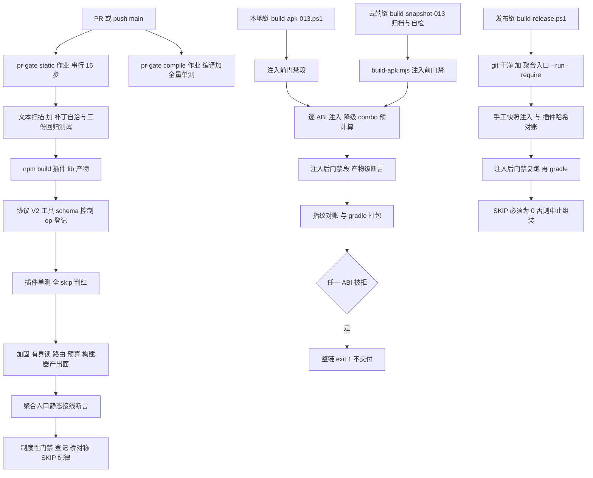
```mermaid
flowchart TD
  P1["PR 或 push main"] --> CI1["pr-gate static 作业 串行 16 步"]
  P1 --> CI2["pr-gate compile 作业 编译加全量单测"]
  CI1 --> S1["文本扫描 加 补丁自洽与三份回归测试"]
  S1 --> S3["npm build 插件 lib 产物"]
  S3 --> S4["协议 V2 工具 schema 控制 op 登记"]
  S4 --> S5["插件单测 全 skip 判红"]
  S5 --> S6["加固 有界读 路由 预算 构建器产出面"]
  S6 --> S7["聚合入口静态接线断言"]
  S7 --> S8["制度性门禁 登记 桥对称 SKIP 纪律"]
  L1["本地链 build-apk-013.ps1"] --> G1["注入前门禁段"]
  C2["云端链 build-snapshot-013 归档与自检"] --> G2["build-apk.mjs 注入前门禁"]
  G1 --> I1["逐 ABI 注入 降级 combo 预计算"]
  G2 --> I1
  I1 --> G3["注入后门禁段 产物级断言"]
  G3 --> G4["指纹对账 与 gradle 打包"]
  G4 --> Z1{"任一 ABI 被拒"}
  Z1 -->|"是"| Z2["整链 exit 1 不交付"]
  R1["发布链 build-release.ps1"] --> R2["git 干净 加 聚合入口 --run --require"]
  R2 --> R3["手工快照注入 与 插件哈希对账"]
  R3 --> R4["注入后门禁复跑 再 gradle"]
  R4 --> R5["SKIP 必须为 0 否则中止组装"]
```

#### B03 设备验收套件（CDP 与 adb 面）


- **一句话**：装完机之后，把「页面里能不能用、跨层状态有没有真收敛」逐条断言出来的 7 个设备侧套件，外加 5 个部署 / 冒烟脚本；它们全都不点屏幕、不截图。
- **入口/触发**：人手动执行，无 CI 接入（`.github/workflows/pr-gate.yml` 里没有任何一条引用）。三类触发：① 发布前设备门禁（两台模拟器两个朝向 + arm64 真机）；② S-12 双 ABI 重出包后的回归（`coord:docs/0.14.1-REVIEW-CHECKLIST-PROGRESS.md:76`）；③ 改 UI 可见行为后的开发循环。跑之前必须先过 `docs/AGENTS/emulator-test-protocol.md:39-53` 的前置检查（设备在线、`.snapshot-fingerprint` 在场且 `.snapshot-transaction` 不在场、应用在前台、a11y 通道在线）。
- **运行顺序**：**没有编排者**——每个套件都是一个独立 Node/PowerShell 进程，跑完只打印 PASS/FAIL 计数并把控制权（退出码）交回操作者；谁先跑谁后跑由人决定，`device-smoke.ps1` 是唯一有内部顺序的（T0 → T1 → T2，`scripts/device-smoke.ps1:9,14,19`）。硬约束是**逐个单独跑**：devtools socket 是「每个 app 进程一个」的 `webview_devtools_remote_<pid>`，而宿主侧只有 `tcp:29225` 一条转发，两个套件并跑会互相抢同一条 forward；且每个套件在启动那一刻就把 ws URL 固定下来（`verify-webview-015.mjs:6,79`、`verify-browser-host.mjs:4`、`verify-browser-panel.mjs:12`），套件运行中只要页面重载或应用重启，旧 target 即失效。
- **嵌套与线程**：套件侧最多 3 层 —— ① `node scripts/verify-*.mjs`（进程入口）→ ② `Runtime.evaluate` 经 WebSocket 发到 WebView 渲染进程（`verify-webview-015.mjs:97-103`）→ ③ 页面里调 `window.androidBridge.*` 进 `@JavascriptInterface`，壳侧再用 `onMain` 把工作搬到主线程（`BrowserHost.kt:1661-1673`：`CountDownLatch.await(2s)`，超时返回 null → JSON 里出现 `available:false` + `main-thread-timeout`）；两处 `BrowserHost.kt:1371,1391` 的导航等待预算是 8s。adb 面是同步阻塞的 `spawnSync`（`verify-state-sync.mjs:27`、`verify-engine-log-copy.mjs:30`），会卡住 Node 事件循环。CDP 求值本身是异步 await，不占线程；壳侧真正的执行落在应用主线程（服务回调 / Binder 回调只在 a11y 与 Shizuku 侧出现，与本块无直接调用链）。
- **耦合**：`window.androidBridge`（套件读壳侧真源的唯一入口，`verify-state-sync.mjs:107,122,132,142,151`）；`BrowserHost.kt` 的 `statusJson/show/hide/bounds/viewport/identity/close` 与 `pageGeneration` 代次字段（`verify-browser-host.mjs:70-185` 全程按这些字段判）；`browserHostShow` 的入参解析 `showPayload`（`BrowserHost.kt:384-394`，只认 `url`/`session`）；虚拟屏的 `vdisplayStatus.screens[]/viewers[]/presenting/selected` 与 `viewerId: 'files-sidebar'`（`verify-vdisplay-viewer.mjs:81,142,161`）；DOM 锚点 `data-dsh-mobile-form` / `data-dsh-frame` / `data-dsh-mobile-topbar` / `data-conversation-header-corner` / `data-testid="vdisplay-stage"` / `data-sidebar-right-expand`（`verify-webview-015.mjs:11-19`、`verify-vdisplay-viewer.mjs:106,137`）；`window.__dshBack` / `__dshBackDepth` / `__dshBackKinds` / `dshBackBridge`（`verify-webview-015.mjs:60-73`）；偏好文件与键 `shared_prefs/dsh_settings.xml`（`immersive_mode`，`ShellState.kt:38-39`）、`shared_prefs/dsh-overlay.xml`（`enabled`，`OverlayController.kt:22-23`）、`shared_prefs/dsh_prefs.xml`（`dev_log_enabled`，`MainActivity.kt:1164-1165`）；系统真源 `appops MANAGE_EXTERNAL_STORAGE` / `SYSTEM_ALERT_WINDOW`、`settings secure enabled_accessibility_services`（`verify-state-sync.mjs:106,118,150`）；`/data/data/<pkg>/files/engine.log` 与其世代后缀（`verify-engine-log-copy.mjs:28,49-53`）；`scripts/golden/session-golden.json` ↔ `scripts/golden/last-run.json`（后者被 `device-smoke.ps1:24` 每次运行覆盖，且是**受版本控制的文件**）。
- **关键坐标**：`scripts/verify-webview-015.mjs:6`（`const [, , wsUrl] = process.argv` 位置参数，无名字校验）、`scripts/verify-state-sync.mjs:244`（`if (WS && !force) return WS`——传 `--ws` 即永久短路 target 重解析）、`scripts/verify-state-sync.mjs:247`（`pidof` + `forward tcp:29225 localabstract:webview_devtools_remote_<pid>`）、`scripts/verify-browser-host.mjs:55-64`（唯一按 URL 在 `/json/list` 里重解析 target 的实现）、`scripts/verify-browser-panel.mjs:66-73`（多页签项只有 1 页时显式 SKIP）、`scripts/verify-vdisplay-viewer.mjs:165-169`（全套件唯一一条 adb 系统读 `dumpsys display`）、`scripts/verify-vdisplay-float.mjs:95-103`（非法档位判定，见可疑点 1）、`scripts/deploy-device.ps1:31`（调不存在的 `..\web-restart.ps1`）。
- **不变量**：（1）设备在线**且应用在前台**——后台会让 `/json/list` 为空或 `fetch failed`，`verify-state-sync.mjs:246` 与 `verify-browser-host.mjs:58` 都会把它报成断言失败。（2）快照刷新未在跑（`.snapshot-fingerprint` 在场 + `.snapshot-transaction` 不在场）；违反时不只是假失败——`verify-state-sync.mjs:161` 的 `am force-stop` 撞上坑 37（`docs/AGENTS/gotchas.md:44`：看门狗用半解压运行时拉引擎，用户 settings 被剪成出厂模板）。（3）同一时刻只有一个套件持有 29225 转发，且跑前重建 target（pid 随重启变）。（4）被测包必须是 debug 包：`MainActivity.kt:514` 只在 `debuggable` 时开 `WebView.setWebContentsDebuggingEnabled(true)`，release 包没有 devtools socket，整套 CDP 面直接不可用。（5）页面加载成功且是主页面——所有桥断言读 `window.androidBridge?.x`，连到隔离页或白屏页时静默返回 `undefined`。（6）vdisplay 两套件需要 Shizuku 已注册（viewer 全链、float 第 5 步）。
- **症状 → 排查**：
  1. **一批桥断言同时读成 `undefined` / `false`**（`verify-webview-015` 的 `:21-23` 与 `:60-76` 整批连红）→ 九成是连错 target 不是回归。查 `adb shell "cat /proc/net/unix | grep webview_devtools"`、`adb forward --list`、`curl -s http://127.0.0.1:29225/json/list`；主页面 target 的 `url` 应是引擎 Web UI，隔离浏览器页是 `https://example.com/` 之类。grep `webview_devtools_remote_`。
  2. **`verify-state-sync` 的重启类用例（ST-02 / ST-10 / ST-11）恒报「未收敛」，其余全绿** → 先看命令行是不是带了 `--ws`（`:244` 短路重解析，force-stop 后旧 ws 必然连不上，却被渲染成业务未收敛）。
  3. **断言返回 `null`，或 status JSON 里 `available:false` + `reason:"main-thread-timeout"`** → 是壳侧主线程 2s 预算超时（`BrowserHost.kt:1661-1673`），**副作用可能已经发生**（post 出去的块不会被取消）；重跑一次再判，别当业务缺陷。grep `main-thread-timeout`。
  4. **vdisplay 套件第一步就红** → 读 `vdisplayStatus()` 的 `code`：`shizuku-not-running` / `shizuku-not-ready`（`ShizukuProbe.kt:75`、`ShizukuTransport.kt:98`、`VdisplayController.kt:326`）是前置不满足，不是回归；`adb shell dumpsys accessibility | grep -A2 "Bound services"` 与 Shizuku App 状态一起确认。
  5. **`verify-state-sync` 首跑部分红、复跑全绿** → 先清 uid-mode appop 残留（`adb shell appops set --uid <op> default` + `appops reset --uid com.dsharnessmobile.shell`）并重设 a11y 服务（坑 46，`docs/AGENTS/gotchas.md:74`）；两条都在 `docs/AGENTS/emulator-test-protocol.md:57-58` 有原文。
- **可疑点**：
  1. 已证实：`scripts/verify-vdisplay-float.mjs:95-103` 的「非法档位必须被拒」是**永久假通过 + 顺手改设备状态**。链路：`setVdisplayScale(0.123)` → `VdisplayPrefs.setScale` 用 `coerceIn(0.4, 1.0)` 把值钳成 0.4 存盘（`VdisplayController.kt:753-756`）→ 返回的 `VdisplayPrefs.scale()` 是**数值 0.4**（`MainActivity.kt:788`），既不是 `true` 也不是 `{ok:true}` → 脚本走 `else` 分支打印 `PASS 非法档位被拒 → rejected`。而第 3 步之后**没有任何还原**（对比第 1、2 步都有还原），设备档位就停在 0.4（默认 0.75），后续所有 vdisplay 用例的几何随之变化。影响：断言假绿 + 跨轮设备状态漂移。
  2. 已证实：`scripts/verify-browser-panel.mjs:123-128` 用 `browserHostShow({..., newTab:true})` 声称建多页签，但 `showPayload`（`BrowserHost.kt:384-394`）只解析 `url` 与 `session`，`newTab` 是**死参数**（`newTab` 只在 `navigateOp` `BrowserHost.kt:1035` 被读）；脚本结尾（`:137-138` 打印 PASSED）也不调 `browserHostClose`，于是留下两个隔离页签常驻。影响：与可疑点 1 叠加——`/json/list` 变成多 target，而 `verify-state-sync.mjs:248-250` 与 `verify-webview-015.mjs:3-4` 的取值规则都是「取第一个 target」，取错即整批桥断言假红。同结论见 `coord:docs/COMPAT-REVIEW-0.14.0-2026-09-19.md:453`（M4）。
  3. 已证实：`scripts/verify-vdisplay-viewer.mjs:2` 与 `scripts/verify-vdisplay-float.mjs:4` 的头部都声称覆盖「多查看器仲裁」，脚本内却没有任何第二查看器断言（全文只有一个硬编码 `viewerId: 'files-sidebar'`，`:161`/`:173`）。真正的仲裁在 `VdisplayController.attachViewerSurface` 的 `ViewerArbitration.decide(...) == Verdict.OCCUPIED` → `viewer-target-occupied`（`VdisplayController.kt:483-492`），当前**没有任何套件打到这条路径**。
  4. 已证实（正则语义）/ 未证实（真实 dump 文本形态）：`scripts/t0-check.ps1:14` 的禁用判定写成 `"shell-termux[sS]{0,200}?disabled:s*true"`——`s*` 是「零个或多个字母 s」，疑似想写 `\s*`。于是只有 `disabled:true` 紧贴形态命中，任何带空白的 `disabled: true` 都会逃逸，T0 会对「shell-termux 被禁」假绿。修法一行：`disabled:\s*true`。
  5. 已证实：`scripts/deploy-device.ps1:31` 调 `Join-Path $PSScriptRoot "..\web-restart.ps1"`，两仓均无此文件（全仓只有 `docs/archive/orphan-scripts/web-restart.ps1`）→ 「部署完重启 dsh web」这一步静默失效（`$ErrorActionPreference = "Continue"` 吞掉 `&` 的报错，脚本仍以正常语义结束）。另一条同族：`scripts/device-smoke.ps1:14` 的 T1 依赖设备上手放的 `/data/data/com.termux/files/home/run-t1.sh`，该文件两仓都不存在 → 干净设备上 T1 不可复现。

| 套件 | 验什么 | 连接方式 | 参数约定 | 已知假失败陷阱 | 依赖 |
|---|---|---|---|---|---|
| `scripts/verify-webview-015.mjs` | 移动形态 DOM 锚点、顶栏 / 抽屉 / corner 座位、桥方法增删（`openPathChooser` 在场，`downloadDebugLogs`/`pickImage`/`pickFilePath` 已退役）、@ 菜单无注入杂项、7 项 polyfill 活性 + 迭代器助手、全部内联脚本可解析、`window.__dshBack*` 返回层栈在场并能消费、`getImmersiveMode` 在场（36 条断言） | 操作者先建好 `adb forward tcp:29225 localabstract:webview_devtools_remote_<pid>`，再 `curl /json/list` 取 ws，**positional** 传进脚本；脚本自己不再解析 target | `node scripts/verify-webview-015.mjs <ws-url> [--wide]`；`--wide` 是**位置无关的 flag**（`process.argv.includes`，`:7`），但必须排在 ws 之后——排前面会被当成 ws | ① 连到隔离页 / 旧 target → 桥断言整批假红；② 竖屏加 `--wide`（或反之）会把形态类断言判反；③ 页面重载 → ws 静默关闭，60s 全局超时兜底（`:114`）；④ 断言顺序自带副作用（打开 @ 菜单、点抽屉），所以层栈类断言不绑定初值（`:61-62`）；⑤ **只断言内联脚本**（`:51-53` 显式排除 `src`），外部模块脚本加载失败测不出来（`coord:docs/0.14.1-preview-LEGACY-AND-PERF.md:436` 同样登记） | debug 包 + 应用前台 + 引擎页面已渲染；不需要 Shizuku、不需要 adb（除建 forward） |
| `scripts/verify-state-sync.mjs` | 跨层状态同步「只改外部真源」用例集：ST-01 all-files-access、ST-02 overlay-enabled、ST-10 immersive-mode、ST-11 dev-log-enabled、ST-12 a11y 控制通道；每条都 on/off 双向，共 10 次断言 | 自己用 adb 解析：`pidof <pkg>` → `forward tcp:29225 localabstract:webview_devtools_remote_<pid>` → `/json/list[0]`（`:243-251`）；真源改写全走 `adb shell` / `run-as` | `node scripts/verify-state-sync.mjs --serial <s> [--pkg <p>]`；**绝对不要传 `--ws`**（`:244` 短路重解析）；另有 `--self-test` 桩驱动（含 1 条故意失败样本） | ① 传了 `--ws` → 重启类用例恒「未收敛」；② uid-mode appop 残留 → 稳定判红；③ a11y 僵尸标记（坑 46）→ ST-12 判红；④ 应用被挤到后台 → `fetch failed`；⑤ 跑在快照刷新期间会 `am force-stop` 撞坑 37（破坏性，不只是假失败）；⑥ 中途崩溃时 `finally` 的还原（`:302-308`）可能没跑完，留下 a11y 关闭 / 权限关闭 | 应用可 force-stop 与重启（快照刷新期禁跑）；a11y 用例需无障碍通道；ST-01/02 依赖设备 appops 可写（模拟器可，部分真机受 ROM 限制） |
| `scripts/verify-browser-host.mjs` | 隔离浏览器宿主生命周期与隔离性：初始态 `available/created/visible`、可信舞台 bounds、回环 URL 必须 `unsupported-url`、`https://example.com` 建面并可见、隔离 target 不在 `window.androidBridge`（无桥）、hide 语义、视口档 `phone-portrait` 的 CSS 视口 ±1/±2 与宽高比、host 上报视口 == 页面实测、`linux-desktop` 身份档（UA / platform / maxTouchPoints / screen / media query）、身份与视口复位 | 只吃 ws：**positional**；target 列表从 ws 的 host 反推 `http://<host>/json/list`（`:49-52`），并**按 URL 重解析**（`:55-64`，唯一做对的实现） | `node scripts/verify-browser-host.mjs <main-webview-cdp-ws-url>` | ① 起始不 close 上一次的宿主会污染初始态断言（脚本自己在 `:70` 先 close）；② 分辨率变化会重建隔离 WebView → 必须按 URL 重解析，用固定 ws 必红；③ 首次 renderer 导航可能晚于固定间隔，脚本已改成轮询 native status（`:85-97`），仍红时先看是不是慢启动；④ 视口高度有 1/factor 的 letterbox 取整误差（`:126-141` 已放宽到 ±2 并加宽高比锁）；⑤ 跑完会**留下一个 created=true 的宿主**（只 hide + 复位视口，不 close），是下一套件 target 名单的污染源 | debug 包 + 外网可达（依赖 `https://example.com`）；不需要 Shizuku、不需要 adb（除建 forward） |
| `scripts/verify-browser-panel.mjs` | 面板与多页签语义：关闭即销毁（`created=false` 且页签清零）、页签列表可读、hide/show 保活（`pageGeneration` 不变）、不可达主机的错误页（`loadState=error` 且 `reason=load-error:<code>` 或 `title=ERR_*` 至少一个在场）、跨会话互不占用（A/B 各开一页 + `ownerSessionId` 跟随最后下推会话） | 只吃 ws：**positional**（`argv.find(x => x.startsWith('ws://'))`，`:12`）；`--serial` 被解析后 `void SERIAL` 丢弃（`:14-15`），纯摆设 | `node scripts/verify-browser-panel.mjs <ws> [--serial <s>]` | ① 多页签项在只有 1 页时**显式 SKIP**（`:66-73`），且脚本用来建多页的 `newTab:true` 是死参数（见可疑点 2）→ 覆盖面被高估；② 错误页用例要等 25s（`:103`），DNS 慢会假红；③ 结尾不 close，留两个隔离页签；④ 桥调用统一写成 `window.androidBridge.<m>.call(window.androidBridge, ...)`（`:37`），与其它套件的 `?.` 调用风格不同，桥面改名时是另一套报错形态 | 同 `verify-browser-host`；错误页用例需能解析出「不可达主机」（`no-such-host.invalid`） |
| `scripts/verify-vdisplay-viewer.mjs` | 虚拟屏查看器两相契约：A 基线（`real` 恒不可镜像且带 reason、`displayId=0`）、B 创建（`active` 且 `displayId != 0`）、C1 收起态**不得被程序自动展开**且舞台不可见、C2 手动展开后 stage 挂载 + `viewers[].presenting=true`、D `vdisplaySelect('real')` 必拒 `screen-not-selectable` 而虚拟屏必收敛、E 关闭查看器后 display 仍 `active`（再 `dumpsys display` 复核 `type VIRTUAL`）、F 重开重挂、G 销毁（或 `--keep` 保留） | 主 ws **必须是 `--ws`**（靠路径解析页面 DOM 与舞台矩形）；adb 只用于 E 步的 `dumpsys display` 复核，且**只在给了 `--serial` 时执行**（`:61-65`，否则打印 skipped） | `node scripts/verify-vdisplay-viewer.mjs --ws <ws> [--serial <s>] [--keep]` | ① 传成 positional（`node x.mjs <ws>`）→ 直接用法错误退出，不是「跑通了」；② 不给 `--serial` 时 E 步的 dumpsys 复核被静默跳过，报告仍是 PASS（覆盖度低于看起来的样子）；③ Shizuku 未注册 → B 步 `fail()` 抛错，**退出码是 1 不是 2**（见漂移 1），与真回归同形；④ C1 早期版本无条件等 stage 挂载，会把正确实现判成回归（`:97-104` 有历史注记），改动这块前先读那段注释；⑤ 头部声称的「多查看器仲裁」并未实现（可疑点 3） | Shizuku 已注册且 UserService 已绑定（`vdisplayStatus().ok=true`）；屏幕上限 `MAX_VIRTUAL_DISPLAYS = 1`（`VdisplayController.kt:40`），设备上已有别的虚拟屏会走幂等分支；a11y / 系统设置页可能被 Shizuku 拉起，会干扰同轮的别的用例 |
| `scripts/verify-vdisplay-float.mjs` | 浮窗与档位的**真源往返**：`vdisplay*` 桥面在场（5 个方法名）、`get/setVdisplayFloatEnabled` 往返并还原、`setVdisplayScale` 0.5/0.75/1 三档收敛并还原、非法档位不被采纳、选择器置灰（`real.selectable=false` 且带 reason）、`forceDestroyVdisplay` 幂等可达 | 只吃 ws：**必须 `--ws`**；`--serial` 被解析后 `void SERIAL` 丢弃（`:18`），无 adb 调用 | `node scripts/verify-vdisplay-float.mjs --ws <ws> [--serial <s>]` | ① 非法档位项是永久假通过且会改设备档位（可疑点 1）；② 浮窗 / 档位返回的是**裸值**（boolean / number）而非 `{ok:true}`，脚本用 `readBool` / `readNum` 兼容两种形态（`:43-44`），桥面若改回对象形态不会红只是读法变了；③ 第 5 步 `forceDestroyVdisplay` 内部会调 `status()`（`VdisplayController.kt:721-735`），Shizuku 未就绪时 `ok=false` → 该步必红，因此**这个套件也需要 Shizuku**，但头部注释没写 | Shizuku 已注册（第 5 步）；前四步纯偏好读写，不需要设备特权 |
| `scripts/verify-engine-log-copy.mjs` | 启动页「复制日志」的**真源侧**判据：当前代 `engine.log` 存在非空、全文可读并算 sha256、世代后缀文件 `.1..5` 与当前代相互独立（当前代全文不得出现在任何后缀里）、当前代含 token 行时脱敏必要性成立、打印「复制等式基准」（长度 + 指纹）供 UI 侧比对 | **纯 adb**：`adb -s <serial> shell run-as <pkg> <stat/cat>`（`:30`），不用 CDP、不建 forward | `node scripts/verify-engine-log-copy.mjs --serial <s> [--pkg <p>]` | ① 世代文件多达 5 个才扫（`:49`），更多代次不覆盖；② token 行为空时脱敏项打印 SKIP 而非 PASS（假绿边界要看清）；③ **UI 剪贴板一项脚本明确不判**（`:15`、`:77`），需要指引页可达后人工 / AI 复核——别把这份 PASS 当成「复制按钮可用」 | 应用已跑过一次引擎（生成 engine.log）；`run-as` 可用（debug 包） |
| `scripts/device-smoke.ps1` | T0 配置断言 → T1 headless 冒烟（真 bash）→ T2 黄金会话回归（工具名序列对比），一条链 | 走 `run-as com.termux`（**legacy Termux 形态**）与设备内 `/data/data/com.termux/...` 路径 | `pwsh scripts/device-smoke.ps1 -Serial <s>`，默认 `127.0.0.1:16416` | ① T1 依赖设备上手放的 `run-t1.sh`（两仓都没有，干净设备不可复现）；② T2 会**覆盖受控文件** `scripts/golden/last-run.json`，跑完工作树必脏；③ T2 是黄金序列比对，模型 / 提示词一变即红（不是产品回归）；④ 应用是内嵌形态（`/data/user/0/com.dsharnessmobile.shell/files/home`）时整条链的前提不成立 | 设备上装着旧 Termux 形态的 dsh 与 `.dsh/sessions/...` 会话目录；`$env:LOCALAPPDATA\Android\Sdk\platform-tools\adb.exe` 在场 |
| `scripts/deploy-device.ps1` | 把已构建的插件包推进**设备 profile 层** `node_modules`（termux 形态），然后重启 `dsh web` | adb push 到 `/data/local/tmp` → `run-as com.termux sh -c` 拷进 `~/.dsh/profiles/<Profile>/node_modules/@dsh-android/<pkg>` 并 `chmod -R a+rX` | `pwsh scripts/deploy-device.ps1 -Serial <s> [-Package <name>] [-Profile web]` | ① 最后一步 `..\web-restart.ps1` 不存在 → 重启静默失效（可疑点 5）；② 暂存目录是**仓库根的 `.deploy-staging`**（`:14`），与 `deploy-embedded.ps1` 共用同一路径（两者不可并跑）；③ `lib/index.js` 不存在直接 throw（`:11`），先跑 `scripts/build.mjs` | 插件已 `lib/` 构建；设备已装 Termux 形态 dsh 且 profile 目录存在 |
| `scripts/deploy-embedded.ps1` | 把插件推进**内嵌形态**：`/data/user/0/com.dsharnessmobile.shell/files/home/.dsh/profiles/web/node_modules/@dsh-android/<pkg>` | `adb push` → `run-as com.dsharnessmobile.shell sh -c` 拷贝 + `chmod` | `pwsh D:\coding\dsh-mobile\scripts\deploy-embedded.ps1 -Serial <s> -Package <name>`；**根目录硬编码 `D:\coding\dsh-mobile`**（`:5`），默认 serial 是真机 `10AF2B0GN0001F2`（`:1`），无 `-Profile` 参数（写死 `web`，`:17`） | ① `-Package` 语义有缺陷：既当仓库相对目录又当设备包名（传 `plugins/dsh-android-bridge` 会在 `@dsh-android/` 下嵌出同形子路径 → 插件解析不到）——须传**纯包名**（协调仓 `coord:docs/0.14.0-preview-VERIFICATION-LOG.md:211,253` 已登记为 N-5 未修）；② 与 `deploy-device.ps1` 共用 `.deploy-staging`，不可并跑 | 内嵌形态应用已装且跑过一次（`files/home` 已解压）；`run-as` 可用 |
| `scripts/t0-check.ps1` | `--dump-config` 输出里 `shell-termux` / `bash-sandbox` / `permission` 三行在场，且 `shell-termux` 不得是 `disabled` | `adb shell run-as com.termux sh -c` 调设备内 node 跑 `--dump-config` 并 `cat` 结果 | `pwsh scripts/t0-check.ps1 -Serial <s>` | ① 禁用判定正则写错（可疑点 4）→ 对「被禁」假绿；② 只在 `shell-termux` 后 200 字符窗口内找 `disabled`，dump 排版一变即漏；③ `matrix()` 行匹配是纯子串，插件改名可能误命中 | 设备内 Termux 形态引擎在位（`/data/data/com.termux/files/usr/lib/node_modules/@deepseek-ai/dsh`） |
| `scripts/e2e-phone-test.ps1` | 旧 RPC 端到端：`session.create` → `session.prompt`（让模型跑 bash echo/uname）→ 轮询 `session.history` 最多 120s | 纯宿主侧 HTTP，**不接 adb**：要求操作者事先把宿主端口转发好 | 无参数；`$base` 写死 `http://127.0.0.1:3081`，请求体落到 `D:\coding\dsh-mobile\.deploy-tmp` | ① 点号 wire + 旧端口 3081，而现行文档口径是 `forward 23080→3080`（`docs/AGENTS/build-and-env.md:54`）且 `/api` 需 `EngineAuth` cookie（`docs/AGENTS/BRIDGE-API.md:129`）→ 大概率直接被拒（未证实，本轮未实跑）；② 脚本内无 serial / pkg 参数，无法在多设备上选择；③ 轮询结束不判「有没有拿到回复」，只看最后一条事件类型 | 宿主转发在位 + 引擎 cookie；同目录 `scripts/dsh-agent-chat.ps1` 才是 0.13.3+ 的斜杠 wire 版本（它自己 `:4` 就写明本脚本是旧 wire 旧端口），新验收优先用它 |

**CDP 与 adb 的能力边界对照**

| 套件 | 走 CDP 的断言（DOM / devtools） | 走 adb 的断言（含系统读） | 有 adb 用户级操作（input / screencap / uiautomator / logcat）？ |
|---|---|---|---|
| `verify-webview-015.mjs` | 全部 36 条：DOM 锚点与 `getComputedStyle`、`window.__dshBoot__` 名册、`new Function` 逐段解析内联脚本、polyfill 活性与迭代器助手、`window.__dshBack*` 层栈读写、`androidBridge` 方法在场性 | 无（adb 只在命令行注释里手工建 forward） | 无 |
| `verify-state-sync.mjs` | 观测量：`hasAllFilesAccess` / `getOverlayEnabled` / `getImmersiveMode` / `getDevLogEnabled` / `a11yStatus` 的 getter 回读 | 真源改写与进程控制：`appops set/get`、`settings put/get/delete`、`am force-stop` / `am start -W`、`run-as` 改 shared_prefs XML、`pidof`、`forward`、`get-state` | **无**（不点屏、不截图、不读 logcat） |
| `verify-browser-host.mjs` | 全部：主页面 + 隔离 target 两条 ws 的 `Runtime.evaluate`（视口几何、UA/platform/touch/screen/media query、无桥断言） | 无 | 无 |
| `verify-browser-panel.mjs` | 全部：面板状态机（created/visible/tabs/pageGeneration/loadState/reason/title/ownerSessionId）与保活 | 无（`--serial` 被丢弃） | 无 |
| `verify-vdisplay-viewer.mjs` | 页面 DOM（`data-testid=vdisplay-stage`、`data-sidebar-right-expand`、舞台矩形）与桥状态（screens/viewers/select/bounds） | `dumpsys display` 一条（仅在 `--serial` 给定时）复核 `type VIRTUAL` 与包名 | **无**（虚拟屏画面本身没截图；坑 147 已说明 `screencap -d` 必失败） |
| `verify-vdisplay-float.mjs` | 全部：浮窗开关与档位的 get/set 往返、`screens[].selectable/reason`、`forceDestroyVdisplay` | 无（`--serial` 被丢弃） | 无 |
| `verify-engine-log-copy.mjs` | 无 | 全部：`run-as stat/cat` 读 `engine.log` 与 `.1..5`、本地复算 sha256 与脱敏必要性 | **无**（UI 剪贴板项明确留给人工） |

**缺口结论（当前哪些验收面只有 CDP、完全没有 adb 用户级操作）**

- 7 个套件**一个都没有**执行 `input tap/swipe/text/keyevent`、`exec-out screencap`、`uiautomator dump`、`logcat -d`。`grep -c` 实算：`screencap` = 0、`input tap` = 0、`uiautomator` = 0（七个文件逐个统计）。全仓 `scripts/` 下唯一带这些原语的脚本是 `scripts/e2e-provider-ui.ps1`（`Shot` `:31-36`、`Tap` `:38-43`、`TypeText` `:45-50`），而它不在本套件清单里。
- 因此**「用户看得见 / 摸得到」这一整面只有 CDP 断言，没有任何脚本化的设备证据**，具体缺口（对应 `docs/AGENTS/emulator-test-protocol.md:10-20` 的必须双轨清单）：移动顶栏 / 抽屉 / 侧栏开关是否真能点到且不互相遮挡；虚拟屏 viewer 舞台在真实屏幕上的位置、缩放与遮挡（坑 50 的教训：几何缺陷只有截图能发现）；浏览器面板地址栏与隔离页的可见结果；错误页呈现（脚本只断言 `loadState=error` 与 `reason` 字段，没断言用户看到的页面）；浮窗 / 光环 / 通知与通知内应答；返回网关的逐级返回手势。
- 替代路径只有两条，都不在套件里：① `docs/AGENTS/emulator-test-protocol.md:61-90` 的「B 轨原语」是一段**人工复制粘贴清单**（截图 + `input` + `uiautomator dump` + logcat），落在 PR 描述的手工结论表里；② 会话内的 MCP 封装 `android_ui_describe` / `android_ui_resolve` / `android_ui_tap` / `android_screenshot`（协议文档 `:79-80` 注明底层就是上面几条命令，但证据仍要落盘成文件）。两者都不产出「每轮可复现、可归档」的脚本证据，PR 里的「功能完好」目前靠人自觉。
- 判据原文（`docs/AGENTS/emulator-test-protocol.md:4`）：**只跑 CDP 不算验收**；`:121-122` 规定 pass 的充要条件是 A 轨全绿**且** B 轨每步截图与预期一致，缺任一轨即「未验收」。

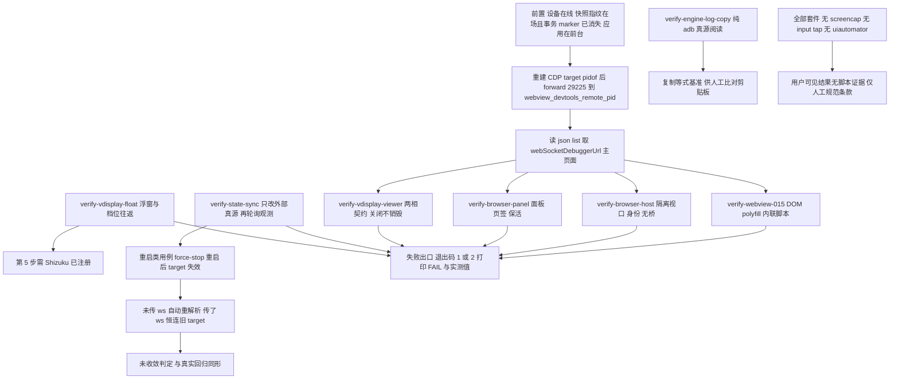
```mermaid
flowchart TD
  A["前置 设备在线 快照指纹在场且事务 marker 已消失 应用在前台"] --> B["重建 CDP target pidof 后 forward 29225 到 webview_devtools_remote_pid"]
  B --> C["读 json list 取 webSocketDebuggerUrl 主页面"]
  C --> D["verify-webview-015 DOM polyfill 内联脚本"]
  C --> E["verify-browser-host 隔离视口 身份 无桥"]
  C --> F["verify-browser-panel 面板 页签 保活"]
  C --> G["verify-vdisplay-viewer 两相契约 关闭不销毁"]
  L["verify-vdisplay-float 浮窗与档位往返"] --> M["第 5 步需 Shizuku 已注册"]
  H["verify-state-sync 只改外部真源 再轮询观测"] --> I["重启类用例 force-stop 重启 后 target 失效"]
  I --> J["未传 ws 自动重解析 传了 ws 恒连旧 target"]
  J --> K["未收敛判定 与真实回归同形"]
  N["verify-engine-log-copy 纯 adb 真源阅读"] --> O["复制等式基准 供人工比对剪贴板"]
  Q["全部套件 无 screencap 无 input tap 无 uiautomator"] --> R["用户可见结果无脚本证据 仅人工规范条款"]
  D --> P["失败出口 退出码 1 或 2 打印 FAIL 与实测值"]
  E --> P
  F --> P
  G --> P
  H --> P
  L --> P
```

## 7. 覆盖账本与校验

```bash
node scripts/check-code-map.mjs           # 校验：覆盖完整 / 锚点有效 / 编号一致 / 无 emoji
node scripts/check-code-map.mjs --list    # 只盘点，不判红
node scripts/check-code-map.mjs --self-test   # 判别力自检（8 个用例，含故意失败样本）
```

覆盖全域（脚本里定义，构建产物与第三方目录除外）：`app/src/**/*.kt` 与 `AndroidManifest.xml`、`plugins/*/{src,test}/**`、三个子仓 src/lib、`scripts/{check-,verify-,build-,inject-}*` 与 `scripts/patches/**`、`scripts/snapshot-config/**`。

<!-- COVERAGE
app/src/main/java/com/dsharnessmobile/shell/MainActivity.kt
app/src/main/java/com/dsharnessmobile/shell/EngineStartFlow.kt
app/src/main/java/com/dsharnessmobile/shell/GuideChrome.kt
app/src/main/java/com/dsharnessmobile/shell/GuidePageRenderer.kt
app/src/main/java/com/dsharnessmobile/shell/WebUiChrome.kt
app/src/main/java/com/dsharnessmobile/shell/ConsoleActivity.kt
app/src/main/java/com/dsharnessmobile/shell/ConsoleSession.kt
app/src/main/java/com/dsharnessmobile/shell/BootReceiver.kt
app/src/main/java/com/dsharnessmobile/shell/ShimmerTextView.kt
app/src/main/java/com/dsharnessmobile/shell/DsUi.kt
app/src/main/java/com/dsharnessmobile/shell/ApkArtifactCheck.kt
app/src/main/java/com/dsharnessmobile/shell/EngineManager.kt
app/src/main/java/com/dsharnessmobile/shell/EngineService.kt
app/src/main/java/com/dsharnessmobile/shell/EngineProbe.kt
app/src/main/java/com/dsharnessmobile/shell/LiveProbe.kt
app/src/main/java/com/dsharnessmobile/shell/WatchdogV2.kt
app/src/main/java/com/dsharnessmobile/shell/LogCollector.kt
app/src/main/java/com/dsharnessmobile/shell/SnapshotTransaction.kt
app/src/main/java/com/dsharnessmobile/shell/SnapshotFs.kt
app/src/main/java/com/dsharnessmobile/shell/SnapshotExtractor.kt
app/src/main/java/com/dsharnessmobile/shell/SnapshotUserData.kt
app/src/main/java/com/dsharnessmobile/shell/SnapshotFileMode.kt
app/src/main/java/com/dsharnessmobile/shell/UpdateManager.kt
app/src/main/java/com/dsharnessmobile/shell/UpdateChecker.kt
app/src/main/java/com/dsharnessmobile/shell/DownloadSaver.kt
app/src/main/java/com/dsharnessmobile/shell/FactoryProfilePatch.kt
app/src/main/java/com/dsharnessmobile/shell/AndroidBridge.kt
app/src/main/java/com/dsharnessmobile/shell/EngineAuth.kt
app/src/main/java/com/dsharnessmobile/shell/UndoGate.kt
app/src/main/java/com/dsharnessmobile/shell/BackGate.kt
app/src/main/java/com/dsharnessmobile/shell/ControlPoller.kt
app/src/main/java/com/dsharnessmobile/shell/ControlProtocolV2.kt
app/src/main/java/com/dsharnessmobile/shell/ControlCarrier.kt
app/src/main/java/com/dsharnessmobile/shell/ControlAudit.kt
app/src/main/java/com/dsharnessmobile/shell/MuxClient.kt
app/src/main/java/com/dsharnessmobile/shell/ShellState.kt
app/src/main/AndroidManifest.xml
app/src/main/java/com/dsharnessmobile/shell/DeviceControlService.kt
app/src/main/java/com/dsharnessmobile/shell/GlobalActionCatalog.kt
app/src/main/java/com/dsharnessmobile/shell/AdbKeyboardService.kt
app/src/main/java/com/dsharnessmobile/shell/AdbKeyboardReceiver.kt
app/src/main/java/com/dsharnessmobile/shell/ShellOps.kt
app/src/main/java/com/dsharnessmobile/shell/ScreenScope.kt
app/src/main/java/com/dsharnessmobile/shell/ShizukuTransport.kt
app/src/main/java/com/dsharnessmobile/shell/ShizukuUserService.kt
app/src/main/java/com/dsharnessmobile/shell/ShizukuProbe.kt
app/src/main/java/com/dsharnessmobile/shell/ShizukuSupport.kt
app/src/main/java/com/dsharnessmobile/shell/ProcIo.kt
app/src/main/java/com/dsharnessmobile/shell/FileIncoming.kt
app/src/main/java/com/dsharnessmobile/shell/PathOpen.kt
app/src/main/java/com/dsharnessmobile/shell/ConfigTransfer.kt
app/src/main/java/com/dsharnessmobile/shell/VdisplayController.kt
app/src/main/java/com/dsharnessmobile/shell/VdisplayHost.kt
app/src/main/java/com/dsharnessmobile/shell/VdisplayFloat.kt
app/src/main/java/com/dsharnessmobile/shell/VdisplayOps.kt
app/src/main/java/com/dsharnessmobile/shell/VirtualDisplayProbe.kt
app/src/androidTest/java/com/dsharnessmobile/shell/VdisplayProbeTest.kt
app/src/main/java/com/dsharnessmobile/shell/BrowserHost.kt
app/src/main/java/com/dsharnessmobile/shell/BrowserHostNavigationPolicy.kt
app/src/main/java/com/dsharnessmobile/shell/BrowserOverlayPolicy.kt
app/src/main/java/com/dsharnessmobile/shell/OverlayService.kt
app/src/main/java/com/dsharnessmobile/shell/OverlayPanel.kt
app/src/main/java/com/dsharnessmobile/shell/OverlayController.kt
app/src/main/java/com/dsharnessmobile/shell/OverlayReport.kt
app/src/main/java/com/dsharnessmobile/shell/OverlayLiveFeed.kt
app/src/main/java/com/dsharnessmobile/shell/OverlayHalo.kt
app/src/main/java/com/dsharnessmobile/shell/OverlayTheme.kt
app/src/main/java/com/dsharnessmobile/shell/NotifyCenter.kt
app/src/main/java/com/dsharnessmobile/shell/NotifyBridge.kt
app/src/main/java/com/dsharnessmobile/shell/NotifyStore.kt
app/src/main/java/com/dsharnessmobile/shell/NotifyActionReceiver.kt
app/src/main/java/com/dsharnessmobile/shell/NotifyDecisionQueue.kt
app/src/main/java/com/dsharnessmobile/shell/NotifySuppressQueue.kt
app/src/main/java/com/dsharnessmobile/shell/NotifyProbe.kt
glob:app/src/test/java/com/dsharnessmobile/shell/*.kt
plugins/dsh-android-bridge/src/index.ts
plugins/dsh-android-bridge/src/control-queue.ts
plugins/dsh-android-bridge/src/screen-scope.ts
plugins/dsh-android-bridge/src/capability-gate.ts
plugins/dsh-android-bridge/src/notify-projection.ts
plugins/dsh-android-bridge/src/shell-ops.ts
plugins/dsh-android-bridge/src/route-auth.ts
plugins/dsh-android-bridge/src/control-policy.ts
plugins/dsh-android-bridge/src/lossless-json.ts
plugins/dsh-android-bridge/src/client/index.ts
glob:plugins/dsh-android-bridge/test/*.mjs
plugins/dsh-android-manage/src/index.ts
plugins/dsh-android-manage/src/ui-tree.ts
plugins/dsh-android-manage/src/protocol-v2.ts
plugins/dsh-android-manage/src/vd-shot.ts
plugins/dsh-android-manage/src/detail-store.ts
glob:plugins/dsh-android-manage/test/*.test.mjs
glob:plugins/dsh-android-manage/test/*.mjs
plugins/dsh-android-browser/src/tools.ts
plugins/dsh-android-browser/src/index.ts
plugins/dsh-android-browser/src/contract.ts
plugins/dsh-android-browser/src/tier.ts
plugins/dsh-android-browser/src/facts.ts
plugins/dsh-android-vdisplay/src/index.ts
plugins/dsh-android-vdisplay/src/status.ts
plugins/dsh-android-vdisplay/src/client/index.ts
glob:plugins/dsh-android-browser/test/*.mjs
glob:plugins/dsh-android-vdisplay/test/*.mjs
plugins/dsh-android-file-open/src/index.ts
plugins/dsh-android-file-open/src/route-auth.ts
plugins/dsh-android-linux-env/src/index.ts
plugins/dsh-android-linux-env/src/runtime-cache.ts
plugins/dsh-model-capability/src/index.ts
plugins/dsh-model-capability/src/capability-probe.ts
plugins/dsh-model-capability/src/settings-writer.ts
plugins/dsh-model-capability/src/catalog-lookup.ts
plugins/dsh-model-capability/src/settings-config.ts
plugins/dsh-model-capability/src/signature.ts
glob:plugins/dsh-android-file-open/test/*.mjs
glob:plugins/dsh-android-linux-env/test/*.mjs
glob:plugins/dsh-android-model-capability/test/*.mjs
glob:plugins/dsh-model-capability/test/*.mjs
dsh-client-ui-responsive/src/index.ts
dsh-client-ui-responsive/src/invariant.ts
dsh-client-ui-responsive/src/css-modules.d.ts
glob:dsh-client-ui-responsive/src/client/*.ts
glob:dsh-client-ui-responsive/src/client/*.tsx
glob:dsh-client-ui-responsive/src/client/*.module.css
glob:dsh-client-ui-responsive/src/client/mobile/*
glob:dsh-client-ui-responsive/src/client/dev-section/*
dsh-client-ui-responsive/src/client/general-settings/GeneralSettings.tsx
dsh-host-web-compat/lib/index.js
glob:dsh-host-web-compat/scripts/*
dsh-shell-termux/src/index.ts
scripts/build-apk-013.ps1
scripts/build-snapshot-013.mjs
scripts/make-snapshot.sh
scripts/inject-all.py
scripts/inject-snapshot.py
scripts/inject-external-plugins.py
scripts/relocate-snapshot.py
scripts/update-snapshot-patch.py
scripts/patches/apply-patches.mjs
scripts/patches/registry.json
scripts/patches/README.md
scripts/patches/data/compat-map.json
glob:scripts/patches/tests/*.test.mjs
glob:scripts/patches/tests/fixtures/**
glob:scripts/snapshot-config/*
scripts/profile-web.cordis.patch.yml
scripts/build-apk.mjs
scripts/build-release.ps1
scripts/build-snapshot-arm64.mjs
glob:scripts/check-*.mjs
scripts/check-snapshot-asset.ps1
scripts/check-snapshot-secrets.ps1
scripts/check-prefix-residue.sh
scripts/kotlin-test-baseline.json
scripts/contract.json
scripts/contract-pin-gaps.json
scripts/state-registry.json
scripts/tool-surface-budget.json
scripts/bridge-symmetry-baseline.json
scripts/plugin-dirs.json
scripts/api-route-auth-policy.json
scripts/control-ops-pending.json
scripts/control-ops-known-gaps.json
scripts/perf-instrumentation-gaps.json
scripts/release-plugin-src-gaps.json
scripts/third-party-licenses.json
scripts/tests/boot-pending.test.mjs
scripts/tests/pi-toolcall.test.mjs
glob:scripts/patches/tests/**
plugins/dsh-android-vdisplay/test/tools-callable.test.mjs
.github/workflows/pr-gate.yml
.github/workflows/build-apk.yml
.github/workflows/build-snapshot.yml
scripts/verify-webview-015.mjs
scripts/verify-state-sync.mjs
scripts/verify-browser-host.mjs
scripts/verify-browser-panel.mjs
scripts/verify-vdisplay-viewer.mjs
scripts/verify-vdisplay-float.mjs
scripts/verify-engine-log-copy.mjs
scripts/device-smoke.ps1
scripts/deploy-device.ps1
scripts/deploy-embedded.ps1
scripts/t0-check.ps1
scripts/e2e-phone-test.ps1
-->

## 8. 已知漂移（文档与源码不一致，待当场修文档）

- [K01] 漂移：`dsh-mobile-apk/docs/AGENTS/ARCHITECTURE.md:12` 说 EngineStartFlow.kt 为 539 行（同表 :9 MainActivity 918、:10 GuidePageRenderer 404），源码实测为 773 / 1175 / 419 行（`wc -l`，见该表自称「2026-09-14 当场实测」）。
- [K01] 漂移：`dsh-mobile-apk/docs/AGENTS/ARCHITECTURE.md:15` 说 WebUiChrome.kt 的职责是「沉浸式/剪贴板/常亮/主题推送（真源统一走 ShellState）」，源码里剪贴板/常亮/主题推送三组只有定义、无调用点（WebUiChrome.kt:37/54/94），生效面是 MainActivity.kt:850/967/874 的私有副本。
- [K02] 漂移：`docs/AGENTS/BRIDGE-API.md:114` 说 `shellEnv()` 注入 `DSH_ADB_*`/`DSH_ADB_FULLACCESS`，源码 `EngineManager.kt:1464-1465` 注明 0.14.0 内置 adb 已退役、环境 map 里没有这两个键。
- [K02] 漂移：`docs/AGENTS/ARCHITECTURE.md:45` 说 WatchdogV2.kt 负责「boot 恢复用户同意状态」，源码该文件已无任何 Receiver（`ActivityManager`/`BroadcastReceiver`/`Intent`/`IntentFilter` 只剩零使用的 import，WatchdogV2.kt:3-8），BOOT_COMPLETED 处理在 `BootReceiver.kt:23-36`。
- [K02] 漂移：`docs/AGENTS/ARCHITECTURE.md:76` 给 LogCollector.kt 记 332 行（2026-09-14 实测），现为 931 行；同表 EngineService.kt 记 201 行，现为 246 行。
- [K05] 漂移：`docs/AGENTS/ARCHITECTURE.md:68` 说 `DeviceControlService.kt` 是 1094 行、能力面到「屏幕范围执行点复查」为止，源码 `app/src/main/java/com/dsharnessmobile/shell/DeviceControlService.kt` 现场为 1333 行（`wc -l`），且含该表未列的虚拟屏窗口选择面 `rootProbe`/`WindowPick`（:353-434）与 browser*/vd*/sh* 分支（:634-664）。
- [K05] 漂移：`docs/AGENTS/ARCHITECTURE.md:65` 说 ShizukuProbe.kt 被 MainActivity、DeviceControlService、VdisplayController 依赖，源码零引用——`grep -rl ShizukuProbe app/src/main` 只命中 `app/src/main/java/com/dsharnessmobile/shell/ShizukuProbe.kt` 自身（main 与 test 均无其它引用）。
- [K05] 漂移：`docs/AGENTS/ACCESSIBILITY-API.md:167` 说「⑤ 多窗口 `getWindows()` 的窗口选择面未接」，源码已接：`getWindowsOnAllDisplays()` + `WindowPick.order`（`app/src/main/java/com/dsharnessmobile/shell/DeviceControlService.kt:353-434`，回归 `app/src/test/java/com/dsharnessmobile/shell/WindowPickTest.kt`）。
- [K05] 漂移：`docs/AGENTS/ACCESSIBILITY-API.md:99` 说 `MENU` / `MEDIA_PLAY_PAUSE` 为 API 36，源码 `app/src/main/java/com/dsharnessmobile/shell/GlobalActionCatalog.kt:33-34` 写 minSdk=31（SDK `api-versions.xml` 两个 android-36 平台均 `since="36"`，支持文档口径，影响见可疑点 2）。
- [K06] 漂移：`docs/AGENTS/BRIDGE-API.md:122` 说 ShizukuTransport/ShizukuUserService 是「固定 argv、16KB 输出上限；页面/引擎拿不到原始 binder 或任意 shell 面」（AIDL v1），源码 `ShizukuUserService.kt:30` 是 `PROTOCOL_VERSION = 2`（execCapture 落盘面 + 单文件 256 MiB），`ShizukuTransport.kt:271-301` 与 `ShellOps.kt:91-103` 交给引擎的正是任意 `sh -c` 命令面。
- [K06] 漂移：`docs/AGENTS/BRIDGE-API.md:125` 说 ScreenScope「执行点复查在 DeviceControlService」，源码 `ShellOps.kt:132`（scopeDenied）才是特权 shell 通道的执行点复查，`DeviceControlService.kt:703`（realScreenScopeError）只管无障碍 op 面。
- [K07] 漂移：`docs/AGENTS/ARCHITECTURE.md:90` 说 `VdisplayController.kt` 389 行、`:91` 说 `VdisplayHost.kt` 177 行，源码 `app/src/main/java/com/dsharnessmobile/shell/VdisplayController.kt` 是 766 行、`VdisplayHost.kt` 是 214 行（`wc -l` 现场数）。
- [K07] 漂移：`docs/AGENTS/BRIDGE-API.md:117` 与 `:195` 说页面桥面有 `vdisplayLaunchSettingsProbe`/`backProbe`，源码 `app/src/main/java/com/dsharnessmobile/shell/AndroidBridge.kt:316-348` 没有这两个方法（`sendBackProbe` 只有定义、无调用点，`VdisplayController.kt:529`）；实际存在的 `vdisplaySelect`、`get/setVdisplayScale`、`get/setVdisplayFloatEnabled`、`forceDestroyVdisplay` 未列出。
- [K07] 漂移：`docs/AGENTS/ARCHITECTURE.md:136` 与 `docs/AGENTS/BRIDGE-API.md:201` 说建屏 flag 是「公开 `PUBLIC|OWN_CONTENT_ONLY|SUPPORTS_TOUCH`」，源码 `VdisplayController.kt:372-373` 是 5 个（另含 `DESTROY_CONTENT_ON_REMOVAL`、`ROTATES_WITH_CONTENT`），且同文件 `:366-368` 的实测注释已写明 13+ 上 `FLAG_PUBLIC` 不生效。
- [K07] 漂移：`VdisplayController.kt:124` 的 `ops()` 说支持 5 个 vd op（缺 `vdLaunchApp`/`vdInput`，且把只回 `unsupported` 的 `vdMoveTask` 列成支持），而 `VdisplayOps.kt:21-44` 实际分发 7 个，引擎侧 `plugins/dsh-android-vdisplay/src/status.ts:14` 的 `VD_OPS` 也是 7 个 —— 面板读载荷里的 `ops`（`mapStatusPayload`）时 capabilities 会少报两条。
- [K08] 漂移：`docs/AGENTS/ARCHITECTURE.md:18` 说 `BrowserHostNavigationPolicy.kt` / `BrowserOverlayPolicy.kt` 为 210 / 82 行，现场 `wc -l` 是 231 / 86 行（同行的 BrowserHost.kt 1813 与文档一致）。
- [K08] 漂移：`dsh-client-ui-responsive/src/client/mobile/browser-tab.tsx:248` 注释说「原生层 foreignViewer 亦 fail-closed」，源码 `BrowserHost.kt:810-814` 明写 foreignViewer 判定已随按会话隔离删除（全仓只剩这条注释提及该符号）；同文件 `:398-401` 的口径才是现状。
- [K09] 漂移：`dsh-mobile-apk/docs/AGENTS/ARCHITECTURE.md:27-34` 说 OverlayService.kt 772 / OverlayHalo.kt 164 / OverlayPanel.kt 1217 / OverlayReport.kt 325 行，源码实测 `OverlayService.kt` 785 / `OverlayHalo.kt` 168 / `OverlayPanel.kt` 1222 / `OverlayReport.kt` 384（差 59 行正是块H 的 CompletionNotice 段）
- [K09] 漂移：`dsh-mobile-apk/docs/AGENTS/ARCHITECTURE.md:29` 与 `dsh-mobile-apk/docs/AGENTS/modules.md:39` 说「应答 POST /api/respond 全信封，approval value={sessionId,approvalId,outcome}；question 取消发 ok:false error cancelled」，源码 `OverlayPanel.kt:818` 是 POST /api/$events/result、payload={args:{clientId,eventId,outcome}}，审批取值 allowed-once/rejected（`OverlayPanel.kt:616-617`）、提问跳过是 kind=rejected 加 error{name:UserQuestionError,code:cancelled}（`OverlayPanel.kt:904-908`）；同族过期注释仍在源码里：`OverlayPanel.kt:24`、`OverlayPanel.kt:489`、`OverlayLiveFeed.kt:166`
- [K09] 漂移：`dsh-mobile/docs/0.14.1-preview-OVERLAY-COMPLETION-CARD.md` 的 1.1 表说 OverlayService.kt 673 / OverlayPanel.kt 1046 / OverlayLiveFeed.kt 172 / OverlayHalo.kt 91 / OverlayTheme.kt 33 行，源码实测 785 / 1222 / 196 / 168 / 38；该详档被源码注释当准绳引用（`OverlayService.kt:106`、`OverlayReport.kt:252`）
- [K09] 漂移：`app/src/main/java/com/dsharnessmobile/shell/NotifyCenter.kt:133` 说 flashStatus 在 `OverlayService.kt:669`，源码该函数在 `OverlayService.kt:683`
- [K10] 漂移：
- [K10] 漂移：`docs/AGENTS/ARCHITECTURE.md:70` 说 `NotifyCenter.kt` 834 行，源码（`wc -l`）是 1051 行。
- [K10] 漂移：`docs/AGENTS/ARCHITECTURE.md:71` 说 `NotifyStore.kt` 287 行，源码是 330 行。
- [K10] 漂移：`docs/AGENTS/ARCHITECTURE.md` 模块表缺 `NotifySuppressQueue.kt`（0.14.1 新增，只在 `docs/AGENTS/modules.md:36` 有条目）。
- [K10] 漂移：`app/src/main/java/com/dsharnessmobile/shell/OverlayReport.kt:233-234` 注释说与 `notify-projection.ts` 的 `reportOutcomeLabel` 逐字同构，实际 `interrupted` 文案不同——`plugins/dsh-android-bridge/src/notify-projection.ts:68` 是「被中断（进程重启）」，`OverlayReport.kt:244` 与 `NotifyCenter.kt:1041` 是「被中断」。
- [K10] 漂移：`app/src/main/java/com/dsharnessmobile/shell/NotifyCenter.kt:133` 注释指向 `OverlayService.kt:669` 的 `flashStatus`，实际在 `OverlayService.kt:683`。
- [K10] 漂移：`app/src/main/java/com/dsharnessmobile/shell/OverlayService.kt:706` 注释说先例在 `NotifyCenter.kt:605-606`，实际 `Intent(app, MainActivity::class.java)` 在 `NotifyCenter.kt:822`（605-606 是 `deferredKey` 的注释）。
- [K10] 漂移：`plugins/dsh-android-bridge/src/index.ts:1458` 注释说「壳侧 FileObserver 按偏移消费后截断/轮转」，实际壳侧只读不截断不轮转（`NotifyStore.kt:18-20` 明写「引擎超过 512KB 时轮转 .1」，轮转方是引擎）。
- [K10] 漂移：`docs/0.14.1-preview-NOTIFY-REALTIME-AND-STATE-SYNC.md` §0/§1.2 仍用旧行号（`:377` 抑制判定、`:114` 默认值、`:88-97` Listener、`:307-311` Result），当前源码对应 `NotifyCenter.kt:570`、`:49` / `:191`、`:111-120`、`:500-504`。
- [P01] 漂移：`dsh-mobile-apk/docs/AGENTS/known-gaps.md:127` 说 0.14.1 块G F1 落在 `bridge/index.ts` 第 832-838 行，源码该处是 `a11ySource()` 的心跳判定（`plugins/dsh-android-bridge/src/index.ts:829-838`），F1 的「按 args.screenId 经 screenAccessResolved 判定」实际在 `plugins/dsh-android-bridge/src/index.ts:991-997`。
- [P01] 漂移：`dsh-mobile-apk/docs/AGENTS/ARCHITECTURE.md:151`（§9「0.13.5 设备控制面」）说 `adb → execAdbLine/execAdbShell（shell 执行、原图截图、pm/dumpsys 等系统面）`，源码 `plugins/dsh-android-bridge/src/index.ts:1034`/`:1070` 与 `plugins/dsh-android-bridge/src/shell-ops.ts:120` 已在 0.14.0 改成经控制队列投递壳侧 Shizuku、不再有 adb 客户端语义（该节自带 0.13.5 标注，属历史段落，按「以源码为准」记录）。
- [P02] 漂移：`docs/AGENTS/gotchas.md:178` 说坑 72 的锚点是 `plugins/dsh-android-manage/src/lossless-json.ts` 与 `plugins/dsh-android-manage/test/privilege-status.test.mjs`，源码里这两个文件只在 bridge 插件下（`plugins/dsh-android-bridge/src/lossless-json.ts:1`、`plugins/dsh-android-bridge/test/privilege-status.test.mjs:1`），manage 的 `src/` 只有 index/ui-tree/protocol-v2/detail-store/vd-shot 五个文件。
- [P02] 漂移：`plugins/dsh-android-manage/src/index.ts:7` 的文件头工具集注释只列 8 个工具（screenshot/ui_tree/device_info/act_input/ui_dump/ui_click/ui_scroll/ui_input），源码 `plugins/dsh-android-manage/src/index.ts:2283` 实际注册 14 个（另有 screen_list/ui_detail/web_dump/env_prepare/app_launch/ui_global）。
- [P02] 漂移：`scripts/check-code-map.mjs:152` 的注释说耦合边右端可以是「外部角色」文字，同文件 `scripts/check-code-map.mjs:103` 的解析正则却要求两端都形如查点 ID，凡右端写外部角色的边一律判 `bad-coupling`。
- [P03] 漂移：`plugins/dsh-android-browser/src/tools.ts:407` 说壳侧 `reason` 在 `BrowserHost.kt:818` 的 `lastError`，同文件 `:160` 说 `tabSummaries()` 在 `BrowserHost.kt:80-91`；源码 `lastError` 声明在 `app/src/main/java/com/dsharnessmobile/shell/BrowserHost.kt:304`、`tabSummaries()` 在 `:91`（`:818` 是 `ORPHAN_REFS`），注释锚点按 0.14.0 基线写死。
- [P03] 漂移：`docs/AGENTS/ARCHITECTURE.md:17` 说 AndroidBridge.kt 383 行、`:90` 说 VdisplayController.kt 389 行、`:91` 说 VdisplayHost.kt 177 行；源码现数 422 / 766 / 214 行（`wc -l`，文件末行分别为 `app/src/main/java/com/dsharnessmobile/shell/AndroidBridge.kt:422`、`VdisplayController.kt:766`、`VdisplayHost.kt:214`），同文档 `:18` 自己注明「行数每次改都会漂、不要写死」。
- [P03] 漂移：`docs/AGENTS/BRIDGE-API.md:117` 与 `:195` 把虚拟屏桥面写成 `vdisplayStatus/create/destroy/launchSettingsProbe/backProbe/bounds`，未列 `vdisplaySelect`（`app/src/main/java/com/dsharnessmobile/shell/AndroidBridge.kt:330`）、`forceDestroyVdisplay`（`:348`）与 Scale/Float 四个存取（`:334/:337/:341/:344`），而面板侧正在调用前两个（`plugins/dsh-android-vdisplay/src/client/index.ts:84`、`:89`）。
- [P04] 漂移：`app/src/main/java/com/dsharnessmobile/shell/FileIncoming.kt:326` 注释说「三条 file-incoming exact 路由」（`plugins/dsh-android-file-open/src/index.ts:20` 同样写「三条」），实际注册五条（`plugins/dsh-android-file-open/src/index.ts:527/605/697/752/813`，`scripts/api-route-auth-policy.json` 也列五条），`docs/AGENTS/BRIDGE-API.md:198` 按五条记。
- [P04] 漂移：`app/src/main/java/com/dsharnessmobile/shell/FileIncoming.kt:97-99` 注释说「canonical 形态会被插件 `safeResolveInside` 的词法首门拒绝」，源码 `plugins/dsh-android-file-open/src/index.ts:431-452` 是两侧都 realpath 后比较（只有 ws 侧 realpath 抛错时才回落词法），不存在会拒 canonical 的词法首门——该注释会把维护者引向不必要的路径形态限制。
- [S01] 漂移：`dsh-mobile-apk/docs/AGENTS/gotchas.md:103`（坑 61）说防线③是「常驻 `node dsh-host-web-compat/scripts/smoke-injections.mjs` 门禁」，源码 `dsh-host-web-compat/lib/index.js:783,791` 已是两次 `tapIndex`，而 `dsh-host-web-compat/scripts/smoke-injections.mjs:50` 仍断言 `transforms.length === 1` —— 该门禁当下是红的（apk 仓 `.github/workflows` 不跑它）。
- [S01] 漂移：`dsh-mobile-apk/docs/AGENTS/BRIDGE-API.md:117` 说 AndroidBridge 桥面「方法计数由 `check-bridge-symmetry.mjs` 从源码守」，但该清单及其余各表都未收录 0.14.1 新增的 `getNotifySetting` / `setNotifySetting`，源码 `app/src/main/java/com/dsharnessmobile/shell/AndroidBridge.kt:372,381` 已实现，页面 `dsh-client-ui-responsive/src/client/dev-section/notify-settings.tsx:66,86` 已在调用。
- [S01] 漂移：apk 仓 `dsh-shell-termux/README.md` 与协调仓同名副本不是逐字节镜像（6 行行尾 CRLF/LF 差异，正文逐字相同，无功能影响）。
- [B01] 漂移：`docs/AGENTS/build-and-env.md:32,41-42` 说快照归档/解压用 `xz -T0`/`xz -dT0`，源码 `scripts/build-snapshot-013.mjs:985` 是 `xz -T${XZ_THREADS} -6`、`:120` 是 `xz -dT${XZ_THREADS}`（`scripts/lib/shell.mjs:31` 默认 8，`scripts/check-build-parallel-cap.mjs` 把「吃满全部核心」判红）。
- [B01] 漂移：`docs/AGENTS/BRIDGE-API.md:33` 同一句「瘦身 + xz -T0 归档」与源码 `scripts/build-snapshot-013.mjs:985` 的 `xz -T${XZ_THREADS}` 不符（该文件的构建段落是 build-and-env.md 的拷贝）。
- [B01] 漂移：`docs/AGENTS/BRIDGE-API.md:41` 说聚合门禁「当前 17 项」，源码 `scripts/check-release-gates.mjs:28-104` 声明 27 项（同目录 build-and-env.md:48 亦写 27）。
- [B01] 漂移：`docs/AGENTS/build-and-env.md:48` 与 `docs/AGENTS/BRIDGE-API.md:41` 说「门禁（build-apk-013.ps1 内）：聚合入口 scripts/check-release-gates.mjs」，源码 `scripts/build-apk-013.ps1` 全文无该脚本调用（逐条内联 27 项；聚合入口只由 `scripts/build-release.ps1:56,60,147` 与 CI 调用，本地链里它只出现在 `:43` 的注释）。
- [B01] 漂移：`docs/AGENTS/RUNTIME-PATCHES.md:56` 说 scope=vendor 补丁「在 build-apk-013.ps1 阶段施加」，源码 `scripts/build-apk-013.ps1:211` 的调用无 `--apply`/`--scope` → `scripts/patches/apply-patches.mjs:2096,2100` 默认 `mode=check`（只校验不施加；`docs/AGENTS/0.13.7-CERTIFICATION.md:11` 也记 mode=check）。
- [B01] 漂移：`docs/AGENTS/RUNTIME-PATCHES.md:58` 的 engine 补丁「当前全量」清单 14 项，源码 `scripts/patches/registry.json` 现 18 项 engine（缺 combo-single-lazy-A5、combo-parallel-C3、combo-probe-P1、boot-third-party-isolation-G3）。
- [B01] 漂移：`AGENTS.md:21` 说 `vendor/`（marketplace / undo-savepoint / dsh-model-sync），源码实际 `vendor/` 只有 `dsh-undo-savepoint` 与 `dshmarketplace-plugin`（model-sync 已随 0.14.1 整体摘除，见 `scripts/profile-web.cordis.patch.yml:128-138` 与 `scripts/check-patch-mirror.mjs:231-233`）。
- [B02] 漂移：`docs/AGENTS/BRIDGE-API.md:41` 说聚合入口「`--list` 现数，当前 17 项」，源码 `scripts/check-release-gates.mjs:28`（`GATES` 数组）是 27 项（同仓 `docs/AGENTS/build-and-env.md:48` 写的是 27 项，两份文档自相矛盾）。
- [B02] 漂移：5 个门禁脚本的两仓副本行尾不同（协调仓 CRLF、apk 仓 LF），`cmp` 字节不等、归一化后内容一致：`scripts/check-boot-budget.mjs`、`scripts/check-browser-syntax-floor.mjs`、`scripts/check-build-parallel-cap.mjs`、`scripts/check-snapshot-builder-output.mjs`、`scripts/check-tool-output-schema.mjs`；镜像门禁只按「仅行尾差异」告警放行（`scripts/check-patch-mirror.mjs:339`）——「逐字节镜像」在行尾层不成立。
- [B02] 漂移：`scripts/check-code-map.mjs` 只在 apk 仓存在（协调仓 `scripts/` 无此文件），且未被列进 `scripts/check-patch-mirror.mjs:160` 起的 `MIRROR_TOP` → 这条新门禁自身没有镜像守护。
